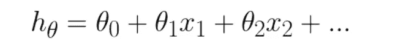
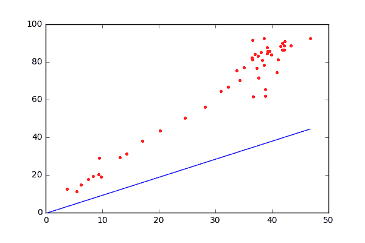
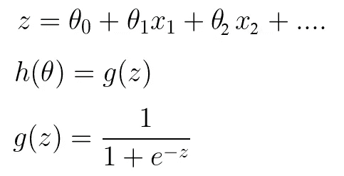
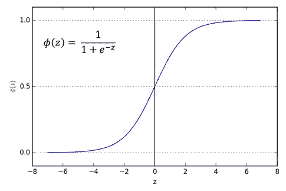
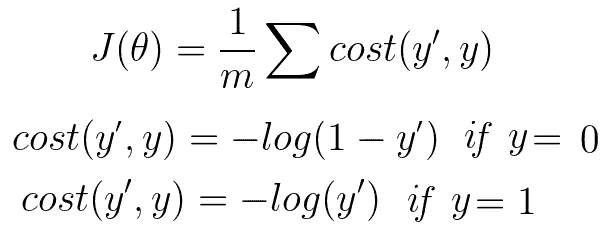
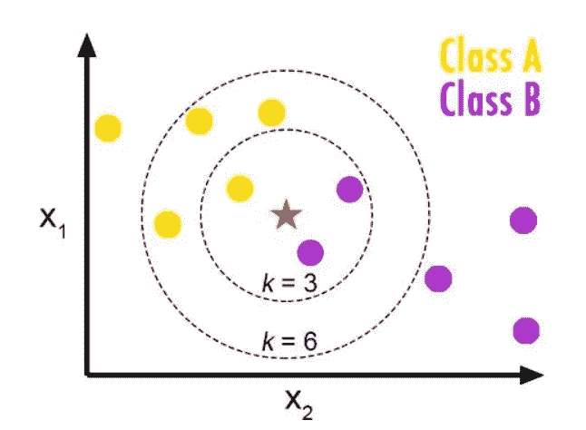
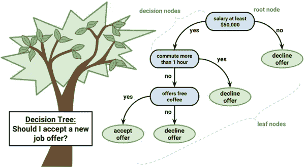
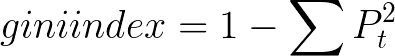
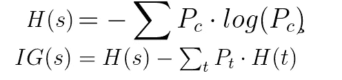

# 经典机器学习算法的比较研究

> 原文：<https://towardsdatascience.com/comparative-study-on-classic-machine-learning-algorithms-24f9ff6ab222?source=collection_archive---------0----------------------->

## 各种 ML 算法的快速总结

机器学习是一种科学技术，在这种技术中，计算机学习如何解决一个问题，而不需要对它们进行显式编程。在更好的算法、计算能力和大数据的推动下，深度学习目前正在引领 ML 竞赛。尽管如此，最大似然经典算法在该领域仍有其强大的地位。

我将对不同的机器学习监督技术进行比较研究，如本故事中的***线性回归、逻辑回归、K 近邻和决策树******。*** 在[的下一个故事](https://medium.com/@dannymvarghese/comparative-study-on-classic-machine-learning-algorithms-part-2-5ab58b683ec0)中，我将覆盖 ***支持向量机、随机森林和天真八爷* s** 。关于算法的深入细节有那么多比较好的博客，我们就只着重比较研究一下。我们将研究它们的 ***基本逻辑、优点、缺点、假设、共线效应&异常值、超参数*** *、* ***相互比较*** *等*。

其余算法请参考本系列的第 2 部分。

# **1。线性回归**

如果你想开始机器学习，线性回归是最好的起点。线性回归是一种回归模型，也就是说，它将获取特征并预测连续输出，例如:股票价格、工资等。线性回归顾名思义，找到一个线性曲线解决每个问题。

## **基础理论**:

LR 为每个训练特征分配权重参数θ。预测输出(h(θ))将是特征和θ系数的线性函数。

linear regression output. Eqn (1)

在训练开始时，每个θ被随机初始化。但是在训练期间，我们校正对应于每个特征的θ，使得损失(预期和预测输出之间的偏差的度量)最小化。梯度下降算法将用于在正确的方向上对齐θ值。在下图中，每个红点代表训练数据，蓝线显示导出的解决方案。

*gif credits :* [https://medium.com/@kabab/linear-regression-with-python-d4e10887ca43](https://medium.com/@kabab/linear-regression-with-python-d4e10887ca43)

## **损失函数:**

在 LR 中，我们使用均方误差作为损失的度量。预期和实际输出的偏差将被平方并求和。梯度下降算法将使用该损失的导数。

## **优点:**

*   容易和简单的实现。
*   空间复解。
*   快速训练。
*   θ系数的值给出了特征重要性的假设。

## **缺点:**

*   仅适用于线性解决方案。在很多现实生活场景中，可能并非如此。
*   算法假设输入残差(误差)为正态分布，但可能并不总是满足。
*   算法假设输入特征相互独立(无共线)。

## **超参数:**

*   正则化参数(λ):正则化用于避免对数据的过拟合。λ越大，正则化程度越高，解的偏差越大。λ越低，解的方差越大。中间值是优选的。
*   学习率(α):它估计在训练期间应用梯度下降算法时，θ值应该被校正多少。α也应该是一个适中的值。

## **LR 的假设:**

*   自变量和因变量之间的线性关系。
*   训练数据是同方差的，这意味着误差的方差应该是恒定的。
*   自变量不应该是共线的。

## **共线性&异常值:**

当一个特征可以从另一个特征以一定的精度线性预测时，称两个特征共线。

*   共线性只会扩大标准误差，并导致一些重要特征在训练过程中变得不重要。理想情况下，我们应该在训练之前计算共线性，并且只保留高度相关的特征集中的一个特征。

离群值是训练中面临的另一个挑战。它们是对正常观察极端的数据点，并影响模型的准确性。

*   异常值会增大误差函数，并影响曲线函数和线性回归的精度。正则化(尤其是 L1)可以通过不允许θ参数剧烈变化来校正异常值。
*   在探索性数据分析阶段本身，我们应该注意异常值并纠正/消除它们。箱线图可用于识别它们。

## **与其他车型对比:**

由于线性回归是一种回归算法，我们将它与其他回归算法进行比较。线性回归的一个基本区别是，LR 只能支持线性解。机器学习中不存在胜过所有其他模型的最佳模型(没有免费的午餐)，效率是基于训练数据分布的类型。

**LR vs 决策树**:

*   决策树支持非线性，而 LR 只支持线性解决方案。
*   当具有较少数据集(低噪声)的大量特征时，线性回归可能优于决策树/随机森林。在一般情况下，决策树会有更好的平均准确率。
*   对于分类独立变量，决策树优于线性回归。
*   决策树比 LR 更好地处理共线性。

**LR vs SVM :**

*   SVM 支持使用内核技巧的线性和非线性解决方案。
*   SVM 比 LR 更好地处理异常值。
*   两者在训练数据较少且特征数量较多的情况下表现良好。

**LR vs KNN :**

*   KNN 是一个非参数模型，而 LR 是一个参数模型。
*   KNN 的实时速度很慢，因为它必须跟踪所有训练数据并找到邻居节点，而 LR 可以很容易地从调谐的θ系数中提取输出。

**LR vs 神经网络:**

*   与 LR 模型相比，神经网络需要大量的训练数据，而 LR 即使使用较少的训练数据也可以工作得很好。
*   NN 相比 LR 会比较慢。
*   神经网络的平均精度总是更好。

# **2。逻辑回归**

就像线性回归一样，逻辑回归是从分类算法开始的正确算法。尽管“回归”这个名字出现了，但它不是一个回归模型，而是一个分类模型。它使用逻辑函数来构建二进制输出模型。逻辑回归的输出将是一个概率(0≤x≤1)，并可用于预测二进制 0 或 1 作为输出(如果 x <0.5, output= 0, else output=1).

## **基本理论:**

逻辑回归的作用有点类似于线性回归。它还计算线性输出，然后对回归输出执行存储函数。Sigmoid 函数是常用的逻辑函数。从下面可以清楚地看到，z 值与等式(1)中的线性回归输出值相同。

这里的 h(θ)值对应于 P(y=1|x)，即给定输入 x，输出为二进制 1 的概率。P(y=0|x)将等于 1-h(θ)。

当 z 的值为 0 时，g(z)将为 0.5。每当 z 为正时，h(θ)将大于 0.5，输出将为二进制 1。同样，每当 z 为负时，y 的值将为 0。当我们使用线性方程来寻找分类器时，输出模型也将是线性的，这意味着它将输入维度分成两个空间，其中一个空间中的所有点对应于相同的标签。

下图显示了 sigmoid 函数的分布。

sigmoid function Eqn(3)

## **损失函数:**

我们不能用均方差作为损失函数(像线性回归)，因为我们在最后用了一个非线性的 sigmoid 函数。MSE 函数会引入局部极小值，影响梯度下降算法。

所以我们用交叉熵作为损失函数。将使用两个等式，对应于 y=1 和 y=0。这里的基本逻辑是，每当我的预测严重错误时，(例如:y' =1 & y = 0)，成本将是-log(0)，这是无穷大。

cross-entropy loss Eqn(4)

在给出的等式中，m 代表训练数据大小，y’代表预测输出，y 代表实际输出。

## **优点:**

*   简易、快速、简单的分类方法。
*   θ参数解释了自变量相对于因变量的显著性的方向和强度。
*   也可用于多类分类。
*   损失函数总是凸的。

## **缺点:**

*   不能应用于非线性分类问题。
*   需要正确选择功能。
*   期望有好的信噪比。
*   共线性和异常值会影响 LR 模型的准确性。

## **超参数:**

逻辑回归超参数类似于线性回归超参数。学习率(α)和正则化参数(λ)必须适当调整以实现高精度。

## **LR 的假设:**

逻辑回归假设类似于线性回归模型的假设。请参考上述部分。

## **与其他车型对比:**

**逻辑回归 vs SVM :**

*   SVM 可以处理非线性解，而逻辑回归只能处理线性解。
*   线性 SVM 能更好地处理异常值，因为它能导出最大利润解。
*   SVM 的铰链损耗优于 LR 的原木损耗。

**逻辑回归 vs 决策树:**

*   决策树比 LR 更好地处理共线性。
*   决策树不能得出特征的重要性，但是 LR 可以。
*   决策树比 LR 更适合分类值。

**逻辑回归 vs 神经网络:**

*   NN 可以支持 LR 不能支持的非线性解。
*   LR 具有凸损失函数，所以它不会陷入局部极小值，而 NN 可能会陷入局部极小值。
*   当训练数据较少且特征较多时，LR 优于 NN，而 NN 需要大量训练数据。

**逻辑回归 vs 朴素贝叶斯:**

*   朴素贝叶斯是一种生成模型，而 LR 是一种判别模型。
*   朴素贝叶斯适用于小数据集，而 LR+正则化可以实现类似的性能。
*   LR 在共线性方面比朴素贝叶斯表现得更好，因为朴素贝叶斯期望所有特征都是独立的。

**逻辑回归 vs KNN :**

*   KNN 是非参数模型，而 LR 是参数模型。
*   KNN 比逻辑回归相对慢。
*   KNN 支持非线性解决方案，而 LR 仅支持线性解决方案。
*   LR 可以导出置信度(关于它的预测)，而 KNN 只能输出标签。

# **3。k-最近邻**

k-最近邻法是一种用于分类和回归的非参数方法。这是最简单的 ML 技术之一。它是一个懒惰的学习模型，具有局部近似性。

## 基本理论:

KNN 背后的基本逻辑是探索你的邻居，假设测试数据点与他们相似，并得到输出。在 KNN，我们寻找 k 个邻居并得出预测。

在 KNN 分类的情况下，在 k 个最近的数据点上应用多数投票，而在 KNN 回归中，k 个最近的数据点的平均值被计算为输出。根据经验，我们选择奇数作为 k。KNN 是一个懒惰的学习模型，计算只在运行时发生。

image credits : [https://www.fromthegenesis.com/pros-and-cons-of-k-nearest-neighbors/](https://www.fromthegenesis.com/pros-and-cons-of-k-nearest-neighbors/)

在上图中，黄色和紫色点对应于训练数据中的 A 类和 B 类。红星指的是要分类的测试数据。当 k = 3 时，我们预测 B 类作为输出，当 K=6 时，我们预测 A 类作为输出。

## **损失函数:**

在 KNN 没有培训。在测试期间，具有最小距离的 k 个邻居将参与分类/回归。

## 优势:

*   简易的机器学习模型。
*   需要调整的超参数很少。

## 缺点:

*   应该明智地选择 k。
*   如果样本量很大，则运行时的计算成本很大。
*   应该提供适当的缩放，以便在特性之间进行公平处理。

## 超参数:

KNN 主要涉及两个超参数，K 值和距离函数。

*   k 值:有多少邻居参与 KNN 算法。k 应该根据验证误差进行调整。
*   距离函数:欧几里德距离是最常用的相似性函数。曼哈顿距离、海明距离、闵可夫斯基距离是不同的选择。

## 假设:

*   应该对输入域有清晰的理解。
*   可行的中等样本量(由于空间和时间的限制)。
*   共线性和异常值应在训练前处理。

## 与其他型号的比较:

KNN 和其他模型之间的一个普遍区别是，与其他模型相比，KNN 需要大量的实时计算。

**KNN vs 朴素贝叶斯:**

*   由于 KNN 的实时执行，朴素贝叶斯比 KNN 快得多。
*   朴素贝叶斯是参数化的，而 KNN 是非参数化的。

**KNN vs 线性回归:**

*   当数据信噪比较高时，KNN 优于线性回归。

**KNN 对 SVM :**

*   SVM 比 KNN 更关心离群值。
*   如果训练数据远大于特征数(m>>n)，KNN 比 SVM 好。当有大量特征和较少训练数据时，SVM 胜过 KNN。

**KNN vs 神经网络:**

*   与 KNN 相比，神经网络需要大量的训练数据来达到足够的精度。
*   与 KNN 相比，神经网络需要大量的超参数调整。

# **4。决策树**

决策树是一种基于树的算法，用于解决回归和分类问题。构造一个倒置的树，它从一个均匀概率分布的根节点分支到高度不均匀的叶节点，用于导出输出。回归树用于具有连续值的因变量，分类树用于具有离散值的因变量。

**基础理论:**

决策树是从独立变量中导出的，每个节点都有一个特征条件。节点根据条件决定下一步导航哪个节点。一旦到达叶节点，就可以预测输出。正确的条件顺序使树有效率。熵/信息增益被用作选择节点条件的标准。使用递归的、基于贪婪的算法来导出树结构。

credits : [https://brookewenig.github.io](https://brookewenig.github.io)

在上图中，我们可以看到一个树，它有一组内部节点(条件)和带标签的叶节点(拒绝/接受提议)。

## 选择条件的算法:

*   对于 CART(分类和回归树)，我们使用基尼指数作为分类度量。这是计算数据点混合程度的指标。

在创建决策树的每个阶段，具有最大基尼系数的属性被选为下一个条件。当集合是不平等混合时，基尼系数将是最大的。

*   对于迭代二分法 3 算法，我们使用熵和信息增益来选择下一个属性。在下面的等式中，H(s)代表熵，IG(s)代表信息增益。信息增益计算父节点和子节点的熵差。选择具有最大信息增益的属性作为下一个内部节点。

## **优点:**

*   数据不需要预处理。
*   没有关于数据分布的假设。
*   有效处理共线性。
*   决策树可以对预测提供可理解的解释。

## **缺点:**

*   如果我们继续构建树以达到高纯度，则有可能过度拟合模型。决策树剪枝可以用来解决这个问题。
*   倾向于离群值。
*   在训练复杂数据集时，树可能会变得非常复杂。
*   处理连续变量时丢失有价值的信息。

## **超参数:**

决策树包括许多超参数，我将列出其中的几个。

*   **准则**:选择下一个树节点的代价函数。常用的有基尼/熵。
*   **最大深度:**决策树允许的最大深度。
*   **最小样本分裂:**分裂一个内部节点所需的最小节点。
*   **最小样本叶:**要求在叶节点的最小样本。

## **与其他车型对比:**

**决策树 vs 随机森林:**

*   随机森林是决策树的集合，选择森林的平均/多数投票作为预测输出。
*   随机森林模型将比决策树更不容易过拟合，并给出更一般化的解决方案。
*   随机森林比决策树更加健壮和准确。

**决策树 vs KNN :**

*   两者都是非参数方法。
*   决策树支持自动特征交互，而 KNN 不支持。
*   由于 KNN 昂贵的实时执行，决策树更快。

**决策树 vs 朴素贝叶斯:**

*   决策树是一种判别模型，而朴素贝叶斯是一种生成模型。
*   决策树更加灵活和简单。
*   决策树剪枝可能会忽略训练数据中的一些关键值，这会导致准确性下降。

**决策树 vs 神经网络:**

*   两者都能找到非线性解，并且独立变量之间有相互作用。
*   当训练数据中有大量类别值时，决策树更好。
*   当场景要求对决策进行解释时，决策树比神经网络更好。
*   当有足够的训练数据时，神经网络优于决策树。

**决策树 vs SVM :**

*   SVM 使用核技巧来解决非线性问题，而决策树在输入空间中导出超矩形来解决问题。
*   决策树更适合分类数据，它比 SVM 更好地处理共线性。

在下一个故事中，我将介绍剩余的算法，如朴素贝叶斯、随机森林和支持向量机。如有任何建议或修改，请赐教。

快乐学习:)