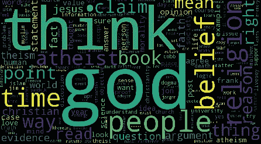
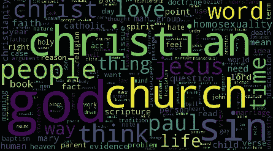
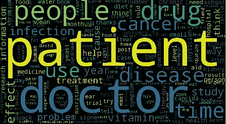
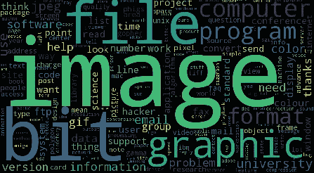
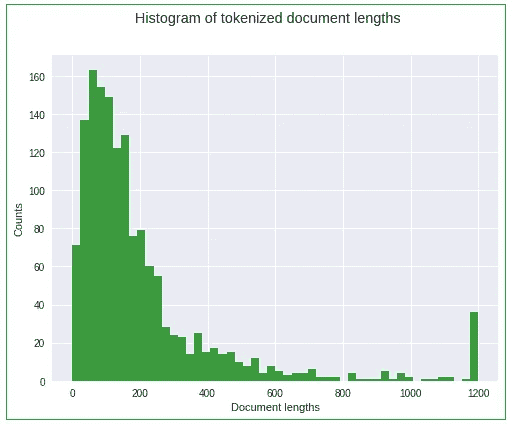
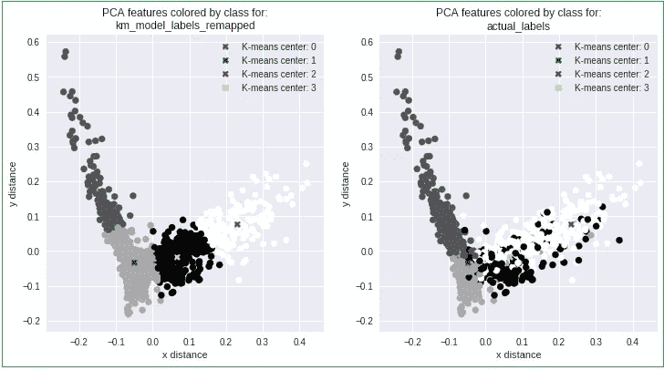

# 非监督与监督学习方法在自然语言处理文本分类中的性能比较

> 原文：<https://towardsdatascience.com/comparing-the-performance-of-non-supervised-vs-supervised-learning-methods-for-nlp-text-805a9c019b82?source=collection_archive---------11----------------------->

将分类性能与 scikit-learn 文档中现有的 NLP 指标基线进行比较。Gal Arav M.Sc

# 笔记

1.本文中使用的术语的定义包含在末尾。

2.附带的 python 笔记本托管在 Google Colab:https://Colab . research . Google . com/github/gal-a/blog/blob/master/docs/notebooks/NLP/NLP _ TF-IDF _ clustering . ipynb

3.这是我在**关于数据科学**的第一篇文章，我期待任何反馈或问题，我的博客在:[http://gal-a.com/](http://gal-a.com/)

# 输入数据

输入数据是从 scikit learn library 中的 4 个互联网新闻组中提取的。下面显示的是这些新闻组中的**热门话题**的单词云，强调了每个新闻组中最受欢迎的话题。

# 无神论新闻组词云:

# 基督教新闻组单词云:

# 医学新闻组单词云:

# 图形新闻组单词云:

# 动机

**我们的目标是准确地对文本文档进行分类，并将无监督学习方法的性能指标与现有的有监督学习方法的性能指标进行比较。**

我们将比较以下非监督方法的性能指标:K-means、NMF 和 LDA 方法与这些监督方法:多项式朴素贝叶斯和线性支持向量机(SVM)方法。

scikit learn 的文档中详细介绍了**监督方法**的性能指标，我们将它们用作基准参考。

为了确保我们能够相互比较，**我们将在这里分析的完全相同的测试数据集**上评估性能指标:
[http://sci kit-learn . org/stable/tutorial/text _ analytics/working _ with _ text _ data . html](http://scikit-learn.org/stable/tutorial/text_analytics/working_with_text_data.html)

如果我们知道有监督的方法会比无监督的方法更好，为什么还要为无监督的方法烦恼呢？这是因为在许多情况下，我们面临着没有完全标记的数据集的情况。标注大型数据集既昂贵又耗时，因此，在对文本标注项目投入资源之前，通过找到相似文档的聚类来获得我们研究的初始角度是有用的。例如，如果我们对文本数据的性质只有一个模糊的概念，通过非监督学习方法找到的“有趣”的类簇可以用来帮助我们决定在随后的监督学习项目中关注哪些类标签。半监督学习方法，即使用一个大的未标记数据集来扩充一个小的标记数据集，可以显著提高分类精度。

# 预处理

在我们可以应用机器学习方法之前，我们需要“清理”文本，具体来说，我们的目标是:**删除标点符号**，**删除琐碎的“停用词”**，应用一些基本的语言学方法，如**词干分析器**或**词法分析器**算法，并限制**词性(POS)** 。在这个简短的研究中，我们尝试只保留文本中的名词。

**斯特梅尔**算法的工作原理是切断单词的结尾或开头，同时考虑到一系列常见的前缀和后缀，这些前缀和后缀可以在一个屈折的单词中找到。

**Lemmatizer** 算法更复杂，通过使用详细的字典来考虑单词的形态分析，算法可以浏览这些字典以将形式链接回其 lemma。

下面是从原句中提取的 3 个名词示例列表。这里有些问题需要更复杂的预处理，但它们足够精确，我们可以继续处理(如前所示，单词 clouds 很好地反映了 4 个新闻组中的每一个)。原文句子:

注意，nltk 的缺省 POS 实现远非完美，还有各种其他的 POS 实现可以尝试(例如 HunPos、Stanford POS、Senna)。在这里我们看到，对于上面的句子，单词“bite”被错误地归类为名词，尽管它实际上是“bite”(一个动词)的过去分词。

机器学习模型需要输入数据的数字表示，因此我们需要在应用学习模型之前将文本转换为数字格式。用于将文本文档转换为数字表示的最流行的方法被称为 **TF-IDF** 、**‘词频-逆文档频率’**，尽管它的名字很长，但它非常容易理解。**简而言之，TF-IDF 是一个数字表，表示一个术语在一个特定文档中出现的频率，通过它在语料库中所有文档中出现的频率来标准化。**

请注意,“词频”概念通常被称为“词汇包”。当处理相关文本文档的大型语料库时，通常我们想要做的第一件事是创建这些文档中最流行的单词或短语的摘要。然后，可以通过术语频率或加权术语频率(当它们出现在 TF-IDF 矩阵中时，通过文档计数标准化)从术语的排序列表中创建“热门话题”

一旦预处理完成，绘制标记化文档长度的直方图是很有帮助的。

# 标记化文档长度的直方图:

注意，最后一个箱代表接近 40 个计数的尖峰(在文档长度= 1200 处)，因为该值用于最大文档长度。

下面是可以在附带的笔记本中运行的预处理步骤的摘要(使用 sklearn 库):

(I)从文档构建计数矢量器并拟合文档

(ii)从文档中建立 TF(术语频率),这是词袋的稀疏版本

㈢分两步建立词汇袋:适应、转换

㈣获得特征名称，并建立词汇袋的数据框架版本

(v)使用 TfidfTransformer 将单词包转换成 TF-IDF 矩阵(术语频率-逆文档频率)

(vi)找出最流行的词和最高权重

(vii)建立单词权重列表并对其进行排序

(viii)计算所有文档与其自身的余弦相似度

(ix)计算文档的距离矩阵

# 基于 K-均值聚类的 PCA 降维方法

K-means 是最著名的聚类算法。这是一种无监督的学习方法，因为学习不是基于标记的类。

给定一组观察值(x1，x2，…，xn)，其中每个观察值是一个 d 维实向量，k-means 聚类旨在将 n 个观察值划分为 k (≤ n)个集合 S = {S1，S2，…，Sk}，以便最小化组内平方和(WCSS)(即最小化方差)。

它可以在语料库中的所有文档中生成最流行主题的良好分割。

虽然 K-means 可以直接处理任意数量的特征，但它通常在负责减少特征数量的单独预处理步骤之后使用，例如流行的 PCA 方法(主成分分析)。sklearn.decomposition 中有一个很好的 PCA 实现。

**用线性代数术语**来说，PCA 可以通过数据协方差(或相关性)矩阵的特征值分解来完成。得到的特征向量对应于数据分散的不同方向。特征值代表这些特征向量的相对重要性。PCA 允许我们根据相应特征值的有序排序，丢弃相对不重要的特征向量。

**在统计学术语**中，主成分解释的方差分数是该主成分的方差与总方差(所有单个主成分的方差之和)之比。为了估计需要多少分量来描述数据，我们可以检查作为分量数量(按特征值大小排序)的函数的累积解释方差比，并仅选择与解释方差的特定百分比(例如 90%)相对应的顶部分量。

在我们的例子中，由于我们想要创建一个 2 维的可视化(见下文)，我们丢弃了除了对应于两个最大特征值的两个最重要的特征向量之外的所有特征向量，这两个剩余的特征作为 K-means 算法的输入——注意，仅基于两个特征的分析通常不包含 90%的解释方差！

# K 均值模型与实际类别的 PCA 特征:

*   K-means 导致所有数据点的清晰分割(左侧)。
*   当然，K-Means 模型导致了一些分类错误，如右图所示(对于具有实际类别标签的相同数据点)，尽管我们仍然可以非常清楚地看到 4 个聚类。
*   请注意，一般来说，由于我们通常不知道数据中的聚类数，我们需要使用一种技术来估计这一点，例如流行的**肘方法**:
    [https://en . Wikipedia . org/wiki/Determining _ the _ number _ of _ clusters _ in _ a _ data _ set](https://en.wikipedia.org/wiki/Determining_the_number_of_clusters_in_a_data_set)
*   中心的维数是:(n 个簇，n 个特征)。
*   PCA 作为 K-均值之前的初始步骤运行，这产生了上面的二维表示(n_features = 2)。

# NMF 和 LDA 聚类

NMF(非负矩阵分解)和 LDA(潜在狄利克雷分配)聚类都使用“单词包”矩阵作为输入，即与每个文档相关联的术语频率。然后，两种算法将原始单词包矩阵分成两个独立的单词包:

1.  文档到主题矩阵
2.  主题矩阵的术语

使用最小误差方法，这两个导出矩阵的乘积尽可能接近等于原始项频率。

虽然 K-means 可以提供良好的整体分割，但使用替代聚类方法(如 NMF 和 LDA)的主要优势在于，这些方法提供了对每个主题聚类中排名靠前的文档的额外洞察。注意，所有这三种算法都要求用户指定主题的数量作为输入参数。

注意，NMF 需要 TF-IDF 矩阵作为输入，而 LDA 只需要单词包(TF 表)作为输入。如何使用这些算法的例子可以在附带的 python 笔记本中找到。

# 结果

首先，为无监督学习方法计算**调整后的 Rand 指数**和**调整后的互信息得分**(参见本文末尾的定义)。这些是测量两个赋值的相似性的函数，忽略置换和机会归一化:

基于调整后的 Rand 指数和调整后的互信息得分，NMF 和 LDA 方法都优于 K-means。

在这项研究中，LDA 算法取得了最好的结果(下面显示的 sklearn.metrics 表的列定义包含在“文本处理定义”部分的末尾)。

与监督方法的最佳结果(线性 SVM 获得的)相比:

考虑到我们使用的是无监督学习方法，这还不错！

# 摘要

*   **在没有“偷看”类别标签的情况下，我们能够使用 LDA 进行无监督学习，在平均精确度、召回率和 f1 分数方面获得略高于 0.8 的分数。相比之下，对于在实际类别标签上训练的监督学习方法，使用线性支持向量机(SVM)分类器，得分仅超过 0.9。**
*   总的来说，所有的算法在挑选“comp.graphics”新闻组的能力方面都比较好(例如，这个新闻组与其他新闻组最少混淆)。
*   正如我们所料，最大的困惑发生在类似的“另类无神论”和“社会宗教基督教”新闻组之间。

附带的 python 笔记本使用 python 的 sklearn 库演示了 NLP(自然语言处理)环境中的以下技术:

*   使用 TF-IDF(术语频率-逆文档频率)将文本矢量化为数字矩阵
*   利用主成分分析进行维数约简
*   无监督分类:基于 PCA(TF-IDF 的简化版本)计算 K 均值聚类
*   非监督分类:基于 TF-IDF 计算 NMF
*   无监督分类:基于 TF 计算 LDA(潜在导数分析)

下一步将是对这些算法的参数化进行网格搜索(这可能会导致更好的分类)，并在更大更大胆的数据集上释放它们。

# 文本处理定义(在本文中使用)

# 常规:

文集:某一特定主题的书面文本的集合。

**文档/样本/观察**:语料库中的单词序列。

**术语/单词/短语/特征/ n 元语法**:来自给定文本(或语音)样本的 n 个项目的连续序列。n 元语法可以有不同的长度，例如一元语法、二元语法、三元语法。

**术语簇**:话题。相关术语的分类。

**文档簇**:文档中具有共同主题的主题混合。

# 预处理:

**TF-IDF(术语频率-逆文档频率)**:术语相对于整个语料库对文档的重要性的统计度量。实际上，这种方法通过一个术语在语料库中出现的频率来标准化它在文档中出现的频率。

**TF-IDF 样本**:语料库中的单个文档，TF-IDF 矩阵中的行。

**TF-IDF 特征**:这些都是语料库中包含的唯一 n 元文法，即 TF-IDF 矩阵中的列。

**PCA** (主成分分析):一种流行的降维统计方法，即降低特征空间的维度。它使用正交变换将一组可能相关的变量样本转换为一组称为主成分的线性不相关变量的值。

# 监督学习方法:

**多项式朴素贝叶斯**:基于应用贝叶斯定理的概率分类器家族，在特征之间具有强(朴素)独立性假设。多项式分布用于对每个特征建模，因为这适合于可以容易地转化为字数的文本数据。这是一种用于文本分类的流行的监督学习方法，尽管它有“天真”的假设，但表现良好。

**支持向量机(SVM)** :通过寻找最大化类间距离余量的超平面来执行分类。这是一种流行的用于文本分类的监督学习方法，尽管实现比上面的朴素贝叶斯方法慢。

# 监督学习绩效指标:

**精度**:tp/(TP+fp)的比值，其中 TP 为真阳性的数量，FP 为假阳性的数量。精确度直观上是分类器不将阴性样品标记为阳性的能力。

**回想一下**:比值 tp / (tp + fn)其中 tp 是真阳性的数量，fn 是假阴性的数量。召回直观上是分类器找到所有肯定样本的能力。

**F1 得分**:这可以解释为精度和召回率的加权平均值，其中 F1 得分在 1 时达到最佳值，在 0 时达到最差得分。在多类别和多标签的情况下，这是每个类别的 F1 分数的加权平均值。

F1 得分= 2 *(精确度*召回率)/(精确度+召回率)

**支持**:目标类向量中每个类出现的次数。

# 无监督学习方法:

**K-means** :一种流行的聚类方法，用于将一组样本划分为 K 个簇。

**NMF(非负矩阵分解)**:一种线性代数方法，将一个非负矩阵分解成两个与话题分布相关的非负矩阵 W 和 H。

**LDA(潜在狄利克雷分配)**:一种贝叶斯推理方法，通过使用狄利克雷分布建立每文档主题模型和每主题术语模型。

# 无监督学习性能指标:

**注意**:在监督学习中，我们获得基础真实类向量和预测类向量之间的直接映射，而在非监督学习中，我们无法预测绝对类 id，而是获得相对类 id 的预测。例如，包含 3 个不同类别标签{0，1，2}的基本事实的样本可能导致标记为{0，1，2}或{0，2，1}或{1，0，2}或{1，2，0}或{2，0，1}或{2，1，0}的 6 个不同排列中的任何一个的预测分配，并且我们对相对于基本事实的“最佳”排列的度量的质量感兴趣。

**调整后的互信息得分**:互信息是衡量两个赋值的一致性的函数，忽略排列。这种度量有两种不同的标准化版本，标准化互信息(NMI)和调整互信息(AMI)。NMI 经常在文献中使用，而 AMI 是最近才提出来的，并根据概率进行标准化。

**调整后的 Rand 指数**:调整后的 Rand 指数是一个函数，它测量两个赋值的相似性，忽略置换并进行机会归一化。

有关这些指标的详细信息，请参见 sk learn:[http://sci kit-learn . org/stable/modules/clustering . html # clustering-performance-evaluation](http://scikit-learn.org/stable/modules/clustering.html#clustering-performance-evaluation)