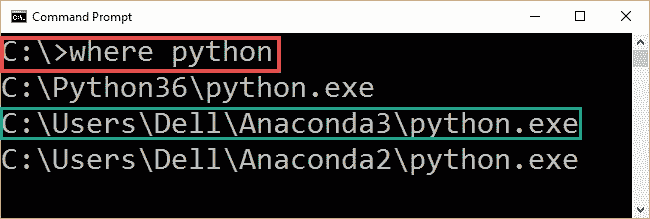
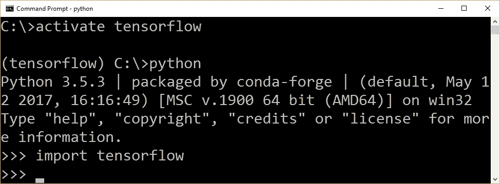
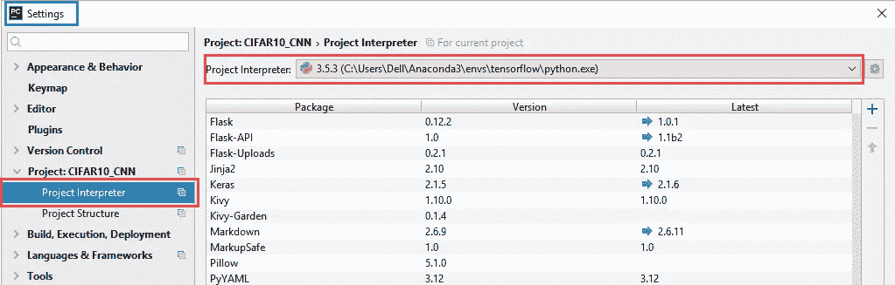
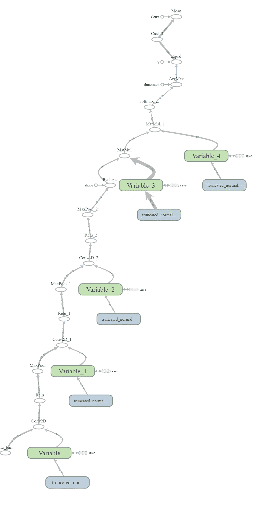
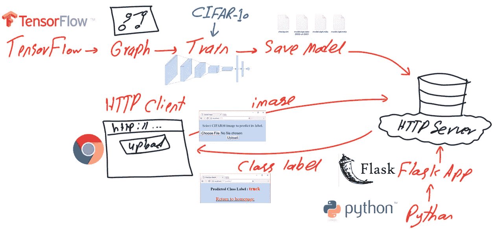
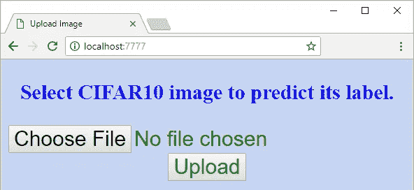

# 使用 TensorFlow 和 Flask RESTful Python API 构建基于 ConvNet HTTP 的应用程序的完整指南

> 原文：<https://towardsdatascience.com/complete-guide-to-build-convnet-http-based-application-using-tensorflow-and-flask-restful-python-c6326b13878b?source=collection_archive---------10----------------------->

本教程将带您了解使用 TensorFlow 创建卷积神经网络(CNN/ConvNet)所需的步骤，并通过允许使用 Flask RESTful API 通过基于 HTTP 的应用程序进行远程访问，将其投入生产。

该教程在 2018 年 5 月 15 日至 20 日期间在 KDnuggets.com 最常分享的帖子中排名第二。它获得了银质徽章。

在本教程中，CNN 将使用 TensorFlow NN (tf.nn)模块构建。CNN 模型架构是针对 CIFAR10 数据集创建、训练和测试的。为了使模型可以远程访问，使用 Python 创建了一个 Flask Web 应用程序来接收上传的图像，并使用 HTTP 返回其分类标签。在有 CPU 支持的 Windows 上，除了 TensorFlow 之外，还使用 Anaconda3。本教程假设你对 CNN 有一个基本的了解，比如层、步幅和填充。还需要关于 Python 的知识。

本教程总结为以下步骤:

1.通过安装 Python、TensorFlow、PyCharm 和 Flask API 来准备环境。

2.下载和准备 CIFAR-10 数据集。

3.用张量流建立 CNN 计算图。

4.训练 CNN。

5.保存训练好的 CNN 模型。

6.准备测试数据并恢复训练好的 CNN 模型。

7.测试训练好的 CNN 模型。

8.构建 Flask Web 应用程序。

9.使用 HTML 表单上传图像。

10.创建辅助 HTML、JavaScript 和 CSS 文件。

11.基于 HTTP 远程访问训练好的模型进行预测。

# **1。安装 Python、TensorFlow、PyCharm 和 Flask API**

在开始构建项目之前，需要准备它的环境。Python 是第一个开始安装的工具，因为环境完全依赖于它。如果您已经准备好了环境，可以跳过第一步。

## **1.1 Anaconda/Python 安装**

可以安装原生 Python 发行版，但是建议使用一体化包，比如 Anaconda，因为它会为您做一些事情。在这个项目中，使用了 Anaconda 3。对于 Windows，可执行文件可以从 https://www.anaconda.com/download/#windows 的[下载。它很容易安装。](https://www.anaconda.com/download/#windows)

为了确保 Anaconda3 安装正确，可以发出 CMD 命令(*，其中 python* )，如图 1 所示。如果 Anaconda3 安装正确，它的安装路径将出现在命令输出中。



Figure 1

## **1.2 张量流安装**

使用 Anaconda3 安装 Python 后，接下来就是安装 TensorFlow (TF)。本教程在有 CPU 支持的 Windows 上使用 TF。安装说明见本页[https://www.tensorflow.org/install/install_windows](https://www.tensorflow.org/install/install_windows)。这段 YouTube 视频可能会有所帮助(【https://youtu.be/MsONo20MRVU】T2)。

TF 安装步骤如下:

**1)通过调用该命令为 TF 创建一个 conda 环境:**

```
C:> conda create -n tensorflow pip python=3.5
```

这将创建一个空文件夹来存放 TF 安装的虚拟环境(venv)。venv 位于此位置的 Anaconda3 安装目录下(\Anaconda3\envs\tensorflow)。

使用此命令激活 TensorFlow 安装的 venv:

```
C:> activate tensorflow
```

上面的命令告诉我们，我们在 venv 内部，任何库安装都将在其中。在此命令之后，命令提示符应更改为(tensorflow)C:>。进入目录后，我们准备安装库。

**3)激活 venv 后，可以通过发出以下命令安装 Windows TensorFlow 的纯 CPU 版本:**

```
**(tensorflow)C:> pip install --ignore-installed --upgrade tensorflow**
```

为了测试 TF 是否安装正确，我们可以尝试如图 2 所示导入它。但是记住在导入 TF 之前，必须激活它的 venv。从 CMD 测试它，我们需要发出 **python** 命令，以便能够与 python 交互。因为导入行中没有出现错误，所以 TF 安装成功。



Figure 2

## **1.3 PyCharm Python IDE 安装**

对于这个项目，建议使用 Python IDE，而不是在 CMD 中输入命令。本教程中使用的 IDE 是 PyCharm。它的 Windows 可执行文件可以从这个页面下载[https://www.jetbrains.com/pycharm/download/#section=windows](https://www.jetbrains.com/pycharm/download/#section=windows)。它的安装说明非常简单。

下载安装 PyCharm Python IDE 后，接下来就是和 TF 链接了。这是通过将其 Python 解释器设置为 TF venv 下安装的 Python 来实现的，如图 3 所示。这是通过打开 IDE 的设置并选择安装在 TF venv 中的**python.exe**文件的项目解释器来完成的。



Figure 3

## **1.4 烧瓶安装**

最后要安装的工具是 Flask RESTful API。它是一个要使用 pip/conda 安装程序在 TF venv 下使用以下 CMD 命令安装的库:

```
C:> pip install Flask-API
```

如果 NumPy 和 SciPy 尚未安装，应该安装在 venv 中，以便能够读取和操作图像。

通过安装 Anaconda (Python)、TensorFlow、PyCharm 和 Flask，我们已经准备好开始构建项目了。

# **2。下载和准备 CIFAR-10 数据集**

10 类 CIFAR 数据集(CIFAR-10)的 Python 版本可以从 https://www.cs.toronto.edu/~kriz/cifar.html[的这个页面下载。该数据集包含 60，000 幅图像，分为训练和测试数据。有五个保存训练数据的文件，其中每个文件有 10，000 个图像。这些图像是大小为 32x32x3 的 RGB。训练文件被命名为 **data_batch_1** 、 **data_batch_2** 等等。有一个保存测试数据的文件，名为 **test_batch** ，包含 10，000 个图像。有一个名为 **batches.meta** 的元数据文件，保存着数据集类标签，分别是**飞机**、**汽车**、**鸟**、**猫**、**鹿**、**狗**、**青蛙**、**马**、**船**和**卡车**。](https://www.cs.toronto.edu/~kriz/cifar.html)

因为数据集中的每个文件都是二进制文件，所以应该对其进行解码，以便检索实际的图像数据。为此，创建了一个名为 unpickle_patch 的函数来完成此类工作，定义如下:

```
def unpickle_patch(file):
"""
Decoding the binary file.
:param file:File to decode it data.
:return: Dictionary of the file holding details including input data and output labels.
"""
patch_bin_file = open(file, 'rb')#Reading the binary file.
patch_dict = pickle.load(patch_bin_file, encoding='bytes')#Loading the details of the binary file into a dictionary.
return patch_dict#Returning the dictionary.
```

该方法接受二进制文件名，并返回一个包含该文件详细信息的字典。除了标签之外，字典还保存文件中所有 10，000 个样本的数据。

为了解码整个训练数据，创建了一个名为 get_dataset_images 的新函数。该函数接受数据集路径，并且只对定型数据起作用。因此，它会过滤该路径下的文件，并仅返回以 **data_batch_** 开头的文件。测试数据是在构建和训练 CNN 之后准备的。

对于每个训练文件，通过调用 unpickle_patch 函数对其进行解码。基于此类函数返回的字典，get_dataset_images 函数返回图像数据及其类标签。从**‘数据’**键检索图像数据，从**‘标签’**键检索图像的类别标签。

因为图像数据保存为 1D 矢量，它应该被整形为三维。这是因为张量流接受这种形状的图像。因此，get_dataset_images 函数除了接受每个图像中的通道数之外，还接受行数/列数作为参数。

该功能的实现如下:

```
def get_dataset_images(dataset_path, im_dim=32, num_channels=3):
    """
    This function accepts the dataset path, reads the data, and returns it after being reshaped to match the requierments of the CNN.
    :param dataset_path:Path of the CIFAR10 dataset binary files.
    :param im_dim:Number of rows and columns in each image. The image is expected to be rectangular.
    :param num_channels:Number of color channels in the image.
    :return:Returns the input data after being reshaped and output labels.
    """
    num_files = 5#Number of training binary files in the CIFAR10 dataset.
    images_per_file = 10000#Number of samples withing each binary file.
    files_names = os.listdir(patches_dir)#Listing the binary files in the dataset path.
    """
    Creating an empty array to hold the entire training data after being reshaped.
    The dataset has 5 binary files holding the data. Each binary file has 10,000 samples. Total number of samples in the dataset is 5*10,000=50,000.
    Each sample has a total of 3,072 pixels. These pixels are reshaped to form a RGB image of shape 32x32x3.
    Finally, the entire dataset has 50,000 samples and each sample of shape 32x32x3 (50,000x32x32x3).
    """
    dataset_array = numpy.zeros(shape=(num_files * images_per_file, im_dim, im_dim, num_channels))
    #Creating an empty array to hold the labels of each input sample. Its size is 50,000 to hold the label of each sample in the dataset.
    dataset_labels = numpy.zeros(shape=(num_files * images_per_file), dtype=numpy.uint8)
    index = 0#Index variable to count number of training binary files being processed.
    for file_name in files_names:
        """
        Because the CIFAR10 directory does not only contain the desired training files and has some  other files, it is required to filter the required files.
        Training files start by 'data_batch_' which is used to test whether the file is for training or not.
        """
        if file_name[0:len(file_name) - 1] == "data_batch_":
            print("Working on : ", file_name)
            """
            Appending the path of the binary files to the name of the current file.
            Then the complete path of the binary file is used to decoded the file and return the actual pixels values.
            """
            data_dict = unpickle_patch(dataset_path+file_name)
            """
            Returning the data using its key 'data' in the dictionary.
            Character b is used before the key to tell it is binary string.
            """
            images_data = data_dict[b"data"]
            #Reshaping all samples in the current binary file to be of 32x32x3 shape.
            images_data_reshaped = numpy.reshape(images_data, newshape=(len(images_data), im_dim, im_dim, num_channels))
            #Appending the data of the current file after being reshaped.
            dataset_array[index * images_per_file:(index + 1) * images_per_file, :, :, :] = images_data_reshaped
            #Appening the labels of the current file.
            dataset_labels[index * images_per_file:(index + 1) * images_per_file] = data_dict[b"labels"]
            index = index + 1#Incrementing the counter of the processed training files by 1 to accept new file.
    return dataset_array, dataset_labels#Returning the training input data and output labels.
```

通过准备训练数据，我们可以使用 TF 建立和训练 CNN 模型。

# **3。使用 TensorFlow** 构建 CNN 计算图

CNN 的计算图是在一个名为 create_CNN 的函数中创建的。它创建卷积(conv)、ReLU、最大池化、下降和完全连接(FC)图层的堆栈，并返回最后一个完全连接图层的结果。每一层的输出都是下一层的输入。这要求相邻层的输出和输入的大小一致。请注意，对于每个 conv、ReLU 和 max 池层，有一些参数需要指定，如每个维度的跨度和填充。

```
def create_CNN(input_data, num_classes, keep_prop):
"""
Builds the CNN architecture by stacking conv, relu, pool, dropout, and fully connected layers.
:param input_data:patch data to be processed.
:param num_classes:Number of classes in the dataset. It helps determining the number of outputs in the last fully connected layer.
:param keep_prop:probability of dropping neurons in the dropout layer.
:return: last fully connected layer.
"""
#Preparing the first convolution layer.
filters1, conv_layer1 = create_conv_layer(input_data=input_data, filter_size=5, num_filters=4)
"""
Applying ReLU activation function over the conv layer output.
It returns a new array of the same shape as the input array.
"""
relu_layer1 = tensorflow.nn.relu(conv_layer1)
print("Size of relu1 result : ", relu_layer1.shape)
"""
Max pooling is applied to the ReLU layer result to achieve translation invariance.
It returns a new array of a different shape from the the input array relative to the strides and kernel size used.
"""
max_pooling_layer1 = tensorflow.nn.max_pool(value=relu_layer1, ksize=[1, 2, 2, 1], strides=[1, 1, 1, 1], padding="VALID")
print("Size of maxpool1 result : ", max_pooling_layer1.shape)#Similar to the previous conv-relu-pool layers, new layers are just stacked to complete the CNN architecture.
#Conv layer with 3 filters and each filter is of sisze of 5x5.
filters2, conv_layer2 = create_conv_layer(input_data=max_pooling_layer1, filter_size=7, num_filters=3)
relu_layer2 = tensorflow.nn.relu(conv_layer2)
print("Size of relu2 result : ", relu_layer2.shape)
max_pooling_layer2 = tensorflow.nn.max_pool(value=relu_layer2, ksize=[1, 2, 2, 1], strides=[1, 1, 1, 1], padding="VALID")
print("Size of maxpool2 result : ", max_pooling_layer2.shape)#Conv layer with 2 filters and a filter sisze of 5x5.
filters3, conv_layer3 = create_conv_layer(input_data=max_pooling_layer2, filter_size=5, num_filters=2)
relu_layer3 = tensorflow.nn.relu(conv_layer3)
print("Size of relu3 result : ", relu_layer3.shape)
max_pooling_layer3 = tensorflow.nn.max_pool(value=relu_layer3, ksize=[1, 2, 2, 1], strides=[1, 1, 1, 1], padding="VALID")
print("Size of maxpool3 result : ", max_pooling_layer3.shape)#Adding dropout layer before the fully connected layers to avoid overfitting.
flattened_layer = dropout_flatten_layer(previous_layer=max_pooling_layer3, keep_prop=keep_prop)#First fully connected (FC) layer. It accepts the result of the dropout layer after being flattened (1D).
fc_resultl = fc_layer(flattened_layer=flattened_layer, num_inputs=flattened_layer.get_shape()[1:].num_elements(),
num_outputs=200)
#Second fully connected layer accepting the output of the previous fully connected layer. Number of outputs is equal to the number of dataset classes.
fc_result2 = fc_layer(flattened_layer=fc_resultl, num_inputs=fc_resultl.get_shape()[1:].num_elements(), num_outputs=num_classes)
print("Fully connected layer results : ", fc_result2)
return fc_result2#Returning the result of the last FC layer.
```

因为卷积层在输入数据和所用的一组过滤器之间应用卷积运算，所以 create_CNN 函数接受输入数据作为输入参数。get_dataset_images 函数返回的就是这样的数据。卷积图层是使用创建 conv 图层函数创建的。create_conv_layer 函数接受输入数据、过滤器大小和过滤器数量，并返回输入数据与过滤器集合的卷积结果。这组滤波器根据输入图像的深度来设置它们的大小。创建 conv 层的定义如下:

```
def create_conv_layer(input_data, filter_size, num_filters):"""Builds the CNN convolution (conv) layer.:param input_data:patch data to be processed.:param filter_size:#Number of rows and columns of each filter. It is expected to have a rectangular filter.:param num_filters:Number of filters.:return:The last fully connected layer of the network.""""""Preparing the filters of the conv layer by specifiying its shape.Number of channels in both input image and each filter must match.Because number of channels is specified in the shape of the input image as the last value, index of -1 works fine."""filters = tensorflow.Variable(tensorflow.truncated_normal(shape=(filter_size, filter_size, tensorflow.cast(input_data.shape[-1], dtype=tensorflow.int32), num_filters),stddev=0.05))print("Size of conv filters bank : ", filters.shape)"""Building the convolution layer by specifying the input data, filters, strides along each of the 4 dimensions, and the padding.Padding value of 'VALID' means the some borders of the input image will be lost in the result based on the filter size."""conv_layer = tensorflow.nn.conv2d(input=input_data,filter=filters,strides=[1, 1, 1, 1],padding="VALID")print("Size of conv result : ", conv_layer.shape)return filters, conv_layer#Returing the filters and the convolution layer result.
```

另一个论点是神经元留在脱落层的概率。它指定有多少神经元被丢弃层丢弃。dropout 层是使用 dropout_flatten_layer 函数实现的，如下所示。该函数返回一个展平的数组，该数组将作为完全连接的层的输入。

```
def dropout_flatten_layer(previous_layer, keep_prop):"""Applying the dropout layer.:param previous_layer: Result of the previous layer to the dropout layer.:param keep_prop: Probability of keeping neurons.:return: flattened array."""dropout = tensorflow.nn.dropout(x=previous_layer, keep_prob=keep_prop)num_features = dropout.get_shape()[1:].num_elements()layer = tensorflow.reshape(previous_layer, shape=(-1, num_features))#Flattening the results.return layer
```

因为最后一个 FC 层的输出神经元的数量应该等于数据集类的数量，所以数据集类的数量被用作 create_CNN 函数的另一个输入参数。使用 fc_layer 函数创建完全连接的层。该函数接受丢弃层的展平结果、展平结果中的特征数量以及 FC 层的输出神经元数量。根据输入和输出的数量，创建一个权重张量，然后乘以展平层，以获得 FC 层的返回结果。

```
def fc_layer(flattened_layer, num_inputs, num_outputs):"""uilds a fully connected (FC) layer.:param flattened_layer: Previous layer after being flattened.:param num_inputs: Number of inputs in the previous layer.:param num_outputs: Number of outputs to be returned in such FC layer.:return:"""#Preparing the set of weights for the FC layer. It depends on the number of inputs and number of outputs.fc_weights = tensorflow.Variable(tensorflow.truncated_normal(shape=(num_inputs, num_outputs),stddev=0.05))#Matrix multiplication between the flattened array and the set of weights.fc_resultl = tensorflow.matmul(flattened_layer, fc_weights)return fc_resultl#Output of the FC layer (result of matrix multiplication).
```

使用 TensorBoard 可视化后的计算图如图 4 所示。



Figure 4

# **4。训练 CNN**

在构建了 CNN 的计算图之后，接下来是针对先前准备的训练数据来训练它。训练是根据下面的代码完成的。代码首先准备数据集的路径，并将其准备到一个占位符中。请注意，路径应该更改为适合您的系统。然后它调用前面讨论过的函数。被训练的 CNN 的预测被用于测量网络的成本，该成本将使用梯度下降优化器被最小化。注意:一些张量有一个名字，这有助于以后测试 CNN 时检索这些张量。

```
#Nnumber of classes in the dataset. Used to specify number of outputs in the last fully connected layer.num_datatset_classes = 10#Number of rows & columns in each input image. The image is expected to be rectangular Used to reshape the images and specify the input tensor shape.im_dim = 32#Number of channels in rach input image. Used to reshape the images and specify the input tensor shape.num_channels = 3#Directory at which the training binary files of the CIFAR10 dataset are saved.patches_dir = "C:\\Users\\Dell\\Downloads\\Compressed\\cifar-10-python\\cifar-10-batches-py\\"#Reading the CIFAR10 training binary files and returning the input data and output labels. Output labels are used to test the CNN prediction accuracy.dataset_array, dataset_labels = get_dataset_images(dataset_path=patches_dir, im_dim=im_dim, num_channels=num_channels)print("Size of data : ", dataset_array.shape)"""Input tensor to hold the data read above. It is the entry point of the computational graph.The given name of 'data_tensor' is useful for retreiving it when restoring the trained model graph for testing."""data_tensor = tensorflow.placeholder(tensorflow.float32, shape=[None, im_dim, im_dim, num_channels], name='data_tensor')"""Tensor to hold the outputs label.The name "label_tensor" is used for accessing the tensor when tesing the saved trained model after being restored."""label_tensor = tensorflow.placeholder(tensorflow.float32, shape=[None], name='label_tensor')#The probability of dropping neurons in the dropout layer. It is given a name for accessing it later.keep_prop = tensorflow.Variable(initial_value=0.5, name="keep_prop")#Building the CNN architecure and returning the last layer which is the fully connected layer.fc_result2 = create_CNN(input_data=data_tensor, num_classes=num_datatset_classes, keep_prop=keep_prop)"""Predicitions probabilities of the CNN for each training sample.Each sample has a probability for each of the 10 classes in the dataset.Such tensor is given a name for accessing it later."""softmax_propabilities = tensorflow.nn.softmax(fc_result2, name="softmax_probs")"""Predicitions labels of the CNN for each training sample.The input sample is classified as the class of the highest probability.axis=1 indicates that maximum of values in the second axis is to be returned. This returns that maximum class probability fo each sample."""softmax_predictions = tensorflow.argmax(softmax_propabilities, axis=1)#Cross entropy of the CNN based on its calculated probabilities.cross_entropy = tensorflow.nn.softmax_cross_entropy_with_logits(logits=tensorflow.reduce_max(input_tensor=softmax_propabilities, reduction_indices=[1]),labels=label_tensor)#Summarizing the cross entropy into a single value (cost) to be minimized by the learning algorithm.cost = tensorflow.reduce_mean(cross_entropy)#Minimizng the network cost using the Gradient Descent optimizer with a learning rate is 0.01.error = tensorflow.train.GradientDescentOptimizer(learning_rate=.01).minimize(cost)#Creating a new TensorFlow Session to process the computational graph.sess = tensorflow.Session()#Wiriting summary of the graph to visualize it using TensorBoard.tensorflow.summary.FileWriter(logdir="./log/", graph=sess.graph)#Initializing the variables of the graph.sess.run(tensorflow.global_variables_initializer())"""Because it may be impossible to feed the complete data to the CNN on normal machines, it is recommended to split the data into a number of patches.A percent of traning samples is used to create each path. Samples for each path can be randomly selected."""num_patches = 5#Number of patchesfor patch_num in numpy.arange(num_patches):print("Patch : ", str(patch_num))percent = 80 #percent of samples to be included in each path.#Getting the input-output data of the current path.shuffled_data, shuffled_labels = get_patch(data=dataset_array, labels=dataset_labels, percent=percent)#Data required for cnn operation. 1)Input Images, 2)Output Labels, and 3)Dropout probabilitycnn_feed_dict = {data_tensor: shuffled_data,label_tensor: shuffled_labels,keep_prop: 0.5}"""Training the CNN based on the current patch.CNN error is used as input in the run to minimize it.SoftMax predictions are returned to compute the classification accuracy."""softmax_predictions_, _ = sess.run([softmax_predictions, error], feed_dict=cnn_feed_dict)#Calculating number of correctly classified samples.correct = numpy.array(numpy.where(softmax_predictions_ == shuffled_labels))correct = correct.sizeprint("Correct predictions/", str(percent * 50000/100), ' : ', correct)
```

不是将整个训练数据提供给 CNN，而是将数据分成一组小块，然后一个小块一个小块地通过环路提供给网络。每个补丁包含训练数据的子集。使用 get_patch 函数返回补丁。该函数接受输入数据、标签以及从这些数据中返回的样本百分比。然后，它根据输入的百分比返回数据的子集。

```
def get_patch(data, labels, percent=70):"""Returning patch to train the CNN.:param data: Complete input data after being encoded and reshaped.:param labels: Labels of the entire dataset.:param percent: Percent of samples to get returned in each patch.:return: Subset of the data (patch) to train the CNN model."""#Using the percent of samples per patch to return the actual number of samples to get returned.num_elements = numpy.uint32(percent*data.shape[0]/100)shuffled_labels = labels#Temporary variable to hold the data after being shuffled.numpy.random.shuffle(shuffled_labels)#Randomly reordering the labels."""The previously specified percent of the data is returned starting from the beginning until meeting the required number of samples.The labels indices are also used to return their corresponding input images samples."""return data[shuffled_labels[:num_elements], :, :, :], shuffled_labels[:num_elements]
```

# **5。保存训练好的 CNN 模型**

在对 CNN 进行训练之后，模型被保存起来，供以后在另一个 Python 脚本中测试时重用。您还应该更改保存模型的路径，以适合您的系统。

```
#Saving the model after being trained.
saver = tensorflow.train.Saver()
save_model_path = "C:\\model\\"
save_path = saver.save(sess=sess, save_path=save_model_path+"model.ckpt")
print("Model saved in : ", save_path)
```

# **6。准备测试数据，恢复训练好的 CNN 模型**

在测试训练好的模型之前，需要准备测试数据并恢复之前训练好的模型。测试数据准备与训练数据类似，只是只有一个二进制文件需要解码。根据修改的 get_dataset_images 函数对测试文件进行解码。这个函数调用 unpickle_patch 函数，就像之前对训练数据所做的一样。

```
def get_dataset_images(test_path_path, im_dim=32, num_channels=3):"""Similar to the one used in training except that there is just a single testing binary file for testing the CIFAR10 trained models."""print("Working on testing patch")data_dict = unpickle_patch(test_path_path)images_data = data_dict[b"data"]dataset_array = numpy.reshape(images_data, newshape=(len(images_data), im_dim, im_dim, num_channels))return dataset_array, data_dict[b"labels"]
```

# **7。测试训练好的 CNN 模型。**

准备好测试数据，恢复训练好的模型后，我们就可以按照下面的代码开始测试模型了。值得一提的是，我们的目标只是返回输入样本的网络预测。这就是为什么 TF 会话只返回预测。当训练 CNN 时，会话运行以最小化成本。在测试中，我们不再对最小化成本感兴趣。另一个有趣的地方是，dropout 层的保持概率现在被设置为 1。这意味着不要删除任何节点。这是因为我们只是在确定了要删除的节点后才使用预训练模型。现在，我们只是使用模型之前所做的，并不关心通过删除其他节点来修改它。

```
#Dataset path containing the testing binary file to be decoded.patches_dir = "C:\\Users\\Dell\\Downloads\\Compressed\\cifar-10-python\\cifar-10-batches-py\\"dataset_array, dataset_labels = get_dataset_images(test_path_path=patches_dir + "test_batch", im_dim=32, num_channels=3)print("Size of data : ", dataset_array.shape)sess = tensorflow.Session()#Restoring the previously saved trained model.saved_model_path = 'C:\\Users\\Dell\\Desktop\\model\\'saver = tensorflow.train.import_meta_graph(saved_model_path+'model.ckpt.meta')saver.restore(sess=sess, save_path=saved_model_path+'model.ckpt')#Initalizing the varaibales.sess.run(tensorflow.global_variables_initializer())graph = tensorflow.get_default_graph()"""Restoring previous created tensors in the training phase based on their given tensor names in the training phase.Some of such tensors will be assigned the testing input data and their outcomes (data_tensor, label_tensor, and keep_prop).Others are helpful in assessing the model prediction accuracy (softmax_propabilities and softmax_predictions)."""softmax_propabilities = graph.get_tensor_by_name(name="softmax_probs:0")softmax_predictions = tensorflow.argmax(softmax_propabilities, axis=1)data_tensor = graph.get_tensor_by_name(name="data_tensor:0")label_tensor = graph.get_tensor_by_name(name="label_tensor:0")keep_prop = graph.get_tensor_by_name(name="keep_prop:0")#keep_prop is equal to 1 because there is no more interest to remove neurons in the testing phase.feed_dict_testing = {data_tensor: dataset_array,label_tensor: dataset_labels,keep_prop: 1.0}#Running the session to predict the outcomes of the testing samples.softmax_propabilities_, softmax_predictions_ = sess.run([softmax_propabilities, softmax_predictions],feed_dict=feed_dict_testing)#Assessing the model accuracy by counting number of correctly classified samples.correct = numpy.array(numpy.where(softmax_predictions_ == dataset_labels))correct = correct.sizeprint("Correct predictions/10,000 : ", correct)
```

# **8。构建 Flask Web 应用程序**

在训练 CNN 模型之后，我们可以将它添加到 HTTP 服务器上，并允许用户在线使用它。用户将使用 HTTP 客户端上传图像。上传的图像将由 HTTP 服务器接收，或者更具体地说，由 Flask Web 应用程序接收。这种应用将基于训练的模型预测图像的类别标签，并最终将类别标签返回给 HTTP 客户端。图 5 总结了这种讨论。



Figure 5

要开始构建 flask 应用程序，需要创建 Flask 库，并使用 Flask 类创建一个新的应用程序。最后，这样的应用程序将运行以从 Web 访问。此类应用程序有一些属性，如访问它的主机、端口号和返回调试信息的调试标志。运行应用程序后，可以使用指定的主机和端口号来访问它。

```
import flask#Creating a new Flask Web application. It accepts the package name.app = flask.Flask("CIFAR10_Flask_Web_App")"""To activate the Web server to receive requests, the application must run.A good practice is to check whether the file is whether the file called from an external Python file or not.If not, then it will run."""if __name__ == "__main__":"""In this example, the app will run based on the following properties:host: localhostport: 7777debug: flag set to True to return debugging information."""app.run(host="localhost", port=7777, debug=True)
```

目前，服务器没有提供任何功能。服务器应该做的第一件事是允许用户上传图像。当用户访问应用程序的根 URL 时，应用程序什么也不做。应用程序可以将用户重定向到一个 HTML 页面，用户可以在该页面上传图像。为此，该应用程序有一个名为 redirect_upload 的函数，将用户重定向到上传图像的页面。让这个函数在用户访问应用程序的根目录后执行的是使用以下代码行创建的路由:

```
app.add_url_rule(rule="/", endpoint="homepage", view_func=redirect_upload)
```

这一行说的是如果用户访问 app 的根目录(标记为**"/**)，那么就会调用查看器函数(redirect_upload)。此类函数除了呈现一个名为 **upload_image.html** 的 HTML 页面之外什么也不做。该页面位于服务器的专用**模板**目录下。模板目录中的页面通过调用 render_template 函数来呈现。请注意，有一个名为 endpoint 的属性，它使多次重用相同的路由变得容易，而无需对其进行硬编码。

```
def redirect_upload():"""A viewer function that redirects the Web application from the root to a HTML page for uploading an image to get classified.The HTML page is located under the /templates directory of the application.:return: HTML page used for uploading an image. It is 'upload_image.html' in this exmaple."""return flask.render_template(template_name_or_list="upload_image.html")"""Creating a route between the homepage URL (http://localhost:7777) to a viewer function that is called after getting to such URL.Endpoint 'homepage' is used to make the route reusable without hard-coding it later."""app.add_url_rule(rule="/", endpoint="homepage", view_func=redirect_upload)
```

呈现的 HTML 页面的屏幕如图 6 所示。



Figure 6

下面是这个页面的 HTML 代码。这是一个简单的表单，允许用户上传图像文件。提交该表单时，将向 URL[**HTTP://localhost:7777/upload/**](http://localhost:7777/upload/)返回一条 POST HTTP 消息。

```
<!DOCTYPE html><html lang="en"><head><link rel="stylesheet" type="text/css" href="{{url_for(endpoint='static', filename='project_styles.css')}}"><meta charset="UTF-8"><title>Upload Image</title></head><body><form enctype="multipart/form-data" method="post" action="http://localhost:7777/upload/"><center><h3>Select CIFAR10 image to predict its label.</h3><input type="file" name="image_file" accept="image/*"><br><input type="submit" value="Upload"></center></form></body></html>
```

从 HTML 表单返回到服务器后，将调用与在**表单动作**属性中指定的 URL 相关联的查看器函数，即 upload_image 函数。该函数获取用户选择的图像，并将其保存到服务器。

```
def upload_image():"""Viewer function that is called in response to getting to the 'http://localhost:7777/upload' URL.It uploads the selected image to the server.:return: redirects the application to a new page for predicting the class of the image."""#Global variable to hold the name of the image file for reuse later in prediction by the 'CNN_predict' viewer functions.global secure_filenameif flask.request.method == "POST":#Checking of the HTTP method initiating the request is POST.img_file = flask.request.files["image_file"]#Getting the file name to get uploaded.secure_filename = werkzeug.secure_filename(img_file.filename)#Getting a secure file name. It is a good practice to use it.img_path = os.path.join(app.root_path, secure_filename)#Preparing the full path under which the image will get saved.img_file.save(img_path)#Saving the image in the specified path.print("Image uploaded successfully.")"""After uploading the image file successfully, next is to predict the class label of it.The application will fetch the URL that is tied to the HTML page responsible for prediction and redirects the browser to it.The URL is fetched using the endpoint 'predict'."""return flask.redirect(flask.url_for(endpoint="predict"))return "Image upload failed.""""Creating a route between the URL (http://localhost:7777/upload) to a viewer function that is called after navigating to such URL.Endpoint 'upload' is used to make the route reusable without hard-coding it later.The set of HTTP method the viewer function is to respond to is added using the 'methods' argument.In this case, the function will just respond to requests of method of type POST."""app.add_url_rule(rule="/upload/", endpoint="upload", view_func=upload_image, methods=["POST"])
```

将图像成功上传到服务器后，我们就可以读取图像，并使用之前训练的 CNN 模型预测其类别标签。因此，upload_image 函数将应用程序重定向到负责预测图像类别标签的查看器函数。这种查看器功能是通过其在该行中指定的端点来实现的:

```
return flask.redirect(flask.url_for(endpoint="predict"))
```

将调用与 endpoint =**“predict”**关联的方法，这是 CNN_predict 函数。

```
def CNN_predict():"""Reads the uploaded image file and predicts its label using the saved pre-trained CNN model.:return: Either an error if the image is not for CIFAR10 dataset or redirects the browser to a new page to show the prediction result if no error occurred.""""""Setting the previously created 'secure_filename' to global.This is because to be able invoke a global variable created in another function, it must be defined global in the caller function."""global secure_filename#Reading the image file from the path it was saved in previously.img = scipy.misc.imread(os.path.join(app.root_path, secure_filename))"""Checking whether the image dimensions match the CIFAR10 specifications.CIFAR10 images are RGB (i.e. they have 3 dimensions). It number of dimenions was not equal to 3, then a message will be returned."""if(img.ndim) == 3:"""Checking if the number of rows and columns of the read image matched CIFAR10 (32 rows and 32 columns)."""if img.shape[0] == img.shape[1] and img.shape[0] == 32:"""Checking whether the last dimension of the image has just 3 channels (Red, Green, and Blue)."""if img.shape[-1] == 3:"""Passing all conditions above, the image is proved to be of CIFAR10.This is why it is passed to the predictor."""predicted_class = CIFAR10_CNN_Predict_Image.main(img)"""After predicting the class label of the input image, the prediction label is rendered on an HTML page.The HTML page is fetched from the /templates directory. The HTML page accepts an input which is the predicted class."""return flask.render_template(template_name_or_list="prediction_result.html", predicted_class=predicted_class)else:# If the image dimensions do not match the CIFAR10 specifications, then an HTML page is rendered to show the problem.return flask.render_template(template_name_or_list="error.html", img_shape=img.shape)else:# If the image dimensions do not match the CIFAR10 specifications, then an HTML page is rendered to show the problem.return flask.render_template(template_name_or_list="error.html", img_shape=img.shape)return "An error occurred."#Returned if there is a different error other than wrong image dimensions."""Creating a route between the URL (http://localhost:7777/predict) to a viewer function that is called after navigating to such URL.Endpoint 'predict' is used to make the route reusable without hard-coding it later."""app.add_url_rule(rule="/predict/", endpoint="predict", view_func=CNN_predict)
```

这种方法读取图像并检查它是否与 32×32×3 的 CIFAR-10 数据集的尺寸相匹配。如果图像符合 CIFAR-10 数据集的规格，则它将被传递给负责进行预测的函数，如下所示:

```
predicted_class = CIFAR10_CNN_Predict_Image.main(img)
```

负责预测图像类别标签的主函数定义如下。它会恢复训练好的模型，并运行一个会话来返回图像的预测类。预测的类被返回给 Flask Web 应用程序。

```
def main(img):"""The 'main' method accepts an input image array of size 32x32x3 and returns its class label.:param img:RGB image of size 32x32x3.:return:Predicted class label."""#Dataset path containing a binary file with the labels of classes. Useful to decode the prediction code into a significant textual label.patches_dir = "C:\\cifar-10-python\\cifar-10-batches-py\\"dataset_array = numpy.random.rand(1, 32, 32, 3)dataset_array[0, :, :, :] = imgsess = tensorflow.Session()#Restoring the previously saved trained model.saved_model_path = 'C:\\model\\'saver = tensorflow.train.import_meta_graph(saved_model_path+'model.ckpt.meta')saver.restore(sess=sess, save_path=saved_model_path+'model.ckpt')#Initalizing the varaibales.sess.run(tensorflow.global_variables_initializer())graph = tensorflow.get_default_graph()"""Restoring previous created tensors in the training phase based on their given tensor names in the training phase.Some of such tensors will be assigned the testing input data and their outcomes (data_tensor, label_tensor, and keep_prop).Others are helpful in assessing the model prediction accuracy (softmax_propabilities and softmax_predictions)."""softmax_propabilities = graph.get_tensor_by_name(name="softmax_probs:0")softmax_predictions = tensorflow.argmax(softmax_propabilities, axis=1)data_tensor = graph.get_tensor_by_name(name="data_tensor:0")label_tensor = graph.get_tensor_by_name(name="label_tensor:0")keep_prop = graph.get_tensor_by_name(name="keep_prop:0")#keep_prop is equal to 1 because there is no more interest to remove neurons in the testing phase.feed_dict_testing = {data_tensor: dataset_array,keep_prop: 1.0}#Running the session to predict the outcomes of the testing samples.softmax_propabilities_, softmax_predictions_ = sess.run([softmax_propabilities, softmax_predictions],feed_dict=feed_dict_testing)label_names_dict = unpickle_patch(patches_dir + "batches.meta")dataset_label_names = label_names_dict[b"label_names"]return dataset_label_names[softmax_predictions_[0]].decode('utf-8')
```

返回的图像的类标签将呈现在一个名为 **prediction_result.html** 的新 HTML 页面上，由 CNN_predict 函数在这一行中指示，如图 7 所示。


Figure 7

注意，Flask 应用程序使用 Jinja2 模板引擎，该引擎允许 HTML 页面接受输入参数。在这种情况下传递的输入参数是 predicted _ class = predicted _ class。

```
return flask.render_template(template_name_or_list="prediction_result.html", predicted_class=predicted_class)
```

这个页面的 HTML 代码如下。

```
<!DOCTYPE html><html lang="en"><head><link rel="stylesheet" type="text/css" href="{{url_for(endpoint='static', filename='project_styles.css')}}"><script type="text/javascript" src="{{url_for(endpoint='static', filename='result.js')}}"></script><meta charset="UTF-8"><title>Prediction Result</title></head><body onload="show_alert('{{predicted_class}}')"><center><h1>Predicted Class Label : <span>{{predicted_class}}</span></h1><br><a href="{{url_for(endpoint='homepage')}}"><span>Return to homepage</span>.</a></center></body></html>
```

它是一个模板，由图像的预测类填充，作为参数传递给 HTML 页面，如代码的这一部分所示:

```
<**span**>{{predicted_class}}</**span**>
```

想了解更多关于 Flask RESTful API 的信息，你可以访问这样的教程【https://www.tutorialspoint.com/flask/index.htm。

完整的项目可以在 Github 的这个链接中找到:【https://github.com/ahmedfgad/CIFAR10CNNFlask 

*原载于 2018 年 5 月 1 日*[*https://www.linkedin.com*](https://www.linkedin.com/pulse/complete-guide-build-convnet-http-based-application-using-ahmed-gad)*。*

原文可在 LinkedIn 的以下链接中找到:

[https://www . LinkedIn . com/pulse/complete-guide-build-conv net-http-based-application-using-Ahmed-gad](https://www.linkedin.com/pulse/complete-guide-build-convnet-http-based-application-using-ahmed-gad/?published=t)

# 联系作者

艾哈迈德·法齐·加德

领英:[https://linkedin.com/in/ahmedfgad](https://linkedin.com/in/ahmedfgad)

电子邮件:ahmed.f.gad@gmail.com