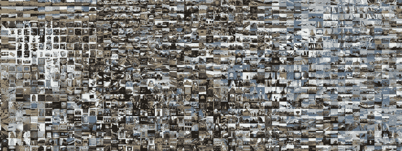

# 卷积神经网络的组件

> 原文：<https://towardsdatascience.com/components-of-convolutional-neural-networks-6ff66296b456?source=collection_archive---------11----------------------->



最近最先进的体系结构采用了许多附加组件来补充卷积运算。在这篇文章中，我将解释一些提高了现代卷积神经网络的速度和精度的最重要的组件。我将从解释每个组件的理论开始，并以 keras 中的实际实现结束。

# 联营

让 CNN 非常有效的第一个秘方是联营。池化是一种向量到标量的变换，它对图像的每个局部区域进行操作，就像卷积一样，但是，与卷积不同，它们没有过滤器，也不计算局部区域的点积，而是计算区域中像素的平均值(平均池化)或简单地挑选具有最高强度的像素并丢弃其余的像素(最大池化)。

以上是一个 2 x 2 的池，它将有效地减少了 2 的要素地图的大小。

汇集的想法看起来可能是反作用的，因为它会导致信息的丢失，然而它在实践中被证明是非常有效的，因为它使得 covnets 对于图像呈现的变化是不变的，并且它还减少了背景噪声的影响。最大池近年来工作得最好，它基于一个区域中的最大像素代表该区域中最重要的特征的思想。通常，我们希望分类的对象图像可能包含许多其他对象，例如，出现在汽车图片中某处的猫可能会误导分类器。池有助于减轻这种影响，并使 covnets 更好地泛化。

它还大大降低了 covnet 的计算成本。通常，网络中每层的图像大小与每层的计算成本(flops)成正比。随着层越来越深，池化减少了图像的维度，因此，它有助于防止网络所需的 flops 数量激增。交错卷积有时被用作池化的替代方法。

# 辍学者

过度拟合是一种网络在训练集上工作良好，但在测试集上表现不佳的现象。这通常是由于过度依赖训练集中特定特征的存在。辍学是一种应对过度适应的技术。它的工作原理是随机设置一些激活为 0，本质上杀死他们。通过这样做，网络被迫探索更多分类图像的方法，而不是过度依赖某些特征。这是 AlexNet 的关键要素之一。

# 批量标准化

神经网络的一个主要问题是梯度消失。这是一种梯度变得太小的情况，因此，训练冲浪运动员非常糟糕。来自 Google Brain 的 Ioffe 和 Szegedy 发现，这主要是由于内部协变量的变化，这种情况是由于信息在网络中流动时数据分布的变化而引起的。他们所做的是发明一种被称为批量标准化的技术。其工作原理是将每批图像归一化，使平均值和单位方差为零。

在 CNN 中，它通常位于非线性(relu)之前。它极大地提高了准确性，同时令人难以置信地加快了训练过程。

# 数据扩充

现代 covnets 需要的最后一个要素是数据扩充。人类视觉系统在适应图像平移、旋转和其他形式的失真方面表现出色。拍个图像随便翻一翻反正大部分人还是能认出来的。然而，covnets 并不擅长处理这种扭曲，它们可能会因为微小的翻译而严重失败。解决这个问题的关键是随机扭曲训练图像，使用水平翻转、垂直翻转、旋转、白化、移位和其他扭曲。这将使 covnets 能够学习如何处理这种失真，因此，它们将能够在现实世界中很好地工作。

另一种常见的技术是从每幅图像中减去平均图像，然后除以标准偏差。

解释了这些组件是什么以及它们为什么工作良好之后，我现在将解释如何在 keras 中实现它们。

在本文中，所有实验都将在 CIFAR10 上进行，这是一个由 60，000 张 32 x 32 RGB 图像组成的数据集。它被分成 50，000 幅训练图像和 10，000 幅测试图像

为了使事情更加模块化，让我们为每一层创建一个简单的函数

```
**def** Unit(x,filters):
    out = BatchNormalization()(x)
    out = Activation(**"relu"**)(out)
    out = Conv2D(filters=filters, kernel_size=[3, 3], strides=[1, 1], padding=**"same"**)(out)

    **return** out
```

这是我们代码中最重要的部分，单位函数定义了一个简单的层，包含三层，首先是我之前解释过的批处理规范化，然后我们添加了 RELU 激活，最后，我们添加了卷积，注意我是如何将 RELU 放在 conv 之前的，这是最近的一个实践，叫做“预激活”

现在我们将这个单元层合并成一个单一的模型

```
**def** MiniModel(input_shape):
    images = Input(input_shape)

    net = Unit(images,64)
    net = Unit(net,64)
    net = Unit(net,64)
    net = MaxPooling2D(pool_size=(2,2))(net)

    net = Unit(net,128)
    net = Unit(net,128)
    net = Unit(net,128)
    net = MaxPooling2D(pool_size=(2, 2))(net)

    net = Unit(net,256)
    net = Unit(net,256)
    net = Unit(net,256)

    net = Dropout(0.5)(net)
    net = AveragePooling2D(pool_size=(8,8))(net)
    net = Flatten()(net)
    net = Dense(units=10,activation=**"softmax"**)(net)

    model = Model(inputs=images,outputs=net)

    **return** model
```

在这里，我们使用函数式 API 来定义我们的模型，我们从三个单元开始，每个单元有 64 个过滤器，然后是最大池层，将我们的 32 x 32 图像减少到 16 x 16。接下来是 3，128 个过滤器单元，然后是池，在这一点上，我们的图像变成 8×8，最后，我们有另外 3 个单元，256 个通道。请注意，每次我们将图像尺寸缩小 2 倍，通道数量就会增加一倍。

我们以 0.5 的比率添加辍学，这将随机地停用我们的参数的 50%，正如我先前解释的，它对抗过度拟合。

接下来，我们需要加载 cifar10 数据集并执行一些数据扩充

```
*#load the cifar10 dataset* (train_x, train_y) , (test_x, test_y) = cifar10.load_data()

*#normalize the data* train_x = train_x.astype(**'float32'**) / 255
test_x = test_x.astype(**'float32'**) / 255

*#Subtract the mean image from both train and test set* train_x = train_x - train_x.mean()
test_x = test_x - test_x.mean()

*#Divide by the standard deviation* train_x = train_x / train_x.std(axis=0)
test_x = test_x / test_x.std(axis=0)
```

在上面的代码中，在加载训练和测试数据后，我们从每个图像中减去均值图像，然后除以标准差，这是一种基本的数据扩充技术，有时，我们可能只减去均值，而跳过标准差部分，应该使用效果最好的部分。

对于更先进的数据增强，我们的图像加载过程会略有变化，keras 有一个非常有用的数据增强工具，简化了整个过程。

下面的代码可以解决这个问题

```
datagen = ImageDataGenerator(rotation_range=10,
                             width_shift_range=5\. / 32,
                             height_shift_range=5\. / 32,
                             horizontal_flip=**True**)

*# Compute quantities required for featurewise normalization
# (std, mean, and principal components if ZCA whitening is applied).* datagen.fit(train_x)
```

在上面，首先，我们指定 10 度的旋转角度，高度和宽度都移动 5/32，最后水平翻转，所有这些变换将随机应用于训练集中的图像。请注意，还存在更多的转换，您可以查看一下可以为该类指定的所有参数。请记住，过度使用数据增强可能是有害的。

接下来，我们必须将标签转换为一键编码

```
*#Encode the labels to vectors* train_y = keras.utils.to_categorical(train_y,10)
test_y = keras.utils.to_categorical(test_y,10)
```

我已经在之前的教程中解释过了，所以我不会再在这里解释了。事实上，几乎所有组成训练过程的东西都和我以前的教程一样，因此，这里是完整的代码

```
*#import needed classes* **import** keras
**from** keras.datasets **import** cifar10
**from** keras.layers **import** Dense,Conv2D,MaxPooling2D,Flatten,AveragePooling2D,Dropout,BatchNormalization,Activation
**from** keras.models **import** Model,Input
**from** keras.optimizers **import** Adam
**from** keras.callbacks **import** LearningRateScheduler
**from** keras.callbacks **import** ModelCheckpoint
**from** math **import** ceil
**import** os
**from** keras.preprocessing.image **import** ImageDataGenerator

**def** Unit(x,filters):
    out = BatchNormalization()(x)
    out = Activation(**"relu"**)(out)
    out = Conv2D(filters=filters, kernel_size=[3, 3], strides=[1, 1], padding=**"same"**)(out)

    **return** out

*#Define the model* **def** MiniModel(input_shape):
    images = Input(input_shape)

    net = Unit(images,64)
    net = Unit(net,64)
    net = Unit(net,64)
    net = MaxPooling2D(pool_size=(2,2))(net)

    net = Unit(net,128)
    net = Unit(net,128)
    net = Unit(net,128)
    net = MaxPooling2D(pool_size=(2, 2))(net)

    net = Unit(net,256)
    net = Unit(net,256)
    net = Unit(net,256)

    net = Dropout(0.25)(net)
    net = AveragePooling2D(pool_size=(8,8))(net)
    net = Flatten()(net)
    net = Dense(units=10,activation=**"softmax"**)(net)

    model = Model(inputs=images,outputs=net)

    **return** model

*#load the cifar10 dataset* (train_x, train_y) , (test_x, test_y) = cifar10.load_data()

*#normalize the data* train_x = train_x.astype(**'float32'**) / 255
test_x = test_x.astype(**'float32'**) / 255

*#Subtract the mean image from both train and test set* train_x = train_x - train_x.mean()
test_x = test_x - test_x.mean()

*#Divide by the standard deviation* train_x = train_x / train_x.std(axis=0)
test_x = test_x / test_x.std(axis=0)

datagen = ImageDataGenerator(rotation_range=10,
                             width_shift_range=5\. / 32,
                             height_shift_range=5\. / 32,
                             horizontal_flip=**True**)

*# Compute quantities required for featurewise normalization
# (std, mean, and principal components if ZCA whitening is applied).* datagen.fit(train_x)

*#Encode the labels to vectors* train_y = keras.utils.to_categorical(train_y,10)
test_y = keras.utils.to_categorical(test_y,10)

*#define a common unit* input_shape = (32,32,3)
model = MiniModel(input_shape)

*#Print a Summary of the model* model.summary()
*#Specify the training components* model.compile(optimizer=Adam(0.001),loss=**"categorical_crossentropy"**,metrics=[**"accuracy"**])

epochs = 20
steps_per_epoch = ceil(50000/128)

*# Fit the model on the batches generated by datagen.flow().* model.fit_generator(datagen.flow(train_x, train_y, batch_size=128),
                    validation_data=[test_x,test_y],
                    epochs=epochs,steps_per_epoch=steps_per_epoch, verbose=1, workers=4)

*#Evaluate the accuracy of the test dataset* accuracy = model.evaluate(x=test_x,y=test_y,batch_size=128)
model.save(**"cifar10model.h5"**)
```

首先，这里有些事情是不同的

```
input_shape = (32,32,3)
model = MiniModel(input_shape)

*#Print a Summary of the model* model.summary()
```

正如我之前解释的，cifar 10 由 32 x 32 RGB 图像组成，因此，输入形状有 3 个通道。这是不言自明的。

下一行创建了我们定义的模型的实例，并传入了输入形状

最后，最后一行将打印出我们网络的完整摘要，包括参数的数量。

最后需要解释的是

```
epochs = 20
steps_per_epoch = ceil(50000/128)

*# Fit the model on the batches generated by datagen.flow().* model.fit_generator(datagen.flow(train_x, train_y, batch_size=128),
                    validation_data=[test_x,test_y],
                    epochs=epochs,steps_per_epoch=steps_per_epoch, verbose=1, workers=4)

*#Evaluate the accuracy of the test dataset* accuracy = model.evaluate(x=test_x,y=test_y,batch_size=128)
model.save(**"cifar10model.h5"**)
```

首先，我们定义要运行的周期数，以及每个周期的步数，不要与数字混淆

```
steps_per_epoch = ceil(50000/128)
```

这里的 50000 是训练图像的总数，这里我们使用 128 的批量大小，这意味着，对于 20 个时期中的每一个，网络必须处理 50000/128 批图像。

接下来是 fit 函数，这显然不同于我在之前的教程中解释的 fit 函数。

再看看下面会有帮助

```
*Fit the model on the batches generated by datagen.flow().* model.fit_generator(datagen.flow(train_x, train_y, batch_size=128),
                    validation_data=[test_x,test_y],
                    epochs=epochs,steps_per_epoch=steps_per_epoch, verbose=1, workers=4)
```

由于我们将数据生成器类用于数据扩充目的，我们必须使用 fit_generator 函数，我们也不直接传入 train_x 和 train_y，而是通过来自数据生成器的 flow 函数传入它们，我们还指定批量大小，接下来我们陈述验证数据，在这种情况下是测试数据。所有其他事情保持不变。

该设置在 20 个周期后产生 82%。

你可以尝试调整参数和网络，看看你能提高多少精度。在下一篇教程中，我将解释一些真正构建高效 cnn 架构所需的技巧和技术。本教程的目的是向您介绍基本组件。

如果你想深入研究计算机视觉。从[https://John . specpal . science](https://john.specpal.science/deepvision)下载我的免费电子书《深度计算机视觉入门》

如果你有任何问题，请在下面评论或者通过 [@johnolafenwa](https://twitter.com/johnolafenwa) 在 twitter 上联系我