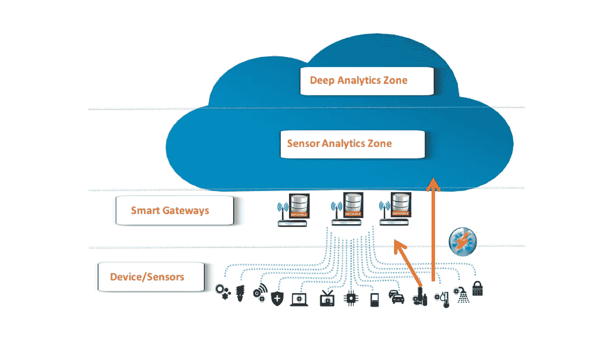
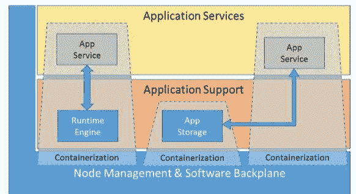
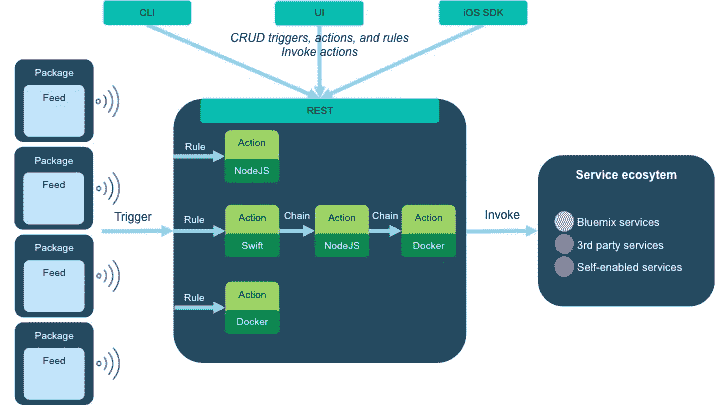

# 为混合物联网构建深度学习微服务

> 原文：<https://towardsdatascience.com/composing-deep-learning-microservices-for-the-hybrid-internet-of-things-c6cb3cb23b0f?source=collection_archive---------0----------------------->

深度学习正在稳步重塑我们世界的方方面面。但是，除非开发人员有合适的工具来包装这种机器智能以进行普遍部署，否则它无法实现这种潜力。

通过整合到支持微服务架构的工具中，深度学习正在进入云数据服务开发人员的工作环境。这指的是一种越来越流行的方式，即将云应用程序开发为模块化、可重用、范围狭窄的功能套件。在微服务环境中，每个函数都在自己的容器中执行(比如 Docker)。此外，每个微服务通过 RESTful APIs 以轻量级、松散耦合的方式与其他微服务进行互操作。

深度学习将越来越依赖于在复杂的多云中执行的容器化微服务。通常，这是通过抽象的“[无服务器](https://dzone.com/articles/adapting-serverless-architecture?edition=275883&utm_source=weekly%20digest&utm_medium=email&utm_campaign=wd%202017-03-08)”接口来实现的，这些接口使微服务能够在后端云基础设施上透明地执行，而开发人员无需了解 IT 资源是从哪里或如何提供的。因此，无服务器后端使基础设施能够在运行时自动为微服务提供必要的计算能力、存储、带宽和其他分布式资源。

在转向这种组合应用程序的模式时，深度学习开发人员无需担心预配置基础设施之类的事情，如服务器或操作。相反，他们可以简单地专注于建模和编码。但要让这一切在复杂的深度学习应用程序中无缝互操作，需要有一个后端中间件结构，用于可靠的消息传递、事务回滚和长期运行的编排功能(如 Kubernetes 提供的)。

当开发人员构建深度学习微服务以在物联网(IoT)中执行时，后端互操作性结构变得甚至比大多数云中更复杂。这是因为深度学习正在成为所有物联网终端的嵌入式功能，以及从物联网中心和集中式云服务向应用程序提供的服务。正如深度学习服务本身在狭义范围内将是“微”的，算法执行的物联网端点本身在资源限制方面将越来越微——或者更确切地说，是纳米。

在物联网中，嵌入式深度学习微服务将处理端点设备捕获的丰富的实时传感器数据流。这些微服务将推动物联网应用所依赖的视频识别、运动检测、自然语言处理、点击流处理和其他模式感知应用。通过这种方式，任何种类的每一个物体都将充满持续的数据驱动智能、环境意识和情境自主性。

对于物联网深度学习应用的组成和部署，开发人员需要一个中间件后端，它可以分发微服务，以便在网络端点执行[。为了支持这些物联网用例，微服务架构将发展为支持名为“](http://www.dataversity.net/distributing-machine-intelligence-foggy-edge-iot/)[雾计算](https://dzone.com/articles/future-is-in-fog-computing?edition=275883&utm_source=weekly%20digest&utm_medium=email&utm_campaign=wd%202017-03-08)”的完全分布式面向边缘的云架构

在这种新模式中，开发人员使用微服务 API 和无服务器后端来构建深度学习和其他分布式功能，这些功能可以透明地分布、并行化和优化到 fog 的无数端点。说明雾架构分层的一种方式如下，但请记住，容器化的微服务使“深度(学习)分析区”能够遍及整个云，一直到智能设备、传感器和网关。

Fog computing architecture

下图说明了 [OpenFog 协会的参考架构](https://www.openfogconsortium.org/ra/)的应用服务层是如何支持容器化的。本质上，深度学习应用和其他微服务可以在任何容器化的环境中运行，如 Docker/Kubernetes，这是一种物联网 fog 的软件背板。这样一来，这些容器化的深度学习微服务将利用物联网/雾支持层服务(如数据库和中间件)，这些服务将作为微服务在自己的容器内运行。

Containerization for Application Support in the IoT Fog (source: OpenFog Consortium “OpenFog Reference Architecture for Fog Computing”)

从更广的角度来看，确保所有这些深度学习微服务相互关联的团队将把数据科学作为他们的核心技能集。这些专业人员的核心工作将是构建、训练和优化回旋、递归和其他深层神经网络算法，这种技术魔法依赖于这些算法。他们将使用工具，如 IBM blue mix open shaw 构建基于事件的深度学习微服务，以部署在可能完全私有、完全公共或跨越混合架构中私有和公共部分的物联网雾/云上。

blue mixopen 晶须今天在 [IBM Bluemix](http://www.ibm.com/cloud-computing/bluemix/) 上有提供，开源社区可以在[这里](https://new-console.ng.bluemix.net/openwhisk/)找到。为了支持混合物联网的深度学习应用的敏捷组合，OpenWhisk 提供了内置的链接，这使得团队能够单独开发和定制深度学习和其他微服务，作为可以以协调的顺序连接在一起的小代码片段。它为物联网和其他用例的无服务器部署、认知算法、容器和语言提供了全面、灵活的支持。

下面是 open 晶须的高级功能架构:

OpenWhisk provides a distributed compute service to execute application logic in response to events.

关于底层 open 晶须架构和源代码的更多信息，从这里[开始](https://developer.ibm.com/openwhisk/)并进入[项目的 GitHub 页面](https://github.com/openwhisk)。