# Wolfram 暑期学校的 Reddit 计算思维

> 原文：<https://towardsdatascience.com/computational-thinking-with-reddit-at-the-wolfram-summer-school-29961feaa85d?source=collection_archive---------1----------------------->

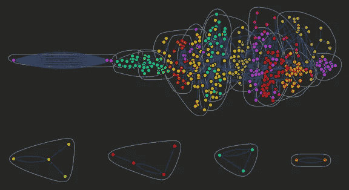

大约在去年的这个时候，我在想这个夏天该做些什么。在研究生院度过了一个相当糟糕的学期，但我终于完成了路易斯安那州立大学社会学博士项目的核心课程。学期结束时，我决定从巴吞鲁日开车去诺克斯维尔，那里的高温和潮湿不会让你的皮肤融化。我正在考虑“休假”，尽管在研究生院，这通常意味着收集数据和写论文。自从 2009 年以来，我一直在工作和上学，或者参加独立阅读课程，我想我应该休息一下。

然而，我太专注于文本分析和我的论文项目，无法放松。我参加的最后一个研讨会是社会网络分析。主持研讨会的教授想出了一种新颖的方法来分析采访记录，作为她在杜克大学的论文工作的一部分。她提出网络文本分析作为分析大量面试数据的方法。

如果你不熟悉这些类型的数据，社会学家通常依靠深度访谈的文字记录来更好地了解社会世界。例如，我的文学硕士工作包括采访 20 个主题。(你可以[在 VICE.com](https://www.vice.com/en_au/article/masculine-gay-men-are-as-sexist-against-feminine-men-as-straights)这里阅读，而[在这里阅读我为什么选择在非学术渠道](http://www.swedewhite.com/single-post/2016/08/07/Why-I-Published-Academic-Work-on-VICEcom)出版这部作品。)

在某些情况下，社会学家使用数百名受试者的采访数据。我计划结合使用调查和访谈数据，调查在 HIV 阳性个体和有感染 HIV 风险的个体中使用[暴露前预防法](https://www.cdc.gov/hiv/basics/prep.html)和 [Truvada](https://start.truvada.com/) 药物的情况。

在我的硕士工作期间，我的导师们教我如何使用一种叫做[扎根理论](http://www.groundedtheory.com/what-is-gt.aspx)的东西、手写笔记和一种叫做 [Atlas.ti](http://atlasti.com/) 的软件程序来组织和分析面试数据。

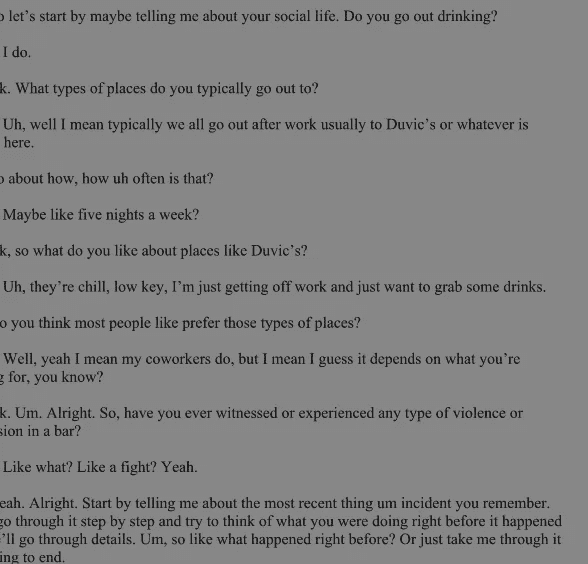

Example of a transcript. Imagine this times one thousand.

这个过程…令人生畏，没有条理，不可复制。它也非常过时。所以，我试图想出更好更有效的方法来分析采访数据。我碰到了几个软件包，包括 [Provalis QDA 矿工](https://provalisresearch.com/products/qualitative-data-analysis-software/)，它们似乎在文本挖掘方面做得相当不错，但仍然不够好。我开始在网上搜索，我偶然发现了 [Wolfram Research 的 Mathematica](https://www.wolfram.com/mathematica/) 。

我对复杂性研究有些熟悉，也在想办法将其与社会学理论结合起来，特别是语言和互动如何在创造意义的过程中产生，所以[史蒂夫·沃尔夫勒姆](http://www.stephenwolfram.com/)的工作对我来说并不陌生。当我在 Wolfram 网站上搜索 Mathematica 中的文本分析教程时，我看到了一个链接，链接到了 Wolfram 暑期学校。我被激起了兴趣，于是我问了几个同事是否知道这件事，其中一个说我肯定应该申请。于是我就这么做了，因为我认为一个社会学研究生根本不可能被一个似乎更适合程序员、物理学家、计算机科学家和其他 STEM 领域的项目录取。

有趣的是，当我申请时，在我的申请被考虑之前，有一个编码挑战要完成。类似于“写一个函数，使得整数列表中的所有整数都被移除。”除了统计软件的一些基础知识，我几乎没有编程经验，这有点吓人。不过我去了 [Wolfram 文档中心](http://reference.wolfram.com/language/)，试了几次就能弄明白怎么做了。接下来我所知道的是，我收到了教务主任的电子邮件，要求安排一次简短的面试。在和他谈了我的兴趣、研究和目标之后，我收到了一封电子邮件，通知我已经被录取了。我欣喜若狂，因为我一直在看过去的学生参与的一些[有趣的项目，以及](http://wolfram-school.tumblr.com/)[现任和前任导师](https://education.wolfram.com/summer/school/faculty/)令人印象深刻的简历。哦，能见到史蒂夫·沃尔夫勒姆真是令人兴奋。

因此，有人建议我在去马萨诸塞州沃尔瑟姆参加暑期学校之前，先阅读，或者至少非常熟悉*(NKS)新科学，并练习使用沃尔夫拉姆语。如果你不知道，NKS 有 1200 页那么长。我让我的一个朋友开车带我去诺克斯维尔图书馆，这样我就可以用他的借书证在几周内搞定那本大部头书(那时我不住在诺克斯维尔)。全文在网上，但我更喜欢实际的书籍，无论出于什么原因。无论如何，我尽可能地读完了它，并对简单程序的含义感到敬畏，如自然界和其他地方的[细胞自动机](http://mathworld.wolfram.com/CellularAutomaton.html)。*

*为此，有一次我在本特利大学的暑期学校，我们的第一个任务是在计算宇宙中寻找一个有趣的二维、三色、完全的细胞自动机(CA)。下面是我找到的 CA 的一些图片。有趣的是它们进化过程中的不规则边缘。*

*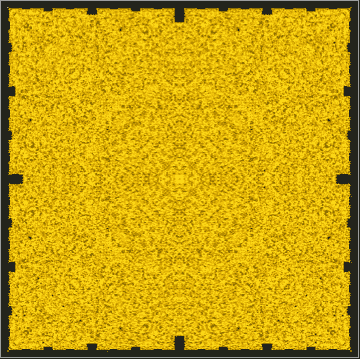*

*Code 144305877 of a 2-D Three-Color Totalistic Cellular Automaton at step 500*

*他们都有相似的特征，但有不同的边界和增长模式。*

*如果我们开始探索其中的一些规则空间，即在计算宇宙中搜索有趣的 CA，这是一种放松——它将你带到一个不同的外星景观和可能性的视觉空间。有些图案看起来可以用于设计目的，或者已经应用于纺织品等领域。视觉上，CA 可以很惊艳。在学术上，他们已经被证明产生了生物学上看到的模式。实际上，它们可以用来产生随机数。例如，从牛顿时代开始，方程就被用来描述物理现象。然而，越来越多的证据表明，CA 和其他类型的程序可能更好地模拟现实。基于代理的建模是一个很好的例子。但是正如托马斯·库恩在 [*科学革命的结构*](http://www.wolframalpha.com/input/?i=the+structure+of+scientific+revolutions) 中指出的，这种类型的进步经常在没有实时识别的情况下发生。相反，这是一个历史过程。*

*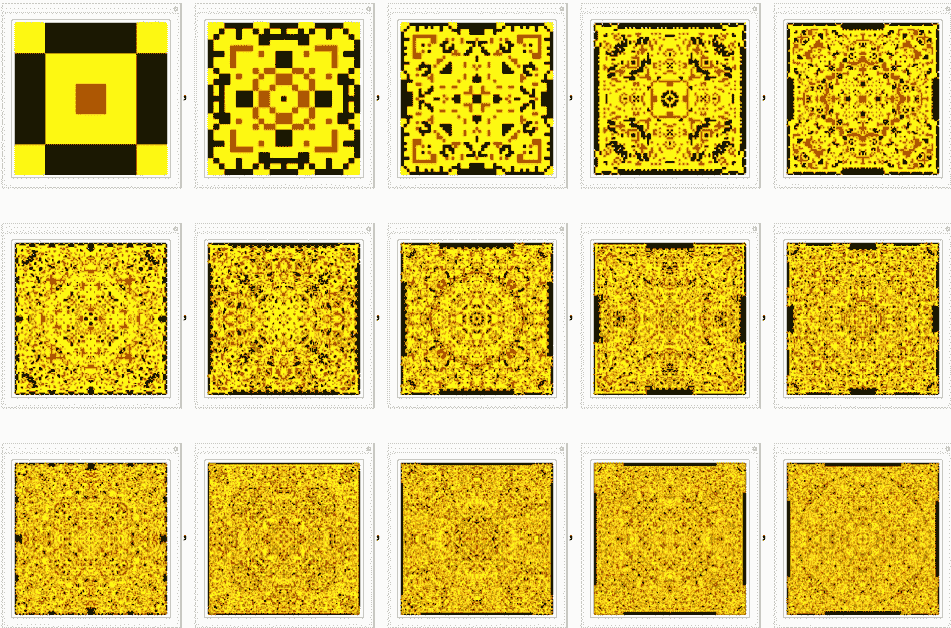**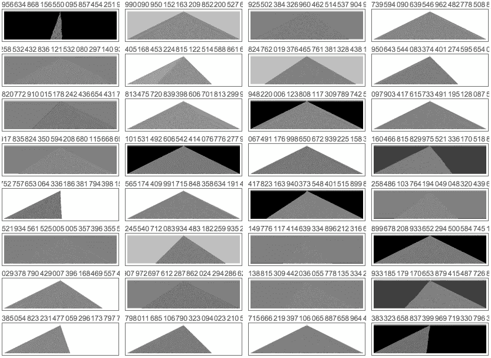**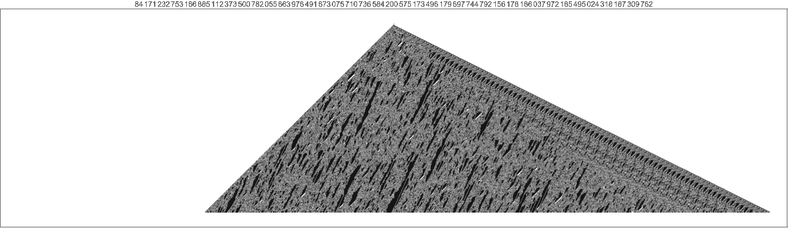**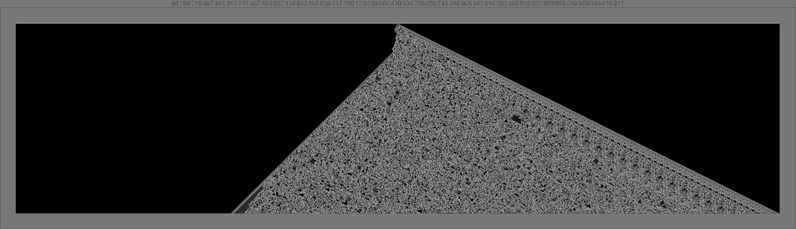*

*暑期学校的第一周主要包括讲座和史蒂夫·沃尔夫勒姆进行现场实验。在第二周，我们每个人都在午餐时与史蒂夫·沃尔夫勒姆见了面，这样他就可以选择我们将与导师一起工作的项目。他称这是他一年一度的“极端专业”时刻。*

*午餐真的很棒，因为有大约六个其他学生。斯蒂芬问了我们的兴趣和研究。这非常有趣，因为他对如此广泛的学科领域有如此多的问题。有理论物理学家，有人研究算法金融，还有另一个人研究在秀丽隐杆线虫*神经元中发现的小世界网络。**

**午餐后，我们分别会见了斯蒂芬和我们的导师。我走进房间的时候，他们心里已经有了一个项目，而且超级爽。我将使用 Wolfram 语言中的一个新特性，它使用 Reddit API。当我问斯蒂芬我到底应该在这个项目中做什么时，他回答说，“给我看看 Reddit 的社会学。”哇哦。这是一个很高的要求，但它让我可以自由地把这个项目带到我想去的任何地方。所以，我立即开始做一些研究。我最初想从用户生成的文本中找出一种使用[五大心理模式](https://en.wikipedia.org/wiki/Big_Five_personality_traits)来描述特定用户的方法。我还想使用网络文本分析来有效地描绘出子街道上发生的事情。在我的导师和其他一些学生的帮助下，我能够建立一些代码来生成一些网络。**

**我首先分析了一个 AMA(问我任何问题)[史蒂夫·沃尔夫勒姆用一些非常简单的代码做了](https://www.reddit.com/r/IAmA/comments/478njk/im_stephen_wolframask_me_anything/)，得到了一个很好的网络。**

**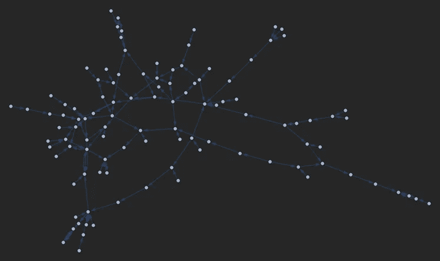**

**Text network from a Stephen Wolfram AMA**

**在那里，我去掉了有向边，并在图中放置了一个工具提示，这样当你将鼠标悬停在节点上时，你就可以可视化它所代表的文本块(AMA 中的一个问题)。**

**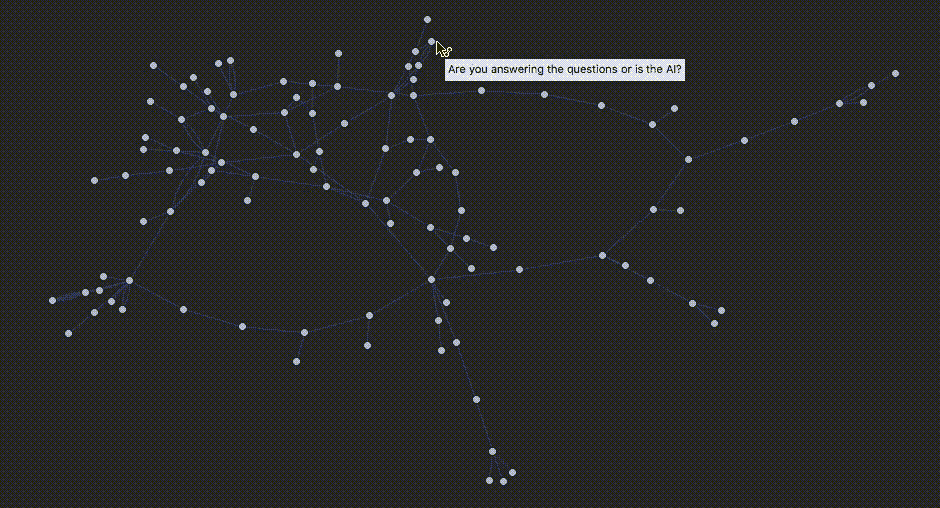**

**Text network from Stephen Wolfram AMA with Tooltip function**

**因此，我进一步尝试了 Wolfram 语言和 Mathematica 中的一些图形/网络功能。在社会网络分析中，我们通常对相似性、派系、社会资本和其他度量感兴趣。Wolfram 语言有一个叫做 [CommunityGraphPlot](http://reference.wolfram.com/language/ref/CommunityGraphPlot.html) 的东西，可以很容易地将节点分组在一起。在这种情况下，它将把 AMA 提出的类似问题组合在一起。**

**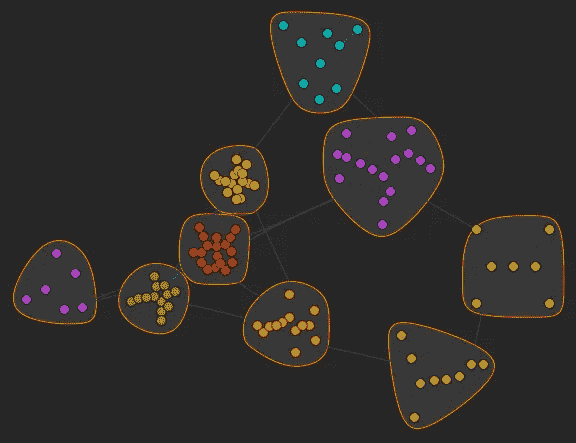**

**Community graph plot of Stephen Wolfram AMA**

**为了进一步形象化，我们可以根据特定问题的投票分数来调整节点大小。**

**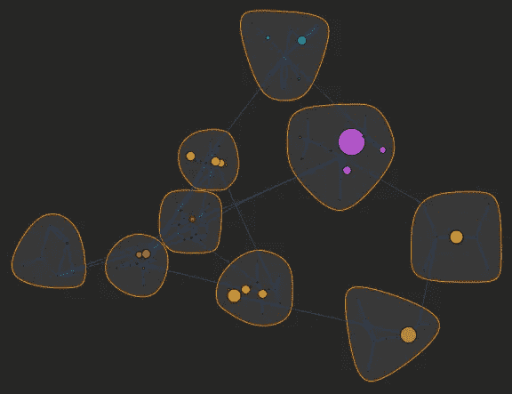**

**Community graph plot of a Stephen Wolfram AMA scaled by popularity.**

**我在那里做了各种各样的事情，比如使用一个内置的情感分类器，一个使用脸书数据作为训练集的 T2 主题分类器，并开始开发一个能够识别文本中某些社会心理特征的分类器。但那是另一篇文章。**

**正如你所看到的，在我的导师的出色帮助下，我能够在两周内完成这个项目。事实上，它是如此的有用，以至于当 [IRB](https://en.wikipedia.org/wiki/Institutional_review_board) 由于诊所中健康相关问题的敏感性而撤回对我的 HIV/PrEP 工作的批准时，我还有一个论文项目要做。考虑到我是带着相当初级的编程能力进入学校的，我能够将这个项目进行下去是相当令人印象深刻的(至少我是这样认为的)。**

**作为奖励，你猜怎么着？我得到了 Wolfram Research 的一份工作，这些年来其他几位校友也是如此。所以，我不仅学到了有价值的新技能，还在一家科技公司找到了工作。**

**所以，如果你想在夏天找点事做，或者想学习如何编程，考虑一下 [Wolfram 暑期学校](https://education.wolfram.com/summer/school/)或者在 [Wolfram|Alpha](http://www.wolframalpha.com/) 中玩玩[开放代码](http://blog.wolfram.com/2016/12/12/launching-wolframalpha-open-code/)函数。你永远不知道它会把你带到哪里，你甚至可能因此得到一份工作。**