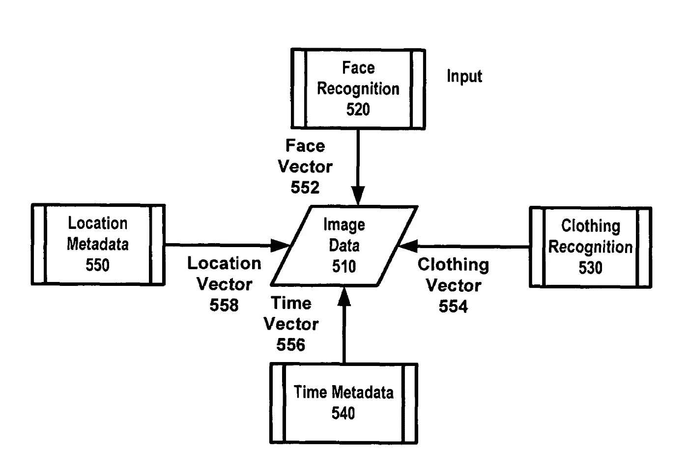
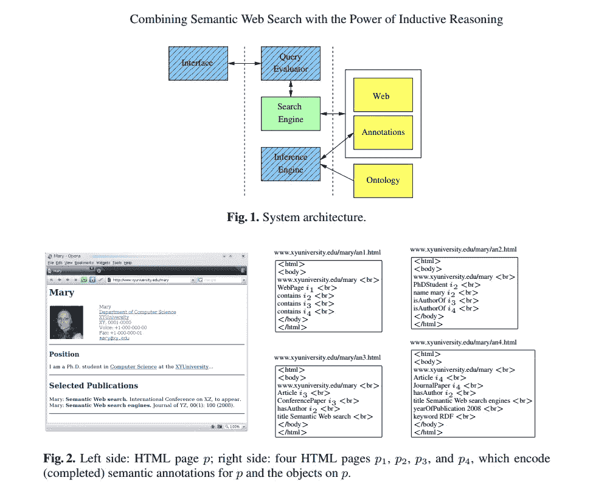

# 计算机视觉及其为何如此困难

> 原文：<https://towardsdatascience.com/computer-vision-and-why-it-is-so-difficult-1ed55e0d65be?source=collection_archive---------0----------------------->

Image used under standard license agreement, Depositphotos

最难理解的是那些基本的东西。我们生活在一个视觉世界。我们看到东西，立即明白它们是什么，以及我们可以用它们做什么。我们不仅可以识别它们，还可以了解它们的特殊属性和它们所属的类别。不需要深入思考，我们就可以看着一本书，理解构思、思考、写作、作家、代理人、编辑、出版社、印刷商、营销商、推销员、书店和经济的过程。这还不是围绕一本书所有关联的详尽列表。

更重要的是，我们每个人都可以看着一本书，理解它是什么，它做什么，即使我们对它的制作过程和周围发生的事情没有相同的细微差别的理解。我们的知识深度(或缺乏知识)只会在特定的环境中发挥作用(如图书大会或经济论坛)，但对于大多数日常用途来说，我们中足够多的被称为“大多数”的人，将能够归因于使这本书成为一个[实体](https://www.slideshare.net/David-Amerland/an-introduction-to-entities)的大多数关键属性。

> 如果一本书写得好，它可能是一本好书，但如果不是这样，它也是一个很好的入门读物。

因此，视觉实际上是一种[知识，而不是眼睛，这就是事情变得非常有趣的地方。知识是基于对现实世界的接受，包括事实和想象的事物。例如，我们都同意哈利·波特是谁，他做了什么，为什么这么做，同时我们也都同意他是一个虚构的存在。这意味着，为了理解我们看到的东西，我们不仅使用演绎推理，即我们得出的结论是 100%真实的，我们还使用归纳推理，即我们从可能是真实的前提进行推断，并得出可能的结论:“如果一本书写得好，它可能是一部伟大的读物，但在情况并非如此的情况下，它也是一个伟大的门阶。”](https://thesnipermind.com/blog/your-mind-does-all-the-seeing.html)

在最后一句话中，我们不仅想象了成功和失败的例子，还想象了一个幽默和讽刺在描述品质中扮演角色的世界。计算机可以配备硬件来捕捉数据(在这种情况下是光),其光谱比我们的肉眼要宽得多，它们还可以配备算法来出色地解释这些数据，以至于仅仅通过研究光的模式，它们就可以学会看到拐角处的。计算机也可以用来进行演绎推理。

在澳大利亚墨尔本举行的 2017 年 AGI 第 10 届人工智能国际会议上，陆军实验室研究员 Douglas Summers Stay 提交了他的论文“语义嵌入知识图上的演绎推理”，摘要如下:“*在连续语义向量空间中将知识表示为高维向量，可以帮助克服传统知识库的脆性和不完整性。我们提出了一种在这样的向量空间中直接执行演绎推理的方法，在推理链的每一步中以直接的方式结合了类比、联想和演绎，利用了来自不同来源和本体的知识。*“——综合运用“类比、联想和演绎”以及“从不同来源和本体中汲取知识”进行推理这正是语义搜索的目的，请注意 Stay 指的是“一个连续的语义向量空间”，它反映了大脑在[有限空间](http://gallantlab.org/index.php/publications/huth-et-al-2012/)中实现无限存储容量的方式。

Image from [US7519200B2](https://patents.google.com/patent/US7519200B2/en) awarded to Google Inc shows the variables that must be recognized in order to assign a high degree of accuracy to the reading of a face by a computer. Image used under Fair Use Policy for educational purposes.

所以，现在听起来我们已经解决了这个问题。是也不是。是的，搜索已经变得非常擅长理解图像(有时是视频)中的对象，并建立一个索引，当它与上下文的知识库相结合时，可以创建一个非常好的智能搜索的感觉。特别是两项谷歌专利[指出了](https://patents.google.com/patent/US7519200B2/en?q=object&q=recognition&q=semantic+search)如何做到这一点，让它看起来[无缝](https://patents.google.com/patent/US7783135B2/en?q=object&q=recognition&q=semantic+search)。

这两者都突出了主要绊脚石的问题:即上下文，通过联想，归纳推理。因为知识不断进化和变形为包含意义但毫无意义的类比(就像我上面用一本写得很差的书作为门挡的例子)，计算机逻辑在无人监督的情况下会遇到归纳推理，这也会影响计算机视觉，至少在涉及特定上下文的情况下。因此，拥有一辆自动驾驶汽车可能是可以的，其中车载遥测系统提供的视觉系统优于人类能够承受的任何东西(想象一下一辆可以透过雾“看到”的汽车，知道拐角处有什么，甚至可以利用交通传感器和交通报告来优化旅程)，但机器人保姆更有问题(因为儿童天生不可预测，他们的不可预测性会给他们的安全带来风险)。

# 归纳推理和语义搜索

一项显示出一些前景的技术来自牛津大学的计算实验室，它创新性地采用了基于可能结果和相关性的归纳计算机推理以及语义搜索技术，以在高度不确定性的环境中提供更高的信息检索准确性。

Ref: d’Amato, Claudia & Fanizzi, Nicola & Fazzinga, Bettina & Gottlob, Georg & Lukasiewicz, Thomas. (2013). Uncertainty Reasoning for the Semantic Web. Volume II URSW 2008–2010/UniDL 2010\. Images are the copyright of their respective owners. Used under Fair Use Policy for educational purposes.

一切都是由数据组成的，数据受制于四个向量:数量、速度、多样性和准确性，我在关于[谷歌语义搜索](https://goo.gl/Ap5vv5)的书中详细介绍了这四个向量。这四个向量中的每一个都提出了自己的挑战，这些挑战因我们将[放在网上](http://aci.info/2014/07/12/the-data-explosion-in-2014-minute-by-minute-infographic/)的数据量不断增加而进一步加剧。

在计算机视觉(以及搜索中的物体识别)中，我们要求比人类更高的标准。机器犯的错误削弱了我们对它们的信任，因为与人类不同，我们通常看不到它们是如何失败的。结果，它们的失败变得普遍，我们认为一台机器(无论是搜索算法还是机器人)存在根本性的缺陷。对于人类，我们通常理解失败，因为我们可以根据自己的知识、记忆和技能参数来模拟他们的表现。失败变得可以接受，因为我们完全理解人类能力的极限。

人工智能在特定和一般意义上的发展都与破解计算机视觉挑战密切相关。毕竟，真正地视觉大多是[的精神](https://thesnipermind.com/blog/your-mind-does-all-the-seeing.html)。

*我最新的一本书:* [《狙击思维:消除恐惧，应对不确定性，做出更好的决策》](https://www.amazon.com/gp/product/1250113679/ref=s9u_simh_gw_i1?ie=UTF8&fpl=fresh&pd_rd_i=1250113679&pd_rd_r=Z6AN9Q7R88M66K4RXRR0&pd_rd_w=eQtqd&pd_rd_wg=lBays&pf_rd_m=ATVPDKIKX0DER&pf_rd_s=&pf_rd_r=GD8764VXFTC5YQKAYESD&pf_rd_t=36701&pf_rd_p=a6aaf593-1ba4-4f4e-bdcc-0febe090b8ed&pf_rd_i=desktop)是一项神经科学研究，探讨如何运用实际步骤做出更好的决策。