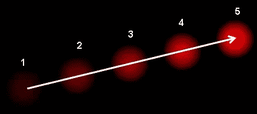

# 计算机视觉概念和术语

> 原文：<https://towardsdatascience.com/computer-vision-concepts-and-terminology-edd392a6f594?source=collection_archive---------6----------------------->

一个**超像素**是一个比矩形片更好地对准强度边缘的图像片。**超像素**可以用任何分割算法提取，然而，它们中的大多数产生高度不规则的**超像素**，具有广泛变化的大小和形状。可能需要更规则的空间镶嵌。

**非** - **最大抑制**通常与边缘检测算法一起使用。沿着图像梯度方向扫描图像，如果像素不是局部最大值的一部分，则它们被设置为零。

**语义分割**:

[https://arxiv.org/pdf/1602.06541.pdf](https://arxiv.org/pdf/1602.06541.pdf)

从图像中提取超像素是这一任务或前景-背景分割的一个例子。**语义分割**:在**语义分割**中，你要给每个像素标上一类物体(汽车，人，狗，…)和非物体(水，天空，道路，…)。

语义分割是将属于同一对象类的图像部分聚集在一起的任务。这种类型的算法有几个用例，如检测路标[MBLAGJ+07]，检测肿瘤[MBVLG02]，检测手术中的医疗器械[WAH97]，结肠隐窝分割[CRSS14]，土地利用和土地覆盖分类[HDT02]。相反，非语义分割仅基于单个对象的一般特征将像素聚集在一起。因此，非语义分割的任务是不明确的

## 光流

光流是由物体或摄像机的运动引起的图像物体在两个连续帧之间的表观运动模式。这是 2D 矢量场，其中每个矢量是一个位移矢量，表示点从第一帧到第二帧的移动。考虑下面的图像，它显示了一个球在连续 5 帧中移动。箭头显示了它的位移矢量。

It shows a ball moving in 5 consecutive frames. The arrow shows its displacement vector.

光流在以下领域有许多应用:

*   运动中的结构
*   视频压缩
*   视频稳定…

光流基于几个假设:

1.  物体的像素强度在连续的帧之间不会改变。
2.  相邻像素具有相似的运动。

## 方向梯度直方图(HOG)

 [## 猪人探测器教程克里斯麦考密克

### 猪人检测器非常容易理解(例如，与 SIFT 对象识别相比)。其中一个…

mccormickml.com](http://mccormickml.com/2013/05/09/hog-person-detector-tutorial/) 

HOG 代表方向梯度直方图。HOG 是一种“特征描述符”。特征描述符的目的是以这样一种方式概括对象，当在不同条件下观察时，相同的对象(在这种情况下是人)产生尽可能接近相同的特征描述符。这使得分类任务更加容易。

这种方法的创造者训练了一种支持向量机(一种用于分类的机器学习算法)，或“SVM”，以识别人的 HOG 描述符。猪人检测器使用滑动检测窗口，该窗口在图像周围移动。在检测器窗口的每个位置，为检测窗口计算 HOG 描述符。然后，这个描述符被显示给经过训练的 SVM，它将其分类为“人”或“不是人”。

为了识别不同尺度的人，图像被二次抽样成多种尺寸。搜索这些二次抽样图像中的每一个。

**SIFT(尺度不变特征变换)**

 [## OpenCV:SIFT(尺度不变特征变换)简介

### 因此，在 2004 年，英国哥伦比亚大学的 D.Lowe 提出了一种新的算法，尺度不变特征变换…

docs.opencv.org](http://docs.opencv.org/3.1.0/da/df5/tutorial_py_sift_intro.html) 

SIFT:尺度不变特征变换(SIFT)特征描述符描述图像中的关键点。拍摄关键点周围大小为 16 × 16 的图像块。该面片被分成大小为 4 × 4 的 16 个不同部分。对于这些部分中的每一个，计算类似于 HOG 特征的 8 个方向的直方图。这导致每个关键点的 128 维特征向量。应该强调的是，SIFT 是完整图像的全局特征。

## BOV:视觉词汇袋(BOV)，

http://kushalvyas.github.io/BOV.html

也称为关键点包，基于矢量量化。与 HOG 特征类似，BOV 特征是直方图，它计算图像的一个片内特定模式的出现次数

## Poselets:

Poselets 依赖于手动添加的额外关键点，例如“右肩”、“左肩”、“右膝”和“左膝”。它们最初用于人体姿态估计。对于像人类这样众所周知的图像类别，找到这些额外的关键点是很容易的。然而，对于像飞机、轮船、器官或细胞这样的类，人类注释者不知道关键点是很困难的。此外，必须为每个单独的类选择关键点。有一些策略可以处理这些问题，比如视点相关的关键点。Poselets 在[BMBM10]中用于检测人，在[BBMM11]中用于 PASCAL VOC 数据集的一般对象检测。

## 文本:

一个粒子是视觉的最小组成部分。计算机视觉文献并没有给出纹理子的严格定义，但边缘检测器可能是一个例子。有人可能会说，卷积神经网络(CNN)的深度学习技术在第一个过滤器中学习文本子。

## 马尔可夫随机场

[https://ermongroup . github . io/cs 228-notes/re presentation/un directed/](https://ermongroup.github.io/cs228-notes/representation/undirected/)

是计算机视觉中广泛使用的无向概率图模型。MRFs 的总体思想是为每个特征分配一个随机变量，为每个像素分配一个随机变量

# 白粉

[http://mccormickml . com/2014/06/03/深度学习-教程-PCA-and-whiting/](http://mccormickml.com/2014/06/03/deep-learning-tutorial-pca-and-whitening/)

我们试图通过美白完成两件事:

1.  使特征之间的相关性降低。
2.  给所有的特征相同的方差。

美白有两个简单的步骤:

1.  将数据集投影到特征向量上。这将旋转数据集，以便组件之间没有相关性。
2.  将数据集归一化，使所有组件的方差为 1。这可以通过简单地将每个分量除以其特征值的平方根来实现。

我问了一个神经网络 expect，我连接的是 [Pavel Skribtsov](http://www.pawlin.com/) ，关于为什么这种技术是有益的更多解释:

> *“这是简化优化过程以找到权重的常用技巧。如果输入信号具有相关输入(某种线性相关性),那么[成本]函数将倾向于具有“类似河流”的最小区域，而不是权重空间中的最小点。至于输入白化——类似的事情——如果不这样做，误差函数将倾向于具有非对称的最小值“洞穴”,并且由于一些训练算法对所有权重具有相等的更新速度——最小化可能倾向于跳过最小值的窄维度中的好位置，同时试图取悦更宽的维度。所以和深度学习没有直接关系。如果您的优化过程收敛良好，您可以跳过这一预处理。”*