# 医学图像的计算机视觉特征提取 101 第 2 部分:同一性、平移、缩放、剪切、旋转和同质性

> 原文：<https://towardsdatascience.com/computer-vision-feature-extraction-101-on-medical-images-part-2-identity-translation-scaling-90d160bcd41e?source=collection_archive---------7----------------------->

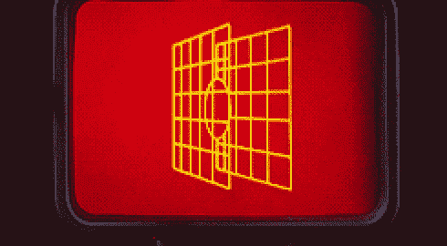

Gif from this [website](https://giphy.com/gifs/alec-guinness-f1MKYbYmzzMXu/download)

所以今天，我想继续回顾计算机视觉的基础知识(我猜这篇文章可能更多的是关于图像处理)。今天我想回顾一下图像转换。(或矩阵)

此外，这是我们将要使用的公开可用数据的列表。
1。 [*乳腺癌细胞来自 UCSB 生物分割基准数据集*](https://bioimage.ucsb.edu/research/bio-segmentation)
2。 [*细胞 2D 来自 UCSB 生物分割基准数据集*](https://bioimage.ucsb.edu/research/bio-segmentation)
3。 [*驱动:用于血管提取的数字视网膜图像*](http://www.isi.uu.nl/Research/Databases/DRIVE/download.php)
4。 [*从 kaggle 数据集进行超声神经分割*](https://www.kaggle.com/c/ultrasound-nerve-segmentation)
5。 [*脑部核磁共振来自 pixabay*](https://pixabay.com/en/mri-magnetic-x-ray-skull-head-782459/)
6。 [*脑部核磁共振来自 pixabay*](https://pixabay.com/en/mri-magnetic-x-ray-skull-head-782457/)
7。 [*来自 pixabay 的自然图像*](https://pixabay.com/en/sunset-lighthouse-dawn-dusk-sun-3120484/)

请注意，这个帖子是给未来的自己回过头来看资料的。

**使用矩阵进行转换**

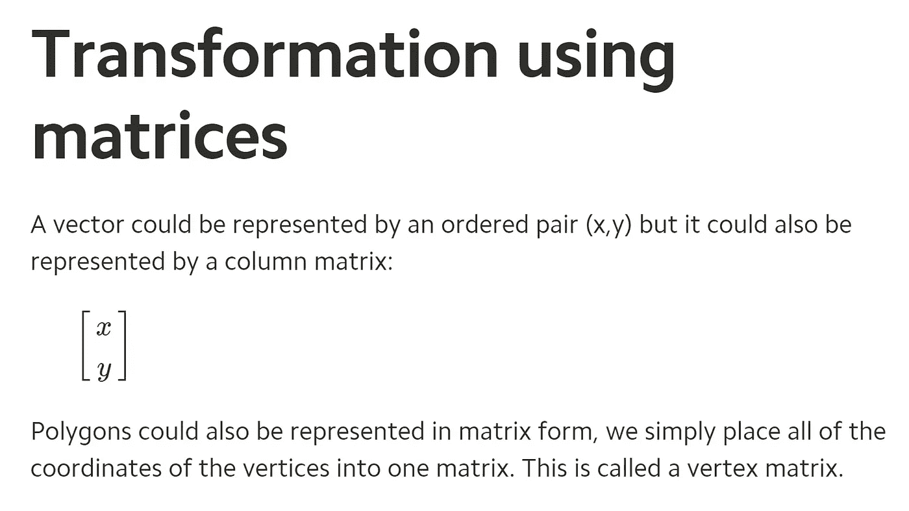

Image from this [website](https://www.mathplanet.com/education/geometry/transformations/transformation-using-matrices)

在这篇文章中，如果你想复习这些运算，理解矩阵和矩阵乘法是很重要的。[请点击这里](https://www.mathplanet.com/education/geometry/transformations/transformation-using-matrices)。

**原始图片**

**左上** → [*来自 UCSB 的乳腺癌细胞生物分割基准*](https://bioimage.ucsb.edu/research/bio-segmentation)
**中上** → [*来自 UCSB 的细胞 2D 生物分割基准数据集*](https://bioimage.ucsb.edu/research/bio-segmentation)
**右上** → [*驱动:用于血管提取的数字视网膜图像*](http://www.isi.uu.nl/Research/Databases/DRIVE/download.php)
**左下** → [*来自 kaggle 数据集的超声神经分割【图*](https://www.kaggle.com/c/ultrasound-nerve-segmentation)

在我们对这些图像做任何事情之前，让我们实际上看看每个图像看起来像什么，最后下面是我们的[自然图像](http://Natural Image from pixabay)看起来像什么。

**身份**

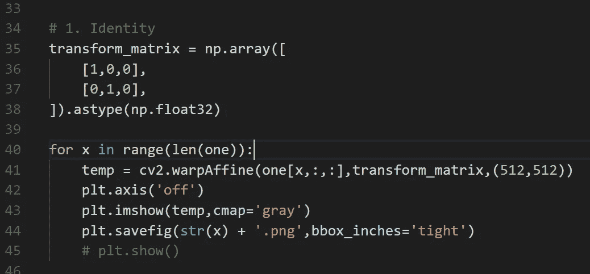

让我们从简单的开始，用单位矩阵来变换图像。我们可以看到原始图像和变换后的图像没有区别。(因为我们使用了单位矩阵…)

**翻译**

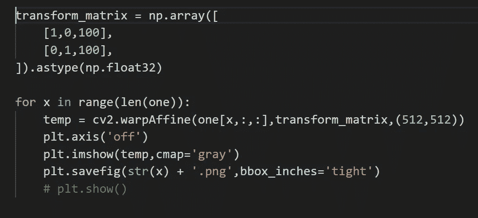

现在让我们将图像向 x(水平方向)和 y(垂直方向)移动 100 像素。因为我们可以怀疑图像已经向右下方移动了 100 个像素。

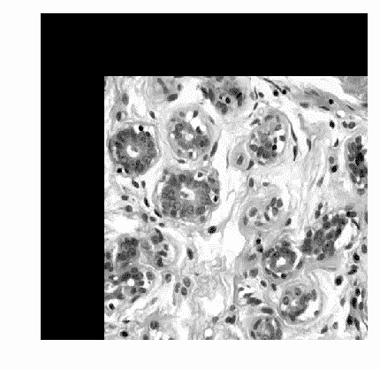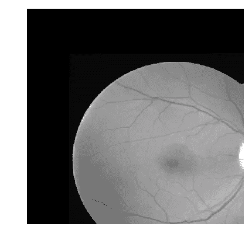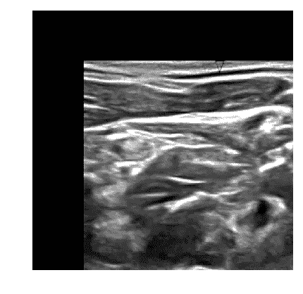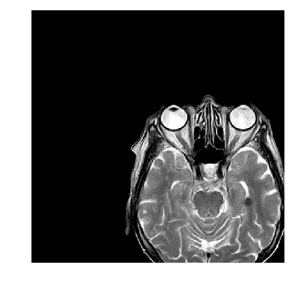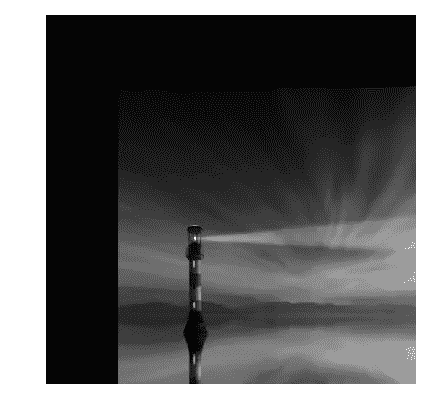

**缩放比例**

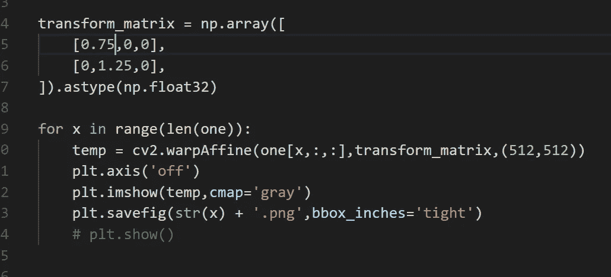

这里，我们将使图像在 x 方向(水平方向)缩小 0.75 倍，而在 y 方向(垂直方向)放大 1.25 倍。正如我们所猜测的，由于图像在 y 方向上增长，一些信息被删除了。

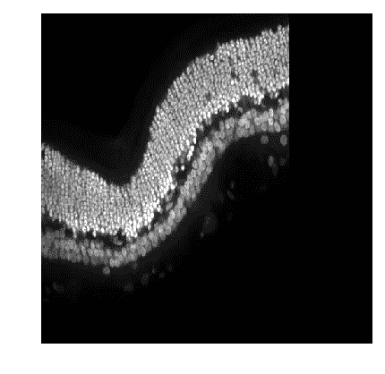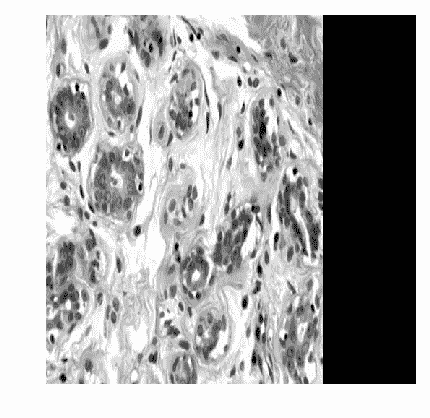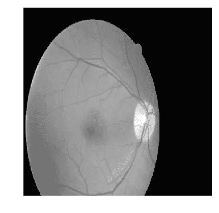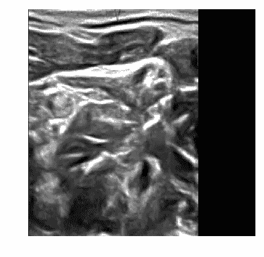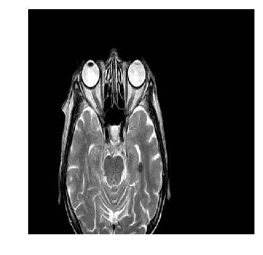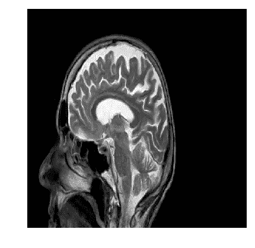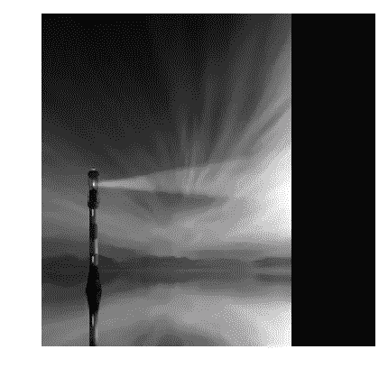

**剪切**

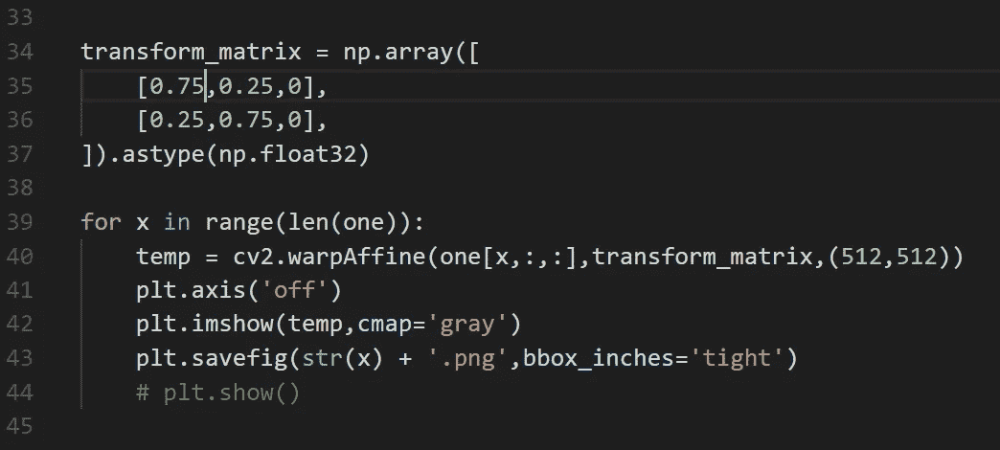

现在让我们做一些更有趣的事情，让[剪切](https://en.wikipedia.org/wiki/Shear_mapping)图像。我们绝对可以看到这些图像变换操作的威力有多大。

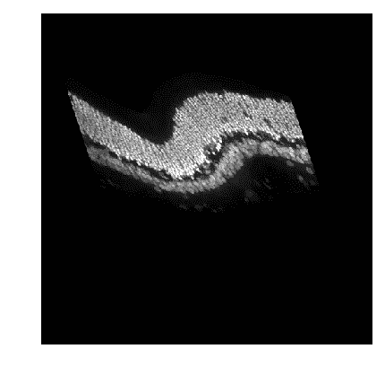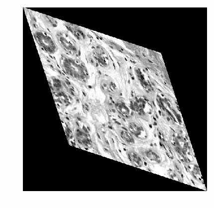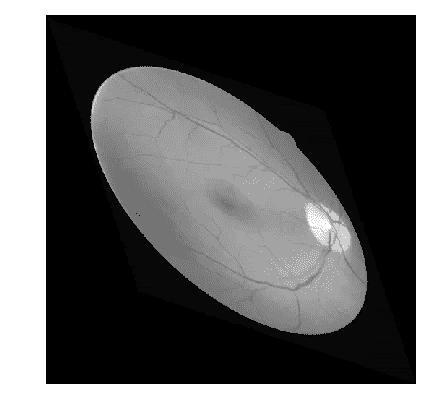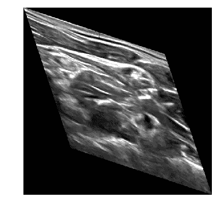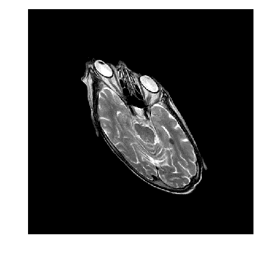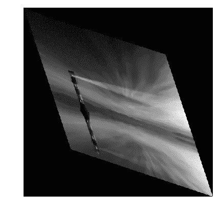

**旋转**

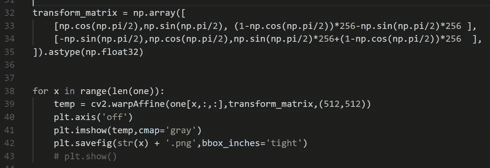

现在我们可以旋转图像，理解旋转的变换矩阵可能有点困难。但是使用下面的等式，我们可以很容易地构建旋转矩阵。

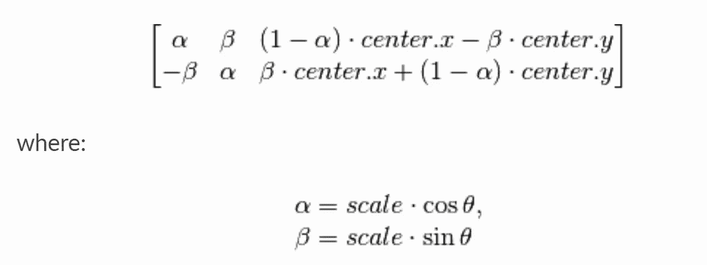

Image from this [website](http://opencv-python-tutroals.readthedocs.io/en/latest/py_tutorials/py_imgproc/py_geometric_transformations/py_geometric_transformations.html)

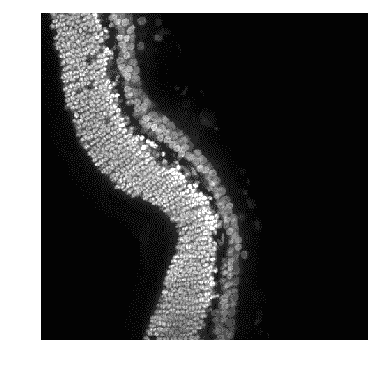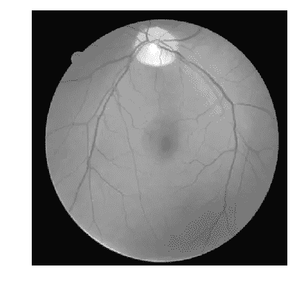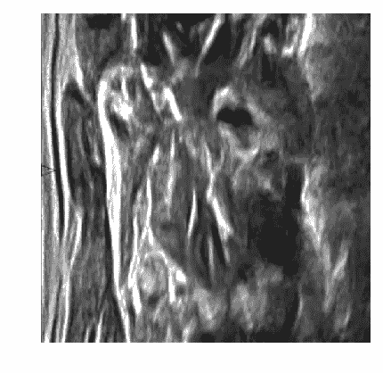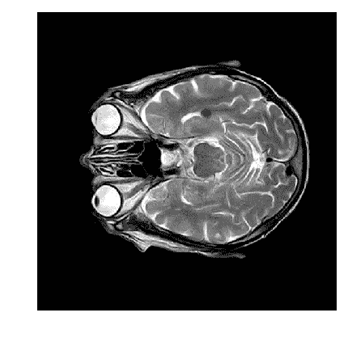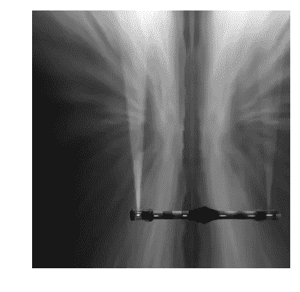

**同质**

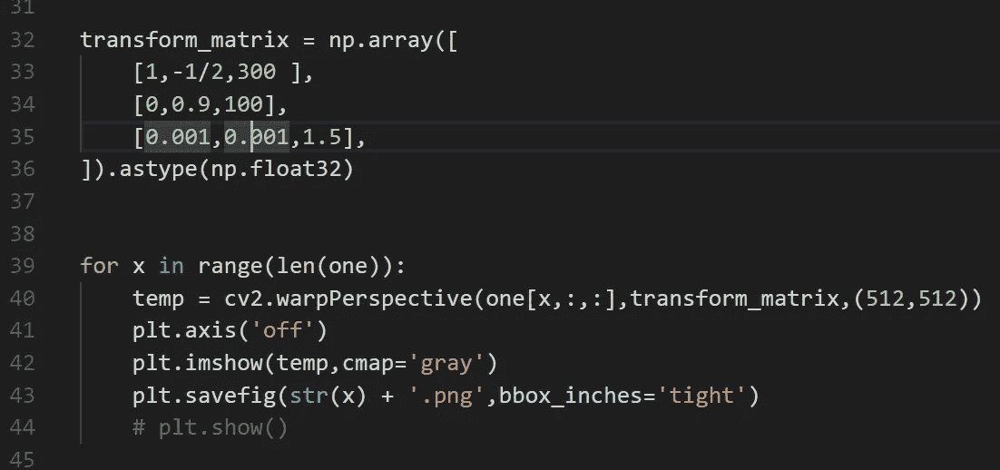

结合我们学过的所有东西，现在我们甚至可以做透视变换，在考虑 3D 空间的同时变换 2D 坐标。结果真的很酷。

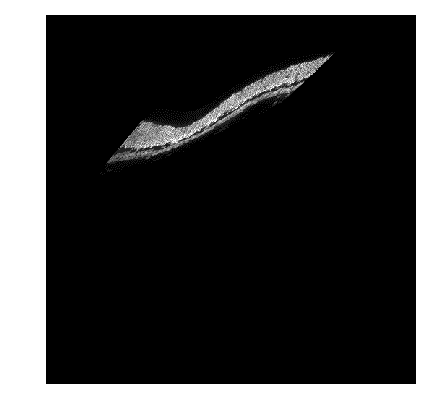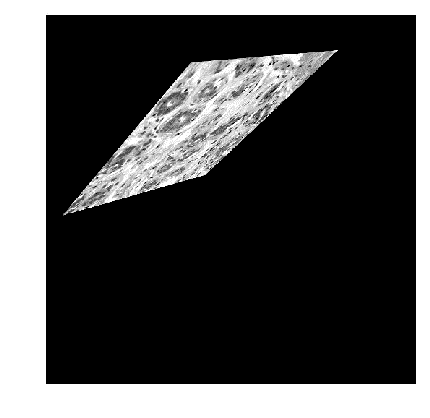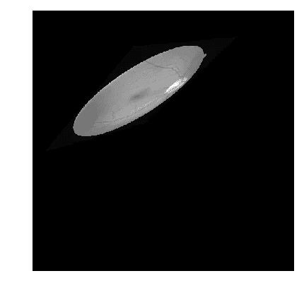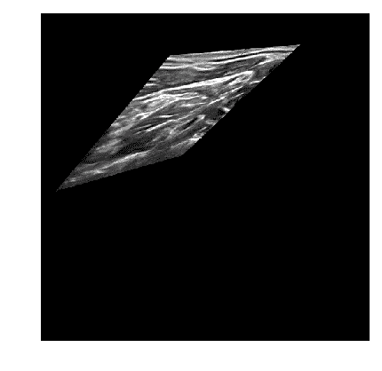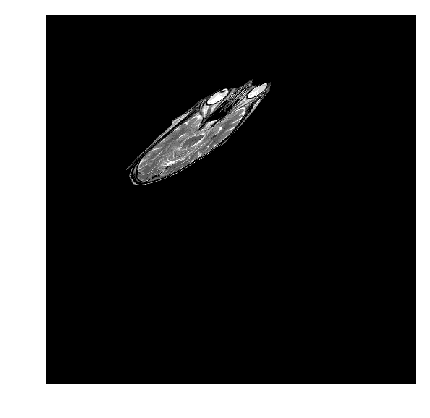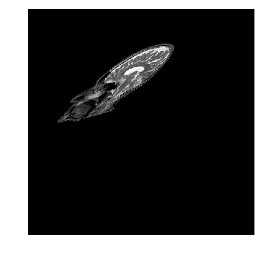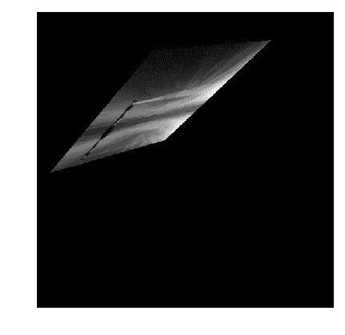

**互动码**

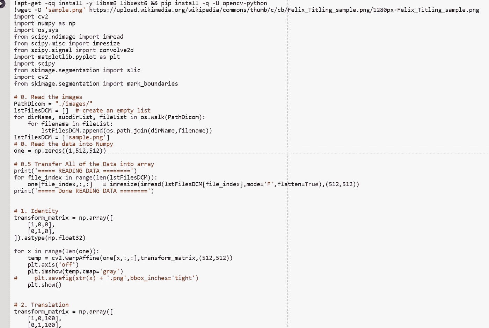

*对于谷歌实验室，你需要一个谷歌帐户来查看代码，你也不能在谷歌实验室运行只读脚本，所以在你的操场上做一个副本。最后，我永远不会请求允许访问你在 Google Drive 上的文件，仅供参考。编码快乐！*

请注意，我不想滥用任何数据政策。所以对于谷歌 Colab，我找到了下面的图片，它被标记为重复使用。要访问在线代码，请点击此处。

Image from this [website](https://upload.wikimedia.org/wikipedia/commons/thumb/c/cb/Felix_Titling_sample.png/1280px-Felix_Titling_sample.png)

**遗言**

对图像进行仿射变换总是很有趣，因为有些结果看起来很滑稽。

如果发现任何错误，请发电子邮件到 jae.duk.seo@gmail.com 给我，如果你想看我所有写作的列表，请在这里查看我的网站。

与此同时，请在我的 twitter [这里](https://twitter.com/JaeDukSeo)关注我，并访问[我的网站](https://jaedukseo.me/)或我的 [Youtube 频道](https://www.youtube.com/c/JaeDukSeo)了解更多内容。如果你感兴趣的话，我还做了解耦神经网络的比较。

**参考**

1.  剪切映射。(2018).En.wikipedia.org。检索于 2018 年 4 月 11 日，来自[https://en.wikipedia.org/wiki/Shear_mapping](https://en.wikipedia.org/wiki/Shear_mapping)
2.  接替艾伦。(2018).YouTube。2018 年 4 月 9 日检索，来自[https://www.youtube.com/watch?v=2S4nn7S8Hk4&list = pltizwl 5 stv 3d 4 uq 6 pvzxkrlkp _ 3 xocotn](https://www.youtube.com/watch?v=2S4nn7S8Hk4&list=PLtizWl5sTV3d4uQ6PvzXKrlkp_3XOCotN)
3.  安，S. (2018)。2D 卷积的例子。Songho.ca 于 2018 年 4 月 9 日检索，来自[http://www . song ho . ca/DSP/convolution/convolution 2d _ example . html](http://www.songho.ca/dsp/convolution/convolution2d_example.html)
4.  内核(图像处理)。(2018).En.wikipedia.org。检索于 2018 年 4 月 9 日，来自[https://en . Wikipedia . org/wiki/Kernel _(image _ processing)](https://en.wikipedia.org/wiki/Kernel_(image_processing))
5.  图像压花。(2018).En.wikipedia.org。检索于 2018 年 4 月 9 日，来自 https://en.wikipedia.org/wiki/Image_embossing
6.  罗斯布鲁克(2014 年)。用 Python 访问单个超像素分割。PyImageSearch。检索于 2018 年 4 月 9 日，来自[https://www . pyimagesearch . com/2014/12/29/access-individual-super pixel-segmentations-python/](https://www.pyimagesearch.com/2014/12/29/accessing-individual-superpixel-segmentations-python/)
7.  生物分割|生物图像信息学中心|加州大学圣巴巴拉分校。(2018).Bioimage.ucsb.edu。检索于 2018 年 4 月 9 日，来自[https://bioimage.ucsb.edu/research/bio-segmentation](https://bioimage.ucsb.edu/research/bio-segmentation)
8.  驱动:下载。(2018).isi . uu . nl . 2018 年 4 月 9 日检索，来自[http://www.isi.uu.nl/Research/Databases/DRIVE/download.php](http://www.isi.uu.nl/Research/Databases/DRIVE/download.php)
9.  超声波神经分割| Kaggle。(2018).Kaggle.com。检索于 2018 年 4 月 9 日，来自[https://www.kaggle.com/c/ultrasound-nerve-segmentation](https://www.kaggle.com/c/ultrasound-nerve-segmentation)
10.  Pixabay 上的免费图像——核磁共振成像，磁性，x 光，头骨，头部。(2018).Pixabay.com。检索于 2018 年 4 月 9 日，来自[https://pix abay . com/en/MRI-magnetic-x-ray-skull-head-782457/](https://pixabay.com/en/mri-magnetic-x-ray-skull-head-782457/)
11.  Pixabay 上的免费图像——日落、灯塔、黎明、黄昏、太阳。(2018).Pixabay.com。检索于 2018 年 4 月 9 日，来自[https://pix abay . com/en/sunset-light house-dawn-dusk-sun-3120484/](https://pixabay.com/en/sunset-lighthouse-dawn-dusk-sun-3120484/)
12.  Pixabay 上的免费图像——核磁共振成像，磁性，x 光，头骨，头部。(2018).Pixabay.com。检索于 2018 年 4 月 9 日，来自[https://pix abay . com/en/MRI-magnetic-x-ray-skull-head-782459/](https://pixabay.com/en/mri-magnetic-x-ray-skull-head-782459/)
13.  图像的几何变换— OpenCV-Python 教程 1 文档。(2018).opencv-python-tutro als . readthedocs . io . 2018 年 4 月 11 日检索，来自[http://opencv-python-tutro als . readthedocs . io/en/latest/py _ tutorials/py _ img proc/py _ geometric _ transformations/py _ geometric _ transformations . html](http://opencv-python-tutroals.readthedocs.io/en/latest/py_tutorials/py_imgproc/py_geometric_transformations/py_geometric_transformations.html)
14.  仿射变换。(2018).En.wikipedia.org。检索于 2018 年 4 月 11 日，来自 https://en.wikipedia.org/wiki/Affine_transformation
15.  Mallick，S. (2016 年)。使用 OpenCV ( Python / C ++)的单应性例子|学习 OpenCV。Learnopencv.com。检索于 2018 年 4 月 11 日，来自[https://www . learnopencv . com/homography-examples-using-opencv-python-c/](https://www.learnopencv.com/homography-examples-using-opencv-python-c/)
16.  齐次坐标。(2018).En.wikipedia.org。检索于 2018 年 4 月 11 日，来自[https://en . Wikipedia . org/wiki/Homogeneous _ coordinates # Use _ in _ computer _ graphics](https://en.wikipedia.org/wiki/Homogeneous_coordinates#Use_in_computer_graphics)
17.  (2018).Cs.utexas.edu。检索于 2018 年 4 月 11 日，来自[https://www . cs . ut exas . edu/users/fussell/courses/cs 384g-fall 2011/lectures/lectures 07-affine . pdf](https://www.cs.utexas.edu/users/fussell/courses/cs384g-fall2011/lectures/lecture07-Affine.pdf)
18.  图像的几何变换— OpenCV-Python 教程 1 文档。(2018).opencv-python-tutro als . readthedocs . io . 2018 年 4 月 11 日检索，来自[http://opencv-python-tutro als . readthedocs . io/en/latest/py _ tutorials/py _ img proc/py _ geometric _ transformations/py _ geometric _ transformations . html](http://opencv-python-tutroals.readthedocs.io/en/latest/py_tutorials/py_imgproc/py_geometric_transformations/py_geometric_transformations.html)
19.  (2018).Web.cs.wpi.edu。检索于 2018 年 4 月 11 日，来自[https://web . cs . wpi . edu/~ Emmanuel/courses/cs 545/S14/slides/lecture 11 . pdf](https://web.cs.wpi.edu/~emmanuel/courses/cs545/S14/slides/lecture11.pdf)
20.  (2018).Mrl.nyu.edu。检索于 2018 年 4 月 11 日，来自[http://mrl.nyu.edu/~dzorin/ig04/lecture05/lecture05.pdf](http://mrl.nyu.edu/~dzorin/ig04/lecture05/lecture05.pdf)
21.  (2018).Colab.research.google.com。检索于 2018 年 4 月 11 日，来自[https://colab . research . Google . com/notebook # fileId = 1 onuy 6 EFE 7 xhdfgfahddcqqxpwuetoj _ NO&scroll to = 2 Sood 3 odxg _](https://colab.research.google.com/notebook#fileId=1OnUy6eFE7XhdfGfAHDCqQxpwueTOj_NO&scrollTo=2SOotD3ODxg_)
22.  矩阵乘法。(2018).En.wikipedia.org。检索于 2018 年 4 月 11 日，来自 https://en.wikipedia.org/wiki/Matrix_multiplication
23.  使用矩阵的变换(几何、变换)— Mathplanet。(2018).数学星球。检索于 2018 年 4 月 11 日，来自[https://www . math planet . com/education/geometry/transformations/transformation-using-matrix](https://www.mathplanet.com/education/geometry/transformations/transformation-using-matrices)