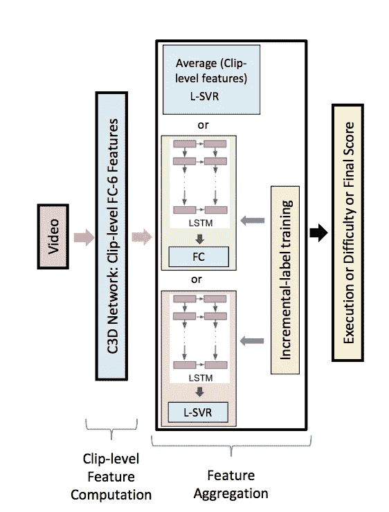
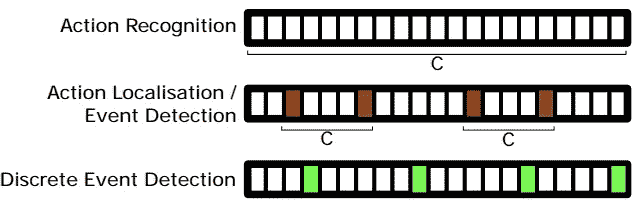
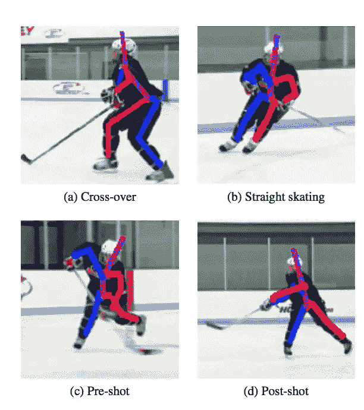
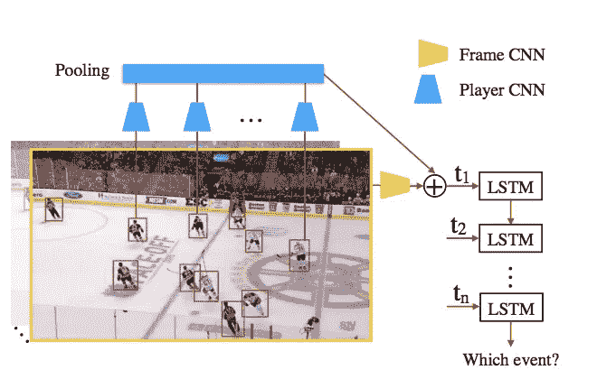

# 运动中的计算机视觉

> 原文：<https://towardsdatascience.com/computer-vision-in-sports-61195342bcef?source=collection_archive---------4----------------------->

我最近在浏览 CVPR 的网站，无意中发现了它在运动工作坊中的计算机视觉。我认为体育是许多机器学习算法的一个有趣的应用，因为体育通常是非常快节奏的，并且(许多)包括群体动态。因此，为体育量身定制的算法可能有助于推动 CV 的发展。

我一直对将机器学习应用于体育和娱乐活动很感兴趣。特别是，在 [PaddleSoft](https://medium.com/u/ffe5d69df3f?source=post_page-----61195342bcef--------------------------------) 的时候，我想用 CV 算法来检测急流中不同的划水和动作，并用它来预测划水者是否会有一条成功的路线，或者他们是否会翻转、游泳……等等。但是由于我的知识有限，我没有走多远；此外，直到最近几乎没有关于这个主题的文献。但是我很高兴看到许多新的论文处理这种复杂的事件识别。

以下是研讨会上的一些论文，我觉得特别有趣，我认为它们解决了整个 CV 中的重要问题。为了简洁起见，我选择了不涉及太多的实现细节，而是专注于这些作品中呈现的广泛主题。

[**学习评分奥运项目**](https://arxiv.org/pdf/1611.05125.pdf) **:**

作者:帕里托什·帕尔马和布伦丹·特兰·莫里斯

虽然乍看起来，为奥运赛事打分似乎是一个利基研究领域，但使用计算机视觉对一个动作或活动打分或提供反馈对许多不同的领域和问题都是有用的。例如，作者指出，与他们论文中介绍的方法类似的方法可以为自行进行物理治疗的患者或在没有教练的情况下为比赛进行训练的人提供反馈。他们还表示，他们的算法可以帮助消除奥运会比赛评判中的一些主观性。

在进入本文之前，澄清一些术语是有用的:

**动作识别:**涉及对视频中发生的活动进行分类。(即人在跑步)。

**行动质量评估:**包括根据行动的执行情况分配一个数值(即人员的运行经济性为 8.0)。

动作质量评估是一个困难的问题，因为高分和低分动作之间的差异往往非常微妙，必须考虑整个序列(不仅仅是一个片段)。此外，与动作识别数据集不同，动作质量数据集相对稀缺，并且存在的数据集非常小。在这篇论文之前，只有少数其他作者探讨了这个问题

作者建议采取多层次的方法来解决这个特定的任务。在第一层，他们使用 3d convnet 提取特征。这些特征然后被传递到三个可能的“第二级”中的一个第一个是裁剪级别要素或 L-SVR 的简单平均值，第二个是具有完全连接图层的 LSTM，第三个是用于提取要素并将其传递到 L-SVR 的 LSTM。

Action quality assessment model overview (taken from page 20 of Learning to Score Olympic Events)

作者评估了他们在跳水、花样滑冰和体操跳马方面的模型。他们使用的潜水数据集是一个小数据集，最初来自麻省理工学院的“评估行动质量”论文，可以在这里找到。。他们还在花样滑冰和体操数据集上测试了他们的模型。他们测试的另一个名为 UNLV 的数据集可以在[这里](http://rtis.oit.unlv.edu/datasets.html)找到。结果和性能评估是相当复杂的，如果不阅读全文就无法很好地总结。然而，TLDR 本质上是 C3D-SVR 给出了最好的总体结果，但是在行动过程中不能检测出特定的错误。如果你只是对评分感兴趣，这是可以的，但是为了提供反馈，你显然也需要能够识别行动的“问题”区域。为了弥补这一点，他们增加了 LSTM(即 C3D·LSTM-SVR ),这增加了他们的得分和实际得分之间的误差，但能够检测出参与行动的个人的具体“错误”。

总的来说，我认为这篇论文是对一个看似研究不足的领域的一个重要贡献(只希望他们把他们的代码发布在某个地方)。令人困惑的是，没有更多的研究针对动作质量评估，因为它可以直接帮助任何类型的教练/训练。

[**连续视频到简单信号用卷积神经网络进行泳姿检测**](http://Continuous Video to Simple Signals for Swimming Stroke Detection with Convolutional Neural Networks:) **:**

**作者:**布兰登·维克托，贞哼·斯图尔特·摩根，迪诺·米尼乌蒂

前面提到的动作识别集中在将整个视频分类为单个动作。相比之下，*事件检测*包括检测动作的开始和结束帧(在连续视频中),然后对它们进行分类。本文主要研究游泳泳姿的检测。具体来说。本文作者提出了一种用于*离散事件检测的方法。*然后，他们使用这种方法来确定视频中何时出现泳姿。

> “划水率是游泳训练中使用的重要指标，目前，专家花费大量时间在视频中手动标记每一次划水，以便向游泳者提供统计反馈。我们称这个任务为离散事件检测(不同于，事件检测；检测一个动作的开始和结束)一

与简单事件检测相比，离散事件检测涉及在事件发生时定位准确的帧。

Figure 2 from [**Continuous Video to Simple Signals for Swimming Stroke Detection with Convolutional Neural Networks**](http://Continuous Video to Simple Signals for Swimming Stroke Detection with Convolutional Neural Networks:)

作者使用 CNN 来检测这些离散事件，并将它们映射到一维平面上，用峰值表示游泳中风的位置(如果你感到困惑，请参见他们的图 1)。他们的 CNN 在预测游泳或网球击球方面也做得很好(“在 3 帧容差下，F 值分别为 0.92 和 0.97”)。

这篇论文激发了我的兴趣，因为它能够检测出一连串的笔画。我还喜欢它对不同类型的动作检测的解释和对离散事件检测的介绍。然而，对我来说最有趣的部分，尤其是它如何很好地推广到网球。我很想测试它识别划水的能力。

[**曲棍球动作识别通过集成堆叠沙漏网络**](http://openaccess.thecvf.com/content_cvpr_2017_workshops/w2/papers/Fani_Hockey_Action_Recognition_CVPR_2017_paper.pdf)

[http://open access . the CVF . com/content _ cvpr _ 2017 _ workshop/w2/papers/Fani _ Hockey _ Action _ Recognition _ CVPR _ 2017 _ paper . pdf](http://openaccess.thecvf.com/content_cvpr_2017_workshops/w2/papers/Fani_Hockey_Action_Recognition_CVPR_2017_paper.pdf)

**作者** : Mehrnaz Fani Shiraz 大学 Helmut Neher 滑铁卢大学 hne her @ uwaterloo . ca David a . Clausi，Alexander Wong，John Zelek 滑铁卢大学

作为一名曲棍球迷，我特别觉得这篇论文很吸引人。这篇论文的作者试图解决冰球运动中的动作识别问题，因为他们认为这有助于提供有价值的反馈。

> 动作识别为教练、分析师和观众提供了评估球员表现的内容，对教练、分析师和观众都有好处。第 29 页

然而，作者指出，冰球有许多特殊的挑战(这也可以推广到其他运动)。

> 姿态估计和动作识别是曲棍球中具有挑战性的问题，可以扩展到其他类型的运动。曲棍球特有的动作识别挑战包括使球员体形变形的笨重服装、与背景高度相似的球队球衣(白色)(冰和木板……第 29 页

作者称他们的模型为 ARHN 或动作识别沙漏网络。他们模型的实际细节相当复杂，因为它使用了许多不同的组件。但在最基本的层面上，他们的模型是通过将视频剪辑转换为图像序列，用堆叠的沙漏网络估计玩家的姿势(并将其作为特征输出)，用潜在的转换器进行转换，然后对动作进行分类。你可以在他们的报纸上读到全部细节。

Figure 7 on page 35 of **Hockey Action Recognition via Integrated Stacked Hourglass Network**

他们将四种不同的动作分类:直滑、交叉滑、前滑和后滑。他们的精确度和回忆分数一般在 60 多到 70 多。

总的来说，考虑到他们在数据可用性方面的局限性，他们取得了相当好的结果。看看这种动作识别如何识别其他项目，如倒滑、身体检查和传球，会很有趣。此外，正如在上一篇文章中提到的，对这一行动的有效性进行分级也是有价值的，但这可能需要对上一篇文章中描述的技术进行更复杂的改进。最后，正如我们将在下面的文章中看到的，曲棍球有一个主要的团队组成部分，作者在这里并没有真正触及。

[**冰球控球项目分类**](http://openaccess.thecvf.com/content_cvpr_2017_workshops/w2/papers/Tora_Classification_of_Puck_CVPR_2017_paper.pdf) **。**

Detecting puck possession in ice hockey using an LSTM. **Classification of Puck Possession Events in Ice Hockey** (91).

**作者**穆米塔·罗伊·托拉，成建辉，吉姆·利特

本文试图解决体育运动中的群体活动识别问题。群体活动识别顾名思义就是试图观察多个人(或者在这种情况下是玩家)并确定他们作为一个群体在做什么。虽然团体活动识别在团队运动中的效用相当明显，但它也可以在体育世界之外提供效用。一个直接的用例是安全目的(例如，确定一群人是否抢劫这个地方或攻击某人)。然而，群体活动识别对于几乎任何涉及大量多人互动镜头的任务都非常有用。正如人们可能期望的那样，可以说群体活动识别的“关键”是理解个体行动之间的关系。

现在记住这些想法，让我们进入实际工作。在本文中，作者着眼于冰球控球事件。具体来说，他们想要检测和分类不同类型的压轮占有事件。他们主要专注于冰球倾入，倾出，松散冰球恢复(LPR)，投篮和传球。为此，他们使用 AlexNet 的 f c7 层从球员有界子图像中提取球员的特征(在他们的算法中，球员是用有界框预先标识的)，这些特征然后被最大化汇集，以便考虑球员的交互，最后它们被馈送到执行预测的 LSTM。他们测试了几种不同的特性和 LSTMs 配置，您可以在本文中了解更多。

我真的很喜欢这篇文章，因为它试图解决一个涉及多个玩家互动的非常困难的任务。正如他们在文章中提到的，我认为获得好的特征来描述玩家之间的关系对于好的性能是至关重要的。像往常一样，我真的希望看到代码或补充，更详细地描述他们的实现，因为纯粹基于他们文章中的信息重建他们的设置将是非常困难的(至少对我来说)。

由于篇幅原因，我没有在这里提到研讨会上的许多其他好论文，但我鼓励您查看研讨会的官方网站。我主要选择这三个，因为它们讨论了体育运动中不同领域的相对不同的挑战。他们主要讨论了与动作质量评估、姿态估计、离散事件检测和群体动作检测相关的挑战。我认为这些论文都展示了看似专业的运动中的进步在整个领域中的应用。他们也激励我重新审视我将 CV 应用于激流泛舟的目标。

## **关于计算机视觉在体育运动中的应用的其他资源**

[计算机视觉在体育 CVPR](http://www.vap.aau.dk/cvsports/)

[运动中的计算机视觉](http://www.springer.com/us/book/9783319093956):斯普林格出版

[网球领域特定活动识别](http://www.doc.ic.ac.uk/~wjk/publications/vinyes-knottenbelt-cvsports-2017.pdf)

[行动质量评估 MIT](http://people.csail.mit.edu/hpirsiav/quality.html)