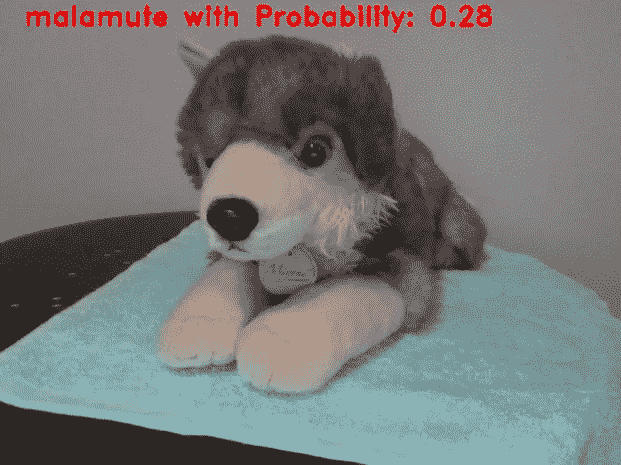
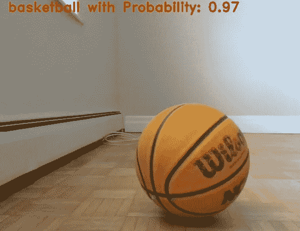

# 预算上的计算机视觉

> 原文：<https://towardsdatascience.com/computer-vision-on-a-budget-3748372414c3?source=collection_archive---------19----------------------->

## 用不到 20 行代码实现一个动态分类器


在试图向我弟弟解释计算机视觉的复杂性时，他问我实现实时图像分类器的最简单的方法(不是他的原话)。

我想了一会儿，想出了一个他*几乎*能够理解的解决方案。它利用了 openCV 库，并且需要与预先存在的模型结合使用。*然而，它可以在不到 20 行的 Python 代码中执行(加载依赖项不算在内)。*

## 属国

*   开源计算机视觉库 openCV
*   如果你不想从头开始训练你的模型，你可以从 Keras/Caffe 下载预先训练好的模型权重

## 准备工作

首先，加载所需的库和分类器。

```
import cv2
import numpy as np
from keras.applications import imagenet_utils, VGG19model = VGG19(weights='imagenet') # load the model weights
```

在这个练习中，我将使用 VGG19，它是通过 ImageNet 训练的模型之一。VGG19 可以使用 Keras 库加载。

我们需要 imagenet_utils 来预处理图像并解码 VGG19 给出的分类。

## 我们开始吧

```
cam = cv2.VideoCapture(0) # Open webcam
```

这种实时分类器的想法是将网络摄像头捕捉的图像分成帧，并将每一帧视为要分类的图像。为此，我们需要创建一个无限循环来连续捕获帧。

```
while True:

    ret, frame = cam.read()
    k = cv2.waitKey(1)     if k%256 == 27: # if esp key is pressed
        break
```

这个循环捕获后续帧(frame)以及前一帧是否存在(ret)。我们还包括一个退出条件，特别是当按下退出键时。其他等待键映射可以参考 [Ascii 表](http://www.asciitable.com/)。

接下来，我们要抓取帧，并像对待任何常规图像一样对其进行分类。这些都在我们的循环中。

```
 frame_pred = cv2.resize(frame, (224, 224))
   frame_pred = cv2.cvtColor(frame_pred,                                                  cv2.COLOR_BGR2RGB).astype(np.float32)
   frame_pred = frame_pred.reshape((1, ) + frame_pred.shape)
   frame_pred = imagenet_utils.preprocess_input(frame_pred) predictions = model.predict(frame_pred)
   (imageID, label, score) = imagenet_utils.decode_predictions(predictions)[0][0]
```

这里发生了很多事情。让我们一行一行地来:

*   图像大小调整为(224，224)，这是 VGG19 的默认输入大小
*   图像被转换为 RGB 格式。OpenCV 使用 BGR 格式，而 Keras(以及几乎所有其他格式)使用 RGB 格式
*   图像被重新整形以适应模型输入要求
*   输入被预处理成模型要求的格式
*   我们检索预测
*   我们解码预测以获得类别、标签和分数(属于该类别的概率)

要将预测叠加在网络摄像机画面上:

```
 cv2.putText(frame, "%s with Probability %.2f" % (label, score), (25, 25), cv2.FONT_HERSHEY_DUPLEX, 0.9, (0, 0, 250), 2) cv2.imshow('Computer Vision on a Budget', frame)
```

这又是在循环内部运行。最后一行返回带有所需标签文本的原始网络摄像头捕捉(不是针对模型增强的捕捉)。

最后，你想关闭你的摄像头。这一步在循环之外，只有按下 escape 键才会执行。

```
cam.release()
cv2.destroyAllWindows()
```

完整的 20 行代码，点击[这里](https://github.com/happilyeverafter95/Computer-Vision-on-a-Budget)。

它所做的一些分类。回想起来，红色并不适合这个标签。



这是一个粗略的解决方案，使用一种过于简单的方法来解决一个非常复杂的问题。分类器不区分也不识别帧中的单个对象。根据所用的型号，它也可能非常慢。

从好的方面来看，实现起来非常简单，我想我哥哥也学到了一些东西。

# 感谢您的阅读！

如果你喜欢这篇文章，可以看看我关于数据科学、数学和编程的其他文章。[通过 Medium](https://medium.com/@mandygu) 关注我的最新动态。😃

作为一个业余爱好项目，我还在 www.dscrashcourse.com[建立了一套全面的**免费**数据科学课程和练习题。](http://www.dscrashcourse.com/)

如果你想支持我的写作，下次你报名参加 Coursera 课程时，可以考虑使用我的[会员链接](https://click.linksynergy.com/fs-bin/click?id=J2RDo*Rlzkk&offerid=759505.198&type=3&subid=0)。完全公开—我从每一次注册中获得佣金，但不会对您产生额外费用。

再次感谢您的阅读！📕