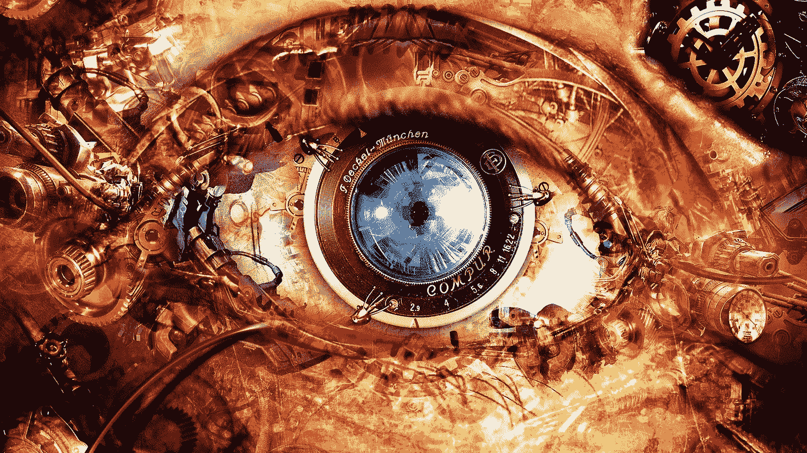
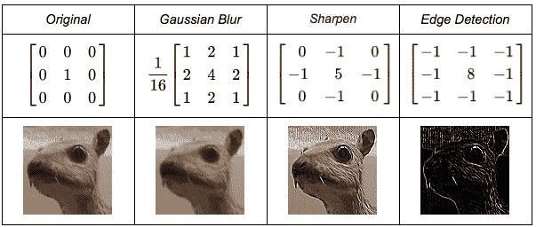
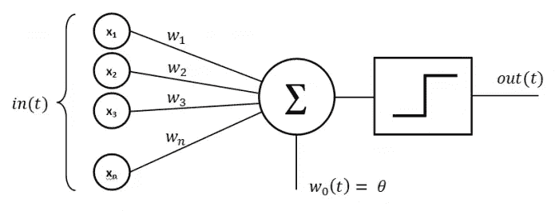
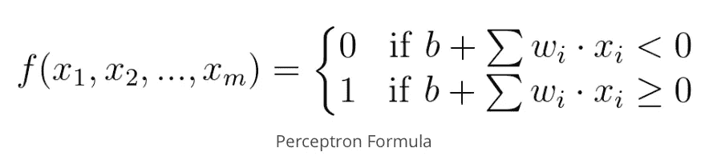
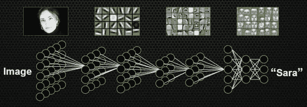

# 计算机视觉:温和的介绍

> 原文：<https://towardsdatascience.com/computers-that-learn-to-see-a2b783576137?source=collection_archive---------13----------------------->

贯穿人类历史和大脑研究的一个主要问题是:我们如何以自己的方式感知世界？

当谈到我们的眼睛时，这些只是传感器，帮助我们建立一个我们周围现实的可理解的表示。例如，颜色等属性并不是物理世界中的物体所固有的，而是代表了我们对不同波长的光反射的感知。尽管听起来令人沮丧，但在我们的物理现实中，一切都是“黑暗”的。当一个物体反射我们脑海中与红色联系在一起的特定波长，并吸收所有其他波长时，这个物体就呈现为红色。

这种视觉感知能力远远不止识别不同的波长。最有趣的一面是，我们有能力根据这些光子在空间中的相互关系来构建一个概念现实。例如，我们理解椅子的概念，因为我们希望它有一定的几何属性。朝向我们的眼睛，椅子反射的光必须保持一种空间关系，类似于我们概念化的椅子形状。

计算机最近也具备了视觉识别能力，学习如何看东西。这要归功于人工智能的进步，尤其是卷积神经网络(CNN)的应用。有很多关于这个主题的文章，但是很少解释统计学和线性代数之外的方法的直觉。

# 卷积神经网络的构造块

为了理解如何使用细胞神经网络来执行任何视觉任务，我们必须首先了解它的组成部分。所涉及的概念列表可能是压倒性的，但它们都可以缩小到该方法中已经存在的词:卷积、深度神经网络(DNNs)以及这两者的融合。

## 什么是卷积？

卷积是一种将两个函数合并成第三个函数的数学运算。例如，假设我们有两个给定的函数，***【f(t)***和 ***g(t)*** ，我们感兴趣的是将一个应用到另一个之上，并计算相交的面积:***f(t)* g(t)=(f * g)(t)***。

Source: Brian Amberg

在这种情况下，我们在***【f(t)***上应用 ***g(t)*** (调用内核)，并根据两个函数面积的交集来更改响应***【f * g】【t】***。卷积的概念是信号处理中最常用的技术，因此它也应用于计算机视觉，这可以看作是处理多个 RGB 传感器的信号。卷积有效性背后的直觉是它们能够将给定的输入信号过滤成组合的、更有用的结果。

在图像的特殊情况下，信号以矩阵而不是波形的形式更容易理解。因此，我们的函数 ***f(t)*** 和 **g(t)** 现在将分别变成 ***【图像(矩阵)*** 和 ***【内核(矩阵)*** 。同样，我们可以通过将一个矩阵放在另一个之上来应用卷积:

Source: Machine Learning Guru

你在上面看到的只是图像中滑动窗口与内核的矩阵相乘，然后求和。在计算机视觉的背景下，卷积的能力在于它们是 RGB 传感器领域的优秀特征提取器。当单独拍摄时，每个像素(RGB 传感器)对于理解图像包含的内容是毫无意义的。正是空间中的相互关系赋予了图像真正的意义。它适用于你在电脑上阅读这篇文章的方式，像素代表字符，你的大脑将黑色像素在空间中相互匹配，形成字符的概念。

通过在图像上滑动不同的卷积核，可以执行图像操作。这是 Photoshop 或 Gimp 等图像编辑软件中的许多工具的工作原理:

Source: Gimp Documentation

## 什么是深度神经网络？

机器学习中学习的概念可以看作是试图从给定的数据中预测未知的函数。假设你有兴趣预测一个标签 ***y*** 给定输入 ***x*** 。在这个特定的场景中，您希望您的模型将您的预测和实际情况之间的误差最小化。我们以这样的方式修改我们网络中的权重和偏差，即我们尽可能将输入 ***x*** 映射到输出 ***y*** 。

为了更好地理解这一点，我们来看一个简单的线性回归问题。一条直线的方程可以描述为 ***y = mx + b*** ，其中 ***m*** 为斜率， ***b*** 为与 y 平面的交点(一般称为偏置)。如果只有两个点，可以用公式直接求解斜率和偏差，但是当我们有多个点 ***n > 2*** 并且没有一条线完全符合这些点时，问题就变得更难了。在这种情况下，我们会对逼近一条使到每个数据点的距离最小化的线感兴趣。为此，我们可以遵循以下步骤:

1.给 ***m*** 和 ***b*** 随机取值。
2。计算误差，可以描述为[均方误差](https://ml-cheatsheet.readthedocs.io/en/latest/linear_regression.html#cost-function) (MSE)，就知道我们离最优线有多远了。
3。使用该误差函数的导数，计算梯度，以知道在哪个方向上移动这两个值，从而减小误差。
4。重复步骤 2 和 3，直到误差停止减小。

Source: Alykhan Tejani

在图的左侧，您可以看到误差空间，它是由应用于我们特定数据点的 MSE 给出的。在右侧，我们可以看到我们的数据点的表示，以及由 ***m*** 和 ***b*** 定义的线。开始时，线完全断开，这反映在高误差值中。然而，当我们计算导数并向函数减小的地方移动时，我们最终得到类似数据点属性的线的值***【m】***和 ***b*** 。

在深度神经网络(DNNs)中，这是关于每个神经元上正在发生什么的核心思想。考虑到我们的问题比仅仅逼近一条线要复杂得多，我们需要更多的神经元，通常是分层的。深度学习通过使用[梯度下降](https://en.wikipedia.org/wiki/Gradient_descent)来最小化误差函数，由于学习是分层结构的，DNNs 最终在数据中学习一个层次。

神经网络的主要构件是人工神经元。这些有不同的类型，最简单的是感知器。人们可以将感知器视为一个单元，它接受几个二进制输入 ***x1，x2，…，xn*** ，并生成一个二进制输出 ***y*** :

每个输入都被赋予一个权重 ***w1，w2，…，wn*** ，代表它们对输出的重要性。最后，利用输入和给定阈值的加权和计算输出。如果这个和大于这个阈值，感知器将输出 *1* ，否则输出 *0* 。这可以更容易地用代数术语来表达:

网络的人工神经元通过层相互连接。连接到输入的第一组神经元形成了*输入层*。提供预测的网络的最后一层被称为*输出层*。中间可以有任意数量的层，这些层被认为是*隐藏层*。

深度学习这个名字来自于架构中涉及 2 层以上的神经元。在过去，超越两层是不切实际的，效果也不好。这些限制被大量训练数据和加速计算的可用性所克服。正是在这个时候，社区开始增加更多的层，产生了所谓的深度神经网络。通过层的通信能够描述数据的分层表示，其中每一层神经元代表一个抽象级别。

# 通过卷积神经网络学习视觉表示

将卷积提取空间特征的能力与从深度神经网络进行分层学习的能力相结合，产生了所谓的卷积神经网络。通过用卷积层代替 DNNs 中的传统神经元层，这两种技术被合并成一个解决方案。因此，权重和偏差被编码在核中，并且是优化从原始输入(图像)到预期预测(例如，图像的类别)的表示的学习参数。最初的层将编码诸如边缘的特征，而后来的边缘将编码越来越高的抽象，例如形状和纹理。

Source: Nvidia

在上图中，每个神经元代表对来自输入层或前一层的图像的卷积运算。我们可以让多个卷积接收相同的输入，以便提取不同种类的特征。通过这些层，卷积运算将不断地将来自先前层的给定矩阵转换成对于手头的任务来说越来越压缩/有用的表示。例如，如果我们的网络正在执行面部识别，初始层将从面部提取边缘，这些边缘将被卷成形状，这些形状将被卷成某些面部特征，这些特征有助于区分不同的个人，一直到输出，在输出中我们有给定面部的标识符。

# 结论

细胞神经网络可以应用于数据中存在某种空间属性的任何领域。这通常转化为以图像作为输入的问题。

## 优势

*   与经典的计算机视觉技术相比，从开发的角度来看，CNN 更容易应用。有大量的教程和开源软件可以处理最常见的任务，如图像分类或物体检测，只需将数据输入到已经可用的模型中。
*   当有足够的数据时，CNN 胜过其他的，主要是肤浅的模型。

## 限制

*   任何任务所需的数据量都可能是巨大的，因为深度学习技术通常从手头任务的有限先验知识开始。在其他计算机视觉算法中，有许多技术使用这种先验知识来实现算法如何工作以减少必要的数据量。
*   和任何深度学习方法一样，CNN 都是黑盒方法，无法形式化解释。这意味着，如果你的模型有一些问题，你将开始猜测什么可能出错。