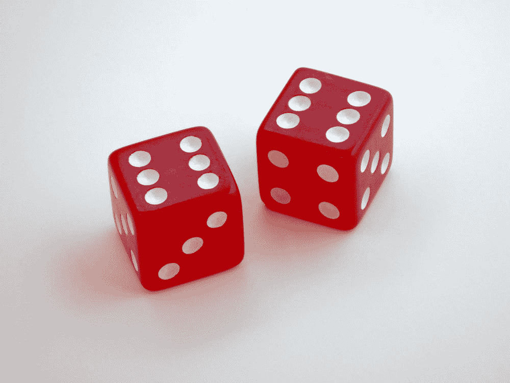
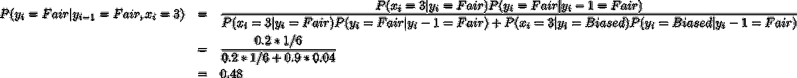
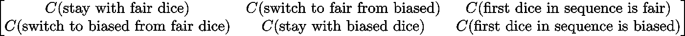
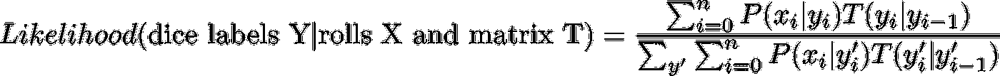
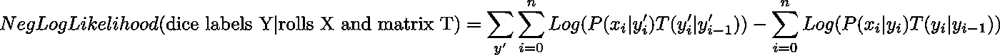

# PyTorch 中的条件随机场教程🔥

> 原文：<https://towardsdatascience.com/conditional-random-field-tutorial-in-pytorch-ca0d04499463?source=collection_archive---------0----------------------->

假设我有两个相同的骰子，但一个是公平的，另一个是以 80%的概率出现数字 6，而数字 1-5 以 4%的概率出现。如果我给你一组 15 次掷骰子，你能预测出每一次我用的是哪个骰子吗？



Credit Brett Jordan at [Unsplash](https://unsplash.com/photos/4aB1nGtD_Sg)

一个简单的模型是，每当 6 出现时，预测我使用了有偏见的骰子，并说我对所有其他数字使用了公平的骰子。事实上，如果我同样可能使用任一骰子来掷骰子，那么这个简单的规则就是你能做的最好的了。

但是如果在使用公平骰子后，我有 90%的机会在下一次掷骰子时使用有偏见的骰子呢？如果下一次掷骰子是 3，你的模型将预测我使用公平骰子，而偏向骰子是更可能的选择。我们可以用贝叶斯定理来验证这一点:



y_i is the random variable of the dice type for roll i. x_i is the value of the dice for roll i.

要点是，在每个时间点做出最有可能的选择，只有当我同样有可能使用任一骰子时，才是可行的策略。在更有可能的情况下，以前的骰子选择会影响我未来的选择，为了成功，你必须考虑到掷骰子的相互依赖性。

条件随机场* (CRF)是一个标准模型，用于预测与输入序列相对应的最可能的标签序列。有很多关于 CRF 的教程，但我看到的属于两个阵营之一:1)所有的理论都没有显示如何实现；2)一个复杂的机器学习问题的代码，很少解释发生了什么。

我不责怪那些作者选择理论或代码。CRF 是一个更广泛、更深入的主题，称为[概率图形模型](https://en.wikipedia.org/wiki/Graphical_model)，因此深入讨论理论和实现需要一本书，而不是一篇博客文章，但这使得学习 CRF 比它需要的更难。

本教程的目标是涵盖足够多的理论，以便您可以带着预期的想法深入第 1 类资源，并展示如何在您自己的笔记本电脑上复制的简单问题上实现 CRF。这将有望使你具备将这个简单的玩具 CRF 应用于更复杂问题所需的直觉。

# **理论**

我们的理论讨论将分为三个部分:1)指定模型参数，2)如何估计这些参数，3)使用这些参数进行预测。这三大类适用于任何统计模型，甚至是简单的逻辑回归，所以从这个意义上说，通用报告格式并没有什么特别的。但这并不意味着 CRF 就像逻辑回归模型一样简单。我们将会看到，一旦我们解决了这样一个事实，事情将会变得更加复杂，那就是我们正在做出一系列的预测，而不是一个单一的预测。

**指定模型参数**

在这个简单的问题中，我们需要担心的唯一参数是在连续掷骰子中从一个骰子转移到下一个骰子的相关成本。我们需要担心六个数字，我们将它们存储在一个名为*转换矩阵*的 2×3 矩阵中:



第一列对应于从前一次掷骰中的公平骰子到当前掷骰中的公平骰子(第 1 行中的值)和偏置骰子(第 2 行中的值)的转变。因此，第一列中的第一个条目编码了预测我在下一次掷骰子时使用公平骰子的成本，假设我在当前掷骰子时使用了公平骰子。如果数据显示我不太可能在连续的掷骰子中使用公平的骰子，那么模型就会知道这个成本应该很高，反之亦然。同样的逻辑适用于第二列。

矩阵的第二列和第三列假设我们知道在前一次掷骰子中使用了哪个骰子。因此，我们必须将第一卷视为特例。我们将在第三列中存储相应的成本。

**参数估计**

假设我给你一组骰子 **X** 和它们对应的骰子标号 **Y** 。我们将找到转移矩阵 **T** ，其最小化训练数据上的负对数可能性。我将向您展示单个掷骰子序列的可能性和负对数可能性。为了得到整个数据集的数据，你需要对所有的序列进行平均。



P(x_i | y_i)是在给定当前骰子标签的情况下观察到给定骰子滚动的概率。举个例子，如果 y_i = dice 是公平的，P(x_i | y_i) = 1/6。另一项 T(y_i | y_{i-1})是从以前的骰子标签转换到当前标签的成本。我们可以从转移矩阵中读出这个成本。

注意在分母中，我们是如何计算所有可能的标签序列 y '的和的。在两类分类问题的传统逻辑回归中，我们在分母中有两项。但是现在我们处理序列，对于长度为 15 的序列，总共有 2 个⁵可能的标签序列，所以分母中的项数是巨大的。CRF 的“秘方”在于，它利用了当前骰子标签如何仅依赖于前一个标签来高效地计算那笔巨款。

这个秘制酱算法叫做[正反向算法](https://en.wikipedia.org/wiki/Forward%E2%80%93backward_algorithm) *。深入讨论这个问题超出了这篇博文的范围，但是我会在下面给你提供一些有用的资源。

**序列预测**

一旦我们估计了我们的转移矩阵，我们就可以用它来为给定的掷骰子序列找到最可能的骰子标签序列。最简单的方法是计算所有可能序列的可能性，但即使是中等长度的序列，这也是很难做到的。就像我们对参数估计所做的那样，我们将不得不使用一种特殊的算法来有效地找到最可能的序列。该算法与前向-后向算法密切相关，被称为[维特比算法](https://en.wikipedia.org/wiki/Viterbi_algorithm)。

# 密码

PyTorch 是 Python 中的深度学习库，为训练深度学习模型而构建。虽然我们没有进行深度学习，但 PyTorch 的自动微分库将帮助我们通过梯度下降来训练我们的 CRF 模型，而无需我们手动计算任何梯度。这将节省我们许多工作。使用 PyTorch 将迫使我们实现前向-后向算法的前向部分和 Viterbi 算法，这比使用专门的 CRF python 包更有指导意义。

让我们从设想结果应该是什么样子开始。我们需要一种方法，在给定骰子标签的情况下，计算任意掷骰子序列的对数似然。这是一种可能的方式:

这个方法主要做三件事:1)将骰子上的值映射到一个似然，2)计算对数似然项的分子，3)计算对数似然项的分母。

让我们首先处理 _data_to_likelihood 方法，它将帮助我们完成第一步。我们要做的是创建一个 6 x 2 维的矩阵，其中第一列是公平骰子掷出 1–6 的可能性，第二列是有偏骰子掷出 1–6 的可能性。对于我们的问题，这个矩阵是这样的:

```
array([[-1.79175947, -3.21887582],
       [-1.79175947, -3.21887582],
       [-1.79175947, -3.21887582],
       [-1.79175947, -3.21887582],
       [-1.79175947, -3.21887582],
       [-1.79175947, -0.22314355]])
```

现在，如果我们看到一卷 4，我们可以只选择矩阵的第四行。向量第一项是公平骰子为 4 的可能性(log(1/6))，第二项是有偏差骰子为 4 的可能性(log(0.04))。代码如下所示:

接下来，我们将编写计算对数似然的分子和分母的方法。

就是这样！我们有了开始学习转换矩阵所需的所有代码。但是，如果我们想在训练模型后进行预测，我们必须编写维特比算法:

我们的实现还有更多的东西，但我只包括了我们在理论部分讨论过的大函数。

# **正在对数据进行评估**

我使用以下概率模拟了一些数据，并对模型进行了评估:

1.  p(顺序中的第一个骰子是公平的)= 0.5
2.  p(当前骰子是公平的|先前骰子是公平的)= 0.8
3.  p(当前骰子有偏差|先前骰子有偏差)= 0.35

查看我制作的[笔记本](https://github.com/freddyalfonsoboulton/crf_tutorial/blob/master/crf_demo.ipynb)，看看我是如何生成模型和训练 CRF 的。

我们要做的第一件事是，看看估计的转移矩阵是什么样的。该模型了解到，如果我在前一次掷骰子时使用公平骰子，我更有可能在当前掷骰子时掷出公平骰子(-1.38 < -0.87). The model also learned that I am more likely to use the fair dice after using the biased dice, but not by a lot (-0.59 < -0.41). The model assigns equal cost to both dice in the first roll (-0.51 ~ -0.54).

```
array([[-0.86563134, -0.40748784, -0.54984874],
       [-1.3820231 , -0.59524935, -0.516026  ]], dtype=float32)
```

Next, we’ll see what the predictions looks like for a particular sequence of rolls:

```
# observed dice rolls
array([2, 3, 4, 5, 5, 5, 1, 5, 3, 2, 5, 5, 5, 3, 5])# corresponding labels. 0 means fair
array([0, 0, 1, 1, 1, 1, 0, 1, 0, 0, 1, 1, 1, 0, 1])# predictions
array([0, 1, 0, 1, 1, 1, 0, 0, 1, 0, 1, 1, 1, 0, 0])
```

The model recognizes long sequences of 6’s (these are the 5’s since we’re starting from 0) as coming from the biased dice, which makes sense. Notice that the model doesn’t assign every 6 to the biased dice, though (eighth roll). This is because prior to that 6, we’re pretty confident we’re at the fair dice (we rolled a 2) and transitioning to the biased dice from the fair dice is less likely. I’m ok with that mistake — I’d say our model is successful!

# **结论**

我已经向您展示了 CRF 背后的一点理论，以及如何实现一个简单的问题。当然还有很多比我在这里能够涵盖的更多，所以我鼓励你查看我在下面链接的资源。

**延伸阅读:**

[条件随机场介绍:](http://homepages.inf.ed.ac.uk/csutton/publications/crftut-fnt.pdf)条件随机场概述，隐马尔可夫模型，以及前后向和维特比算法的推导。

[在 PyTorch 中使用 CRF 进行命名实体识别:](http://pytorch.org/tutorials/beginner/nlp/advanced_tutorial.html)这篇文章的灵感来源。展示了如何将 CRF 应用于 NLP 中更复杂的应用程序。

# **脚注**

*准确地说，我们讨论的是线性链 CRF，它是 CRF 的一个特例，其中输入和输出序列以线性序列排列。就像我之前说的，这个话题很有深度。

*由于我们使用 PyTorch 为我们计算梯度，技术上我们只需要向前-向后算法的向前部分。