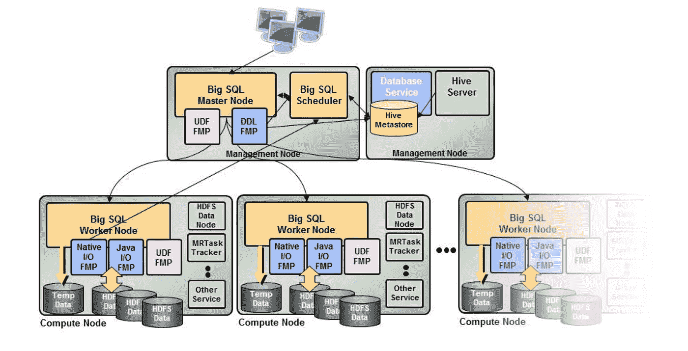
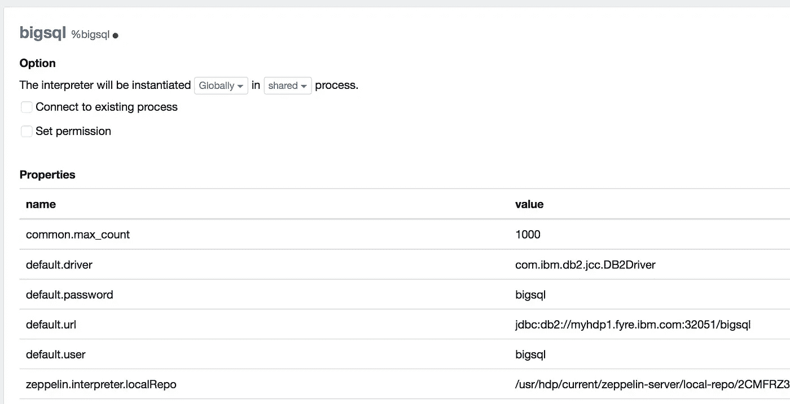
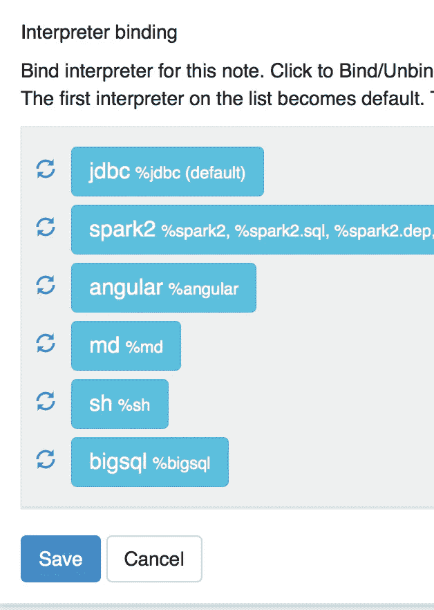
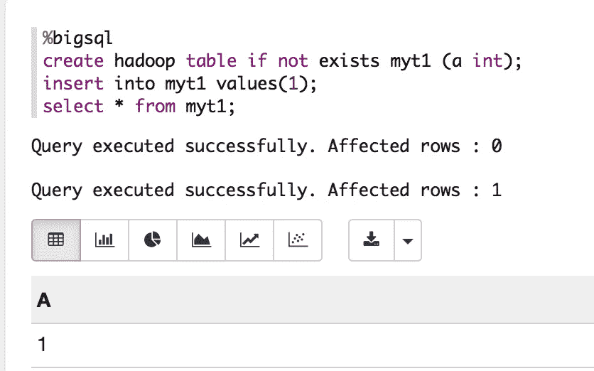

# 用大 SQL 配置 Zeppelin

> 原文：<https://towardsdatascience.com/configure-zeppelin-with-big-sql-e7d61a73b2ad?source=collection_archive---------11----------------------->



*由于* [*大 SQL 版本 5.0.1*](https://developer.ibm.com/hadoop/2017/08/31/announcing-big-sql-5-0-1/) *出来了，我想在 Medium 上转贴我原来贴在*[*LinkedIn*](https://www.linkedin.com/pulse/configure-zeppelin-big-sql-hdp-pierre-regazzoni/)*上的这篇文章。它将带您完成使用 Big SQL 配置 Zeppelin 服务器的过程，并且可能对使用旧版本或希望自己完成这项工作的人有用。*

—

[HDP](https://hortonworks.com/products/data-center/hdp/) Hadoop 发行包 [Zeppelin](http://zeppelin.apache.org/) 服务器作为其堆栈的一部分。随着本周 HDP 2.6 的最新[大 SQL 5.0](http://www-01.ibm.com/common/ssi/ShowDoc.wss?docURL=/common/ssi/rep_ca/2/897/ENUS217-372/index.html&lang=en&request_locale=en) 的发布，我想我会分享你如何快速配置 Zeppelin 与[大 SQL](https://www.ibm.com/analytics/us/en/technology/big-sql/) 对话。

你需要在齐柏林飞船上增加一个新的 JDBC 翻译。导航到 UI 页面右上角的菜单，选择“解释器”，然后单击“创建”。将其命名为 **bigsql** ，选择 **jdbc** 作为解释器组。更新以下属性。

```
default.driver = com.ibm.db2.jcc.DB2Driver
default.user = <username>
default.password = <password>
default.url = jdbc:db2:*//<bigsql_head_host>:<bigsql_port>/bigsql*
```

例如:



如果使用 SSL，相应地编辑 JDBC url 以添加 SSL 参数，例如

```
sslConnection=true;sslTrustStoreLocation=/path/to/truststore.jks;Password=<password>
```

您还需要在 ***依赖项*** 下添加 jdbc 库 jar。将库路径指定为**工件**:

```
/usr/ibmpacks/bigsql/5.0.0.0/db2/java/db2jcc.jar
```

最后点击保存。

**注意**:确保运行 Zeppelin 服务器的节点上存在库路径。

您还可以通过 REST 更新 Zeppelin 解释器。参见[https://zeppelin . Apache . org/docs/0 . 7 . 0/rest-API/rest-interpreter . html](https://zeppelin.apache.org/docs/0.7.0/rest-api/rest-interpreter.html)

回到你的笔记，点击解释器绑定(右上角的小齿轮)来绑定新的解释器。单击以绑定 bigsql 解释器，然后单击保存。像下面这样:



然后，您可以在笔记本中使用 **%bigsql** 与 Big SQL 进行交互:



仅此而已。在笔记本上玩大 SQL 玩得开心。