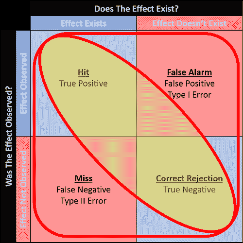
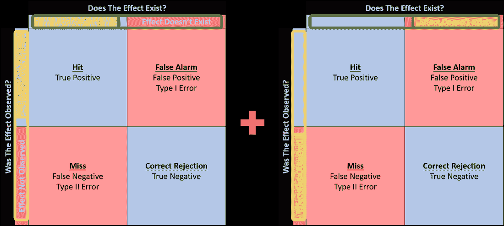
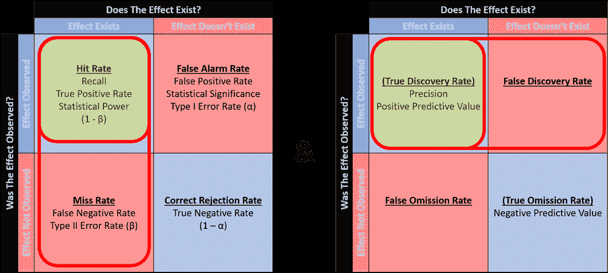
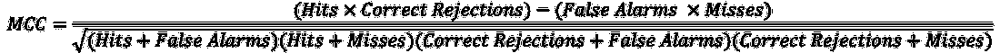
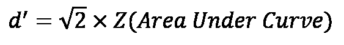

# 困惑于困惑矩阵第 2 部分

> 原文：<https://towardsdatascience.com/confused-by-the-confusion-matrix-part-2-4a8160156cbd?source=collection_archive---------6----------------------->

## “准确性”只是衡量准确性的众多标准之一…

在开始阅读本文之前，建议先阅读本系列的第一部分**，以便更好地理解本文所讨论的内容。**

*在[之前的文章](https://learncuriously.wordpress.com/2018/10/21/confused-by-the-confusion-matrix/)中，我解释了解释混淆矩阵的概念，澄清了所有实际上表示同一事物的不同术语。不幸的是，困惑并没有就此结束。如果你读完了上一篇文章，你可能会意识到简单的命中率或误报率实际上并不能提供太多信息，因为每一个比率都着眼于混乱矩阵的不同部分。正因为如此，不同的领域想出了不同的准确性衡量标准，试图整合来自混乱矩阵不同部分的信息。这篇文章试图涵盖更常见的。*

## *准确(性)*

*你在标题中读到的并不是一个错误——确实有一个官方的准确度衡量标准叫做“准确度”。当有人问“那么你的测试性能的准确性是什么？”时，这显然是一个混淆的设置这个人是指一般意义上的准确性，还是指用自己的计算方法对“准确性”的具体衡量？*

**

*Cells in a confusion matrix used to calculate “Accuracy”.*

*“精度”的计算其实非常简单直观。它基本上是命中数加上正确拒绝数除以整个混淆矩阵中出现的总数(即蓝色单元格在整个矩阵中所占的比例)。*

**准确度=(命中+正确拒绝)/总出现次数**

*然而，“准确性”与[上一篇文章](https://learncuriously.wordpress.com/2018/10/21/confused-by-the-confusion-matrix/)中提到的频率分析存在相同的问题，即不考虑患病率。只要正确拒绝率很高，即使一个效应存在的普遍程度很低，也可以实现高准确度(参见[实际比例的混淆矩阵](https://learncuriously.files.wordpress.com/2018/10/confusion-matrix-actual-proportions.png))。这就是所谓的“[准确性悖论](https://en.wikipedia.org/wiki/Accuracy_paradox)”。正因为如此，相对于“准确性”,通常推荐使用其他准确性度量。*

## *科恩的卡帕*

*[Cohen 的 Kappa](https://en.wikipedia.org/wiki/Cohen%27s_kappa) 是一个统计量，它通过考虑偶然性来调整观察的准确性。机会被定义为预期的准确性，通过结合当效果存在时随机观察到效果的概率，以及当效果*不存在*时随机*不*观察到效果的概率来计算。*

**

*Left: probability of randomly observing an effect when the effect exists; Right: probability of randomly not observing an effect when the effect doesn’t exist.*

*使用上图，当效应存在时，随机观察效应的概率通过将效应存在的普遍程度(左边混淆矩阵中的**绿色轮廓**)乘以进行一般观察的概率(左边混淆矩阵中的**黄色轮廓**)来计算。类似地，当效果*不存在*时，随机*不*观察到效果的概率通过将效果*不存在*的发生率(右侧混淆矩阵中的**绿色轮廓**)乘以*不*进行一般观察的概率(右侧混淆矩阵中的**黄色轮廓**)来计算。这两个概率之和构成了预期精度。*

*然后从观测精度中减去预期精度，得到非偶然的假设精度(分子)。然后将这种非机会准确性与*而非*偶然准确的概率(1 减去预期准确性，分母)作为比率进行比较，这产生 Kappa 统计。统计值有可能是负的，表明观察到的准确性比随机差。*

**Kappa =(观察精度-预期精度)/(1-预期精度)**

*Kappa 统计也有其局限性，主要是因为如果不考虑混淆矩阵中出现次数的分布信息，它可能会被误解。我不会深究这些限制，但更多信息可以在这里找到。*

## *F1 分数*

*[F1 得分](https://en.wikipedia.org/wiki/F1_score)(也称为 F 得分或 F 度量，但*不是*以与 [F 统计或 F 值](https://www.statisticshowto.datasciencecentral.com/probability-and-statistics/f-statistic-value-test/)相混淆)是机器学习中通常用于二进制分类准确性的度量。它的计算同时考虑了命中率(或召回率)和真实发现率(或精确度)。*

**

*The F1 Score is calculated using the Hit Rate and the True Discovery Rate.*

*F1 分数基本上是命中率和真实发现率的[调和平均值](https://en.wikipedia.org/wiki/Harmonic_mean)，这是一种计算平均比率的合适方法。通过取反向命中率和反向真实发现率的平均值的倒数来计算调和平均值。这已通过以下公式简化:*

**F1 = 2 * [(命中率*真实发现率)/(命中率+真实发现率)]**

*对 F1 分数的批评是，它只关注命中，而忽略了正确的拒绝。在有正确拒绝但没有命中的情况下，F1 分数不会提供信息，因为返回值为 0。因此，仅仅依靠 F1 分数来确定准确性是不够的。*

## *马修斯相关系数*

*[马修斯相关系数(MCC)](https://en.wikipedia.org/wiki/Matthews_correlation_coefficient) ，更一般地称为 phi 系数( *φ* )，也通常用于机器学习中的二进制分类准确性。它的计算考虑了混淆矩阵的所有单元，本质上是效应的存在和效应的观察之间的相关系数。因为它是相关系数，所以返回值+1.00 表示完全准确，0 表示准确性不比机会好，而-1.00 表示完全不准确。它还与 *χ* 系数有关，因为 MCC 是 *χ* 的平均值(即 *χ* / n)。MCC 根据以下公式计算:*

**

*MCC 被认为比 F1 分数和准确性更能提供信息，因为它考虑了混淆矩阵中出现的分布。*

## *信号与噪声测量*

*[*信噪比*](https://en.wikipedia.org/wiki/Signal-to-noise_ratio)*

*信噪比是工程中比较常用的一种指标，用来比较目标信号水平和背景噪声水平。然而，术语“信号”和“噪声”又是分别指“命中”和“误报警”的不同术语。因此，一个简单的信噪比仅仅是命中数与假警报数的比较。*

*[*【d’(也称 d-素数或灵敏度指数)*](https://en.wikipedia.org/wiki/Sensitivity_index)*

**d’*比信噪比更进了一步，常用于[信号检测理论](https://en.wikipedia.org/wiki/Detection_theory)。它考虑了信号的平均值和噪声的分布，并可以使用命中率和虚警率的*Z*-分数来计算，基于以下公式:*

**d' = Z(命中率)-Z(虚警率)**

**d’*的一个缺陷是，它假设信号和噪声的标准偏差相等，尽管实际上它们可能非常不同。*

*[*接收机工作特性(ROC)曲线*](https://en.wikipedia.org/wiki/Receiver_operating_characteristic)*

*ROC 曲线是不同阈值设置下的命中率与虚警率的图表，也常用于[信号检测理论](https://en.wikipedia.org/wiki/Detection_theory)。它是通过在 y 轴上绘制命中率的累积分布函数和在 x 轴上绘制虚警率的累积分布函数而生成的。*

**

*Example of an ROC curve. (Image by [Wikipedia](https://en.wikipedia.org/wiki/Receiver_operating_characteristic))*

*ROC 曲线下的面积(AUC)是准确性的主要度量，其中面积越大，准确性越好。完美的准确率是用整个正方形来表示的，但是由于命中率和虚警率是有所取舍的，所以要达到完美的准确率几乎是不可能的。AUC 也通过以下公式与*d’*相关:*

**

** * * * * * * * * **

*汇编所有这些常用的精度度量标准的目的不仅仅是为了便于参考，也是为了展示它们之间的相互关系。从学习所有这些不同的衡量标准中得到的启示是，没有一种衡量标准最能代表准确性。为了了解测试性能的准确性，重要的是要考虑所有的信息，而不是根据几个数字匆忙得出结论。最终，良好的统计思维仍然是更好地理解数据分析中细微差别的关键。*

***如果您觉得这篇文章有用，请访问本系列第一部分的链接:***

* [## 被混乱矩阵弄糊涂了

### 命中率，真阳性率，灵敏度，召回率，统计功效有什么区别？

towardsdatascience.com](/confused-by-the-confusion-matrix-e26d5e1d74eb)* 

**原文发布于:*[*https://learn curily . WordPress . com/2018/10/28/confused-by-the-folling-matrix-part-2*](https://learncuriously.wordpress.com/2018/10/28/confused-by-the-confusion-matrix-part-2/)*