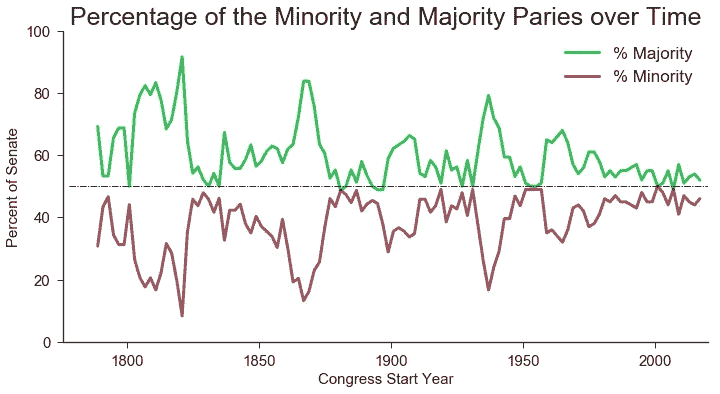
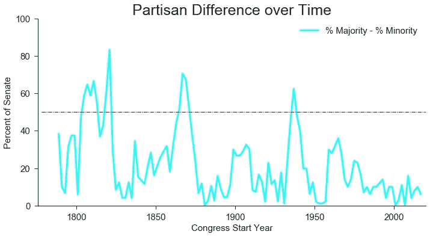
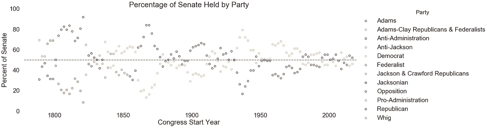
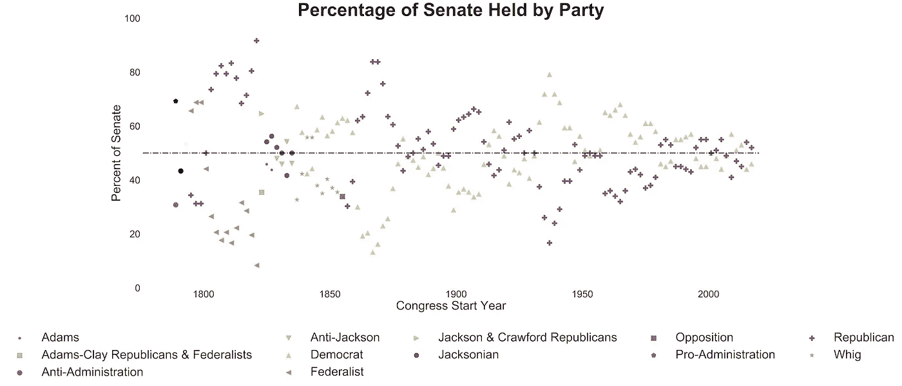
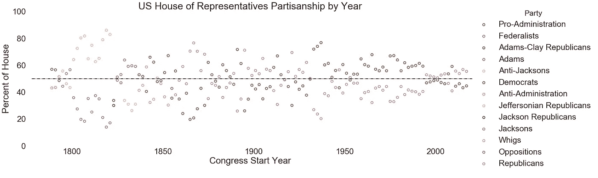
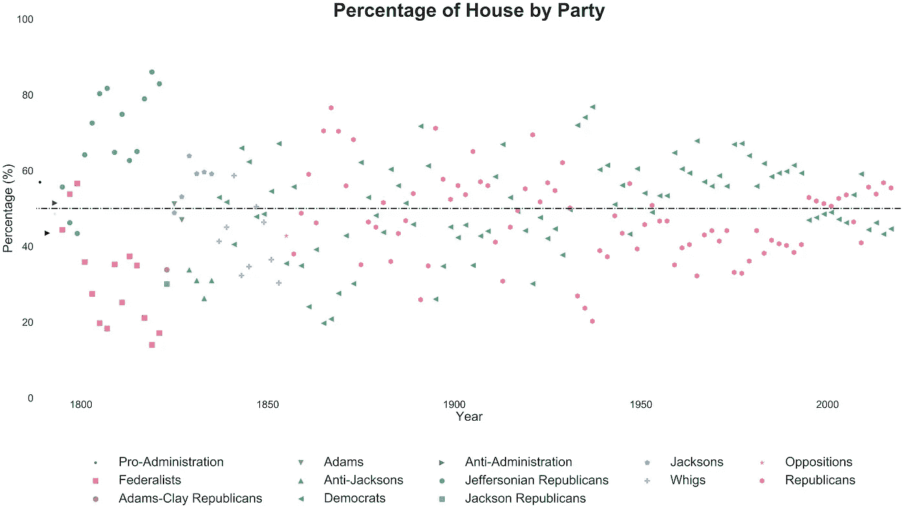
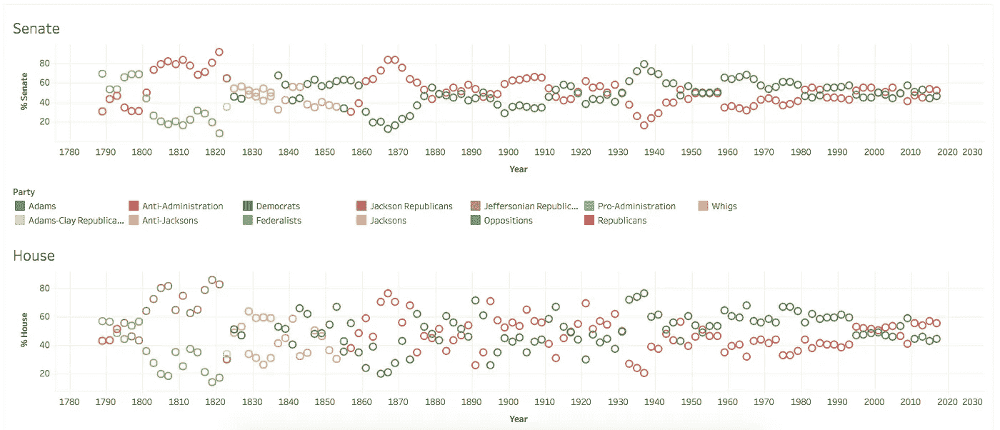

# 国会党派:可视化

> 原文：<https://towardsdatascience.com/congressional-partisanship-a-visualization-c7bc448fd3e?source=collection_archive---------3----------------------->

从高中开始，我就听到我在模拟联合国的朋友或那些真正对政治感兴趣的人谈论“共和党人是这样做的”或“民主党人是这样做的”。一年后，似乎是历史上最政治化的选举之一，我想回答这个问题“国会比以往任何时候都更加政治两极化了吗？”

我开始通过一些简单的数据可视化来做到这一点，这些数据可以从[参议院](https://www.senate.gov/history/partydiv.htm)和[众议院](http://history.house.gov/Institution/Party-Divisions/Party-Divisions/)的网站上免费获得(这两个网站都有党派分歧页面)。我的分析代码可以在我的 GitHub 页面上找到。

这些数据是用两种不同的方法从书页上刮下来的。由于页面上数据的结构，[参议院数据](https://www.senate.gov/history/partydiv.htm)必须用`urllib`和`BeautifulSoup`来抓取。房子数据在一个表中，这个表允许我使用`pandas`库的`read_html()`方法。(清洁在项目的 [Jupyter 笔记本](https://github.com/kaumaron/Data_Science/blob/master/Congressional_Partisanship/Senate%20Partisanship.ipynb)中有详细描述。)

我对参议院数据的研究比众议院数据多一点(尽管根据图表，结论看起来是一样的)。我用参议院数据绘制的第一件事是“多数党”对“少数党”所占席位的百分比。“多数党”是黄绿色，而“少数党”是深红色。

这个图表的一个明显特征是“多数党”在参议院中所占的比例总是比“少数党”大。它没有告诉我们当时哪个政党执政，但它确实给了我们一些启示。似乎双方的百分比差异随着时间的推移而减小。如果我们定义一个称为党派差异的新特征，并说它是多数党百分比和少数党百分比之间的差异，我们可以更直接地测量这种感知的下降。以这种方式定义党派差异保证了一个正值，因为多数必须大于或等于少数。(这张图的颜色是黄绿和深红的 RGB 值之差。)

正如基于最后一个情节的预期，党派差异确实随着时间的推移而减少。这导致了一个结论，至少从政党的角度来看，国会比过去更少政治分化。然而，有另一种方式来解释这个问题:*“政党的政策和意识形态变得更加两极分化了吗？”*这个问题**不能用这个数据**来回答，但是是以后可以探讨的东西。

# 按党派形象化参议院

因此，我们已经看到党派差异随着时间的推移而减少，但谁构成了“多数”和“少数”政党呢？在进一步清理数据并使其更加清晰之后，我使用 Python 的`seaborn`库绘制了它。

这个情节的一个大问题是，由于大量的当事人，区分当事人的颜色太接近了，不容易识别他们。使用`matplotlib`用不同的颜色和不同的标记来绘制每一方，得到了这个图:

那好多了。这不是最漂亮的图表，但它以可读的格式传达了信息，这是首要目标。从这些图表中我们可以发现，早在 19 世纪 50 年代，美国政治中的两大政党一直是共和党和民主党。这意味着图表上显示的其他十个政党只是这个国家 241 年历史上头 60 年左右的主要参与者。

# 通过聚会来想象房子

让我们为众议院做同样的事情。使用`seaborn`,我们得到一个类似于上面参议院的图表。

`seaborn`图遇到了与之前相同的问题。由于视觉上明显不同的颜色有限，很难通过阅读此图快速获得大量信息。为了解决这个问题，我们将使用`matplotlib`,和上面一样，为每一方使用不同的标记。

这样好多了。同样，这不是最漂亮的图表，但它快速准确地传达了信息。正如在参议院的图表中，我们看到共和党和民主党在 19 世纪 50 年代开始是占主导地位的政党。

# 从这里去哪里

这两种可视化效果很好，但是如果是交互式的，效果会更好。交互式格式将允许轻松浏览数据，并使演示更加统一。个别图表中缺失的另一个方面是无法同时观察众议院和参议院。为了解决这些问题，我使用 Tableau Public 对数据进行了[可视化。](https://public.tableau.com/profile/andrew.k.decotiis.mauro#!/vizhome/CongressionalPartisanship/Dashboard1)

 [## 国会党派之争

### 国会党派之争

国会 Partisanshippublic.tableau.com](https://public.tableau.com/views/CongressionalPartisanship/Dashboard1?:showVizHome=no&:embed=true) 

**最后:**我标准化了两个数据源之间各方的名称，以使交互式图表更有趣。最显著的(令人讨厌的)区别是众议院数据使用民主党人和共和党人，而参议院数据使用民主党人和共和党人。我只对 Tableau 图的数据进行了修改，因为我想让数据尽可能地“原始”,以便进行可视化练习。

**有什么建议？**我很想听听你的想法，无论如何，我可以改进我的分析或可视化。请留言评论！

请记住，我在项目的 [GitHub Repo](https://github.com/kaumaron/Data_Science/blob/master/Congressional_Partisanship/Senate%20Partisanship.ipynb) 中包含了我使用的数据和全部代码。清理后的参议院数据可以从[这里](https://github.com/kaumaron/Data_Science/blob/master/Congressional_Partisanship/Senate%20Partisanship%20Data.csv)下载，清理后的众议院数据可以从[这里](https://github.com/kaumaron/Data_Science/blob/master/Congressional_Partisanship/House%20Partisanship%20Data.csv)获得，两者都是`.csv`格式。如果你喜欢这个分析，请与你的朋友分享，并随时查看我在 [decotiismauro.ml](http://decotiismauro.ml) 的其他项目。