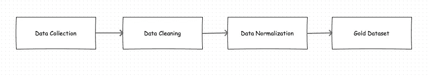
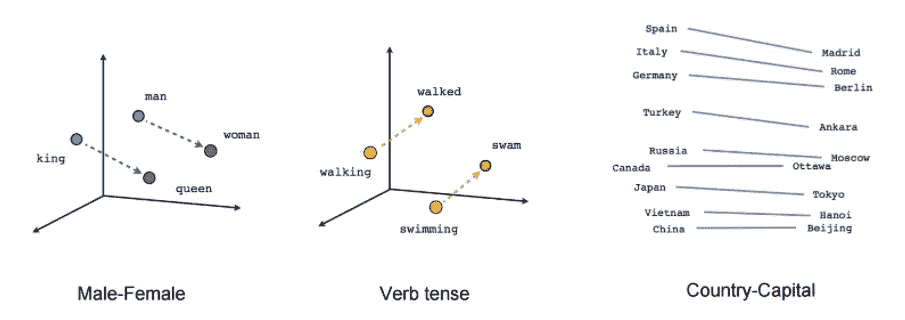
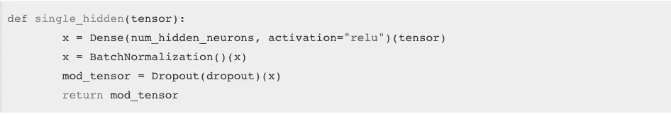
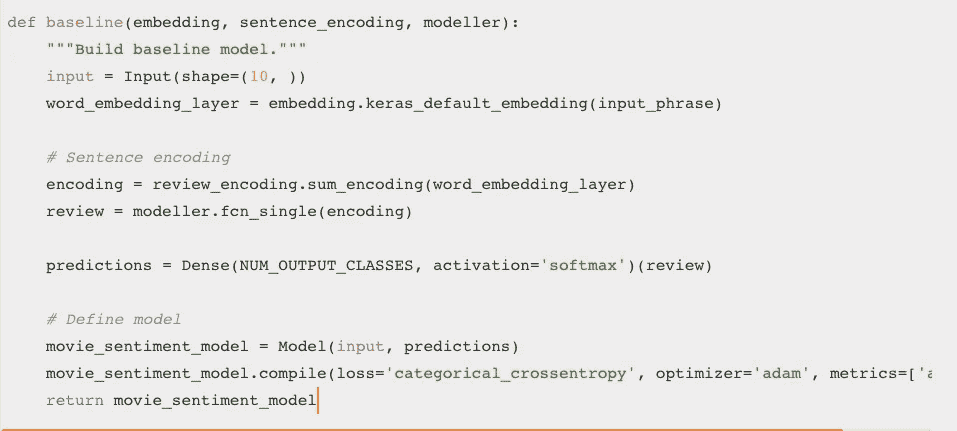
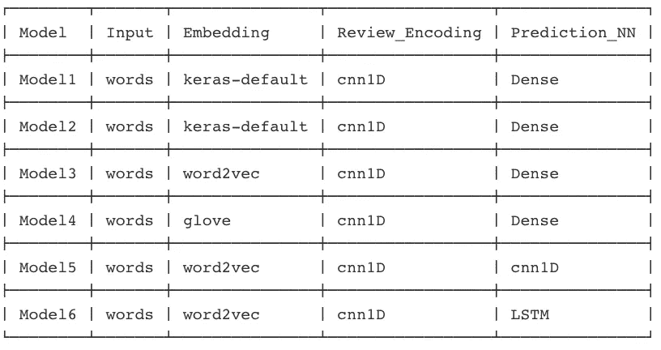
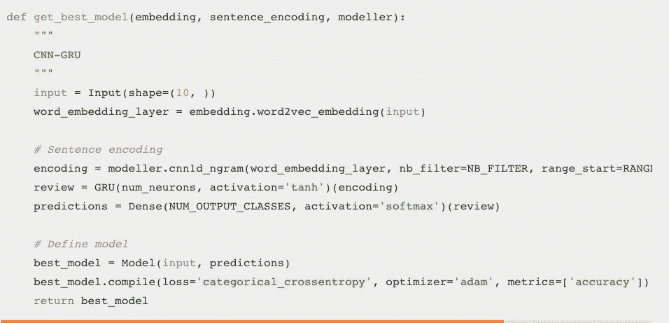
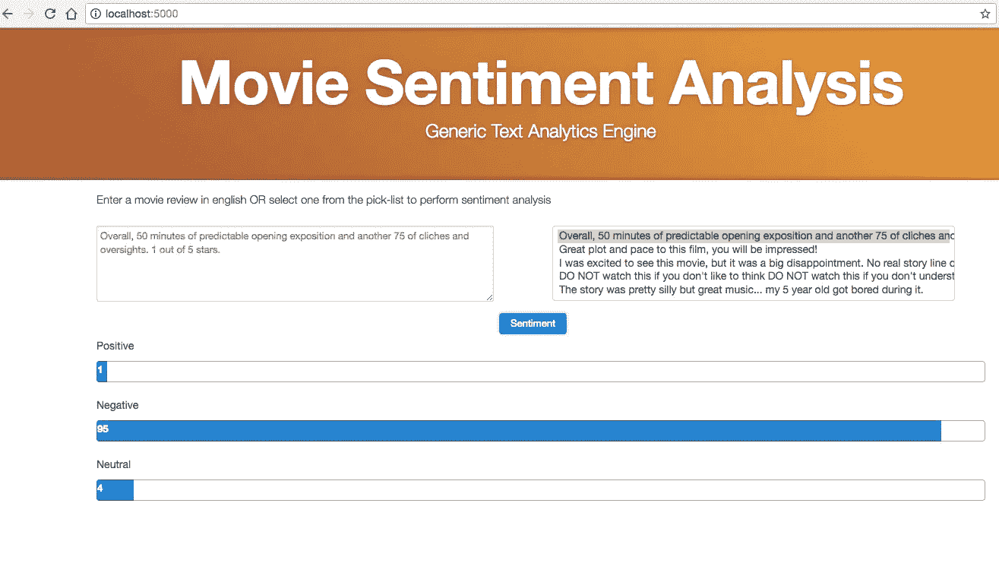

# 连接深度学习应用程序的点…

> 原文：<https://towardsdatascience.com/connecting-the-dots-for-a-deep-learning-app-324e4648720a?source=collection_archive---------7----------------------->

我们的日常活动充满了情感和情绪。想过我们如何通过计算机识别这些情绪吗？哎呀，没脑子的电脑:)？

亲自尝试这个深度学习应用程序(如果有应用程序错误，最初刷新几次):

[https://movie-review-sentiment.herokuapp.com](https://movie-review-sentiment.herokuapp.com)

**Dot 0:情感分析中的深度学习**

情感分析是一个强大的应用程序，它在当今世界中扩展到了以下领域。
1。**电影评论**——超过 60%的人会在网上查看电影评论，然后决定观看。
2。**餐厅点评**——你有没有去过一家餐厅而不看点评的经历？
3。**产品评论** —许多 B2B 或 B2C 产品都是基于它们产生的评论来销售的。
4。**功能评论** —任何产品的成功都与其功能评论成正比。
5。**政治评论** —政党和候选人是根据他们在评论中的表现来选择的。
6。客户支持评论 —令人印象深刻的产品由于糟糕的支持评论而失败。简单的产品获得好评。7。**博客评论** —等待你在本博客的评论和点评，了解感悟！！！

**什么是情感分析？**
据**维基百科**介绍:情感分析(有时也称为意见挖掘或情感 AI)是指利用自然语言处理、文本分析、计算语言学和生物特征识别技术，系统地识别、提取、量化和研究情感状态和主观信息。在这种情况下，让我们使用深度学习的方法开发一个电影评论情感应用程序。

**什么是深度学习？**
深度学习是机器学习的高级领域，是向更大的人工智能学科迈进的一步。
目前，它正在图像处理、自然语言处理、语音处理、视频处理等领域掀起波澜。
这里我们就来说说如何把各个点连接起来，完成一个深度学习 App。在我们开始理清头绪之前，让我们先了解一些有用的定义和概念。
将用于任何预测任务的数据集应首先针对以下关键点进行分析，然后再开始解决这些问题。
1。标签有多好？
2。我们能抽查几个数据点吗？
3。数据集有多大？

一旦我们通过了这个基本的障碍，任何数据科学家生活中的大过程就进入了画面。

**点 1:数据准备**

准备和清理数据目前是数据科学工作的主要部分。相信我，百分之百是真的。
电影评论情感应用程序使用来自 IMDB、UCI、Cornell dataset 等各种不同来源的众多电影评论的定制数据集
制作黄金数据集(为预测准备的数据集)的过程是一个逐步的过程，包括数据收集、数据清理、数据标准化，之后数据可以称为预测过程的黄金数据集。

Dataset preparation process

一旦我们有了黄金数据集，它只不过是为预测准备的数据集，我们就为建模做好了准备。

**点 2:基准模型**

任何深度学习分析的第一个架构总是从单个隐藏层架构开始，这要感谢杰瑞米·霍华德教授和雷切尔·托马斯教授，他们坚持从简单开始训练任何深度模型。这个简单而强大的架构充当了我们的基线！！！
以下是在训练我们的情感分析(自然语言处理)管道时采用的步骤:

1.**记号化器:**每个评论都被分解成一组记号，称为单词。这可以使用 keras 文本标记器来完成。

2.**嵌入:**有多种方法可以将这些单词编码成矢量(矢量化)，在这里，我们将使用默认的 keras 嵌入作为起点。尽管最终模型使用有效的预训练 word2Vec 嵌入，其捕获单词的语义信息以及它们与其他单词的关系。

Courtesy: Tensorflow word2vec

3.**复习编码:**这些单词嵌入抓住了单词之间的语义关系。然后，我们需要对整个电影评论进行编码，这样它就可以作为训练数据进行传递。最简单的策略是将单个单词编码相加，形成审查编码。

4.**预测:**这些检查编码然后通过 300 个神经元的单个隐藏全连接神经网络层，如下所示:
具有批处理规范化的单个隐藏层

Single Hidden Layer with BatchNormalization

完整的基线模型如下所示:

Baseline Model Architecture

**点 3:不同模型架构的实验**

一旦我们有了基线，我们就可以开始改进我们的模型目标，比如准确性。为了提高情绪应用的准确性，进行了大量的实验:下表提供了经过测试的模型的摘要。

Different Model Architectures experimentation

**点 4: CNN-GRU 建筑**

你们中的许多人可能想知道，卷积神经网络(CNN)对图像很有效，但它对文本效果如何？事实上，CNN 在训练 NLP 模型方面有很多优势，因为它们的训练时间更快，当精确调整时，它们也成为训练文本数据的致命工具。在这里，我们使用 CNN 来捕捉单词之间的局部和深层关系，用于我们的评论编码，其中的想法来自“用于句子分类的卷积神经网络”(Kim，2014)。由于电影评论可能是几个长句，需要有效地捕捉长期依赖。在这方面，我想到了两个选择，即 LSTM(长短期记忆神经网络)和 GRU(门控递归神经网络)。
了解这两个网络的好方法是前往 http://colah.github.io/的

在我们的实验中，GRU 在训练速度和准确性方面比 LSTM 表现得更好。

在这个黄金数据集上提供最佳准确性和性能的最终模型:

Best Sentiment Model

**Dot 5: App**

一旦建立了最佳模型，那么剩下的最后一点就是如何将它用作推断/预测的应用程序。推理使用 CPU，因为每个请求都是异步处理的。在 CPU 和 GPU 上都进行了训练。在 CPU 上每个时期的训练平均需要 140 秒，而在 Nvidia 1080 GPU 上要快 3 倍。

最简单的赌注是一些轻量级的东西，当我们谈到轻量级的第一件事想到的是烧瓶。阅读更多关于烧瓶的信息:[http://flask.pocoo.org/](http://flask.pocoo.org/)

Flask 需要以下文件或目录:
**app.py:** Flask app 代码。这将调用 predict 函数，该函数从加载的最佳模型中获取预测。
**模板:**HTML 文件所在的目录。
始终从简单的用户界面(UI)开始，根据用户反馈，您可以添加更多功能。

我们决定使用 jQuery UI Bootstrap([https://jquery-ui-bootstrap.github.io/jquery-ui-bootstrap/](https://jquery-ui-bootstrap.github.io/jquery-ui-bootstrap/))，因为我们希望使用现有的 UI 组件开发 UI 的第一次迭代，其次是因为它准确地支持移动视图。感谢 Arjun Upadhyaya 想出了这个 UI 方法。这个想法是给用户提供输入文本的选项，并以进度图的形式显示结果。这样，最终用户可以很快看到结果。

第一次迭代:

UI-First Iteration

最后，我们集思广益，添加了 5 个样本电影评论输入的选择列表，以允许用户测试模型，而不必手动输入文本。

Movie Review Sentiment App

最后，你还在等什么？。请试一试，进入一个你选择的电影评论，看看有什么感想！！！

[https://movie-review-sentiment.herokuapp.com](https://movie-review-sentiment.herokuapp.com/)

我错过什么了吗？有什么问题吗？请在下面留言告诉我。

如果你喜欢这篇文章，请鼓掌并分享。它让我知道我对你有帮助。

***感谢:*****[***雷切尔·托马斯***](https://medium.com/u/ee56d0bac1b7?source=post_page-----324e4648720a--------------------------------)*[***斯拉维亚·蒂鲁克科瓦鲁尔***](https://medium.com/u/69a655fa6c1e?source=post_page-----324e4648720a--------------------------------)***