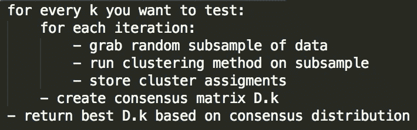
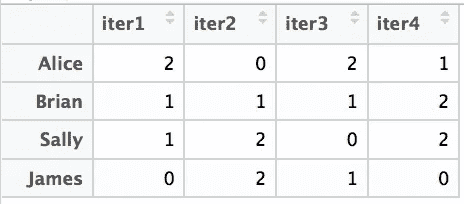
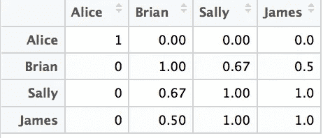
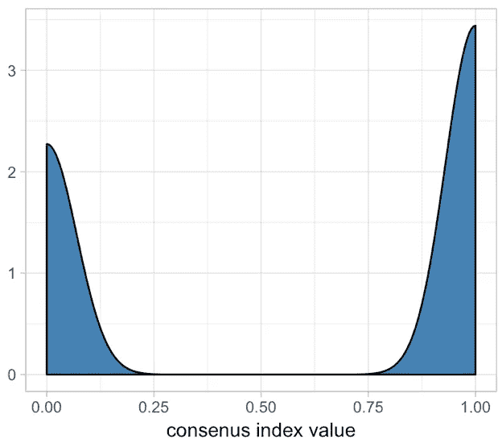
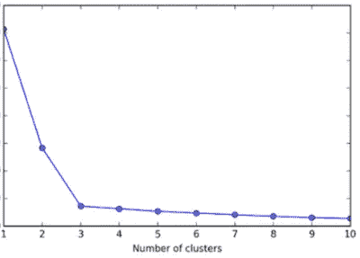
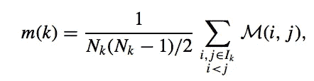
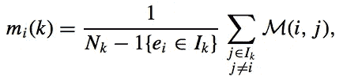
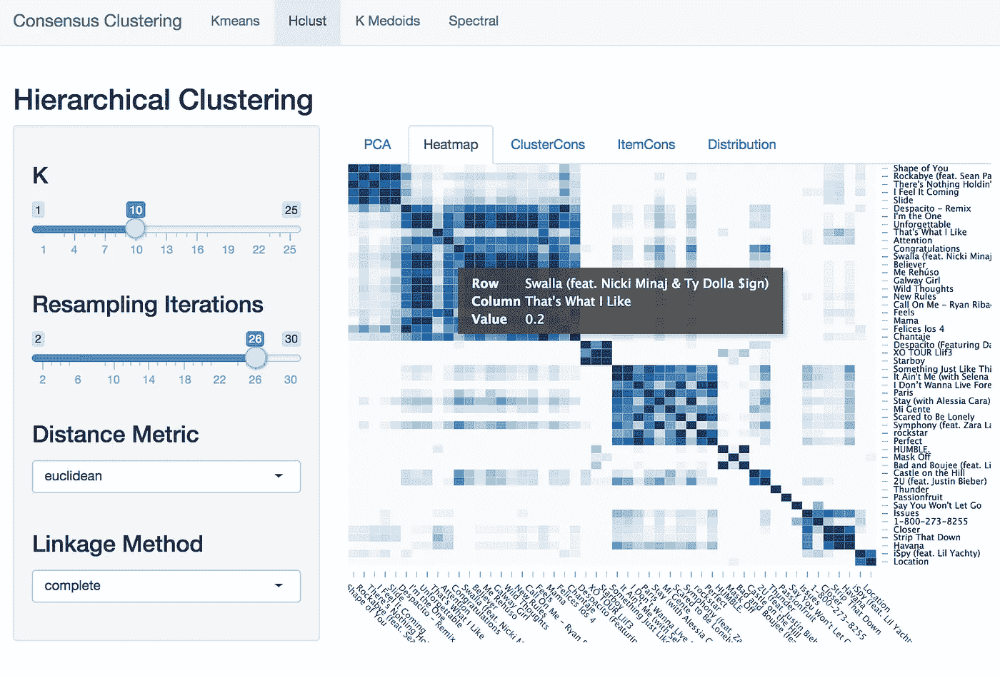

# 共识聚类

> 原文：<https://towardsdatascience.com/consensus-clustering-f5d25c98eaf2?source=collection_archive---------6----------------------->

## 一种鲁棒的聚类方法及其在歌曲播放列表中的应用

在这篇文章中，我们将首先简要介绍集群及其常见问题。然后，我们将解释共识聚类如何缓解这些问题，以及我们如何解释输出。最后，我们将介绍一个很酷的 RShiny 应用程序，该应用程序旨在对一堆歌曲进行一致聚类，以评估可能的播放列表创建。

## 什么是集群？

聚类是根据事物的相似性创建非重叠分组的活动。在数据科学的背景下，我们可能希望在我们的社交媒体平台上对用户进行聚类，以进行有针对性的广告宣传，或者在我们的研究中对基因表达进行分组，以[识别癌变](https://bmcbioinformatics.biomedcentral.com/articles/10.1186/1471-2105-9-497)行为，或者在我们的博客平台上匹配文档，以向读者展示[类似的博客](http://www.aaai.org/Papers/ICWSM/2008/ICWSM08-009.pdf)帖子。

聚类是一个[无监督学习](https://en.wikipedia.org/wiki/Unsupervised_learning)任务，在这个任务中，我们没有一个带标签的响应变量来训练我们的机器学习算法。因此，我们希望找到基于完整数据集的观察之间的相似性。聚类算法有很多种，各有利弊。在这篇文章中，我们不会讨论每个算法和它们各自的理论。

## 怎么了?

像 K-means 或 K-medoids 这样的方法利用随机开始过程，其中每次运行可能产生稍微不同的结果，或者初始化可能使结果有偏差。此外，还需要实例化 K 的值。层次聚类避免了初始化 K 值的问题，因为它具有类似树的性质，允许您在任何所需数量的聚类中对其进行切割。它还提供了一个很好的树形图来可视化集群，这是其他方法所缺乏的。然而，像其他聚类方法一样，很难评估您选择的切割点和所需 K 聚类的稳定性。聚类内/聚类之间的距离用于评估聚类，但是我们只能像信任随机开始和 k 值一样信任这些度量。

## 什么是共识聚类？

一致聚类(或聚集聚类)是一种更健壮的方法，它依赖于对数据集的子样本多次迭代所选的聚类方法。通过使用子采样诱导采样可变性，这为我们提供了评估聚类稳定性和我们的参数决策(即，K 和链接)的指标，以及热图形式的良好视觉组件。

Consensus clustering sudo code

顾名思义，一致性聚类基于它们在聚类算法的所有迭代中的分配，在观察的聚类分配上获得*一致性*。

我们需要首先决定我们希望运行多少次迭代。接下来，我们选择一组 K 值进行测试。对于每个 K，我们将迭代许多次，为我们的观察创建一组聚类。由于我们对数据进行子采样(即，分割 80%)，因此并非所有的观察值都会在每次迭代中聚集。

假设我们希望聚集四个用户:Alice、Brian、Sally 和 James。我们选择 k-means 并决定运行四次迭代。

对于 K = 2，我们得到下表。Brian 和 Sally 在第一次和第四次迭代中聚集在一起。Brian 和 James 聚集在第 3 个迭代中，而 Sally 和 James 聚集在第 2 个迭代中。爱丽丝从不和任何人在一起。

为了获得我们的共识矩阵，我们查看每个用户之间的成对关系。这看起来像一个大小为 NxN 的相异矩阵。在对两个用户进行二次抽样的所有迭代中，他们在同一个群集中出现了多少次？我们的共识矩阵看起来会像这样。

布莱恩和莎莉在一起被子采样了 3 次**，但是在一起被聚类了两次**。因此，Brian ~ Sally 的条目是 0.67，大约是 2/3。****

********

****这个玩具例子解释了我们如何得到一个共识矩阵。我们为每一个 K 值创建一个，并获取给我们最好分布的那个。假设我们取共识矩阵的上三角，并绘制值的分布。乐观地说，我们会想要像左边这样的东西。将共识值捆绑在 0 和 1 上意味着观察值在所有迭代中一致地聚集在一起和分开。****

********

****然后，我们从每个 K 为每个共识矩阵计算一个 [CDF](https://en.wikipedia.org/wiki/Cumulative_distribution_function) 。对于 K 中的每一步，我们计算 CDF 下面积的变化，并使用通常的[肘方法](https://en.wikipedia.org/wiki/Elbow_method_(clustering))来选择 K。对于左侧的图，我们选择 K=3。****

****现在，利用我们的共识矩阵 M，我们计算 1-M，并可以将其视为用于层次聚类的相异矩阵，以对我们的观察结果进行排序。我们这样做是为了获得一个漂亮的热图，如下图所示。分层聚类后的排序将矩阵中相似的行/列放在一起，沿着对角线创建漂亮的方框。****

********

****Heatmap of consensus matrix after sorting using hierarchical clustering. source: [https://link.springer.com/content/pdf/10.1023%2FA%3A1023949509487.pdf](https://link.springer.com/content/pdf/10.1023%2FA%3A1023949509487.pdf)****

******汇总统计******

****我们可以计算两个汇总统计数据，帮助我们确定特定集群的稳定性以及集群中某些观察结果的重要性。首先是*聚类一致性 m(k)* ，其中简单地计算每个聚类内每对观察值的平均一致性值。****

********

****Cluster consensus****

****接下来是*项目共识 m_i(k)* ，它关注于特定的项目或观察，并计算该项目对其集群中所有其他项目的平均共识值。****

********

****Item consensus****

****使用这些汇总统计数据，我们可以根据它们的一致性对集群进行排序，或者确定在集群中处于*中心*的观察值。****

# ******用于创建播放列表的 RShiny 应用******

********

****这款应用使用了 2017 年以来 Spotify 上的[前 50 首歌曲。Spotify 为每首歌曲提供了各种属性，但缩放后只使用了数字值。该应用程序允许您尝试不同的 K 值和重采样迭代，以及其他参数选项，具体取决于所选的聚类算法。第一个可视化是一个](https://www.kaggle.com/nadintamer/top-tracks-of-2017) [PCA](https://en.wikipedia.org/wiki/Principal_component_analysis) 图，显示前两个 PC 和所有观察的聚类分配。使用主成分分析，我们可以在 2d 图中可视化所有特征，并查看我们的聚类方法工作得有多好。****

********

****Visual Heatmap****

****上图是使用分层聚类创建的热图示例，其中 K=10，n.iter = 26，距离=欧氏距离，链接=完整。正如你所看到的，观察结果并没有很好的聚集在一起，这导致了对角线以外的颜色。****

****这个应用程序不仅仅是创建播放列表。如果你愿意，你可以从我的 github[上下载代码，然后输入你自己的数据集！它旨在帮助您直观地了解不同的聚类算法(及其各自的调整)如何使用一致聚类来执行。](https://github.com/Ljfernando/ConsensusClustering)****

## ****重要注意事项****

****在某些情况下，数据可能无法进行聚类。换句话说，如果聚类本质上没有很好地分离，一致聚类仍然可能产生好看的聚类。考虑假阳性结果的可能性是很重要的，当真的没有假阳性结果时显示稳定性。****

## ******总结******

****共识聚类缓解了大多数聚类方法中出现的常见问题，如随机初始化、选择 K、直观可视化和评估聚类的稳定性。这种方法基于对数据集进行子采样并多次运行所选的聚类算法来收集聚类分配的共识。我们可以使用各种指标来验证我们选择的 k。我们还可以使用*集群共识*来评估集群，并使用*项目共识*来查看哪些项目最能代表给定的集群。提供了一个 RShiny 应用程序，以探索 Spotify 2017 年前 50 首歌曲的数据集上的共识聚类。****

> ****该应用程序仍在进行中的工作，所以建议或更正是非常鼓励的！****
> 
> ****阅读这篇很棒的[论文](https://link.springer.com/content/pdf/10.1023%2FA%3A1023949509487.pdf)，了解更多关于共识聚类的知识。
> 这里有一个链接指向 [RShiny 应用](https://ljfernando.shinyapps.io/ConsensusClustering/)以及 github [回购](https://github.com/Ljfernando/ConsensusClustering)。****
> 
> ****如有任何问题，请随时联系 [me](https://ljfernando.github.io/) ！希望你喜欢这篇文章！****