# 与牛郎星主题一致的美丽的可视化

> 原文：<https://towardsdatascience.com/consistently-beautiful-visualizations-with-altair-themes-c7f9f889602?source=collection_archive---------6----------------------->


“rainbow frequency” by [Ricardo Gomez Angel](https://unsplash.com/@ripato?utm_source=medium&utm_medium=referral) on [Unsplash](https://unsplash.com?utm_source=medium&utm_medium=referral)

如果你是一个数据可视化爱好者或者也使用`python`的实践者，你可能听说过 Jake Vanderplas 和 Brian Granger 的`altair` : *“一个基于 Vega 和 Vega-lite 的用于 Python 的声明性统计可视化库”*。

> 有了 Altair，你可以花更多的时间去理解你的数据及其意义。Altair 的 API 简单、友好、一致，建立在强大的 Vega-Lite 可视化语法之上。这种优雅的简单性用最少的代码产生了漂亮而有效的可视化效果。

在这篇文章中，我们将深入挖掘`altair`的一个鲜为人知的特点:主题。

# 什么是`altair`主题？

在`altair`中，一个主题是在每个`python`会话中全局应用的一组图表配置。这意味着您可以始终如一地生成外观相似的可视化效果。

# 为什么会有用？

也许你正在为你的博客开发一种个人风格，也许你所在的公司已经有了一种风格，也许你讨厌网格线，厌倦了每次创建图表时都把它们关掉。当您生成数据可视化时，有一个遵循的样式指南总是有好处的。

在本文中，我们将探讨如何通过重新创建[城市研究所的数据可视化风格指南](http://urbaninstitute.github.io/graphics-styleguide/)，在`altair`中实现一个风格指南，而不是解释你的可视化中风格指南和一致性的价值。

# `altair`中的主题

下面是文档中的一个简单示例:

```
**import** altair **as** alt
**from** vega_datasets **import** data*# define the theme by returning the dictionary of configurations*
**def** black_marks():
    **return** {
        'config': {
            'view': {
                'height': 300,
                'width': 400,
            },
            'mark': {
                'color': 'black',
                'fill': 'black'
            }
        }
    }*# register the custom theme under a chosen name*
alt.themes.register('black_marks', black_marks)*# enable the newly registered theme*
alt.themes.enable('black_marks')*# draw the chart*
cars **=** data.cars.url
alt.Chart(cars).mark_point().encode(
    x**=**'Horsepower:Q',
    y**=**'Miles_per_Gallon:Q'
)
```

`height`和`width`仍然与默认主题相同，但是我们现在已经包括了`color`和`fill`值，这些值将被全局地**(除非另有说明)应用于从此刻起直到**这个** `python`会话结束为止生成的任何图表。**

**这相当于**

```
alt.Chart(cars).mark_point(color **=** 'black', fill **=** 'black').encode(
    x**=**'Horsepower:Q',
    y**=**'Miles_per_Gallon:Q'
)
```

**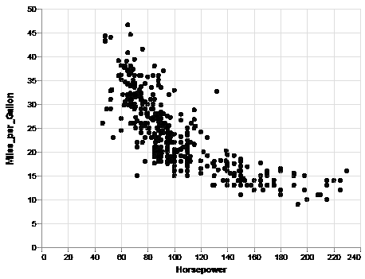**

**在返回的`black_marks` `config`字典中，您可以看到我们为`mark`中的键`color`和`fill`指定了值`black`。这是所有这些规范遵循的格式。例如，如果您想要配置左轴标签的字体大小:**

```
**def** my_theme():
    **return** {
        'config': {
            'view': {
                'height': 300,
                'width': 400,
            },
            'mark': {
                'color': 'black',
                'fill': '#000000',
            },
            'axisLeft': {
                'labelFontSize': 30,
            },
        }
    }*# register the custom theme under a chosen name*
alt.themes.register('my_theme', my_theme)*# enable the newly registered theme*
alt.themes.enable('my_theme')
```

**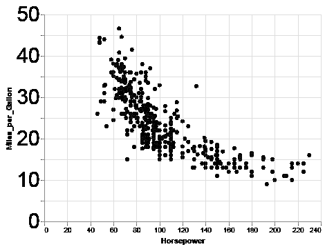**

***(旁注:可以从* [*Vega-Lite 的文档*](https://vega.github.io/vega-lite/docs/config.html.) 中获取这些 ***规格*** *(即* `*'axisLeft'*`**

***如果你或你的公司有你必须遵循的风格指南，这可能特别有用。即使你没有风格指南，你也可以通过在你的个人主题上保存你的配置而不是在你的 viz 代码中开始建立一个风格指南(从长远来看这是值得的！).***

***Vega 已经在 GitHub 上有了一些[主题。](https://github.com/vega/vega-themes/tree/master/src)***

***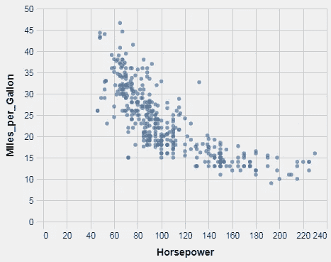***

*****fivethirtyeight*****

***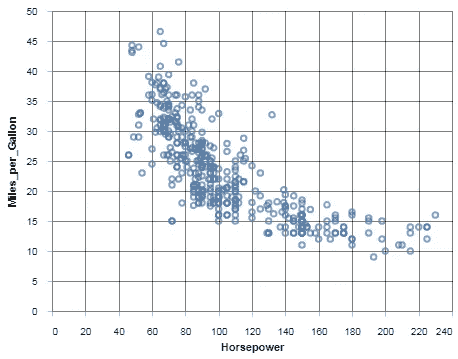***

*****excel*****

***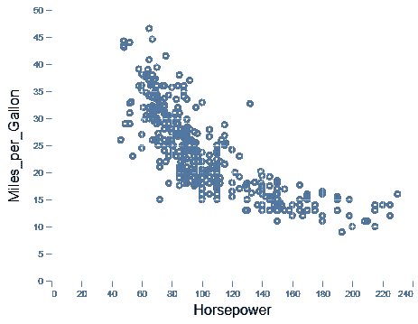***

*****ggplot2*****

***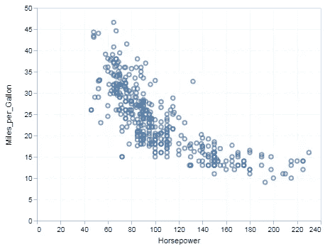***

*****vox*****

***所以让我们建立一个 ***简化的*** 城市学院的`altair`主题。***

***城市学院风格的这个 ***简化版*** 的所有信息都可以从他们的 GitHub 页面的这个图中找到。***

***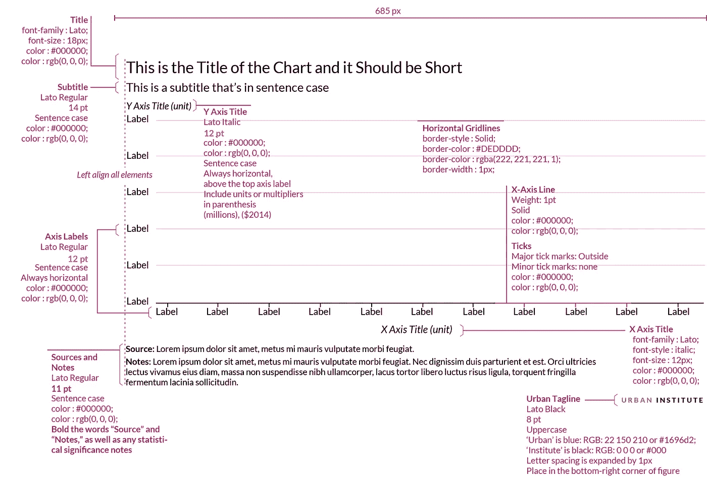***

***这个主题的基本结构如下:***

```
***def** theme_name():**return** {
        "config": { 
            "TOP_LEVEL_OBJECT": { *# i.e. "title", "axisX", "legend",*
                "CONFIGURATION": "VALUE",
                "ANOTHER_ONE": "ANOTHER_VALUE",
                "MAYBE_A_SIZE": 14, *# values can be a string, boolean, or number,*
            },
            "ANOTHER_OBJECT": {
                "CONFIGURATION": "VALUE",
            }
        }
    }*
```

***我们将配置顶级对象“*标题*”、“ *axisX* ”、“ *axisY* ”、“*范围*”和“*图例*”，以及其他一些一行程序规范。***

***现在，我们马上看到 Urban 在所有文本上使用“Lato”字体，我们可以将其保存为一个变量，这样我们就不必重复使用它。***

1.  ****标题****

***Urban 的标题大小为 **18px，Lato 字体，左对齐，黑色。*****

```
***def** urban_theme():
    font **=** "Lato"**return** {
        "config": {
            "title": {
                "fontSize": 18,
                "font": font,
                "anchor": "start", *# equivalent of left-aligned.*
                "fontColor": "#000000"
            }
        }
    }*
```

***此时，你可以*注册*和*启用*这个主题，并且在这个`python`会话中你所有的`altair`图表将会有一个看起来像城市研究所的标题。***

```
**# register*
alt.themes.register("my_custom_theme", urban_theme)
*# enable*
alt.themes.enable("my_custom_theme")*
```

## ***旁注***

***如果您的计算机中没有安装“Lato”字体，您可以在单元格中运行此代码，暂时将它从 Google Fonts 导入到您的浏览器中。***

```
***%%**html
**<**style**>**
@**import** url('https://fonts.googleapis.com/css?family=Lato');
**</**style**>***
```

1.  ****axisX* 和 *axisY****

***在市区，X 轴和 Y 轴略有不同。x 轴有一条在`altair`被称为*域*的线，这条线穿过轴。y 轴没有这个(类似于`seaborn`的`sns.despine()`)。y 轴有网格线，X 轴没有。x 轴有刻度，Y 轴没有。但两者都有同样大小的标签和标题。***

```
***def** urban_theme():
    *# Typography*
    font **=** "Lato"
    *# At Urban it's the same font for all text but it's good to keep them separate in case you want to change one later.*
    labelFont **=** "Lato" 
    sourceFont **=** "Lato" *# Axes*
    axisColor **=** "#000000"
    gridColor **=** "#DEDDDD"**return** {
        "config": {
            "title": {
                "fontSize": 18,
                "font": font,
                "anchor": "start", *# equivalent of left-aligned.*
                "fontColor": "#000000"
            },
            "axisX": {
                "domain": **True**,
                "domainColor": axisColor,
                "domainWidth": 1,
                "grid": **False**,
                "labelFont": labelFont,
                "labelFontSize": 12,
                "labelAngle": 0, 
                "tickColor": axisColor,
                "tickSize": 5, *# default, including it just to show you can change it*
                "titleFont": font,
                "titleFontSize": 12,
                "titlePadding": 10, *# guessing, not specified in styleguide*
                "title": "X Axis Title (units)", 
            },
            "axisY": {
                "domain": **False**,
                "grid": **True**,
                "gridColor": gridColor,
                "gridWidth": 1,
                "labelFont": labelFont,
                "labelFontSize": 12,
                "labelAngle": 0, 
                "ticks": **False**, *# even if you don't have a "domain" you need to turn these off.*
                "titleFont": font,
                "titleFontSize": 12,
                "titlePadding": 10, *# guessing, not specified in styleguide*
                "title": "Y Axis Title (units)", 
                *# titles are by default vertical left of axis so we need to hack this* 
                "titleAngle": 0, *# horizontal*
                "titleY": **-**10, *# move it up*
                "titleX": 18, *# move it to the right so it aligns with the labels* 
            },}
    }*
```

***如果你*注册* ed 并且*启用* d 这个主题，你会得到一个看起来有点像城市研究所图表的东西。但是让你马上知道你正在看一个城市研究所的数据可视化的是颜色。***

***在`altair`中，你有`scales`与`domain`和`range`。这些是"*函数，将数据域中的值(数字、日期、字符串等)转换为编码通道的可视值(像素、颜色、大小)。因此，如果你想添加一个默认的配色方案，你所要做的就是在你的主题中编码顶层对象`"range"`的值。****

***我们将这些值保存为列表`main_palette`和`sequential_palette`。城市研究所的数据可视化风格指南有很多颜色组合。我们将这两个编码为默认值，但是当涉及到颜色时，您很可能会在移动中修改您的数据可视化。***

```
***def** urban_theme():
    *# Typography*
    font **=** "Lato"
    *# At Urban it's the same font for all text but it's good to keep them separate in case you want to change one later.*
    labelFont **=** "Lato" 
    sourceFont **=** "Lato" *# Axes*
    axisColor **=** "#000000"
    gridColor **=** "#DEDDDD" *# Colors*
    main_palette **=** ["#1696d2", 
                    "#d2d2d2",
                    "#000000", 
                    "#fdbf11", 
                    "#ec008b", 
                    "#55b748", 
                    "#5c5859", 
                    "#db2b27", 
                   ]
    sequential_palette **=** ["#cfe8f3", 
                          "#a2d4ec", 
                          "#73bfe2", 
                          "#46abdb", 
                          "#1696d2", 
                          "#12719e", 
                         ]**return** {
        "config": {
            "title": {
                "fontSize": 18,
                "font": font,
                "anchor": "start", *# equivalent of left-aligned.*
                "fontColor": "#000000"
            },
            "axisX": {
                "domain": **True**,
                "domainColor": axisColor,
                "domainWidth": 1,
                "grid": **False**,
                "labelFont": labelFont,
                "labelFontSize": 12,
                "labelAngle": 0, 
                "tickColor": axisColor,
                "tickSize": 5, *# default, including it just to show you can change it*
                "titleFont": font,
                "titleFontSize": 12,
                "titlePadding": 10, *# guessing, not specified in styleguide*
                "title": "X Axis Title (units)", 
            },
            "axisY": {
                "domain": **False**,
                "grid": **True**,
                "gridColor": gridColor,
                "gridWidth": 1,
                "labelFont": labelFont,
                "labelFontSize": 12,
                "labelAngle": 0, 
                "ticks": **False**, *# even if you don't have a "domain" you need to turn these off.*
                "titleFont": font,
                "titleFontSize": 12,
                "titlePadding": 10, *# guessing, not specified in styleguide*
                "title": "Y Axis Title (units)", 
                *# titles are by default vertical left of axis so we need to hack this* 
                "titleAngle": 0, *# horizontal*
                "titleY": **-**10, *# move it up*
                "titleX": 18, *# move it to the right so it aligns with the labels* 
            },
            "range": {
                "category": main_palette,
                "diverging": sequential_palette,
            }}
    }*
```

***此时，默认情况下，您的主题将具有城市研究所的标题、轴和颜色配置。很酷，但这不是你能做的全部。***

***让我们添加一个默认的图例配置。这一次我们将稍微偏离样式指南，因为图例的位置取决于手边的图表(在 Vega-lite 中不能有水平图例)。***

***该代码还包括“*视图*”和“*背景*”配置，无需过多解释，简单易懂。还包括“*区域*”、“*线*”、“*轨迹*”、“*条*”、“*点*”等标识的配置。这只是为每个特定的标记设置正确的颜色。***

```
***def** urban_theme():
    *# Typography*
    font **=** "Lato"
    *# At Urban it's the same font for all text but it's good to keep them separate in case you want to change one later.*
    labelFont **=** "Lato" 
    sourceFont **=** "Lato" *# Axes*
    axisColor **=** "#000000"
    gridColor **=** "#DEDDDD" *# Colors*
    main_palette **=** ["#1696d2", 
                    "#d2d2d2",
                    "#000000", 
                    "#fdbf11", 
                    "#ec008b", 
                    "#55b748", 
                    "#5c5859", 
                    "#db2b27", 
                   ]
    sequential_palette **=** ["#cfe8f3", 
                          "#a2d4ec", 
                          "#73bfe2", 
                          "#46abdb", 
                          "#1696d2", 
                          "#12719e", 
                         ]**return** {
        *# width and height are configured outside the config dict because they are Chart configurations/properties not chart-elements' configurations/properties.*
        "width": 685, *# from the guide*
        "height": 380, *# not in the guide*
        "config": {
            "title": {
                "fontSize": 18,
                "font": font,
                "anchor": "start", *# equivalent of left-aligned.*
                "fontColor": "#000000"
            },
            "axisX": {
                "domain": **True**,
                "domainColor": axisColor,
                "domainWidth": 1,
                "grid": **False**,
                "labelFont": labelFont,
                "labelFontSize": 12,
                "labelAngle": 0, 
                "tickColor": axisColor,
                "tickSize": 5, *# default, including it just to show you can change it*
                "titleFont": font,
                "titleFontSize": 12,
                "titlePadding": 10, *# guessing, not specified in styleguide*
                "title": "X Axis Title (units)", 
            },
            "axisY": {
                "domain": **False**,
                "grid": **True**,
                "gridColor": gridColor,
                "gridWidth": 1,
                "labelFont": labelFont,
                "labelFontSize": 12,
                "labelAngle": 0, 
                "ticks": **False**, *# even if you don't have a "domain" you need to turn these off.*
                "titleFont": font,
                "titleFontSize": 12,
                "titlePadding": 10, *# guessing, not specified in styleguide*
                "title": "Y Axis Title (units)", 
                *# titles are by default vertical left of axis so we need to hack this* 
                "titleAngle": 0, *# horizontal*
                "titleY": **-**10, *# move it up*
                "titleX": 18, *# move it to the right so it aligns with the labels* 
            },
            "range": {
                "category": main_palette,
                "diverging": sequential_palette,
            },
            "legend": {
                "labelFont": labelFont,
                "labelFontSize": 12,
                "symbolType": "square", *# just 'cause*
                "symbolSize": 100, *# default*
                "titleFont": font,
                "titleFontSize": 12,
                "title": "", *# set it to no-title by default*
                "orient": "top-left", *# so it's right next to the y-axis*
                "offset": 0, *# literally right next to the y-axis.*
            },
            "view": {
                "stroke": "transparent", *# altair uses gridlines to box the area where the data is visualized. This takes that off.*
            },
            "background": {
                "color": "#FFFFFF", *# white rather than transparent*
            },
            *### MARKS CONFIGURATIONS ###*
            "area": {
               "fill": markColor,
           },
           "line": {
               "color": markColor,
               "stroke": markColor,
               "strokeWidth": 5,
           },
           "trail": {
               "color": markColor,
               "stroke": markColor,
               "strokeWidth": 0,
               "size": 1,
           },
           "path": {
               "stroke": markColor,
               "strokeWidth": 0.5,
           },
           "point": {
               "filled": **True**,
           },
           "text": {
               "font": sourceFont,
               "color": markColor,
               "fontSize": 11,
               "align": "right",
               "fontWeight": 400,
               "size": 11,
           }, 
           "bar": {
                "size": 40,
                "binSpacing": 1,
                "continuousBandSize": 30,
                "discreteBandSize": 30,
                "fill": markColor,
                "stroke": **False**,
            },}
    }*
```

## ***边注***

***我个人将这些主题保存在一个`.py`脚本中***

```
***import** altair **as** alt
alt.themes.register("my_custom_theme", urban_theme)
alt.themes.enable("my_custom_theme")*
```

***在我的笔记本上。***

***以下是用该主题创建的一些图表示例。***

## ***条形图***

***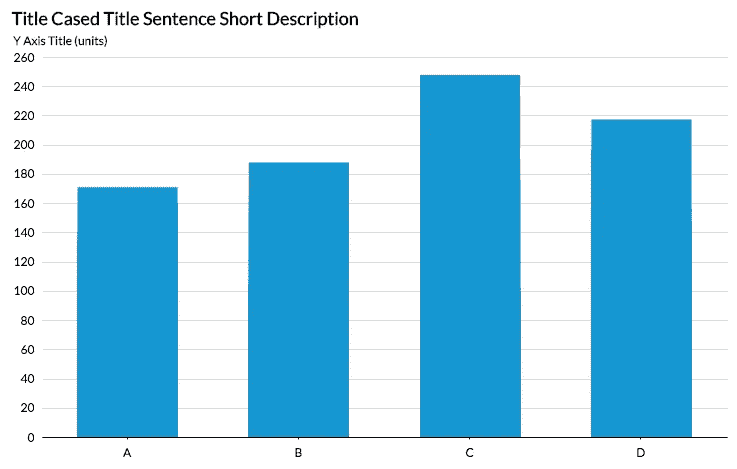***

## ***面积图(分类)***

***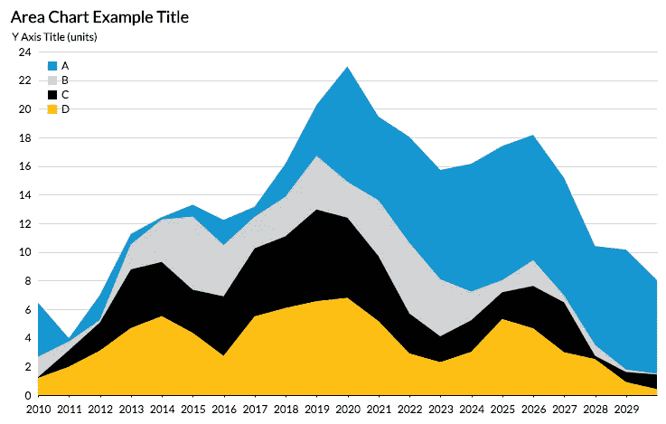***

## ***面积图(顺序)***

***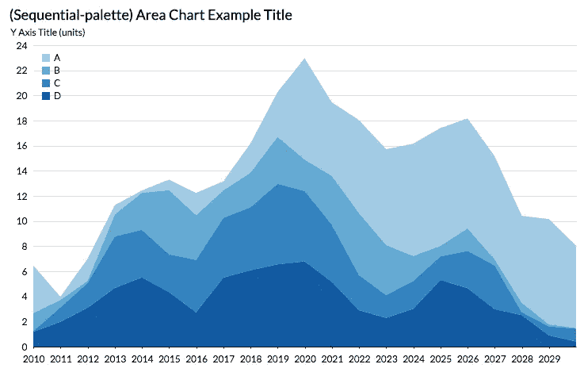***

## ***折线图***

***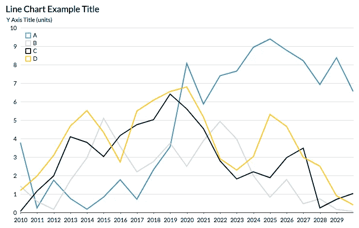***

***有很多方法来配置你的主题，我鼓励你尝试很多不同的东西。你可以把我们刚刚整理好的主题和价值观结合起来。使用不同的字体，字体大小，配色方案。有网格线，没有网格线。给你的斧子贴上非常非常大的标签。做你想做的事情，但是把它保存在某个地方，这样你就可以在它的基础上发展你的个人风格。***

***虽然你可能想在`[altair](http://altair-viz.github.io)` [文档](http://altair-viz.github.io)中查找更多这方面的信息，但我发现使用 [Vega-lite](https://vega.github.io/vega-lite/docs/config.html) 文档更好。毕竟，`altair`是 Vega-lite 的 python-wrapper。***

***所有的图片和代码都可以在这个 [GitHub repo](https://github.com/Chekos/altair_themes_blog) 中找到。***

***有什么意见，问题，建议吗？[我在 twitter](http://twitter.com/ChekosWH) 、 [linkedin](http://www.linkedin.com/in/chekos) 和 [Instagram](http://instagram.com/chekos.visuals) 。***