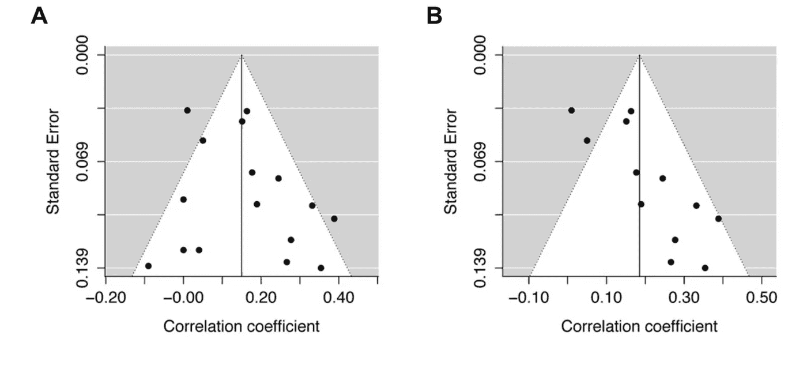
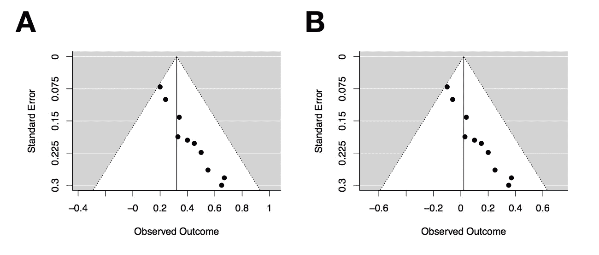
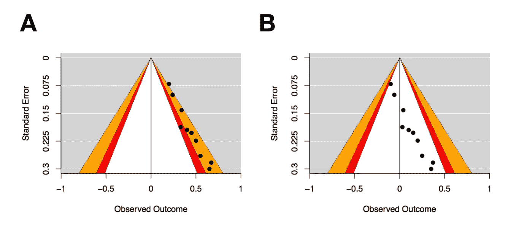
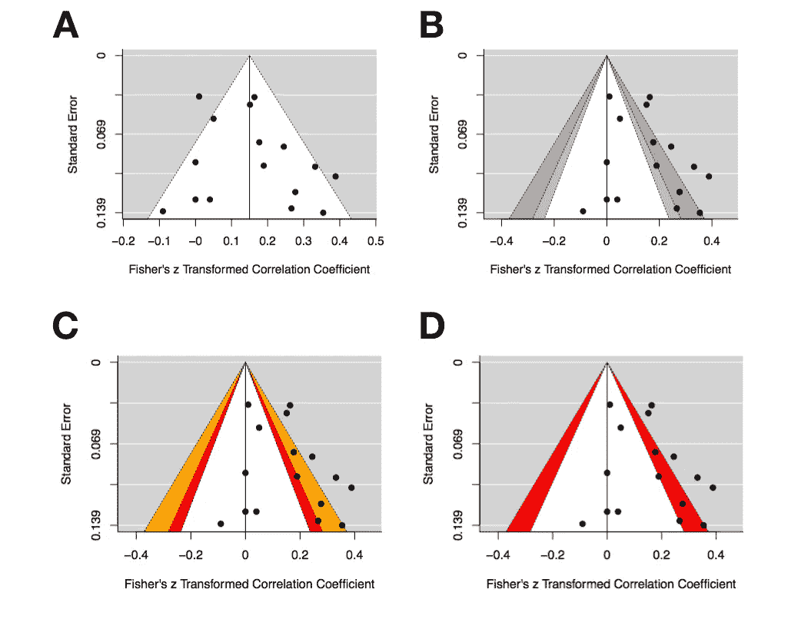

# 构建用于荟萃分析的轮廓增强漏斗图

> 原文：<https://towardsdatascience.com/constructing-contour-enhanced-funnel-plots-for-meta-analysis-6434cc8e51d0?source=collection_archive---------3----------------------->

元分析被用来综合大量的研究，在指导政策时可以发挥相当大的作用。然而，这种方法的一个很大的局限性是纳入荟萃分析的研究可能会有偏差。

出版偏见是众所周知的偏见来源。例如，研究人员可能会搁置那些没有统计学意义的研究，因为期刊不太可能发表这类结果。研究人员也可能使用有问题的研究实践——也被称为*p*——黑客——来将一个效应推到统计学意义上。

P-hacking in action

因此，在进行荟萃分析时，需要考虑发表偏倚的风险。

在荟萃分析中，通常使用两种相互关联的方法来评估发表偏倚的风险。首先，通过构建一个漏斗图来可视化发表偏倚的风险，该漏斗图将效应大小的测量值与测量值方差(例如，标准误差)可视化，漏斗以汇总效应大小为中心。

让我们考虑下面图 1 中的两个漏斗图。

Figure 1

图 1A 似乎是相当对称的，具有大致相同数量的研究，无论是总体效果大小(即漏斗中间的垂直线)。方差越大的研究，其总体效应大小的分布越大，越接近图的底部。相比之下，1B 的身材并不匀称。似乎方差较大的研究(即参与者较少的研究)仅落在汇总效应大小的右侧。许多研究人员会得出结论，由于明显的不对称性，数字 1B 是发表偏倚的象征。

Egger 的回归检验通常被用作漏斗图不对称性的客观测量，因为它评估了影响大小和抽样方差之间的关系。统计上显著的影响表明漏斗图不对称。

现在让我们考虑图 2 中的两个漏斗图，每个漏斗图有十个效果大小。

Figure 2

两个图都显示了不对称性，但注意到了观察结果的差异(即效应大小)。图 2A 中的效果尺寸范围从 0.2 到 0.65，而图 2B 中的效果尺寸范围从-0.1 到 0.35。

对于给定的效应大小和方差范围，可以计算这两个变量任意组合的统计显著性。因此，您可以通过构建所谓的[轮廓增强漏斗图，在传统漏斗图上可视化一组显著性阈值。](https://www.ncbi.nlm.nih.gov/pubmed/18538991)

图 3 中的漏斗图是图 2 中的图的复制，除了具有统计显著性的关键区域已经叠加在漏斗上，并且该图现在以零为中心。红色区域显示在 *p* = .1 和 *p =* .05 之间的效果，橙色区域显示在 *p* = .05 和 *p =* .01 之间的效果。白色区域的效果大于 *p* = .1，灰色区域的效果小于 *p* = .01。

Figure 3

对这两个图进行 Egger 的回归测试得到了相同的结果( *z* = 2.78， *p* = 0.01)，这表明了不对称性。然而，在图 3A 中，有明显的研究模式落入漏斗右侧的统计显著性通道。图 3B 显示了明显的不对称性，但没有一项研究具有统计学意义。

图 3 说明了漏斗图和 Egger 的回归测试只评估了*小型研究*偏差的风险，因为小型研究往往具有更大的方差。当然，不对称图*可能*是由于出版偏差，但可能有其他原因可以更好地解释漏斗图不对称。例如，方差较大的较小研究与较差的研究设计有关。

以下是如何为你自己的元分析绘制这些图，使用 r。

## 在 R 中使用 Metafor 包的轮廓增强漏斗图

metafor R 包提供了一种构建高度可定制的轮廓增强漏斗图的简单方法。

以下 R 脚本将生成一个标准漏斗图和三个不同的轮廓增强漏斗图。

图 4A 是一个标准的漏斗图。图 4B 是轮廓增强漏斗图——注意，垂直参考线现在为零(而不是像图 4A 那样的综合效果大小)。图 4C 增加了一点颜色，图 4D 将轮廓线调整为一条在 *p* = .05 和 *p* = .01 之间的单一轮廓。

Figure 4

使用 R 进行分析的众多好处之一是，您可以轻松地将分析脚本与您的手稿共享。如果你是 R 的新手，你应该看看我的[逐步教程论文](https://www.frontiersin.org/articles/10.3389/fpsyg.2015.01549/full)来使用 R 进行你自己的相关性元分析。我还整理了一个配套的[视频](https://www.youtube.com/watch?v=d1pYHfCKhyA)，如果那更适合你的话。

公开材料通常是为了促进其他科学家重现你的分析。然而，你会很快了解到，开放材料的最大受益者之一是你的未来，因为当你需要重新分析时。

## 最后的想法

轮廓增强漏斗图提供了大量研究中报告的统计显著性模式的便捷可视化。虽然它们是对传统漏斗图的有益补充，传统漏斗图只能显示小规模研究偏差，但它们不能用于客观评估 p-hacking 的风险，或给定领域中效应规模膨胀的程度。尽管有这些限制，漏斗图仍然可以为荟萃分析提供有价值的补充，因为它们很容易放在一起。

如果你喜欢这篇文章，你可能也会喜欢我共同主持的元科学播客【T2 万物赫兹】。这是我们关于元分析的[一集](https://soundcloud.com/everything-hertz/4-meta-analysis-or-mega-silliness)。