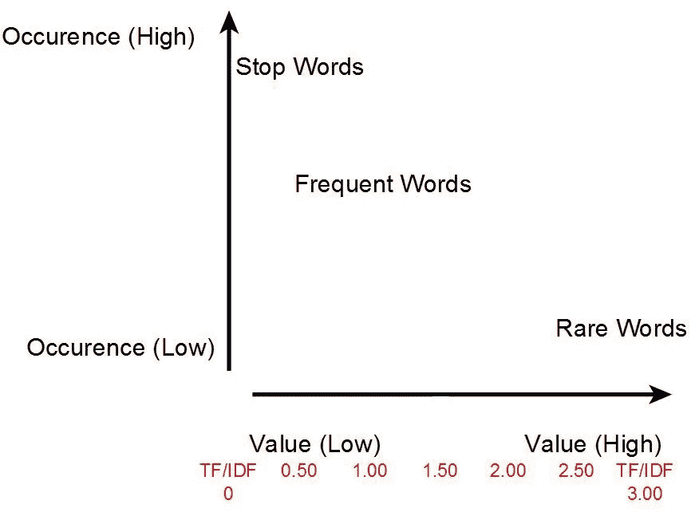
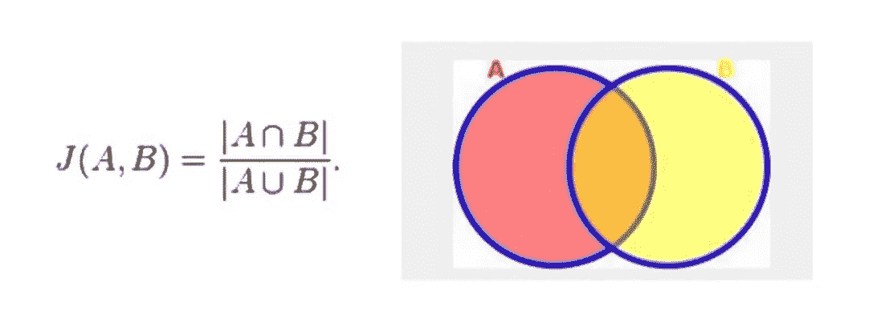
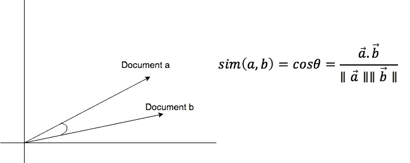

# 基于内容的 NYT 文章推荐系统

> 原文：<https://towardsdatascience.com/content-based-recommender-for-nyt-articles-5a54f57dd531?source=collection_archive---------16----------------------->

## 数据产品。数据科学。自然语言处理

# 介绍


我们将为纽约时报的文章创建一个基于内容的推荐器。这个推荐器是一个非常简单的数据产品的例子。

我们将根据用户当前阅读的文章推荐他们应该阅读的新文章。我们将通过基于那篇文章的文本数据推荐类似的文章来做到这一点。

查看我的 Github 个人资料上的代码。

[](https://github.com/DataBeast03/DataBeast/blob/master/NYT_Recommender/Content_Based_Recommendations.ipynb) [## 数据广播 03/数据广播

### 数据科学投资组合。通过在 GitHub 上创建一个帐户，为 databast 03/databast 开发做出贡献。

github.com](https://github.com/DataBeast03/DataBeast/blob/master/NYT_Recommender/Content_Based_Recommendations.ipynb) 

# 检查数据

以下是我们数据集中第一篇 NYT 文章的摘录。显然，我们正在处理文本数据。

```
'TOKYO —  State-backed Japan Bank for International Cooperation [JBIC.UL] will lend about 4 billion yen ($39 million) to Russia\'s Sberbank, which is subject to Western sanctions, in the hope of advancing talks on a territorial dispute, the Nikkei business daily said on Saturday, [...]"
```

所以我们必须回答的第一个问题是，我们应该如何对它进行矢量化？我们如何着手设计新的特征，如词类、N-grams、情感分数或命名实体？！

显然 NLP 隧道很深，我们可以花几天时间来试验不同的选项。但是所有好的科学都是从尝试最简单可行的解决方案开始，然后迭代到更复杂的方案。

在本文中，我们将实现一个简单可行的解决方案。

**分割您的数据**

首先，我们需要确定数据集中哪些特征是我们感兴趣的，对它们进行洗牌，然后将数据分成训练集和测试集——所有这些都是标准的数据预处理。

```
# move articles to an array
articles = df.body.values# move article section names to an array
sections = df.section_name.values# move article web_urls to an array
web_url = df.web_url.values# shuffle these three arrays 
articles, sections, web_ur = shuffle(articles, sections, web_url, random_state=4)# split the shuffled articles into two arrays
n = 10# one will have all but the last 10 articles -- think of this as your training set/corpus 
X_train = articles[:-n]
X_train_urls = web_url[:-n]
X_train_sections = sections[:-n]# the other will have those last 10 articles -- think of this as your test set/corpus 
X_test = articles[-n:]
X_test_urls = web_url[-n:]
X_test_sections = sections[-n:]
```

## 文本矢量器

我们可以从几个不同的文本矢量器中进行选择，比如**单词袋**(BoW)**Tf-Idf**、 **Word2Vec** 等等。

以下是我们*应该*选择 Tf-Idf 的一个原因:

与 BoW 不同，Tf-Idf 不仅通过文本频率，还通过逆文档频率来识别单词的重要性。



因此，举例来说，如果像“奥巴马”这样的词在一篇文章中只出现几次(不像停用词“a”或“the ”,它们不传达太多信息),但在几篇不同的文章中出现，那么它将被给予较高的权重。

这是有道理的，因为“奥巴马”不是一个停用词，也不是在没有充分理由的情况下被提及(即，它与文章的主题高度相关)。

## 相似性度量

当选择相似性度量时，我们有几个不同的选项，例如 **Jacard** 和 **Cosine** 来命名一对。



Jacard 通过比较两个不同的集合并选择重叠的元素来工作。考虑到我们已经选择使用 Tf-Idf 作为矢量器，Jacard 相似性作为选项没有意义；如果我们选择 BoWs 矢量化，使用 Jacard 可能更有意义。

我们*应该*选择余弦作为我们的相似性度量的原因是因为它作为选择 Tf-Idf 作为我们的矢量器的选项是有意义的。



由于 Tf-Idf 为每篇文章中的每个令牌提供了权重，因此我们可以计算不同文章的令牌的权重之间的点积。

如果文章 A 对于像“Obama”和“White House”这样的标记具有高权重，文章 B 也是如此，那么与文章 B 对于那些相同的标记具有低权重的情况相比，它们的产品将产生更大的相似性得分(为了简单起见，假设所有其他标记权重都被认为是同意的)。

## 构建推荐器

这部分是神奇发生的地方！

在这里，您将构建一个函数，根据用户当前阅读的文章与语料库中所有其他文章之间的相似性得分(即“训练”数据)，输出前 N 篇文章推荐给用户。

```
def get_top_n_rec_articles(X_train_tfidf, X_train, test_article, X_train_sections, X_train_urls, n = 5):
    '''This function calculates similarity scores between a document and a corpus

       INPUT: vectorized document corpus, 2D array
              text document corpus, 1D array
              user article, 1D array
              article section names, 1D array
              article URLs, 1D array
              number of articles to recommend, int

       OUTPUT: top n recommendations, 1D array
               top n corresponding section names, 1D array
               top n corresponding URLs, 1D array
               similarity scores bewteen user article and entire corpus, 1D array
              '''
    # calculate similarity between the corpus (i.e. the "test" data) and the user's article
    similarity_scores = X_train_tfidf.dot(test_article.toarray().T) # get sorted similarity score indices  
    sorted_indicies = np.argsort(similarity_scores, axis = 0)[::-1] # get sorted similarity scores
    sorted_sim_scores = similarity_scores[sorted_indicies] # get top n most similar documents
    top_n_recs = X_train[sorted_indicies[:n]] # get top n corresponding document section names
    rec_sections = X_train_sections[sorted_indicies[:n]] # get top n corresponding urls
    rec_urls = X_train_urls[sorted_indicies[:n]]

    # return recommendations and corresponding article meta-data
    return top_n_recs, rec_sections, rec_urls, sorted_sim_scores
```

上述函数按以下顺序工作

1.  计算用户文章和我们语料库的相似度
2.  从最高相似度到最低相似度排序分数
3.  获取前 N 篇最相似的文章
4.  获取相应的前 N 篇文章部分名称和 URL
5.  返回前 N 篇文章、版块名称、URL 和分数

# 验证结果

既然我们已经为用户推荐了阅读的文章(基于他们当前正在阅读的内容),检查一下结果是否有意义。

我们来对比一下用户的文章和对应的版块名与推荐的文章和对应的版块名。

首先让我们来看看相似性得分。

```
# similarity scores
sorted_sim_scores[:5]
# OUTPUT:
# 0.566
# 0.498
# 0.479
# .
# . 
```

分数不是很高(注意余弦相似度从 0 到 1)。我们如何改进它们？我们可以选择不同的矢量器，比如 Doc2Vec。我们还可以探索不同的相似性度量。即便如此，我们还是来看看结果吧。

```
# user's article's section name
X_test_sections[k]
# OUTPUT:
'U.S'# corresponding section names for top n recs 
rec_sections
# OUTPUT:
'World'
'U.S'
'World'
'World'
'U.S.'
```

好的，所以推荐的版块名称看起来很合适。那就好！

```
# user's article
X_test[k]'LOS ANGELES —  The White House says President Barack Obama has told the Defense Department that it must ensure service members instructed to repay enlistment bonuses are being treated fairly and expeditiously.\nWhite House spokesman Josh Earnest says the president only recently become aware of Pentagon demands that some soldiers repay their enlistment bonuses after audits revealed overpayments by the California National Guard.  If soldiers refuse, they could face interest charges, wage garnishments and tax liens.\nEarnest says he did not believe the president was prepared to support a blanket waiver of those repayments, but he said "we\'re not going to nickel and dime" service members when they get back from serving the country. He says they should not be held responsible for fraud perpetrated by others.'
```

好吧，用户的文章是关于支付给国民警卫队成员的超额报酬。

现在让我们来看看前 N 篇推荐文章中的一些摘录:

```
# article one
'WASHINGTON —  House Speaker Paul Ryan on Tuesday called for the Pentagon to immediately suspend efforts to recover enlistment bonuses paid to thousands of soldiers in California, [...]'# article two
'WASHINGTON —  The Latest on enlistment bonuses the Pentagon is ordering California National Guard soldiers to repay [...]'# article three
'SACRAMENTO, Calif. —  Nearly 10,000 California National Guard soldiers have been ordered to repay huge enlistment bonuses a decade after signing up to serve in Iraq and Afghanistan [...]'# article four
'WASHINGTON —  The Pentagon worked Wednesday to stave off a public relations nightmare, suspending efforts to force California National Guard troops who served in Iraq and Afghanistan to repay their enlistment bonuses [...]'# article five 
'SACRAMENTO, Calif. —  The Latest on enlistment bonuses the Pentagon is ordering California National Guard soldiers to repay [...]'
```

好啊好啊！看来我们的推荐人确实很成功。所有前五名推荐的文章都与读者当前阅读的内容完全相关。还不错。

# 关于验证的说明

我们比较推荐文本和节名的特别验证过程表明，我们的推荐器如我们所愿地工作。

手动梳理结果对于我们的目的来说很好，但是我们最终想要做的是创建一个完全自动化的验证过程，以便我们可以在生产中移动我们的推荐器，并让它进行自我验证。

将这个推荐器投入生产超出了本文的范围。本文旨在展示如何在真实数据集上构建这样一个推荐器的原型。

# 结论

在本文中，我们展示了如何为纽约时报的文章构建一个简单的基于内容的推荐器。我们看到，我们只需要选择一个文本矢量器和相似性度量来构建一个。然而，我们选择哪种矢量器和相似性度量会极大地影响性能。

你可能已经注意到，在我们的推荐器中没有任何实际的机器学习。我们真正拥有的是记忆和相似分数的排序。

# **附加资源**

[标准的推荐系统信息实验室文档](http://infolab.stanford.edu/~ullman/mmds/ch9.pdf)

[Spotify 的深度学习音乐推荐器](http://benanne.github.io/2014/08/05/spotify-cnns.html)