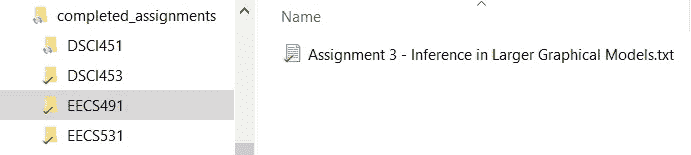
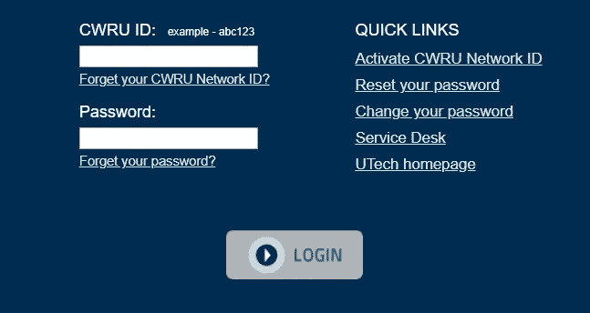
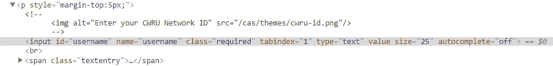
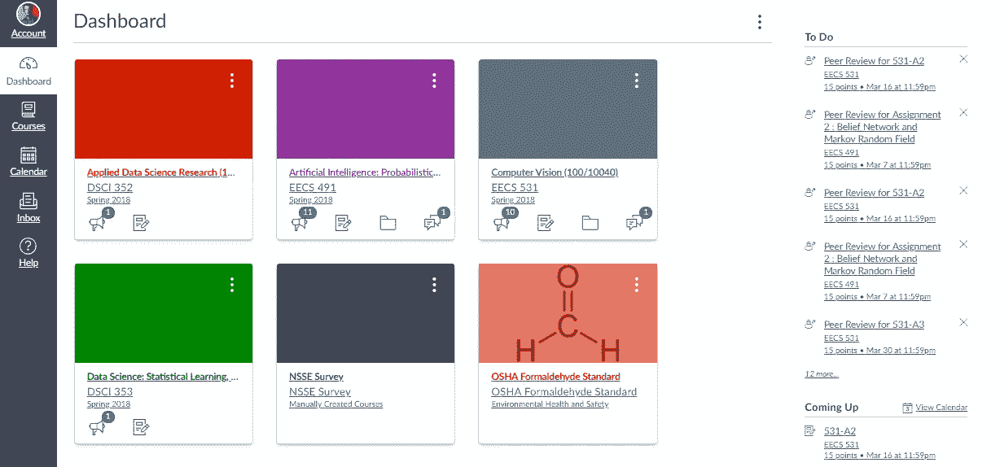
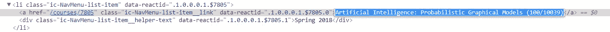
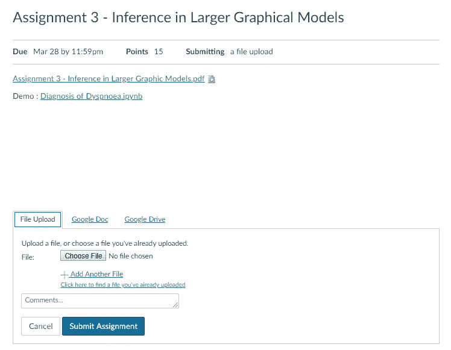
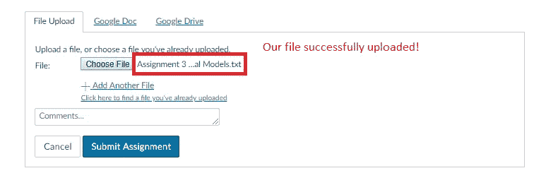
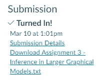
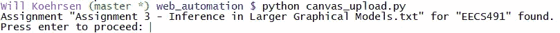
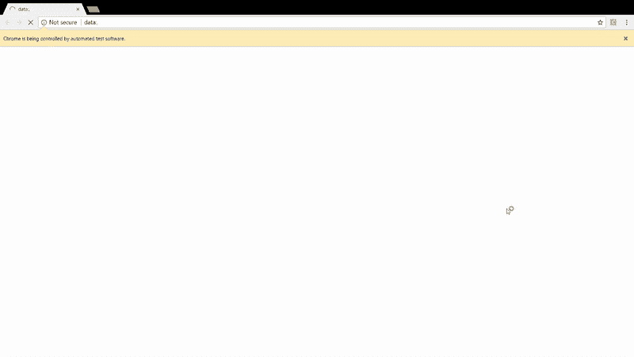

# 用 Python 控制 Web

> 原文：<https://towardsdatascience.com/controlling-the-web-with-python-6fceb22c5f08?source=collection_archive---------0----------------------->


**简单网络自动化的冒险**

**问题:**提交课堂作业需要浏览错综复杂的网页，以至于好几次我都把作业提交错了地方。此外，虽然这个过程只需要 1-2 分钟，但有时它似乎是一个不可逾越的障碍(比如当我晚上很晚才完成一项任务，而我几乎记不起我的密码)。

**解决方案:**使用 Python 自动提交完成的作业！理想情况下，我将能够保存一个任务，键入几个键，并在几秒钟内上传我的工作。起初，这听起来好得难以置信，但后来我发现了 [selenium](https://selenium-python.readthedocs.io/) ，一个可以与 Python 一起使用来为你导航网络的工具。


[Obligatory XKCD](https://xkcd.com/353/)

每当我们发现自己在网上用同样的步骤重复单调乏味的动作时，这是一个编写程序来自动化这个过程的好机会。使用 selenium 和 Python，我们只需要编写一次脚本，然后我们可以多次运行它，避免重复单调的任务(在我的例子中，消除了在错误的地方提交任务的机会)！

在这里，我将介绍我开发的自动(并且正确地)提交作业的解决方案。同时，我们将介绍使用 Python 和 selenium 以编程方式控制 web 的基础知识。虽然这个程序确实有效(我每天都在使用它！)这是非常定制的，所以您不能为您的应用程序复制和粘贴代码。尽管如此，这里的通用技术可以应用于无限多的情况。(如果你想看完整的代码，可以在 GitHub 上找到[)。](https://gist.github.com/WillKoehrsen/127fb3963b12b4f0b339ff0c8ee14558)

# 方法

在我们开始自动化 web 的有趣部分之前，我们需要弄清楚我们解决方案的总体结构。没有计划就直接开始编程是在沮丧中浪费很多时间的一个好方法。我想写一个程序，把完成的课程作业提交到画布上正确的位置(我大学的[“学习管理系统】](https://en.wikipedia.org/wiki/Learning_management_system))。从基础开始，我需要一种方法来告诉程序要提交的作业的名称和类。我采用了一种简单的方法，创建了一个文件夹来存放每门课的已完成作业及其子文件夹。在子文件夹中，我放置了为特定任务命名的完整文档。该程序可以从文件夹中找出类名，并通过文档标题指定名称。

这里有一个例子，类名是 EECS491，作业是“作业 3——大型图形模型中的推理”。



File structure (left) and Complete Assignment (right)

程序的第一部分是一个遍历文件夹的循环，以找到我们存储在 Python 元组中的赋值和类:

```
# os for file management
import os# Build tuple of (class, file) to turn in
submission_dir = 'completed_assignments'dir_list = list(os.listdir(submission_dir))for directory in dir_list:
    file_list = list(os.listdir(os.path.join(submission_dir, 
directory)))
    if len(file_list) != 0:
        file_tup = (directory, file_list[0])

print(file_tup)**('EECS491', 'Assignment 3 - Inference in Larger Graphical Models.txt')**
```

这负责文件管理，程序现在知道要上交的程序和作业。下一步是使用 selenium 导航到正确的网页并上传作业。

## 使用 Selenium 的 Web 控件

为了开始使用 selenium，我们导入这个库并创建一个 web 驱动程序，这是一个由我们的程序控制的浏览器。在这种情况下，我将使用 Chrome 作为我的浏览器，并将驱动程序发送到我提交作业的 Canvas 网站。

```
import selenium# Using Chrome to access web
driver = webdriver.Chrome()# Open the website
driver.get('[https://canvas.case.edu'](https://canvas.case.edu'))
```

当我们打开画布网页时，迎接我们的第一个障碍是一个登录框！要通过这一步，我们需要填写 id 和密码，然后单击登录按钮。



把网络驱动想象成一个从未见过网页的人:我们需要准确地告诉它点击哪里，键入什么，按哪个按钮。有许多方法可以告诉我们的 web 驱动程序要查找什么元素，所有这些方法都使用了选择器。一个[选择器](https://developer.mozilla.org/en-US/docs/Learn/CSS/Introduction_to_CSS/Selectors)是网页上一个元素的唯一标识符。为了找到特定元素的选择器，比如上面的 CWRU ID 框，我们需要检查网页。在 Chrome 中，这是通过按“ctrl + shift + i”或右键单击任何元素并选择“Inspect”来完成的。这带来了 [Chrome 开发者工具](https://developer.chrome.com/devtools)，这是一个非常有用的应用程序，可以显示任何网页下面的 [HTML。](https://www.pathinteractive.com/blog/design-development/rendering-a-webpage-with-google-webmaster-tools/)

为了找到“CWRU ID”框的选择器，我在框中单击鼠标右键，点击“Inspect ”,并在开发工具中看到以下内容。突出显示的行对应于 id box 元素(这一行称为 HTML 标记)。



HTML in Chrome developer tools for the webpage

这个 HTML 可能看起来让人不知所措，但是我们可以忽略大部分信息，只关注`id = "username"`和`name="username"`部分。(这些被称为 HTML 标签的属性)。

要用我们的 web 驱动程序选择 id 框，我们可以使用在开发工具中找到的`id`或`name`属性。selenium 中的 Web 驱动程序有许多不同的方法来选择网页上的元素，并且通常有多种方法来选择完全相同的项目:

```
# Select the id box
id_box = driver.find_element_by_name('username')# Equivalent Outcome! 
id_box = driver.find_element_by_id('username')
```

我们的程序现在可以访问`id_box`，我们可以用各种方式与它交互，比如键入按键，或者点击(如果我们选择了一个按钮)。

```
# Send id information
id_box.send_keys('my_username')
```

我们对密码框和登录按钮执行相同的过程，根据我们在 Chrome 开发者工具中看到的内容来选择它们。然后，我们向元素发送信息，或者根据需要点击它们。

```
# Find password box
pass_box = driver.find_element_by_name('password')# Send password
pass_box.send_keys('my_password')# Find login button
login_button = driver.find_element_by_name('submit')# Click login
login_button.click()
```

登录后，我们会看到这个有点吓人的仪表板:



我们再次需要通过准确指定点击的元素和输入的信息来引导程序浏览网页。在这种情况下，我告诉程序从左边的菜单中选择课程，然后选择与我需要上交的作业相对应的课程:

```
# Find and click on list of courses
courses_button = driver.find_element_by_id('global_nav_courses_link')courses_button.click()# Get the name of the folder
folder = file_tup[0]

# Class to select depends on folder
if folder == 'EECS491':
    class_select = driver.find_element_by_link_text('Artificial Intelligence: Probabilistic Graphical Models (100/10039)')elif folder == 'EECS531':
    class_select = driver.find_element_by_link_text('Computer Vision (100/10040)')# Click on the specific class
class_select.click()
```

程序使用我们在第一步中存储的文件夹的名称找到正确的类。在这种情况下，我使用选择方法`find_element_by_link_text`来查找特定的类。元素的“链接文本”只是我们可以通过检查页面找到的另一个选择器。：



Inspecting the page to find the selector for a specific class

这个工作流程可能看起来有点乏味，但是记住，我们只需要在编写程序的时候做一次！之后，我们可以多次点击 run，程序会为我们导航所有这些页面。

我们使用相同的“检查页面—选择元素—与元素交互”过程来通过几个屏幕。最后，我们到达作业提交页面:



在这一点上，我可以看到终点线，但最初这个屏幕困扰着我。我可以很容易地点击“选择文件”框，但是我应该如何选择我需要上传的实际文件呢？答案非常简单！我们使用选择器定位`Choose File`框，并使用`send_keys`方法将文件的确切路径(在下面的代码中称为`file_location`)传递给该框:

```
# Choose File button
choose_file = driver.find_element_by_name('attachments[0][uploaded_data]')# Complete path of the file
file_location = os.path.join(submission_dir, folder, file_name)# Send the file location to the button
choose_file.send_keys(file_location)
```

就是这样！通过将文件的确切路径发送到按钮，我们可以跳过在文件夹中导航以找到正确文件的整个过程。发送位置后，我们会看到下面的屏幕，显示我们的文件已经上传，可以提交了。



现在，我们选择“提交作业”按钮，点击，我们的作业就上交了！

```
# Locate submit button and click
submit_assignment = driver.find_element_by_id('submit_file_button')
submit_assignent.click()
```



## 清理

文件管理始终是一个关键步骤，我想确保我不会重新提交或丢失旧的任务。我认为最好的解决方案是在任何时候都将提交的单个文件存储在`completed_assignments`文件夹中，并在文件提交后将其移动到`submitted_assignments`文件夹中。最后一段代码使用 os 模块，通过将已完成的赋值重命名为所需的位置来移动它:

```
# Location of files after submission
submitted_file_location = os.path.join(submitted_dir, submitted_file_name)# Rename essentially copies and pastes files
os.rename(file_location, submitted_file_location)
```

所有的后续代码都封装在一个脚本中，我可以从命令行运行这个脚本。为了减少出错的机会，我一次只提交一个作业，这没什么大不了的，因为运行这个程序只需要 5 秒钟。

下面是我启动程序时的样子:



这个程序让我有机会在上传之前确认这是正确的作业。程序完成后，我得到以下输出:


当程序运行时，我可以看到 Python 为我工作:



# 结论

使用 Python 实现 web 自动化的技术对于许多任务都非常有用，无论是一般任务还是我的数据科学领域。例如，我们可以使用 selenium 每天自动下载新的数据文件(假设网站没有 [API](https://en.wikipedia.org/wiki/Application_programming_interface) )。虽然最初编写脚本看起来工作量很大，但好处在于我们可以让计算机以完全相同的方式多次重复这个序列。这个程序将永远不会失去焦点而偏离到 Twitter 上。它将忠实地执行完全一致的一系列步骤(这在网站改变之前非常有效)。

我应该指出，在自动化关键任务之前，您确实需要小心谨慎。这个例子风险相对较低，因为我可以随时返回并重新提交作业，而且我通常会仔细检查程序的工作。网站会改变，如果你不相应地改变程序，你可能会得到一个脚本，它做的事情和你最初想做的完全不同！

就回报而言，这个程序为我每次作业节省了大约 30 秒，而我花了 2 个小时来写。所以，如果我用它来交 240 份作业，那么我就能按时完成了！然而，这个项目的回报是为一个问题设计一个很酷的解决方案，并在这个过程中学到很多东西。虽然我的时间本可以更有效地花在作业上，而不是解决如何自动上交作业，但我非常享受这个挑战。很少有事情像解决问题一样令人满意，而 Python 被证明是一个非常好的工具。

一如既往，我欢迎反馈和建设性的批评。可以通过推特 [@koehrsen_will](http://twitter.com/@koehrsen_will) 联系到我。