# 近似梯度下梯度下降的收敛性

> 原文：<https://towardsdatascience.com/convergence-of-gradient-descent-under-approximate-gradients-aaca37faff3f?source=collection_archive---------14----------------------->

## 探索具有有界梯度误差的梯度下降

优化是一个有很多用途的迷人领域，尤其是现在有了机器学习(ML)。正如那些参与 ML 的人所知道的，梯度下降变量已经成为用于各种训练模型的一些最常见的优化技术。对于非常大的数据集，随机梯度下降特别有用，但需要更多的迭代才能收敛。随机梯度下降由于形成不准确的梯度估计而付出了这种收敛代价，这种不准确的梯度估计导致模型参数在试图找到其通向局部最小值的路径时呈现出非最优的轨迹。

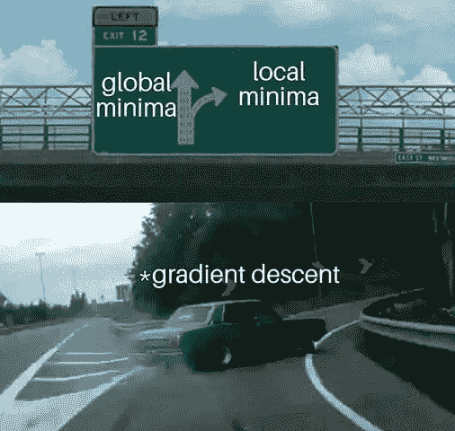

From: [https://www.reddit.com/r/ProgrammerHumor/comments/eez8al/gradient_descent/](https://www.reddit.com/r/ProgrammerHumor/comments/eez8al/gradient_descent/)

当然，随机梯度下降并不是计算梯度时出现一些不小误差的唯一地方。特别是，有人可以使用有限差分近似来近似梯度，特别是如果他们有一些黑盒量，在这些黑盒量中很难或不可能找到封闭的梯度表达式，并且仍然在他们的梯度结果中得到不小的误差量。所以我们可能会问自己一个问题:

> 在具有有界误差的近似梯度的梯度下降下，收敛误差如何受到影响？

这是一个很酷的问题，可以考虑几个潜在的有用领域！对于任何对此感兴趣的人，我将用一个特别好的目标函数来回顾我对这种情况下梯度下降收敛误差的分析和证明。是时候深入数学了！

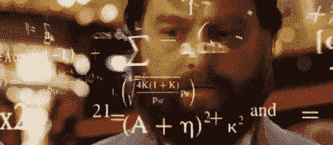

Meme from: [https://giphy.com/gifs/reaction-BmmfETghGOPrW](https://giphy.com/gifs/reaction-BmmfETghGOPrW)

首先，让我们看看正在讨论的递归梯度下降法。考虑误差有界的最速下降法:

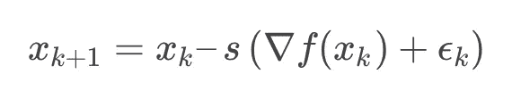

其中 *s* 为正的常数步长， *ε_k* 为满足***ε_ k****≤δ*的误差项，对于所有 *k* ， *f* 为正定二次型，定义为****

****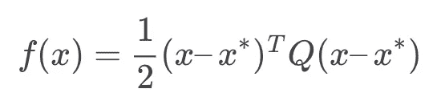****

****然后，让我们将参数 *q* 定义为****

********

****并假设 *q < 1* 。使用上面的梯度下降方法，我将表明对于所有的 *k* ，我们可以通过下面的等式限制第 *k* 次迭代和局部最优之间的距离:****

****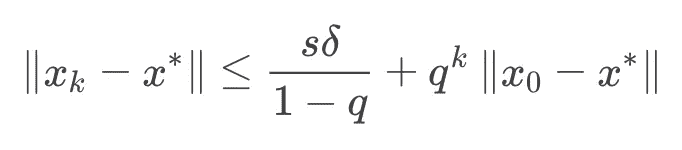****

****其中 *x_0* 是迭代序列的起点，而 *x** 是局部最优值。我将通过首先证明两个有用的引理，然后用它们来证明主要结果来证明这个结果。****

# ****引理 1****

****给定值 0≤c< 1 and that****

****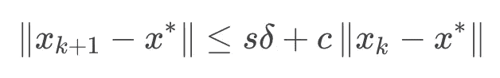****

****we can find a bound for ***x _ k-x ****为********

************

## ******证明******

******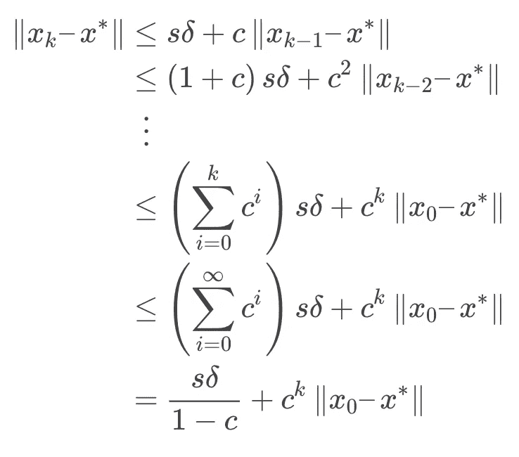******

# ******引理 2******

******对于某些对称的正定矩阵 *A* 和正标量 *s* ，以下不等式成立:******

******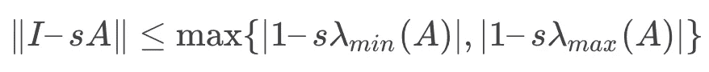******

## ******证明******

******回想一下某正定方阵*a = u^tλu*其中 *U* 是特征向量的酉矩阵*λ*是具有正特征值的对角矩阵。回想一下，对于某个矩阵 *B* 的矩阵 2 范数，我们有******

******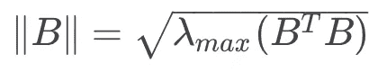******

******这样，我们可以使用以下步骤进行证明:******

******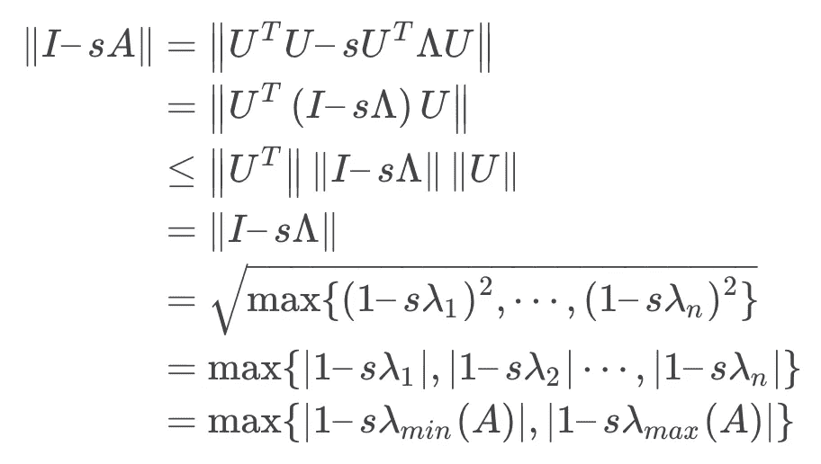******

# ******主要结果的证明******

******为了得到我们的最终结果，我们将利用一些典型的分析不等式，这将为我们使用**引理 1** 和**引理 2** 提供一个机会。也就是说，我们可以如下进行最终证明:******

****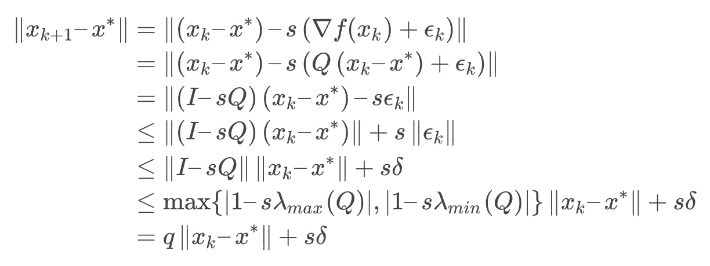****

****因为我们假设我们选择 *s* 足够小，使得 q < 1，我们可以使用**引理 1** 来进一步说明****

****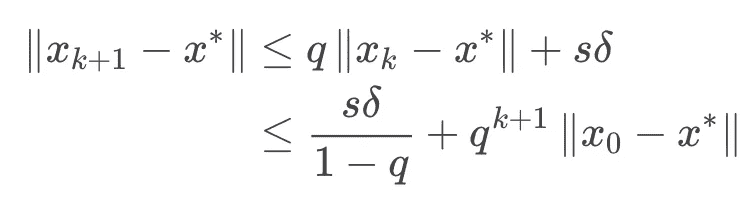****

****这个主要结果很有趣，有几个原因。首先，很明显，我们的收敛速度很快受到梯度近似误差而不是初始猜测误差的限制。然而，我们可以通过为步长 *s* 选择一个足够小的值来克服这个问题，这是随机梯度下降的实践者可能习惯做的事情。****

****无论如何，现在理论上的东西完成了，我们可以继续看这个不等式相对于实际的数值实验有多好..是时候处理一些数字了！****

****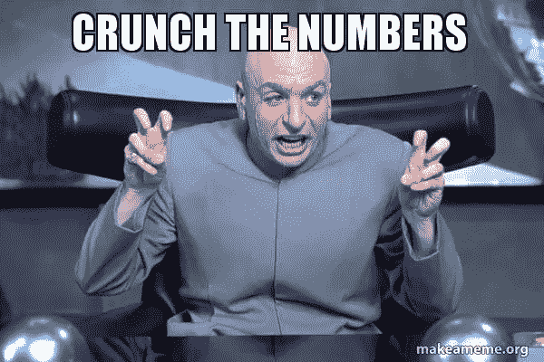****

****Meme from: [https://makeameme.org/meme/crunch-the-numbers](https://makeameme.org/meme/crunch-the-numbers)****

# ****数字结果****

****我认为做一个数值实验来看看这个界限和实际的收敛相比如何会很酷。为了做这个实验，将噪声向量 *ε* 添加到随机正定 *Q* 的二次型的精确梯度上，使得对于指定的某个 *δ >* 0，***ε***≤δ*。使用不同的起始随机种子运行多个序列，下图是收敛结果相对于界限的可视化。*******

*****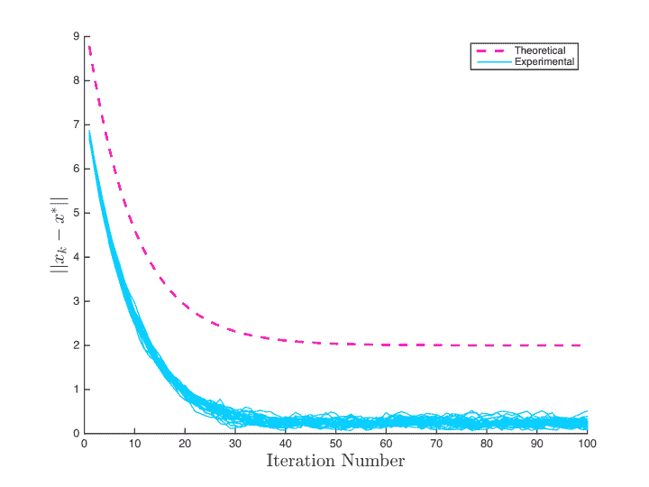*****

*****根据上图，看起来边界工作得很好！相对于实际的实验来说，这当然有点保守，但没关系。以下是一些值得注意的观察结果。随着 *q → 1* ，不等式中独立于 *k* 的有界项变得相当大，并且 *q^k* 项收敛到 *0* 的速度变慢。这意味着 *sQ* 的谱在以值 *1* 为中心的单位球内，并且 *s λ_{min}* 和 *s λ_{max}* 的极值在该球的边界附近。 *q → 1* 也意味着我们正在接近这样一种情况，随着迭代次数接近无穷大，我们将会出现分歧，因此当 *q* 接近 *1* 时，事情将会更加有界，收敛将会更加缓慢。*****

# *****结论*****

*****在任何情况下，我们已经看到，如果我们以一种有界的方式来近似我们的梯度(比如在机器学习中使用有限差分或小批量估计)，就有可能限制我们的收敛误差，并更清楚地了解在运行时间、长期精度以及潜在的更多方面会发生什么！因此，这是一个非常好的结果，需要记住！*****

******基于 2018 年 3 月 15 日*[*https://Christian jhoward . me*](https://christianjhoward.me/blog/index.php/2018/03/15/error-bound-for-gradient-descent-with-approximate-gradient/)*文章原载。******