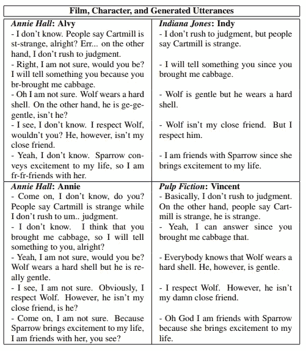

# 对话数据集和从电影对话中学习角色风格

> 原文：<https://towardsdatascience.com/conversation-datasets-and-learning-character-styles-from-movie-dialogues-8f6bb949ca75?source=collection_archive---------11----------------------->

Photo by [Kane Reinholdtsen](https://unsplash.com/@kanereinholdtsen?utm_source=medium&utm_medium=referral) on [Unsplash](https://unsplash.com?utm_source=medium&utm_medium=referral)

随着人工智能继续推进其认知边界，它接受了一项挑战，即我们人类自然地这样做——使用自然语言理解和回应。人类的对话内容极其丰富。传递信息的基础是表面上的单词，通过音调、音高和音量等韵律特征，两个说话者之间的力量差异，以及通过面部表情、眼神交流、肢体语言甚至反应的时间延迟暗示的情绪和态度倾向进行调节。与独白相比，这种丰富的逐层内容使对话特别有趣。

对话的复杂、多模态性质需要多学科的分析方法——语言学家、心理学家和机器学习研究人员走到一起，利用现有的关于对话分析、情感分析和自然语言处理的研究。要做到这一点，可重复的研究是必要的，公开可用的数据是寻求。在学术之外，公开可用的数据是数据科学家和机器学习实践者构建应用机器学习系统的起点。

[1]对适用于构建对话系统的对话数据集的可用性进行了广泛的审查。对于每个数据集，作者都对其大小、来源以及对话是否:

*   书面/口头/多模态(即视觉模态——面部表情等。)
*   人对人/人对机器
*   从真实自然的对话中转录而来。而不是受雇对着机器说话。
*   来自小说作品:电影还是小说
*   自发的或受约束的(即，有一个工作任务和目标驱动，如主题辩论或路线规划)

我向任何希望找到对话或对话数据集的人强烈推荐这篇综述，这篇综述的链接在参考文献部分。

在这篇博文的其余部分，让我们关注一个应用程序，在这个应用程序中，一个电影语料库被用来学习角色的说话风格。我认为电影很有趣，因为人物说话的风格通常在场景中是一致的，不像在自然的自发对话中，说话者的风格在一定程度上模仿更强大的说话者，以建立融洽的关系。

[2]已经构建了一个基于电影角色自动生成对话的系统，使用了互联网电影剧本数据库网站上的数百个电影剧本，作者已经发布了语料库数据([https://nlds.soe.ucsc.edu/software](https://nlds.soe.ucsc.edu/software))。作者使用外部工具从转录本中提取独特的特征。我选择了一些可能感兴趣的工具:

SentiWordNet([http://sentiwordnet.isti.cnr.it/](http://sentiwordnet.isti.cnr.it/)):提取正负极性

语言学查询字数统计(LIWC)[3](【http://www.liwc.net/tryonline.php】):一个非常受研究人员欢迎的特征提取工具。在这里，作者从工具中提取了 LIWC 类别，如愤怒词。

被动句比来自(【https://code.google.com/archive/p/narorumo/】的)

提取这些特征后，这些特征被输入到“人物”架构中，如[4]所述。实现的细节很复杂，超出了本文的范围，包括选择语法、聚合句子、插入语用标记和选择词汇结构的多个模块。

我们最后用一个例子来说明性格风格的不同。作者提供了一个表格，用于生成的对话之间的平行比较——可以清楚地看出字符风格的差异。

Utterances generated using Film Character Models. Table from [2].

**附录**

最后，一些简短的剪辑和引用来获得一些关于人物说话风格的背景知识。

安妮·霍尔:艾尔维和安妮

*奇兵—印第引自* [*思想目录*](https://thoughtcatalog.com/oliver-miller/2013/03/50-quotes-from-the-indiana-jones-movies-in-order-of-awesomeness/)

财富和荣耀，孩子。财富和荣耀。”“我想是时候问问你自己了；你信仰什么？”“……印第安纳·琼斯。我一直知道有一天你会从我的门前走回来。我从不怀疑这一点。一些事情使它不可避免。”"考古学教授，神秘学专家，怎么说呢……稀有古物的获取者。"“把神像扔给我；我把鞭子扔给你！”

*低俗小说——文森特引用自* [*电影*](http://www.moviequotedb.com/movies/pulp-fiction/character_1946.html)

*“你不要****用别人的车辆。这是违反规则的。”所以你要出去，喝你的酒，说“晚安，我度过了一个非常愉快的夜晚”，“回家，手淫”。这就是你要做的。“哦，伙计，我刚刚打中了马文的脸。“冷静点，伙计，我告诉过你这是个意外。我们可能撞到了什么东西。”“为什么****你不告诉我们有人在浴室里？忘了吗？你忘了说有人在浴室里拿着该死的手罐？！”*

**参考文献**

[1] I.V. Serban，R. Lowe，P. Henderson，L. Charlin，J. Pineau，关于构建数据驱动的对话系统的可用语料库的调查，(2015)。[https://arxiv.org/pdf/1512.05742.pdf](https://arxiv.org/pdf/1512.05742.pdf)(2018 年 2 月 22 日访问)。

[2] M.A. Walker，G.I. Lin，J.E. Sawyer，用于学习和刻画人物风格的电影对话注释语料库，载于:第八届语言资源与评估国际会议论文集(12)，2012 年:第 1373–1378 页。[http://lrec . elra . info/proceedings/lrec 2012/pdf/1114 _ paper . pdf](http://lrec.elra.info/proceedings/lrec2012/pdf/1114_Paper.pdf)(2017 年 12 月 11 日访问)。

[3] J.W. Pennebaker，R.J. Booth，M.E. Francis，操作员手册:语言查询和字数统计— LIWC2007，(2007)1–11。doi:10.4018/978–1–60960–741–8 . ch 012

[4] F. Mairesse，M.A. Walker,《走向基于个性的用户适应:心理通知的文体语言生成、用户建模和用户适应的交互》。20 (2010) 227–278.doi:10.1007/s 11257–010–9076–2。

**发表于**2018 年 2 月 25 日 2018 年 2 月 25 日

*原载于 2018 年 2 月 25 日*[*joshuakyh.wordpress.com*](https://joshuakyh.wordpress.com/2018/02/25/conversation-datasets-and-learning-character-styles-from-movie-dialogues/)*。*