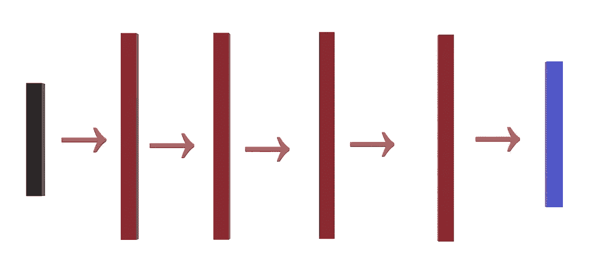
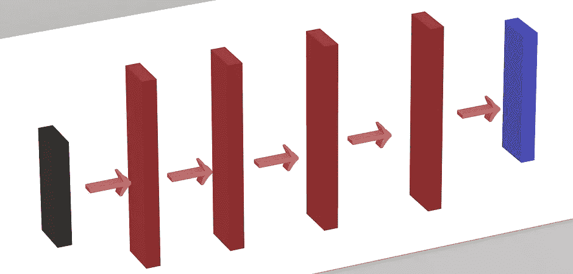
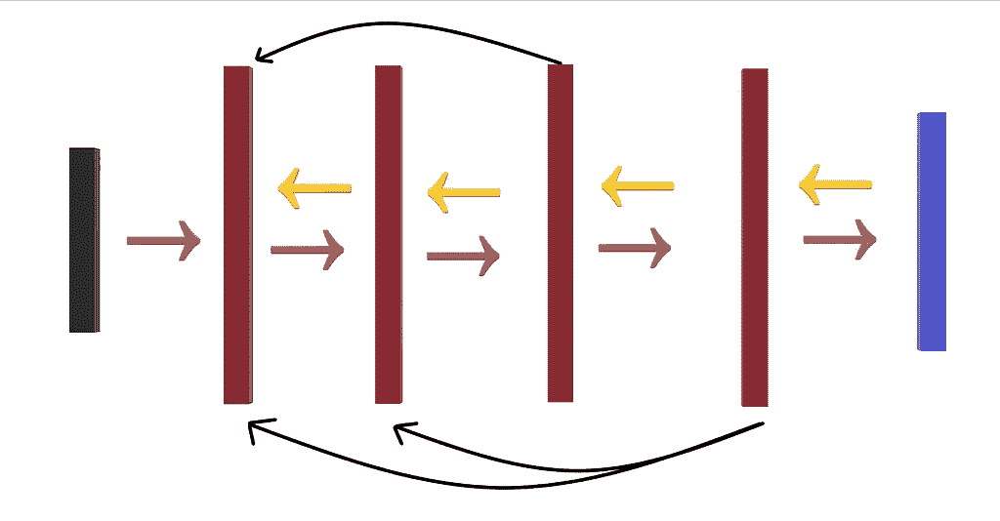
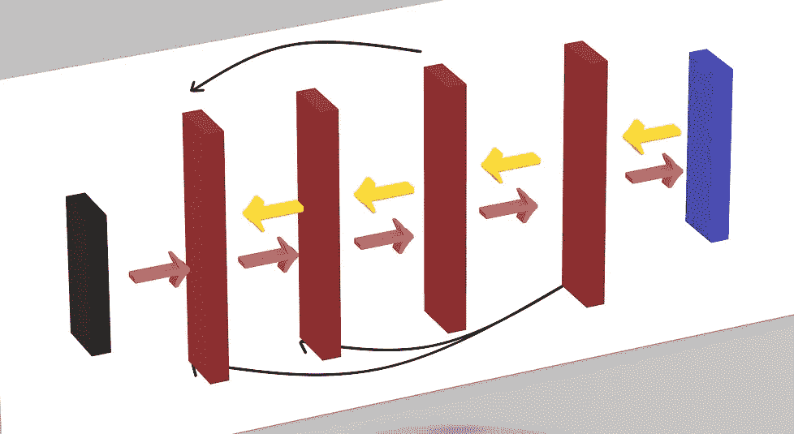
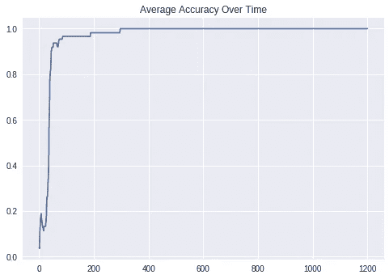
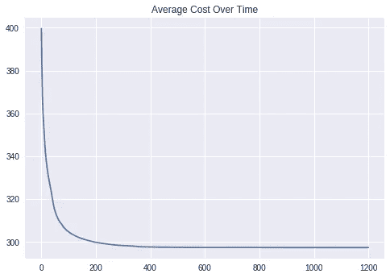
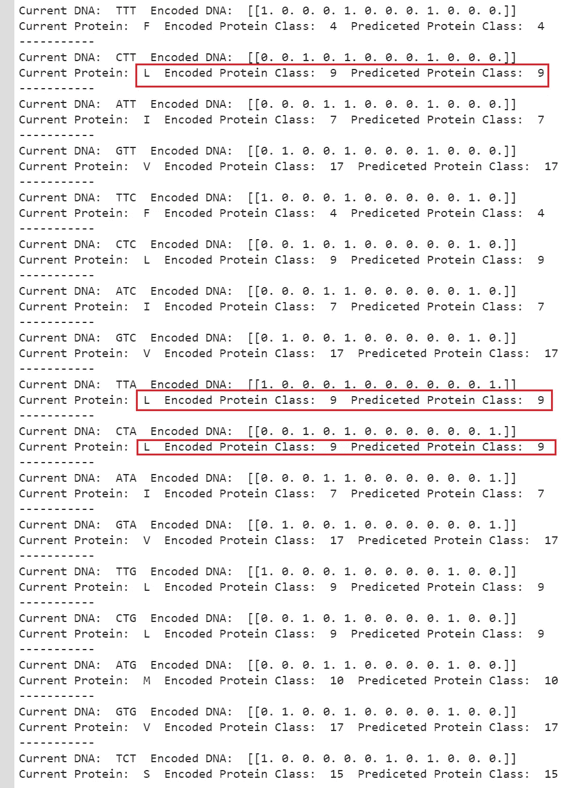
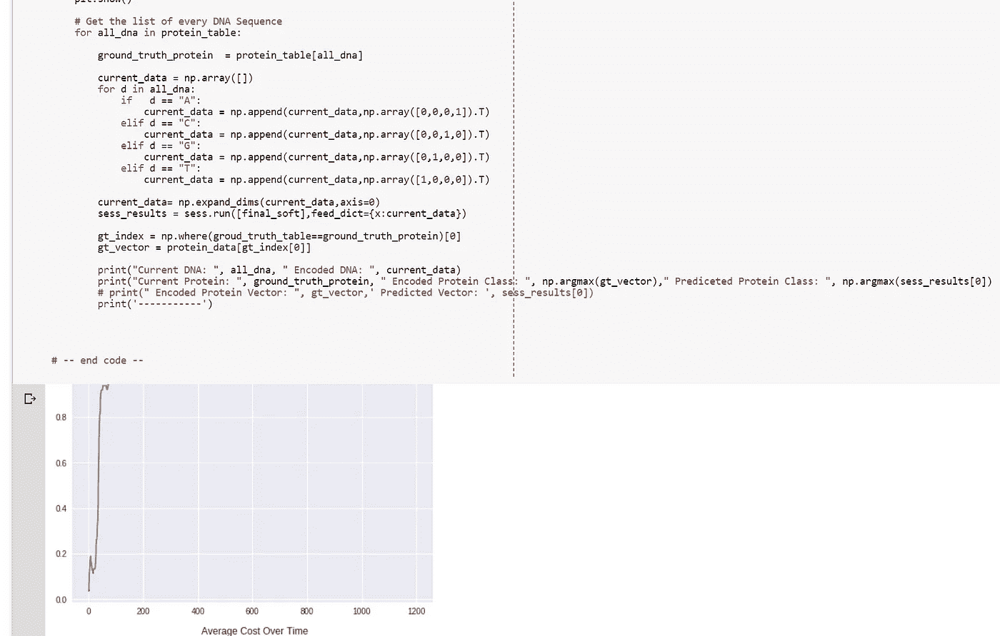

# 使用具有交互代码的深度神经网络将 DNA 序列转换为蛋白质序列[带 TF 的手动 Back Prop

> 原文：<https://towardsdatascience.com/converting-dna-sequence-to-protein-sequence-using-deep-neural-network-with-interactive-code-manual-16d41e1304a7?source=collection_archive---------3----------------------->

Image from [pixabay](https://pixabay.com/en/molecule-cell-biology-molecular-2082634/)

所以今天，我将继续我的机器学习生物信息学之旅。我将尝试完成生物信息学中最基本的任务，即将 DNA 序列转换成蛋白质。同样，这也使任务复杂化了，我们可以建立一个字典来映射这些值，就像[的](/starting-off-in-bioinformatics-turning-dna-sequences-into-protein-sequences-c771dc20b89f)帖子中的[Vijini mallawarachchi](https://towardsdatascience.com/@vijinimallawaarachchi?source=post_header_lockup)所做的那样。

另外，请注意，我们将把 DNA /蛋白质序列预处理成载体，如果你不知道如何去做，请见这个[帖子](/dna-protein-representation-for-machine-learning-task-with-interactive-code-6aa065b69227)。

最后，我将执行[扩张反向传播](https://hackernoon.com/only-numpy-dilated-back-propagation-and-google-brains-gradient-noise-with-interactive-code-3a527fc8003c)来训练我们的网络。

**网络架构和前馈操作**

**黑色向量→** 编码的 DNA 序列数据
**红色向量** →我们的网络中每一层都有 4 层(50 个神经元)
**蓝色向量** →软 Max 层进行多类分类
**粉粉？箭头** →标准前馈操作

如上所述，前馈操作没有什么特别的，非常简单的全连接神经网络。此外，我们将有 50 个神经元在每一层。

**反向传播操作**

**黄色箭头** →标准梯度流
**黑色弯箭头** → [反向传播的扩张连接](https://hackernoon.com/only-numpy-dilated-back-propagation-and-google-brains-gradient-noise-with-interactive-code-3a527fc8003c)

如上所述，训练过程也非常简单，只是标准的反向传播与每隔一层的一些扩张连接，以形成密集连接。

**培训结果**

**左图** →一段时间内的平均精度
**右图** →一段时间内的成本

因此，对于 1201 epoch，我们将跟踪我们的网络运行情况，如上所述，最终它能够达到 100%的准确性。

**将 DNA 序列转换成蛋白质**

**红框** →模型预测 DNA 序列 CTT/TTA/CTA 属于第 9 类或蛋白质“L”

训练完成后，我们将把每个 DNA 序列交给模型，告诉它预测它属于哪个类别，如上所述，它正在正确地预测每个类别。我们可以通过下面的图表来验证结果。

Genetic Code Chart for DNA ([http://www.geneinfinity.org/sp/sp_gencode.html](http://www.geneinfinity.org/sp/sp_gencode.html))

**互动码**

*我搬到了谷歌 Colab 寻找交互代码！所以你需要一个谷歌帐户来查看代码，你也不能在谷歌实验室运行只读脚本，所以在你的操场上做一个副本。最后，我永远不会请求允许访问你在 Google Drive 上的文件，仅供参考。编码快乐！*

要访问代码[,请点击此处。](https://colab.research.google.com/drive/1xHd821DcCOwJnFq-leQZpP5pUTItz6vR)

**遗言**

将 DNA 转换成蛋白质可以通过使用字典来简单地完成，然而我只是想尝试一下。

如果发现任何错误，请发电子邮件到 jae.duk.seo@gmail.com 给我，如果你想看我所有写作的列表，请在这里查看我的网站。

与此同时，请在我的 twitter [这里](https://twitter.com/JaeDukSeo)关注我，并访问[我的网站](https://jaedukseo.me/)或我的 [Youtube 频道](https://www.youtube.com/c/JaeDukSeo)了解更多内容。如果你感兴趣的话，我还做了解耦神经网络的比较。

**参考**

1.  numpy 中的字符 Int 转换。(2018).要点。检索于 2018 年 3 月 6 日，来自[https://gist.github.com/tkf/2276773](https://gist.github.com/tkf/2276773)
2.  印刷，第 2018 页。python:水平打印，而不是当前的默认打印。Stackoverflow.com。检索于 2018 年 3 月 6 日，来自[https://stack overflow . com/questions/8437964/python-printing-horizontally-而非-current-default-printing](https://stackoverflow.com/questions/8437964/python-printing-horizontally-rather-than-current-default-printing)
3.  从生物信息学开始——将 DNA 序列转化为蛋白质序列。(2017).走向数据科学。检索于 2018 年 3 月 6 日，来自[https://towards data science . com/starting-off-in-bio informatics-turning-DNA-sequences-into-protein-sequences-c 771 DC 20 b 89 f](/starting-off-in-bioinformatics-turning-dna-sequences-into-protein-sequences-c771dc20b89f)
4.  范围？，H. (2018)。如何将数据归一化到 0–1 范围？。Stats.stackexchange.com。2018 年 3 月 7 日检索，来自[https://stats . stack exchange . com/questions/70801/how-to-normalize-data-to-0-1-range](https://stats.stackexchange.com/questions/70801/how-to-normalize-data-to-0-1-range)
5.  TF . reset _ default _ graph | tensor flow(2018).张量流。检索于 2018 年 3 月 10 日，来自[https://www . tensor flow . org/API _ docs/python/TF/reset _ default _ graph](https://www.tensorflow.org/api_docs/python/tf/reset_default_graph)\
6.  具有交互式代码的机器学习任务的 DNA /蛋白质表示。(2018).走向数据科学。检索于 2018 年 3 月 10 日，来自[https://towards data science . com/DNA-protein-representation-for-machine-learning-task-with-interactive-code-6aa 065 b 69227](/dna-protein-representation-for-machine-learning-task-with-interactive-code-6aa065b69227)
7.  数组？，I. (2018)。有没有 Numpy 函数返回数组中某个东西的第一个索引？。Stackoverflow.com。检索于 2018 年 3 月 10 日，来自[https://stack overflow . com/questions/432112/is-there-a-numpy-function-to-return-the-first-index-of-something-in-a-a-array](https://stackoverflow.com/questions/432112/is-there-a-numpy-function-to-return-the-first-index-of-something-in-an-array)
8.  NumPy . arg max—NumPy 1.13 版手册。(2018).Docs.scipy.org。检索于 2018 年 3 月 10 日，来自[https://docs . scipy . org/doc/numpy-1 . 13 . 0/reference/generated/numpy . arg max . html](https://docs.scipy.org/doc/numpy-1.13.0/reference/generated/numpy.argmax.html)
9.  遗传密码。(2018).Geneinfinity.org。检索于 2018 年 3 月 10 日，来自[http://www.geneinfinity.org/sp/sp_gencode.html](http://www.geneinfinity.org/sp/sp_gencode.html)