# 将中型文章转换为博客的降价文章

> 原文：<https://towardsdatascience.com/converting-medium-posts-to-markdown-for-your-blog-5d6830408467?source=collection_archive---------7----------------------->


([Source](https://www.pexels.com/photo/light-nature-sky-water-133682/))

## 如何快速导出中型文章到你的博客

如果你像我一样，开始在 Medium 上写博客，但也想建立自己的网站来展示你的文章，你需要一种方法将文章从 Medium 转移到 Markdown 语言。Markdown 是一种轻量级语言，旨在被转换成 HTML 格式用于网络，有几个工具可以让你从现有的中型文章转为博客的 Markdown。

(如果你还没有博客，那么就按照[这个指南](https://medium.com/p/fd0b43cbd886?source=your_stories_page---------------------------)使用 Jekyll 和 GitHub 页面在五分钟内建立你自己的网站。)

## 中等至降价工具

有一个 [Chrome 扩展](https://chrome.google.com/webstore/detail/convert-medium-posts-to-m/aelnflnmpbjgipamcogpdoppjbebnjea)和一个[命令行工具](https://www.npmjs.com/package/medium-to-markdown)用于将你的中型帖子进行降价。不幸的是，我发现 Chrome 扩展不可靠，如果它真的工作，它会产生许多格式错误，需要纠正。

如果你能让 chrome 扩展正常工作，而你不习惯命令行，那么这可能是你最好的选择。然而，我发现命令行工具更适合我的使用，因为它每次都能工作，而且运行后需要对文本进行的重新调整更少。

## 在命令行上使用中到低

[medium-to-markdown 命令行](https://www.npmjs.com/package/medium-to-markdown)包是用 Javascript 编写的，这意味着你需要`node`来运行和`npm`来安装这个包。如果你在 Windows 上，使用[这个页面](https://nodejs.org/en/)来安装两者(大约需要 3 分钟)。然后，使用`npm install medium-to-markdown`安装软件包。您需要运行的实际脚本可以在这里找到，如下所示。

Medium to Markdown JS script

要运行，将脚本保存为`medium-to-markdown.js`，将`"<medium post url">`更改为您发布的文章的地址，并在命令行键入`node medium-to-markdown.js`(确保脚本在您的目录中。

这将在您的控制台中输出整篇文章作为 Markdown。要将输出重定向到一个文件，您可以键入`node medium-to-markdown.js >> file.md`。如果您的博客使用 GitHub Pages + Jekyll，您会希望将存储库的`_posts/`目录中的`md`文件保存为`date-title.md`。比如我的[最新贴档](https://github.com/WillKoehrsen/willkoehrsen.github.io/tree/master/_posts)是`_posts/2018-09-16-Five-Minutes-to-Your-Own-Website.md`。一旦文章被转换成正确命名的 Markdown 文件，就可以通过将存储库推送到 GitHub 来发布。

就我个人而言，我发现手动重命名文件的过程很繁琐，所以我编写了一个 Python 脚本，该脚本接受一篇已发布的媒体文章的 url 和日期，用该 url 调用`medium-to-markdown.js`转换脚本，并用正确的文件名保存结果 markdown。该脚本可以在[这里](https://github.com/WillKoehrsen/willkoehrsen.github.io/blob/master/_posts/medium_to_markdown.py)找到，命令行用法如下:

Command line usage of Python script for converting medium to Markdown.

总的来说，运行脚本需要 15 秒，网站更新大约需要 5 分钟！去你的博客看看这篇文章。

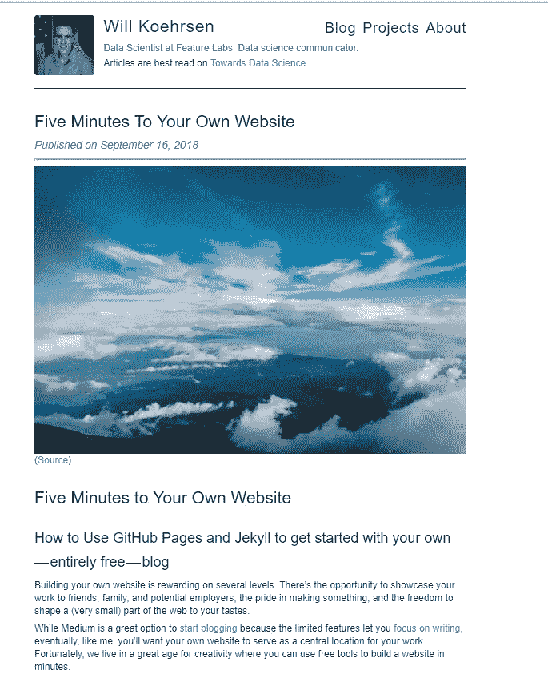

Website after pushing changes to GitHub.

# 常见问题的解决方案

Chrome 扩展和命令行工具都会在 Markdown 中产生一些小问题，您必须解决这些问题。我在[散文在线编辑器](http://prose.io)中完成所有的编辑工作，并喜欢并排调出编辑器和原始媒体文章。(我也经常在我的博客上使用 Chrome 开发工具——右键和`inspect`——来调整 css 并立即看到变化。)

以下是我注意到的一些问题以及如何解决它们。我将假设你正在为你的博客使用 GitHub Pages 和 Jekyll(按照[这个指南开始使用](https://medium.com/p/fd0b43cbd886?source=user_profile---------2------------------)),尽管这些技巧可能适用于其他框架。这些解决方案并不详尽，所以如果你遇到更多的问题，请在评论或 Twitter 上告诉我。

## 图像标题

正如你在上面看到的，默认的 Markdown 转换在图片下方左对齐显示图片标题。要使标题居中，请将以下内容添加到您的`styles.scss`文件中(在存储库根目录中):

```
// Captions for images
img + em {
    font-style: italic;
    font-weight: 600;
    margin-bottom: 20px;
    margin-top: 8px;
    display: block;
    text-align: center;
    font-size: 14px;
    color: black;
}
```

然后，在 Markdown 本身中，将标题文本从顶部显示的默认文本更改为底部显示的文本。确保标题在单独的*行上:*

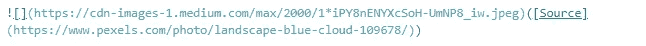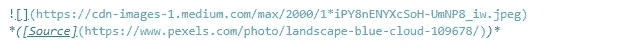

标题现在将在图像下方居中。


Caption centered below image.

如果您不喜欢这种样式，请更改上面列出的 css。

## 并排图像

要在 markdown 中并排呈现图像[，可以使用两列表格。](https://stackoverflow.com/a/24320279/5755357)

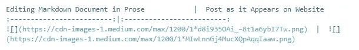

我发现你必须包含标题，否则表格不能正确显示。有几个其他的选项，但是这个桌子很好用。

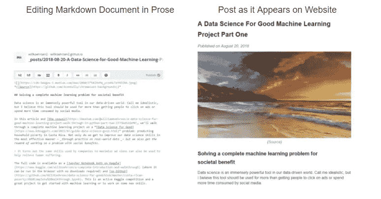

Side by Side Images using a table

这里是表格的空白代码，所以只需替换`image_link`和`header`:

```
Header Left |  Header Right
:--------:|:-------:
  |  
```

## 代码块

如果你写了很多关于编程的东西，那么你希望你的代码看起来很棒！幸运的是，与 on Medium 不同，您可以使用语法突出显示来使您的代码块在您的博客上突出显示。Jekyll 原生支持[胭脂语言荧光笔](http://rouge.jneen.net/)，它有许多风格可供选择(查看它们[在这里](https://spsarolkar.github.io/rouge-theme-preview/))。

在文章的降价中，使用*反斜线*将代码块括起来，并指定高亮显示的语言:

```
```python
from sklearn.ensemble import RandomForestClassifier 
# Create the model with 100 trees
model = RandomForestClassifier(n_estimators=100,                                                     
                               bootstrap = True,                              
                                max_features = 'sqrt')
# Fit on training data
model.fit(train, train_labels)
```
```

默认语法突出显示如下:

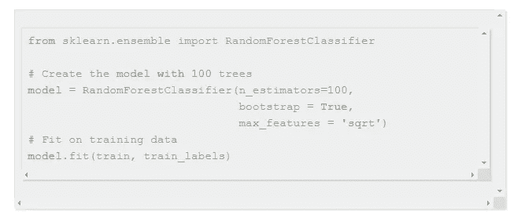

Default Python syntax highlighting with Rouge

使用自定义主题，突出显示如下:

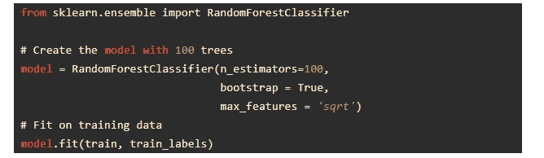

Custom Python syntax highlighting

要设置你自己的代码主题，参考[这篇文章](https://bnhr.xyz/2017/03/25/add-syntax-highlighting-to-your-jekyll-site-with-rouge.html)，或者如果你喜欢我的样子，你可以将我的代码样式表`code-highlighting.scss` ( [链接](https://github.com/WillKoehrsen/willkoehrsen.github.io/blob/master/_sass/_code-highlighting.scss))复制粘贴到你的`_sass/`目录中。然后更改`style.scss`中的行`@import “highlights”`到`@import “code-highlighting"`(这应该在底部附近)来导入新的样式。

## GitHub Gists

我的媒体帖子的另一个常见部分是 GitHub gists。为了在你的文章中恰当地展示这些，首先转到原始的中型文章，右击要点，然后选择`inspect frame`。

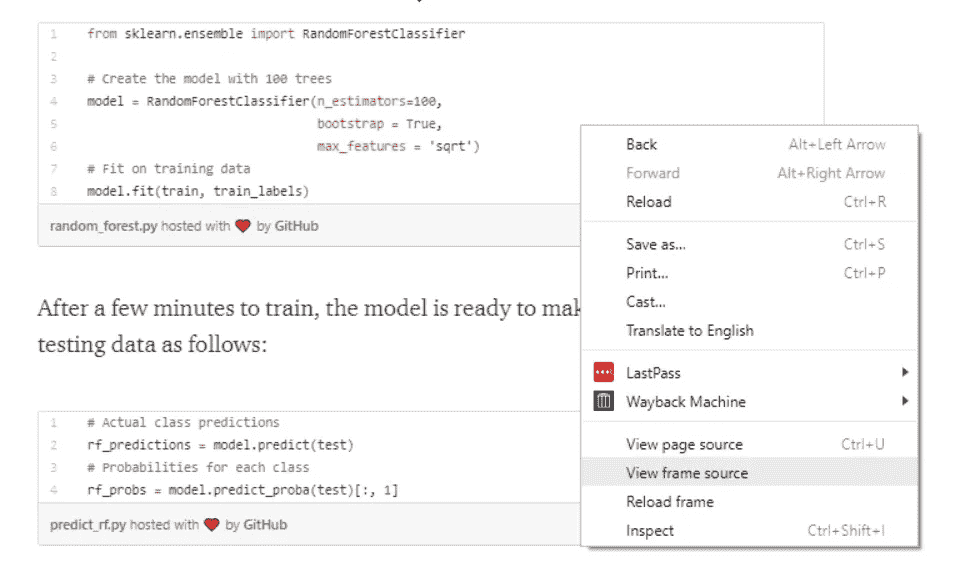

这将显示一页看起来难以理解的代码。然而，你需要做的就是复制`<script>`标签之间的内容，如下所示:

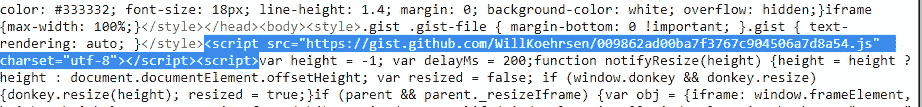

简单地复制这一行并粘贴到如下所示的 Markdown 中，它就会正确地呈现在你的博客上。

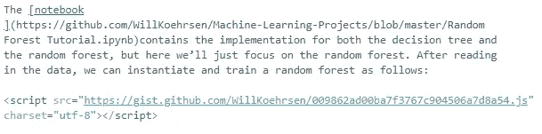

GitHub Gist in Markdown

当然，像你的网站上的任何其他元素一样，你可以用 css 来设计你喜欢的样式！

## 帖子摘录

默认情况下，Jekyll 只会在你的博客主页上显示文章的第一段，并有一个显示“阅读更多”的按钮来访问其余部分。如果你的帖子顶部有一张图片，这将是所有显示的内容。


Default excerpt shown on blog home page

要扩展摘录，在`_config.yaml`中添加以下一行:

```
# Specifies end of excerpt
excerpt_separator: <!--more-->
```

然后将`<!--more-->` 标签放在 post markdown 中您希望摘录结束的地方。

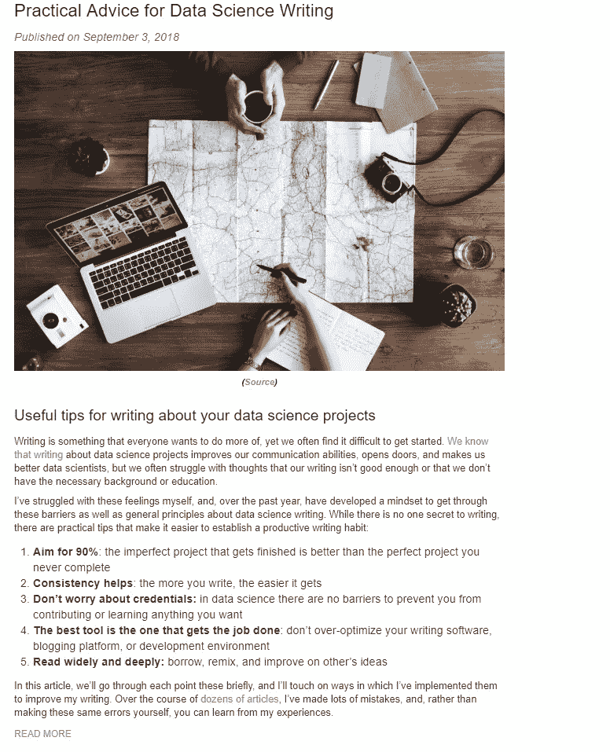

Specifying extent of post excerpt in Markdown (left) and how it looks on my website (right).

## 其他注意事项

还有很多选择我没有探索。如果你想在你的博客上做点什么，很有可能有一种方法可以做到。例如，你可以通过创建一个 Disqus 账户并将其添加到你的`_config.yaml`文件中来为你的所有帖子添加评论。如果你有很多文章，并且想要限制出现在一个页面上的数量，你也可以在配置文件中使用`pagination`([指令](https://jekyllrb.com/docs/pagination/))来指定。

建立一个网站是令人兴奋的，因为你可以让它看起来像你想要的那样！虽然对大多数人来说这可能不令人惊讶，但我仍然很感激当我对我的网站进行小的更新时，我可以在网上看到我想要的变化。你无法想象当我终于在我的 about 页面上运行了一个实时代码编辑器时，我是多么的热情！在一天结束的时候，是的，建立一个网站是为了让世界看到你自己，但也是为了对你创造的东西感到自豪。

# 结论

使用命令行工具可以快速地从一篇现有的中型文章转到 [Markdown](https://daringfireball.net/projects/markdown/syntax) 。在转换为 Markdown 后，有几个小错误需要解决，但这也给了你机会来定制你想要的帖子。

如果你仍然有任何问题，看看我的[网站库](http://github.com/willkoehrsen/willkoehrsen.github.io)，看看你是否能在那里找到解决方案，或者与我联系。此外，如果你发现你可以用 Jekyll 博客做一些很酷的事情，我很乐意听听。现在出去开始写吧。

一如既往，我欢迎评论和建设性的批评。可以通过推特 [@koehrsen_will](http://twitter.com/@koehrsen_will) 或者通过我的网站 [willk.online](http://willk.online) 找到我