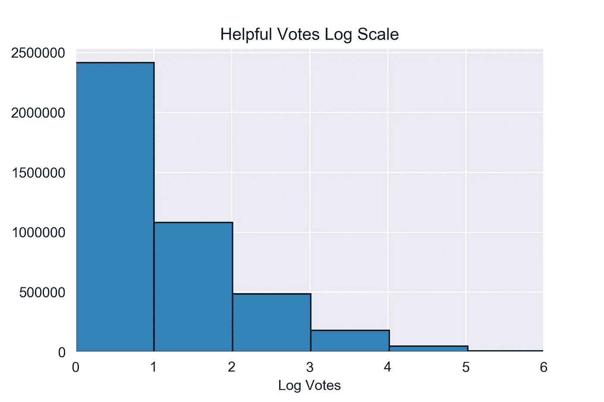

# 将拇指向上/拇指向下转换为完整偏斜度的百分位数

> 原文：<https://towardsdatascience.com/converting-thumbs-up-thumbs-down-to-percentiles-with-skewness-intact-5ee70574a694?source=collection_archive---------22----------------------->

## 用 Python 写亚马逊书评


拇指向上/拇指向下的度量标准已经变得非常流行。它在 YouTube、亚马逊和其他网站上被用来获取用户和产品信息。该指标简单、有用且有吸引力。

当我为我的女儿搜索蹒跚学步的视频时，我得到了 50 万个赞成和 30 万个反对的视频。这些视频并不特别令人印象深刻。我希望它们能以另一种方式分类。

百分比和投票计数提供了不同的数据显示方式。百分比必须在 0 到 1 之间，而投票通常在 0 到无限的范围内。将选票转换成 0 到 1 之间的百分位数可以将这些系统结合起来。

我以前写过一篇关于 Medium 的文章，强调了转换倾斜数据的标准方法。在那篇文章中，我讨论了流行方法的优点和缺点，所以我不会在这里讨论它们。

相反，我提出了一个原始的分段线性函数，它将偏斜的数据转换成偏斜度不变的百分位数。



Base e distribution. Graph taken from Corey Wade’s [Helpful Reviews: Exploratory Data Analysis](https://github.com/coreyjwade/Helpful_Reviews/blob/master/Helpful_Reviews_Exploratory_Data_Analysis.ipynb).

一般来说，大多数拇指朝上/拇指朝下的系统都是右偏的。大多数样本只获得几票，而受欢迎的样本可能获得高出 10 个数量级的投票。离群值可能远远超过第 99 百分位，正如[亚马逊书评“有用投票”的情况](https://github.com/coreyjwade/Helpful_Reviews)

## 有益的投票

```
In[1]:df.Helpful_Votes.describe()Out[1]:count    4.756338e+06
mean     5.625667e+00
std      2.663631e+01
min      0.000000e+00
25%      1.000000e+00
50%      2.000000e+00
75%      4.000000e+00
max      2.331100e+04
```

数百万个数据点，从 4 到 23311 的跳跃是惊人的。

将该数据转换成有意义的百分位数可以通过如下分段线性函数来完成:

1.  选择多个透视来分隔数据。
2.  使用日志空间划分数据。
3.  对于每个枢纽，x 值是投票数，y 值是百分位数。
4.  用直线连接相邻的(x，y)点。

作为一个简单的例子，考虑 5 个线性枢轴。(我们很快就会到达 logspace。)我需要第 0、25、50、75 和 100 百分位的点。上表给出了以下分布情况:

(0，0)、(1，0.25)、(2，0.5)、(4，0.75)和(2311，1)。

接下来，我用一条直线连接这些点。这听起来可能微不足道，但是除以 0 是有问题的。相同的 x 值将产生 0 个分母。出于计算目的，非常陡的斜率就足够了。

## 直线函数

```
In[2]:*# Define line from two points and a provided column*
def two_points_line(a, b, column):

    *# Case when y-values are the same*
    if b[1]==a[1]:

        *# Slope defaults to 0*
        slope = 0

    *# Case when x-values are the same*
    elif b[0]==a[0]:

        *# Case when max value is less than 999999999*
        if column.max() < 999999999:

            *# Add 999999999 to max value*
            slope = column.max() + 999999999

        *# All other cases*
        else:

            *# Multiply max value by itself (greater than 999999999)*
            slope = column.max() * column.max()

    *# When x-values and y-values are not 0*
    else:

        *# Use standard slope formula*
        slope = (b[1] - a[1])/(b[0]-a[0])

    *# Equation for y-intercept (solving y=mx+b for b)*
    y_int = a[1] - slope * a[0]

    *# Return slope and y-intercept*
    return slope, y_int
```

当连接(4，0.75)到(2311，1)时，结果是一条很长的水平线。大多数数据点将聚集在 0.75 附近，导致数据比以前更加倾斜。

日志空间和更多的枢轴帮助极大。

在为日志空间做准备时，让我们回顾一下 linspace。假设我们想把 0 到 100 分成 5 个单位区间。快捷键不是写 0，5，10，…，100，而是 linspace。

## 林空间

```
In[3]:*# Split the numbers between 0 and 100 into 21 evenly spaced points* np.linspace(0,100,21)Out[3]:array([  0., 5., 10., 15.,  20.,  25.,  30.,  35.,  40.,  45.,  50.,
        55.,  60.,  65.,  70.,  75.,  80.,  85.,  90.,  95., 100.])
```

Logspace 返回对数刻度上间隔均匀的数字。每个端点需要 10 的次方。对于结束于 100 的对数间隔段，我们需要 2 作为上限。

## 日志空间

```
In[4]:*# Split the numbers between 0 and 100 into 21 logspace points* np.logspace(0, 2, 21)Out[4]:array([  1\.      ,   1.25892541,   1.58489319,   1.99526231,
         2.51188643,   3.16227766,   3.98107171,   5.01187234,
         6.30957344,   7.94328235,  10\.        ,  12.58925412,
        15.84893192,  19.95262315,  25.11886432,  31.6227766 ,
        39.81071706,  50.11872336,  63.09573445,  79.43282347,
       100\.        ])
```

日志空间最初看起来更适合左侧倾斜的数据。这很容易通过从 101 中减去每个点并颠倒顺序来补救。

## 反向对数空间

```
In[5]:*# Create logspace*
left_logspace = np.logspace(0, 2, 21)*# Reverse logspace*
right_logspace = 101 - left_logspace*# Reverse array to ascending order*
percent_array = right_logspace[::-1]*# Display results*
percent_arrayOut[5]:array([  1\.        ,  21.56717653,  37.90426555,  50.88127664,
        61.18928294,  69.3772234 ,  75.88113568,  81.04737685,
        85.15106808,  88.41074588,  91\.        ,  93.05671765,
        94.69042656,  95.98812766,  97.01892829,  97.83772234,
        98.48811357,  99.00473769,  99.41510681,  99.74107459,
       100\.        ])
```

好多了。

对于“有帮助的投票”列，偏斜度远远超过了第 99 个百分点。经过一些反复试验，我选择了 50 个 logspace 段(51 个点)。

## 有用的投票日志空间枢轴

```
percents= [  1\. 9.79891606  17.82362289  25.1422425   31.81690291
  37.90426555  43.45600627  48.51925398  53.13699077  57.34841678
  61.18928294  64.69219452  67.88688785  70.8004828   73.45771297
  75.88113568  78.09132347  80.10703869  81.94539282  83.62199171
  85.15106808  86.54560229  87.81743261  88.97735565  90.03521804
  91\.          91.87989161  92.68236229  93.41422425  94.08169029
  94.69042656  95.24560063  95.7519254   96.21369908  96.63484168
  97.01892829  97.36921945  97.68868879  97.98004828  98.2457713
  98.48811357  98.70913235  98.91070387  99.09453928  99.26219917
  99.41510681  99.55456023  99.68174326  99.79773557  99.9035218
 100\.  ]pivots= [0.0, 0.0, 1.0, 1.0, 1.0, 1.0, 1.0, 2.0, 2.0, 2.0, 2.0, 3.0, 3.0, 4.0, 4.0, 4.0, 5.0, 6.0, 6.0, 7.0, 8.0, 9.0, 9.0, 10.0, 11.0, 12.0, 14.0, 15.0, 16.0, 18.0, 19.0, 21.0, 23.0, 25.0, 28.0, 30.0, 33.0, 36.0, 40.0, 44.0, 48.0, 54.0, 60.0, 67.0, 77.0, 89.0, 104.0, 126.0, 163.0, 243.0, 23311.0]
```

枢轴现在展开得很漂亮！如果我使用 linspace，分布应该是[0，0，0，0，0，…，14，17，24，42，23311]。

在分享返回这些结果的函数之前，我想回顾一下总体思路。

竖起大拇指，不竖起大拇指的系统通常会导致数据向右倾斜。该数据可以通过保持偏斜度不变的分段线性函数转换为 0 到 1 之间的值。选择枢纽数，用 logspace 划分数据，取 x 值为票数，y 值为百分位数，用直线连接相邻点。

编码快乐！

## 偏斜线性函数

```
In[6]:*# Import essentials*
import pandas as pd
import numpy as np
import matplotlib.pyplot as plt

*# Show all plots in cells*
%matplotlib inline*# Transform skewed column into piecewise linear function by choosing number of segments*def skewed_to_linear(num_segments, column, logspace=True, rightSkew=True, show_graph=True, print_arrays=True, nonNegative=True):

    *# GET PIVOTS AND PERCENTILES*
    *#********************************************************************

    *# Number of pivots equals number of segments plus 1*
    num_pivots = num_segments + 1

    *# Last index equals number of segments*
    last_index = num_segments

    *# By default, logspace is True*
    if logspace:

        *# Create array of percents between 1 and 100 with log base 10 intervals*
        percents_array = np.logspace(0,2,num_pivots)

        *# By default, rightSkew is True*
        if rightSkew:

            *# Stack array with more values closer to 100* 
            backwards_array = 101 - percents_array

            *# Reverse array to standard ascending order*
            percents_array = backwards_array[::-1]

    *# If logspace is False*
    else:

        *# Linspace divides 0 and 100 into even segments*
        percents_array = np.linspace(0, 100, num_pivots)

    *# Create array of pivots*
    pivots_array = []

    *# Loop over percents_array*
    for i in percents_array:

        *# Obtain value for each percentile*
        pivot = np.percentile(column, i)

        *# Add each value to pivots_array*
        pivots_array.append(pivot)

    *# By default, print_arrays is False*
    if print_arrays:

        *# Display array of percents*
        print('percents=',(percents_array))

        *# Display corresponding array of pivots*
        print('pivots=',(pivots_array))

    *# Convert percents_array from integers to decimals (75 becomes 0.75)*
    percents_array = percents_array/100

    *# GET SLOPES AND Y-INTERCEPTS*
    *#********************************************************************

    *# Initialize slope array*
    slopes = np.random.rand(num_pivots)

    *# Initialize y-intercept array*
    yints = np.random.rand(num_pivots)

    *# Loop over number of elements of percents_array minus 1*
    for n in range(len(percents_array)-1):

        *# Create point a by matching elements in pivots_array with element in percents array*
        a = (pivots_array[n], percents_array[n])

        *# Create point b by matching elements in pivots_array with element in percents array*
        b = (pivots_array[n+1], percents_array[n+1])

        *# Use two_points_line function to find slope, y-intercept of a and b* 
        slopes[n], yints[n] = two_points_line(a, b, column)

        *# By default, show_graph is true*
        if show_graph:

            *# Define points_between_x to create appearance of continuous graph*
            points_between_x = (pivots_array[n+1] - pivots_array[n]) * 1000

            *# Define x for each loop as number of points between the pivots*
            x = np.linspace(pivots_array[n], pivots_array[n+1], points_between_x)

            *# Plot graph using x values with corresponding slop and y-intercepts*
            plt.plot(x, slopes[n] * x + yints[n])

    *# By default, print_arrays is False*
    if print_arrays:

        *# Show all slopes*
        print('slopes=',(slopes))

        *# Show all y-intercepts*
        print('yints=',(yints))

    *# GET Y-VALUES BETWEEN 0 AND 1 FOR EACH COLUMN ELEMENT*
    *#********************************************************************

    *# Create numpy array of y-values the same length as given column*
    y = np.random.rand(len(column))

    *# Convert y to a Series*
    y = pd.Series(y)

    *# Start iteration*
    i = 0

    *# Loop over each element in column*
    for x in column:

        *# Case when column is non-negative and element is 0*
        if (nonNegative) & (x == 0):

            *# Min value should be 0*
            y[i] = 0

            *# Add 1 to i*
            i+=1

        *# Case when element is last member of pivots_array*
        elif x == pivots_array[last_index]:

            *# Last pivot should have value of 100%*
            y[i] = 1.0

            *# Add 1 to i*
            i+=1

        *# All other cases*
        else:

            *# Loop over pivots array*
            for pivot in pivots_array: 

                *# Find first pivot greater than x*
                if x < pivot:

                    *# The appropriate index is n-1*
                    index = pivots_array.index(pivot)-1

                    *# Find slope and yint with same index*
                    y[i] = slopes[index] * x + yints[index]

                    *# Add 1 to i*
                    i+=1

                    *# Break out of loop*
                    break

    *# SHOW GRAPH AND RETURN Y-VALUES*
    *#********************************************************************

    *# By default, show_graph is True*
    if show_graph:

        *# Display graph*
        plt.show()

    *# Return y-values*
    return y
```

*[*亚马逊图书评论数据集*](http://jmcauley.ucsd.edu/data/amazon/) *来源于 R. He，J. McAuley，WWW，2016 年出版的《沉浮:用一类协同过滤对时尚趋势的视觉演变进行建模》。**

**