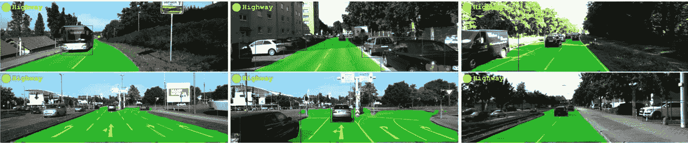
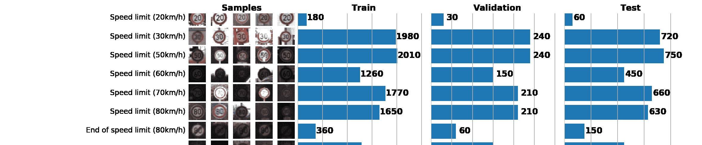
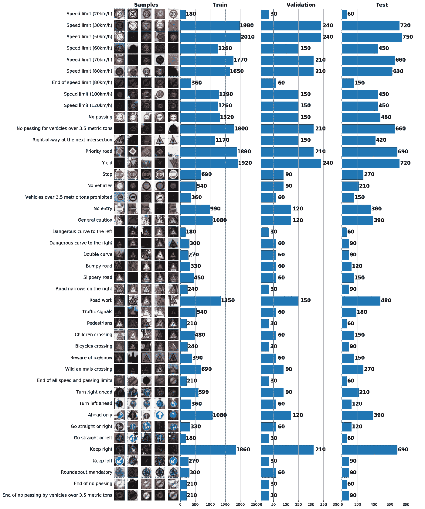
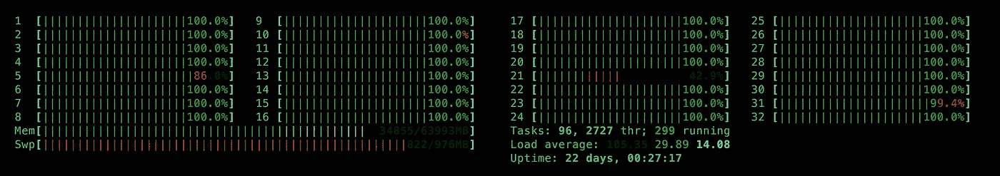
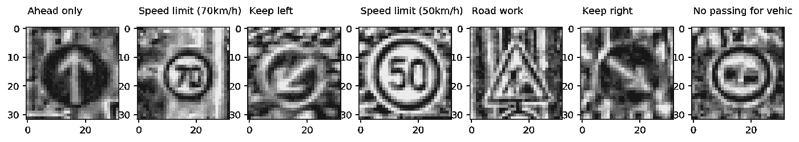
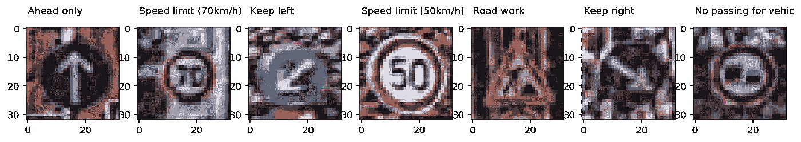
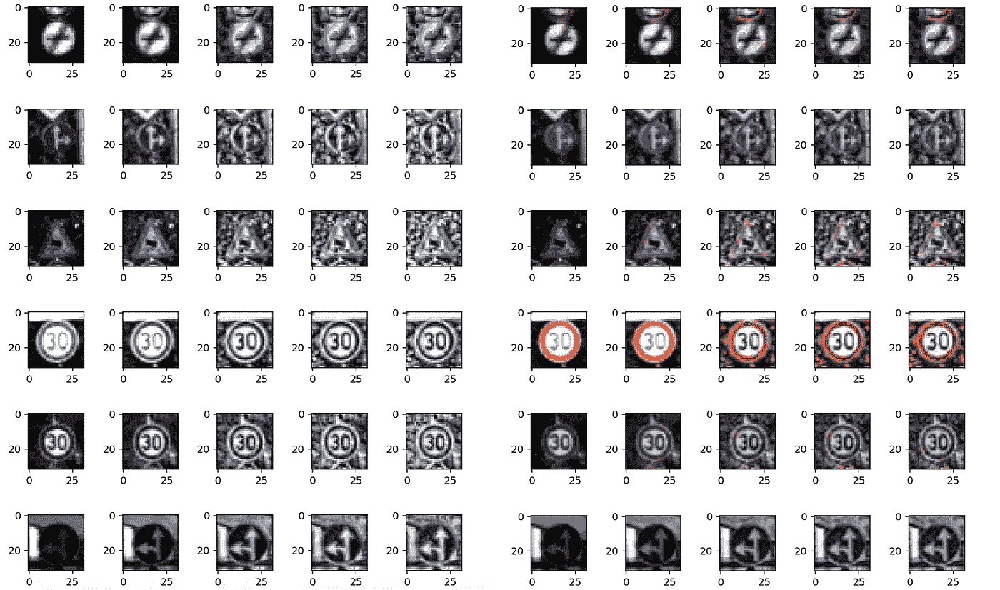
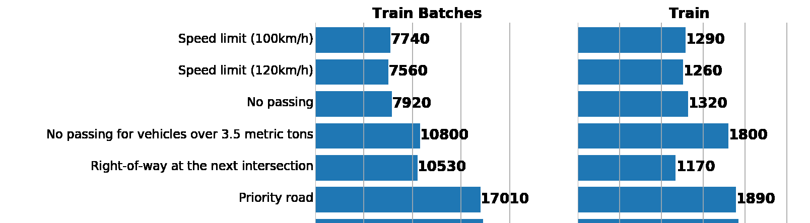
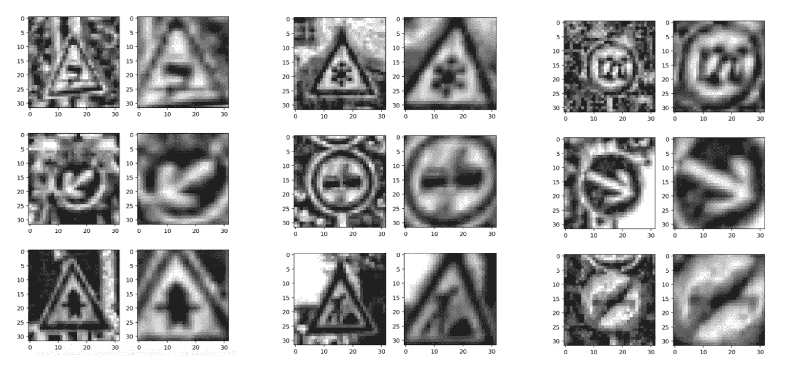

# ConvNets 系列。图像处理:行业工具

> 原文：<https://towardsdatascience.com/convnets-series-image-processing-tools-of-the-trade-36e168836f0c?source=collection_archive---------2----------------------->

# 简介和系列发布

我越是研究 [Udacity 的自动驾驶汽车项目](https://www.udacity.com/drive)，卷积神经网络(ConvNets)这个话题对我来说似乎就越重要。原因很简单:在过去的几年里，在计算机视觉和机器人领域，convnets 已经变得无处不在。测绘，图像分类，分割，无人机和自动驾驶汽车的运动规划——许多处理图像(或图像序列)的问题都可以通过 convnets 高效解决。



MultiNet as an example of a convolutional network (three in one, actually). We are going to use it in one of next posts. Source: [https://arxiv.org/pdf/1612.07695.pdf](https://arxiv.org/pdf/1612.07695.pdf)

我想，你对神经网络的工作原理有很强的直觉。有大量关于这个主题的博客文章、课程和书籍，所以我不想重复:

*   [第六章:深度前馈网络](http://www.deeplearningbook.org/contents/mlp.html)——摘自 I.Goodfellow，Y.Bengio，A.Courville 所著的《深度学习》一书，强烈推荐。
*   [用于视觉识别的 CS231n 卷积神经网络](http://cs231n.github.io/) —费-李非和安德烈·卡帕西教授的著名斯坦福课程。动手和面向工程。卓越的课程材料质量。
*   [深度学习](https://youtu.be/PlhFWT7vAEw)——南多·德·弗雷塔斯的牛津课程。
*   [机器学习简介](https://www.udacity.com/course/intro-to-machine-learning--ud120)—uda city 的免费课程。一个非常温和和广泛的介绍 ML 的初学者。

只有一个建议:为了确保你理解了神经网络的基础知识，[用它们](http://playground.tensorflow.org/)和[构建一个](http://cs231n.github.io/neural-networks-case-study/)！

本系列没有重复基础知识，而是专注于**特定的神经网络架构** : STN(空间转换器网络)、IDSIA(用于交通标志分类的卷积网络)、NVIDIA 用于端到端自动驾驶的网络、用于道路和交通标志检测和分类的 MultiNet。我们开始吧！

**本帖的主题是图像预处理**。Convnets 不能被提供“任何”手边的数据，也不能被视为“自动”提取有用特征的黑匣子。预处理不好或没有预处理会使即使是顶尖的卷积网络也无法收敛或得分很低。因此，强烈建议所有网络进行图像预处理和增强(如果有的话)。在这篇文章中，我们为以后在神经网络中使用和重用打下了基础。

# 工具 1。通过可视化进行数据发现

在这篇和下一篇文章中，我们将使用 gt SRB——一个[德国交通标志识别基准数据集](http://benchmark.ini.rub.de/?section=gtsrb&subsection=dataset)。我们的任务是使用来自 GTSRB 数据集的标记数据来训练交通标志分类器。一般来说，当你有一个数据集时，最好的习惯方法是从中抽取数据样本，并建立一个训练、验证和/或测试集的数据分布直方图。



GTSRB 数据集的基本统计如下:

```
Number of training examples = 34799Number of validation examples = 4410Number of testing examples = 12630Image data shape = (32, 32, 3)Number of classes = 43
```

在这个阶段，`matplotlib`是你最好的朋友。虽然你可以单独用`pyplot`构建良好的可视化效果，但是你可以用`matplotlib.gridspec.`将几个图表合并成一个

例如，您可以用这种方式初始化一个包含三个子图的空图表:

```
gs = gridspec.GridSpec(1, 3, wspace=0.25, hspace=0.1)
fig = plt.figure(figsize=(12,2))
ax1, ax2, ax3 = [plt.subplot(gs[:, i]) for i in range(3)]
```

Gridspec 是高度可定制的。例如，你可以像我在图表中所做的那样，为每个子情节设置不同的宽度。gridspec 中的轴可以被视为独立的图表，允许您创建非常复杂的绘图。

然后，一个单独的图表可以说明你的数据。这里有三个任务可以通过良好的绘图来解决:



*   **样本图像可视化**:我们马上会看到很多太暗或太亮的图像。光照变化应该(也将会)得到解决:这是一种数据标准化。
*   **检查类别不平衡**:如果类别极度不平衡，您可能需要在批处理生成器中使用[过采样或欠采样方法](http://www.chioka.in/class-imbalance-problem/)。
*   比较训练、验证和测试组上的**数据分布是相似的。这可以通过查看上面的直方图来验证，但是您也可以使用 [Spearman 等级相关性](https://en.wikipedia.org/wiki/Spearman%27s_rank_correlation_coefficient)(通过`scipy`)。**

# 工具 2。scikit-image 的 IPython 并行

为了帮助网络融合，我们需要均衡图像的亮度，并(如 [LeCun 关于交通标志识别的论文](http://yann.lecun.com/exdb/publis/pdf/sermanet-ijcnn-11.pdf)中所建议的)将它们转换成灰度。这可以使用 OpenCV 来完成，但是 Python 的工具箱包含了一个很棒的 [scikit-image](http://scikit-image.org/) ( `skimage`)库，可以通过 pip 轻松安装(与自己编译 OpenCV 形成对比)。关键的见解是使用基于内核的 [CLAHE](https://en.wikipedia.org/wiki/Adaptive_histogram_equalization#Contrast_Limited_AHE) (对比度受限的自适应直方图归一化)方法来归一化图像的直方图:`skimage.exposure.equalize_adapthist`。

`skimage`逐个处理图像并利用单个 cpu 核心，这显然是低效的。为了并行化图像预处理，我们使用了 [IPython 并行](https://ipyparallel.readthedocs.io/en/latest/intro.html) ( `ipyparallel`)包。`ipyparallel`的好处之一是它的简单性:并行运行 CLAHE 只需要几行代码。首先，从您的 shell 启动一个控制器和引擎(假设您已经安装了`ipyparallel`):

```
$ ipcluster start
```



One of the benefits of ipyparallel is its client interface which abstracts communication with engines, task scheduling, etc. Running parallel map is just trivial.

我们的并行化方法是最简单的:我们将数据集分成几批，并独立处理每一批。当所有的批次被处理后，我们将它们合并成一个单独的数据集。我的 CLAHE 批处理例程如下:

现在，转换函数已经准备好了，我们可以实现一段代码，将该函数应用于批量数据:

现在我们可以运行它了:

```
# X_train: numpy array of (34799, 32, 32, 3) shape
# y_train: a list of (34799,) shapeX_tr, y_tr = preprocess_equalize(X_train, y_train, bins=128)
```

现在，我们确实利用了系统的所有 cpu 内核(在我的例子中是 32 个),并获得了显著的性能提升。以下是预处理的示例结果:



Grayscale and equalize the histogram



Histogram equalization for RGB image (I used a different function for rc[:].map)

由于整个预处理管道现在只需要几十秒钟就可以运行，我们可以测试不同的`num_bins`值来了解这个论点:



num_bins: 8, 32, 128, 256, 512

较大的`num_bins`值确实增加了图像的对比度，但也过度突出了背景，增加了图像的噪声。不同的箱也可以用于**对比度增强**，因为我们需要防止对背景特征的过度拟合。

最后，我们可以利用 IPython 的`%store` [魔法](https://ipython.org/ipython-doc/3/config/extensions/storemagic.html)来快速序列化我们的数据集以供进一步使用:

```
# Same images, multiple bins (contrast augmentation)
%store X_tr_8
%store y_tr_8
# ...
%store X_tr_512
%store y_tr_512
```

# 工具 3。在线数据扩充

众所周知，增加更多的数据可以提高神经网络的泛化能力。在我们的例子中，我们可以通过使用旋转、翻转和仿射变换来变换我们所拥有的(数据扩充)来构建人工图像。虽然我们可以对整个数据集运行一次这个过程，保存结果并在以后使用它，但更好的方法是动态(在线)构建新图像，以便能够快速修改和迭代数据扩充的参数。

首先，让我们列出我们的转换。我们用`numpy`和`skimage`:

仿射变换增加数据集，同时保持图像标签不变。相反，旋转和翻转可以将一个交通标志转换成另一个。为了处理这个问题，我们可以为每个交通标志和它将被转换成的类别列出一个可用的转换列表:

A part of [the whole transformation table](https://gist.github.com/dnkirill/8aab1c5dbe0471795cdf93729a572d49). Values are class numbers (as in label_class) an image will take after transformation. Empty cell means that transformation is not available for that label.

请注意，上表中的转换名称与我们之前介绍的函数名称相匹配。这样做是为了动态添加更多的转换:

接下来，我们构建一个管道，将`augmentation_table.csv`中列出的所有可用函数应用于所有类:

很好。现在我们有两个数据集扩充例程:

*   `affine_transform`:没有旋转组件的可定制的剪切和缩放变换(不是很一致，因为旋转是仿射变换的一部分)。
*   `flips_rotations_augmentation`:基于随机旋转和增强 _table.csv 的图像变换，可以改变图像标签。

最后一步是将它们合并到一个增强的批处理生成器中:

当我们从这个批处理生成器采样时，我们得到了我们所需要的，对比度和位置数据增强:


Generated images via augmented_batch_generator

**注:**强化只在训练时需要。我们做预处理，但不增加验证或测试集。

之后，一个好主意可能是检查该批处理生成器中批处理的数据分布是否仍然合理(要么与原始数据相似，要么是专门针对过采样设计的)。



Left: data distribution from augmented batch generator. Right: original train. As we see, values differ, but distributions are similar.

# 向神经网络迈进

在完成数据预处理、批处理生成器设置和数据集分析后，我们可以继续训练。我们将使用双卷积网络:STN(空间转换器网络)获取一批图像，专注于交通标志，去除背景，IDSIA 网络从 STN 提供的图像中识别交通标志。下一篇文章将专门讨论这些网络、培训、性能分析和演示。敬请期待，下期帖子再见！



Left: original preprocessed image. Right: STN-transformed image which is fed to IDSIA network for classification.