# ConvNets 系列。空间变压器网络

> 原文：<https://towardsdatascience.com/convnets-series-spatial-transformer-networks-cff47565ae81?source=collection_archive---------0----------------------->

空间转换器是不同模块集合中的另一个乐高积木。它通过应用可学习的仿射变换然后进行插值来消除图像的空间不变性。STN 模块可以放在卷积神经网络(CNN)中，它主要靠自己工作。

这个项目的完整代码可以在 GitHub 上找到:【https://github.com/dnkirill/stn_idsia_convnet 

**为了对 STN 做什么有一些直觉，请看下面我的项目中的两个演示:**

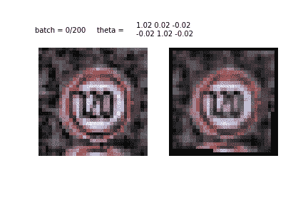

Left image: an original input image from traffic signs dataset. Right image: same image transformed by STN. **Spatial transformers learn what part of an image is the most important and scale or rotate the image to focus on this part.**

在本帖中，我们将回顾 STN 模块的内部工作，并将其与**一个对德国交通标志数据集**进行分类的卷积神经网络结合使用。我们将构建它们:STN 和分类器。

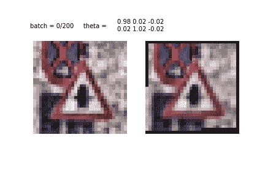

Another example of STN learning and transformation. This is just the first epoch of training. It is clear how the STN learns the sign representation and focuses on the sign itself.

STN 检测甚至在更困难的情况下也能工作(例如，图像上的两个标志)。不过，最重要的是，STN 确实提高了分类器的准确性(在我的例子中是 IDSIA)。

# 空间变压器网络的绝对最小速成课程

卷积神经网络的问题在于它缺乏对输入变化的鲁棒性。这些变化包括比例、视点变化、背景混乱以及更多的变化。一些不变性可以通过池化操作来实现，池化操作只是对导致信息丢失的特征图进行下采样。

不幸的是，由于标准 2×2 池的小感受野，它仅在更靠近输出层的较深层中提供空间不变性。此外，池化不提供任何旋转或缩放不变性。凯文·扎克卡在他的帖子中对这个事实[提供了一个很好的解释。](https://kevinzakka.github.io/2017/01/18/stn-part2/)

使模型对这些变化稳健的基本且最常用的方法是像我们在[上一篇文章](https://medium.com/towards-data-science/convnets-series-image-processing-tools-of-the-trade-36e168836f0c)中所做的那样扩充数据集:

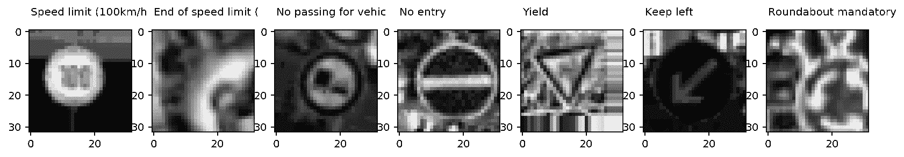

Augmented images. In this post, we will use no augmentations at all.

这种方法没有错，但是我们可能希望开发一种更加智能和自动化的方法来准备图像。这种方法应该有助于分类器得出正确的、更确定的预测。这就是空间转换器网络或 STN 模块发挥作用的地方。**通俗地说，STN 是一种旋转或缩放输入图像或特征地图的机制，目的是聚焦在目标对象上，并消除旋转变化**。STNs 最显著的特征之一是它们的模块化(模块可以被注入到模型的任何部分)以及它们能够在不修改初始模型的情况下用单个反向传播算法进行训练。

下面是另一张图片，让你对 STN 有一个直观的认识:

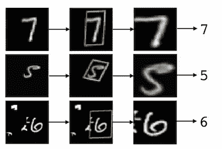

Cluttered MNIST example from the [original paper](http://papers.nips.cc/paper/5854-spatial-transformer-networks.pdf). Cluttered MNIST (left) original image, target object detected by STN (center), transformed image (right).

如果我们排除学习部分，STN 模块可以归结为以下过程:

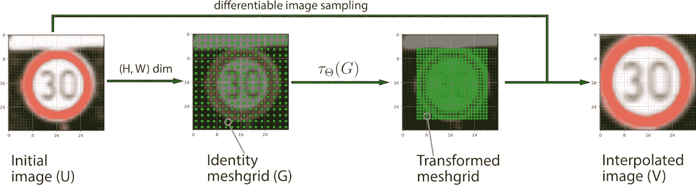

Four steps of applying a STN transformation given that the transformation matrix 𝛳 is defined.

在下一节中，我们将更深入地探讨这一过程，并更仔细地观察转换的每一步。

# STN:转型的步骤

**第一步。**定义描述线性变换本身的变换矩阵𝛳(θ)。θ可定义如下:

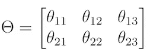

Affine transformation matrix theta.

不同的矩阵对应不同的变换。我们最感兴趣的是这四个:

*   **身份**(输出相同的图像)。这是θ的初始值。在这种情况下，θ矩阵是对角的:
    `theta = np.array([[1.0, 0, 0], [0, 1.0, 0]])`
*   **旋转**(逆时针旋转 45°)。`cos(45º) = 1/sqrt(2) ≈ 0.7`:
    
*   **放大。**
    (放大 2 倍)放大中心:
    `theta = np.array([[0.5, 0, 0], [0, 0.5, 0]])`
*   **缩小。**
    缩小中心(放大 2 倍):
    `theta = np.array([[2.0, 0, 0], [0, 2.0, 0]])`

**第二步。**我们不是将变换直接应用于初始图像，而是生成一个与初始图像大小相同的采样网格`U`。网格是覆盖整个输入图像空间的一组索引`(x_t, y_t)`。它不包含任何颜色信息。这在代码中有更好的解释:

由于张量流的特殊性，`x_t`和`y_t`赋值可能看起来很麻烦。Numpy 翻译做得更好:

`x_t, y_t = np.meshgrid(np.linspace(-1, 1, width), np.linspace(-1, 1, height))`

**第三步。**将线性变换矩阵应用于我们初始化的 meshgrid，以获得新的一组采样点。变换网格的每个点可以定义为θ与坐标`(x_t, y_t)`和偏置项的矩阵向量乘积:

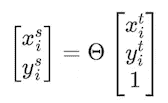

**第四步。**使用初始特征图、转换网格(见步骤 3)和您选择的可微分插值函数(如双线性函数)产生采样输出`V`。插值是必需的，因为我们需要将采样的结果(像素的分数)映射到像素值(整数)。

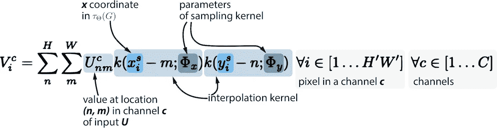

Sampling and interpolation

**学习问题。**如果我们以某种方式为每个输入图像提供正确的θ，我们可以开始使用我们刚刚描述的过程。事实上，我们希望从数据中推导出θ，我们确实可以做到！**首先，**我们需要确保交通标志分类器的损失可以反向传播到采样器并通过采样器。**其次，**我们定义了关于`U`和`G`(网格)的梯度:这就是插值函数必须可微或次可微的原因。第三，我们计算`x`和`y`相对于θ的偏导数。[如果真的好奇的话，梯度计算见原文。](http://papers.nips.cc/paper/5854-spatial-transformer-networks.pdf)

最后，我们定义了一个**定位神经网络**(回归器)，其唯一的任务是学习，然后使用我们通过采样器反向传播的损失为给定图像产生正确的θ。

**这种方法的神奇之处在于，我们得到了一个可微分的带记忆(通过可学习的权重)的自包含模块，它可以放在 CNN 的任何部分。**

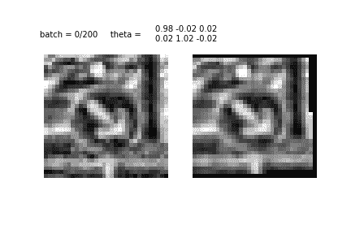

See how 𝛳 changes while the STN learns the representation of the main object (a traffic sign) in images .

简而言之，这就是 STN。以下是最初论文中的 STN 方案:

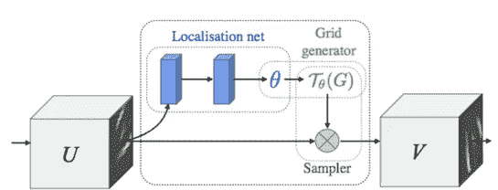

Spatial Transformer with the locnet from the [original paper.](http://papers.nips.cc/paper/5854-spatial-transformer-networks.pdf)

如你所见，我们已经涵盖了 STN 的所有构建模块:本地化网络、meshgrid 生成器和采样器。在下一部分中，我们将训练一个张量流分类器，它将 STN 作为其图形的一部分。

# TensorFlow 模型概述

这个模型的代码太长了，无法在这篇文章中一一列出，但是可以在 github 资源库中免费获得:
[https://github.com/dnkirill/stn_idsia_convnet](https://github.com/dnkirill/stn_idsia_convnet)

我更倾向于关注一些重要的代码和模型训练。

**首先**，由于最终任务是对交通标志进行分类，我们需要定义和训练分类器本身。选择很多:从 LeNet 到你能想象到的任何新的顶级网络。在这个项目中，受 [Moodstocks 对 STN](https://github.com/Moodstocks/gtsrb.torch) (在 Torch 中实现)的研究的启发，我使用了一个类似 IDSIA 的网络。

**第二个**，我们定义并训练 STN 模块，该模块将一幅原始图像作为输入，用采样器对其进行变换，并产生另一幅图像(或一批图像)。该图像然后被分类器用作输入。请注意，STN 可以很容易地从 DAG 中分离出来，并由原始图像批处理生成器替换。这种被放置在 CNN 的任何部分的能力是 STN 的主要优点之一。

以下是组合网络的概述:

Spatial transformer network outputs images to IDSIA traffic signs classifier and trains using a single backprop algorithm.

DAG 的这一部分使用一批原始图像作为输入，通过 STN 模块对它们进行转换，将转换后的数据传输到分类器(IDSIA)并输出 logits:

假设我们有计算 logits 的方法(STN + IDSIA 网络)，下一步是计算损失(我们使用交叉熵或 logloss 损失函数作为分类问题的默认选择):

接下来是定义更多的 ops —我们基本上初始化 TensorFlow 的 DAG 的 ops。我们需要选择一个优化器和训练 op，将损失反向传播回输入层:

我以更高的学习率(0.02)开始:这有助于将更强的梯度信息传播到 STN 的定位网络，该定位网络位于整个网络的“前”层，否则可能训练非常慢(由于[消失梯度问题](https://en.wikipedia.org/wiki/Vanishing_gradient_problem))。学习率的初始值越小，网络就越难放大到更小的交通标志。

[Adam optimizer](http://ruder.io/optimizing-gradient-descent/index.html#adam) (结合自适应学习率并保持过去梯度的指数衰减平均值)与学习率的分段常数一起使用。学习率衰减使用`boundaries`(批次数量)切换到较小的学习率。

使用一个非常简单的声明将输出 logits(网络的前向通道)的 DAG 部分添加到图中:

这个简单的声明展开了整个网络，即 STN + IDSIA。下一节将讨论它们。

# IDSIA 分类器网络

我的灵感来自 Moodstocks 的研究和来自 IDSIA 瑞士人工智能集团的[初始论文](http://www.idsia.ch/~juergen/nn2012traffic.pdf)，其中他们使用了一组 CNN 来击败这个数据集的最先进的分数。我从系综中提取了单个网络架构的蓝图，并在 TensorFlow 中用我自己的术语定义了它。分类器的配置如下所示:

*   第 1 层:卷积(批量归一化，relu，dropout)。**内核** : 7x7，100 个滤镜。**输入** : 32x32x1(一批 256 个)。**输出** : 32x32x100。
*   第 2 层:最大池化。**输入** : 32x32x100。**输出** : 16x16x100。
*   第三层:卷积(批量归一化，relu，dropout)。**内核** : 5x5，150 滤镜。**输入** : 16x16x100(一批 256)。**输出** : 16x16x150。
*   第 4 层:最大池化。**输入** : 16x16x150。**输出** : 8x8x150。
*   第五层:卷积(批量归一化，relu，dropout)。**内核** : 5x5，250 滤镜。**输入** : 16x16x100(一批 256)。**输出** : 16x16x150。
*   第 6 层:最大池化。**输入** : 8x8x250。**输出** : 4x4x250。
*   第 7 层:多比例要素的附加池。conv 层 1、2 和 3 的内核大小分别为 8、4 和 2。
*   第 8 层:多尺度特征的展平和拼接。**输入**:2x2x 100；2x2x1502x2x250。**输出**:全连通层的特征向量 400+600+1000 = 2000。
*   第 9 层:全连接(批量归一化，relu，dropout)。**输入** : 2000 个特征(一批 256 个)。300 个神经元。
*   第 10 层:Logits 层(批量标准化)。**输入** : 300 个特征。输出:logit(43 类)。

下图可以说明这一点:

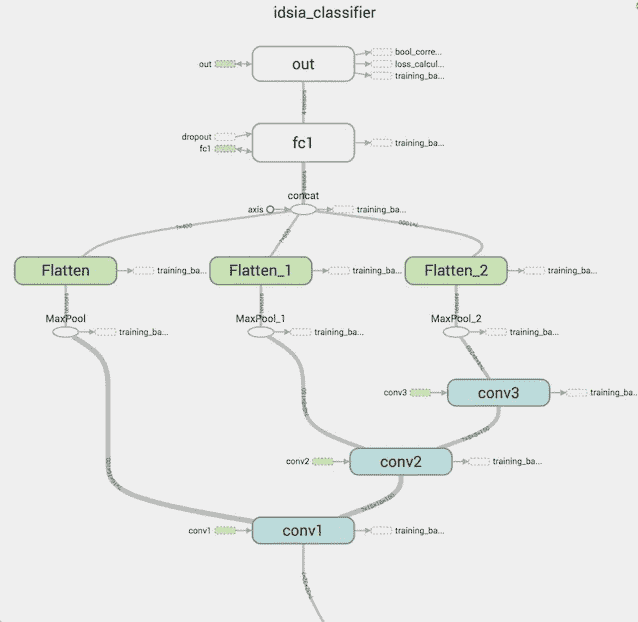

如您所见，每个卷积层的激活随后被合并，并针对全连接层进行扁平化。这是**多尺度特征**的例子，它们**确实**提高了最终得分。

正如我们前面所讨论的,`conv1`的输入来自 STN 的输出。

# TensorFlow 中的空间转换器

TensorFlow models zoo 包含一个 STN 的实现，它将用于我们的模型:[https://github . com/tensor flow/models/tree/master/transformer](https://github.com/tensorflow/models/tree/master/transformer)。

我们的任务是定义和训练本地化网络，为`transformer`提供 theta，并将 STN 模块注入 TensorFlow 的 DAG。`transformer`生成网格并提供变换和插值功能。

本地化网络的配置如下:

**loc net 的卷积层数:**

*   第 1 层:最大池化。**输入** : 32x32x1。**输出** : 16x16x1。
*   第二层:卷积(relu，批量归一化)。**内核** : 5x5，100 个滤镜。**输入** : 16x16x1(一批 256 个)。**输出** : 16x16x100。
*   第 3 层:最大池化。**输入** : 16x16x100。**输出** : 8x8x100。
*   第四层:卷积(批量归一化，relu)。**内核** : 5x5，200 滤镜。**输入** : 8x8x100(一批 256 个)。**输出** : 8x8x200。
*   第 5 层:最大池化。输入:8x8x200。输出:4x4x200。
*   第 6 层:多比例要素的附加池。conv 层 1 和 2 的内核大小分别为 4 和 2。
*   第 7 层:多尺度特征的展平和拼接。**输入**:2x2x 100；2x2x200。**输出**:全连通层的特征向量 400+800 = 1200。

**全连接 LocNet:**

*   第 8 层:全连接(批量归一化，relu，dropout)。**输入** : 1200 个特征(一批 256 个)。100 个神经元。
*   第 9 层:Logits 定义仿射变换的 2×3 矩阵 theta。权重被初始化为零，偏差被初始化为恒等式变换:`[[1.0, 0, 0], [0, 1.0, 0]]`。
*   第 10 层:变压器:网格生成器和采样器。该逻辑在`spatial_transformer.py`中实现。此图层输出与原始图层(32x32x1)尺寸相同的变换图像，并对其应用仿射变换(例如，放大或旋转的图像)。

locnet 的卷积层的结构类似于 IDSIA(尽管 locnet 由 2 个 conv 层而不是 3 个组成，并且我们首先对输入图像进行下采样)。完全连接层的图示更值得注意:

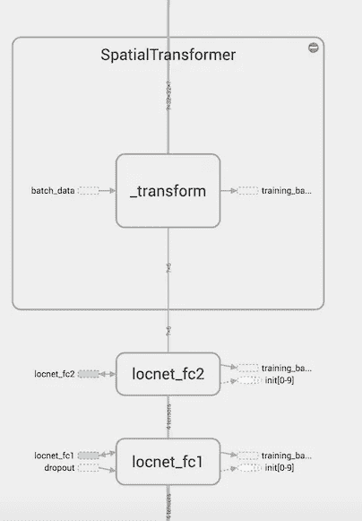

# 培训和结果

带有 STN 模块的 CNN 的问题是需要监控两个网络的过度匹配。这使得训练变得棘手和不稳定。另一方面，增加一点增强数据(尤其是增强亮度)确实可以避免两个网络过度拟合。无论如何，利大于弊:我们在**没有任何增强的情况下得到很好的结果**，STN+IDSIA 比没有这个模块的 IDSIA 性能好 0.5–1%。

以下参数用于训练:

即使仅仅过了 10 个时期，我们也能在验证集上得到`accuracy = 99.3`。CNN 仍然过拟合，但是过拟合的影响可以通过图像增强来减少。事实上，通过添加额外的扩充，我在 10 个时期后得到了验证集上的`accuracy = 99.6`(尽管训练时间显著增加)。

下面是训练的结果(`idsia_1`是单个 IDSIA 网络，`idsia_stn`是 STN+IDSIA)。准确度是德国交通标志数据集的整体验证准确度，而不是 STN:

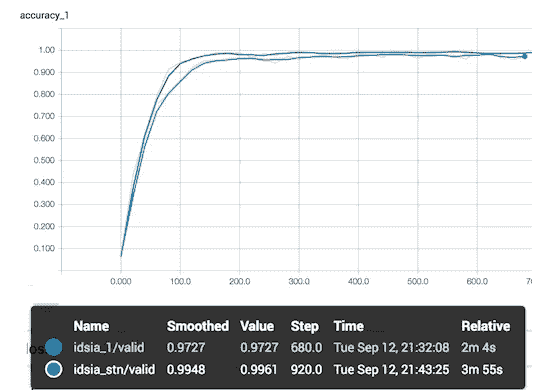

STN+IDSIA 优于单个 IDSIA 网络，尽管它需要更多的时间来训练。请注意，上图中的认证准确度是按批次计算的，而不是按整个认证集计算的。

最后，下面是 STN 转换器训练后的输出示例:

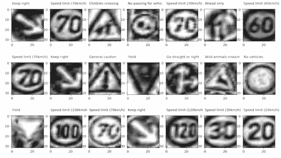

STN 确实抓住了图像的本质，并专注于交通标志，而不是背景或其他特征。

**最后，让我们回顾一下:**

*   STN 是一个可微分的模块，可以注入到卷积神经网络中。默认选择是将它放在输入层的正“后”，使其学习最佳变换矩阵 theta，从而最小化主分类器的损失函数(在我们的例子中，这是 IDSIA)。
*   STN 的采样器将仿射变换应用于输入图像(或特征地图)。
*   STNs 可以被视为图像增强的替代方案，图像增强是 CNN 实现空间不变性的默认方式。
*   向 CNN 添加一个或多个 stn 会使训练更加困难和不稳定:现在你不得不监控两个(而不是一个)网络的过度适应。这似乎是为什么 stn 还没有被广泛使用的原因。
*   用一些数据增强(特别是光照条件增强)训练的 stn 表现更好，并且不会过度拟合。

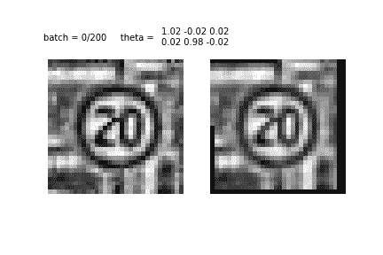