# 卷积神经网络

> 原文：<https://towardsdatascience.com/convolution-neural-network-e9b864ac1e6c?source=collection_archive---------4----------------------->

## 对于初学者

# 介绍

卷积层用于从输入训练样本中提取特征。每个卷积图层都有一组有助于要素提取的过滤器。一般来说，随着 CNN 模型的深度增加，通过卷积层学习的特征的复杂性增加。例如，第一个卷积层捕获简单特征，而最后一个卷积层捕获训练样本的复杂特征。

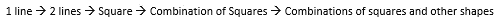

通过考虑数据样本部分的卷积来提取特征。过滤器每次遍历的数据部分的数量与步长和填充值成比例。数据样本在卷积之前可以/可以不进行零填充。

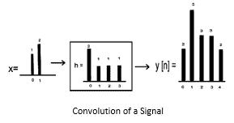

卷积输出然后通过一个称为 ReLU(整流线性单元)的激活单元。这个单元将数据转换成非线性形式。只有当卷积输出为负时，ReLU 的输出才会被削波为零。

由于消失梯度问题，Sigmoid 单元不是优选的激活单元。如果 CNN 的深度很大，那么当在输入层发现的梯度穿过输出层时，它的值会大大减小。这导致网络的总输出变化很小。这反过来导致收敛缓慢/没有收敛。为了避免这种情况，最好使用 ReLU。

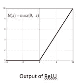

ReLU 的输出然后通过一个池层。合并图层移除卷积过程中捕获的任何冗余要素。因此，这一层减少了数据样本的大小。池化背后的原理是它假设图像像素的相邻值几乎相同。使用四个相邻像素值的平均值/最小值/最大值来进行合并。一般来说，在 2*2 过滤器的帮助下，输入图像的大小减少了一半。输入数据在汇集之前可能会/可能不会进行零填充。

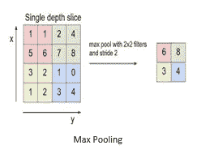

按照 CNN 模型的设计，重复这种连续通过卷积和汇集层传递数据的过程。出于学习目的，这个过程重复 2-4 次。来自连续卷积和汇集层的输出然后通过多层神经网络。这里，每个神经元单元充当携带关于单元的信息的特征图。

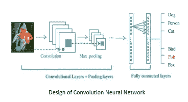

丢弃层用于通过使 CNN 模型对噪声鲁棒来减少过拟合。这些层通常被引入两个完全连接的神经网络层之间。它们暂时切断两个完全连接的层之间的部分数据流。这相当于让模型在存在噪声的情况下学习准确分类。因此，减少了由于过拟合而导致的模型分类不准确的机会。

使用 SoftMax 函数计算 CNN 模型的输出。SoftMax 是首选，因为它给出了不同类别的输出概率，而不是在 sigmoid 输出的情况下> = 0.5。使用 SoftMax 函数根据类的最高概率查找输出结果可提高输出的准确性。

交叉熵用于衡量系统的性能。它们是在 SoftMax 函数的帮助下计算出来的。这里的优点是 SoftMax 输出是对应于我们知道输出所属的类的元素的踪迹。这通常节省了计算时间。

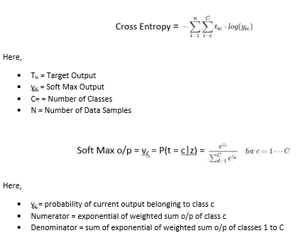

# CNN 层概述

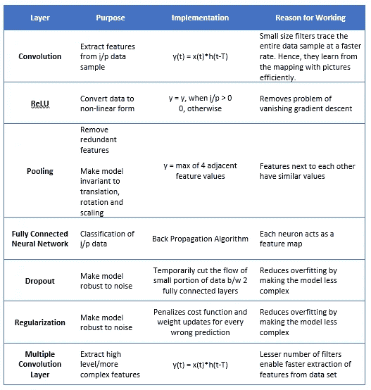



# 特征提取— MNIST

本节让读者直观地了解如何将图像与核进行卷积，从而从输入图像中提取特征。我们考虑一个数字为 2 的图像，在每个示例中，该图像与翻转了 90 度的相同 3*3 滤波器进行卷积。

在我们的实验中，我们假设滤波器的阈值为+2。黑色像素表示为 0，白色像素表示为 1。卷积的结果如下所示。

1.

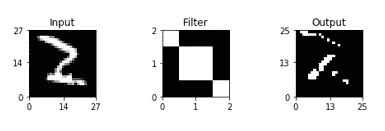

卷积的输出表明该滤波器善于检测内部边缘。这通过沿着对角线的图像中的明显边缘来显示。使用的 3*3 滤波器值为[[2，-1，-1]，[-1，2，-1]，[-1，-1，2]]。因此，当卷积输出大于定义的阈值 2 时，我们认为该卷积的输出为 1，否则为 0。

2.

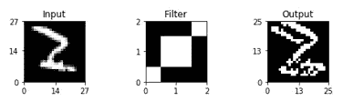

卷积的输出表明滤波器在对角线边缘是坏的。这通过沿着对角线的图像中的明显边缘来显示。使用的 3*3 滤波器值为[[-1，-1，2]，[-1，2，-1]，[2，-1，-1]]。因此，当卷积输出大于定义的阈值 2 时，我们认为该卷积的输出为 1，否则为 0。

3.

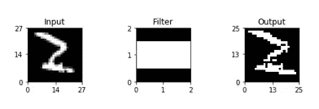

卷积的输出表明该滤波器擅长检测水平边缘。这通过沿着水平面的图像中的明显边缘来显示。使用的 3*3 滤波器值为[[-1，2，-1]，[-1，2，-1]，[-1，2，-1]]。因此，当卷积输出大于定义的阈值 2 时，我们认为该卷积的输出为 1，否则为 0。

4.

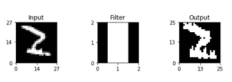

卷积的输出表示滤波器擅长检测垂直边缘。这通过沿着垂直平面的图像中的明显边缘来显示。使用的 3*3 滤波器值为[[-1，2，-1]，[-1，2，-1]，[-1，2，-1]]。因此，当卷积输出大于定义的阈值 2 时，我们认为该卷积的输出为 1，否则为 0。

源代码

 [## shree 6791/深度学习

### 深度学习——这个知识库由 Shreenidhi Sudhakar 实施的深度学习项目组成。

github.com](https://github.com/shree6791/Deep-Learning/blob/master/CNN/MNIST/keras/src/Feature%20Extraction.ipynb)