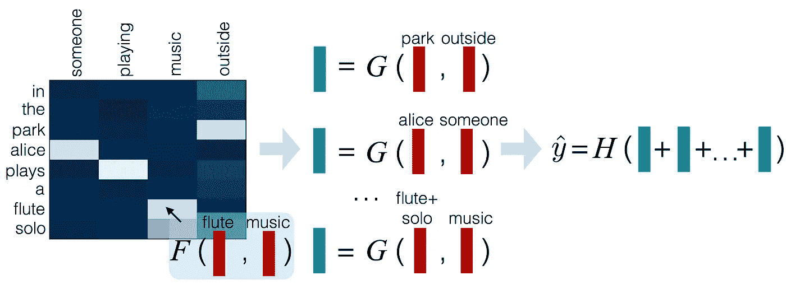
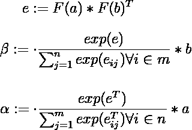
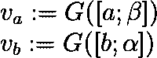
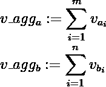
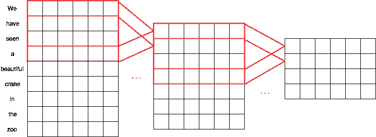
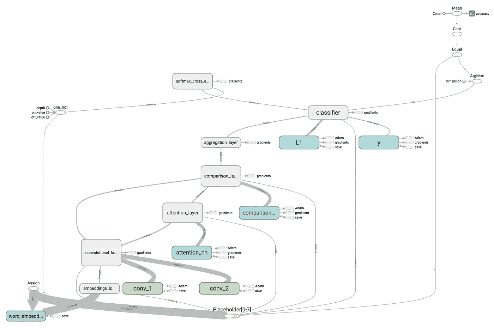

# 自然语言推理的卷积注意模型

> 原文：<https://towardsdatascience.com/convolutional-attention-model-for-natural-language-inference-a754834c0d83?source=collection_archive---------2----------------------->

在这篇文章中，我想向你展示一个我在 Quora 问题配对竞赛中使用的模型。首先，我将描述一个用于自然语言推理的可分解注意力模型( [Parikh 等人，2016](https://arxiv.org/pdf/1606.01933.pdf) )，然后用卷积层扩展它，以提高损失和分类精度。出于本文的目的，我将使用斯坦福 NLI 语料库进行比较。

# 介绍

自然语言推理(NLI)和复述检测是自然语言处理的主要研究课题之一。自然语言推理指的是确定两个语句之间的蕴涵和矛盾的问题，而复述检测的重点是确定句子的重复。发表在这方面的论文使用递归神经网络[王&江，2016](https://arxiv.org/pdf/1611.01747.pdf) ，[王等，2017](https://arxiv.org/pdf/1702.03814.pdf) ，卷积神经网络[牟等，2016](https://arxiv.org/abs/1512.08422) 或带软对齐和注意的前馈神经网络[帕里克等，2016](https://arxiv.org/pdf/1606.01933v1.pdf) 。

# 模型架构

模型的输入是表示为单词嵌入向量序列的两个短语`a = {a1,...,am}`和`b = {b1,...,bn}`。目标是估计这两个短语相互蕴涵或矛盾的概率。在模型训练过程中，我们还将使用一个变量`y`，它是一个基础事实和辅助输入`a_len`和`b_len`来帮助我们构建掩蔽矩阵。下图描绘了由三层组成的核心模型架构:关注、比较和聚集。

A high-level overview of the model architecture. (Image credit: Parikh et al., 2017)

## 注意力

注意力层使用的是 [Bahdanau et al .，2016](https://arxiv.org/pdf/1409.0473.pdf) 提出的一种神经注意力的变体。它是使用分别应用于这两个问题的前馈神经网络`F`实现的(Bahdanau 的工作使用递归神经网络的内部状态)。然后，使用 softmax 函数对神经网络的输出进行归一化，并将其与第二个句子软对齐。该图层的方程式如下所示:

where m = number of words in a, n = number of words in b

对于训练，我使用预先训练的 300 维手套单词嵌入。`F(a)`的输出大小是`mx200`，而`F(b)`的输出大小是`nx200`，这意味着注意力权重矩阵`e`将具有形状`mxn`。`beta`和`alpha`则是 softmax 标准化注意力权重和相应句子矩阵之间的点积。

## 比较

下一步是比较软对齐的句子矩阵。类似于前一步骤，使用前馈神经网络`G`，并且网络的输入分别是连接的句子矩阵`[a, beta]`和`[b, alpha]`。

Soft-aligned matrix comparison

## 聚合

核心模型架构的最后一部分是聚合层。这一层所做的只是对比较网络的输出进行列式求和，这样我们就可以获得每个句子的固定大小的表示。

Comparison matrix aggregation

最后，聚合的句子表示被连接起来并输入到一个密集的分类网络中。分类器的输出层是 softmax 标准化的，以便我们获得目标类的概率分布。

# 卷积层

NLI 的可分解注意力模型的扩展是基于这样一个事实，即同一个单词在给定的上下文中可以有不同的含义。类似于我们人类在上下文中理解单词的方式，机器学习模型可以通过使用递归神经网络(计算成本更高)或卷积层(成本更低但效率也更低)来学习这些更高级的单词表示。

Two convolutional layers with filter size 3 and stride 1

上图显示了如何使用卷积层构建更高级别的表示。例句“*我们在动物园里看到了一只漂亮的鹤”*包含单词 **crane** which 可以是一只鸟，但根据句子的上下文，它也可以是一个结构装置。

# 模特培训

首先使用`nltk.word_tokenize`函数对句子进行标记化，然后执行嵌入索引查找。如果在字典中找不到某个标记，则将其忽略，不进行插补。然后用零向量填充嵌入索引，直到给定批次中最长句子的长度。卷积层然后在第一个令牌之前和最后一个令牌之后附加零向量，以便在应用卷积之后，有效句子长度保持不变。

High level overview of a Tensorflow model graph

注意力权重矩阵`e`将所有填充值替换为`-np.inf`，以便在应用 softmax 归一化后，我们获得句子有效部分的概率分布，并且所有填充值为`0`。最后，如本文的**模型架构**部分所述，应用比较、聚集和分类层，并使用交叉熵损失来训练模型。

# 结果

首先，我在 Tensorflow 中实现了 NLI 最初的可分解注意力模型，以获得基线分数。虽然原始论文报告了 86.3%的测试准确性，但我无法将它提高到 83.8%以上(这可能是因为我使用了 AdaM optimizer 而不是 Adagrad，并且只训练了 100 个时期)。加入卷积层后，模型达到了分类精度 *84.5%* 。我还将 optimizer 改为 Adagrad，因为它与卷积架构配合得更好。

*在撰写本文时，目前最先进的自然语言推理模型是双边多视角匹配模型(* [*王等，2017*](https://arxiv.org/pdf/1702.03814.pdf) *)，达到分类准确率 88.8%。我在这篇文章中选择 NLI 的可分解注意力模型的原因是，该模型的架构更简单，因此运行训练/推理花费的时间更少，我可以更多地进行实验。*

# 结论

正如我们所看到的，卷积层在分类精度上给了我们一点点改进。这种扩展可以对包含更多具有上下文条件意义的单词的数据集提供更大的改进，也可以对没有这种单词的数据集提供很少或没有改进。对于具有多个超参数组合的更多训练时期，训练模型也可以获得更好的分数。

完整的 Tensorflow 模型代码可以在[这里](https://gist.github.com/marekgalovic/a1a4073b917ae1b18dc7413436794dca)找到。如果你喜欢这篇文章，请随意推荐给其他人。此外，如果你对我做错了什么或者本可以做得不一样有任何建议，请在下面的评论区留下它们。