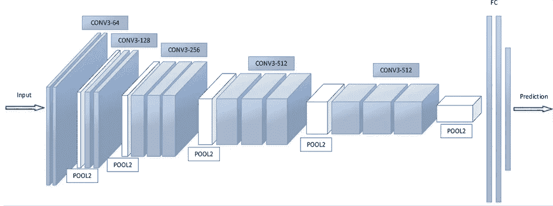
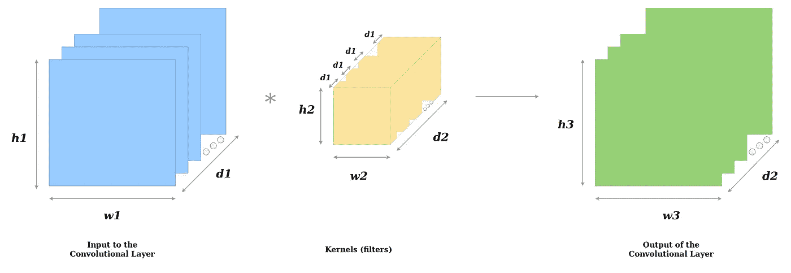
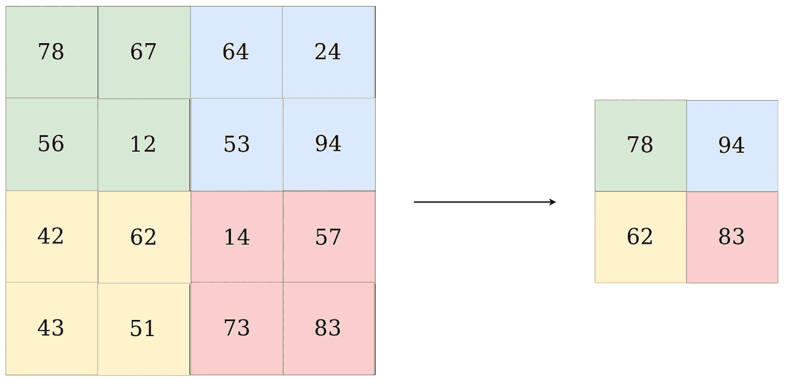
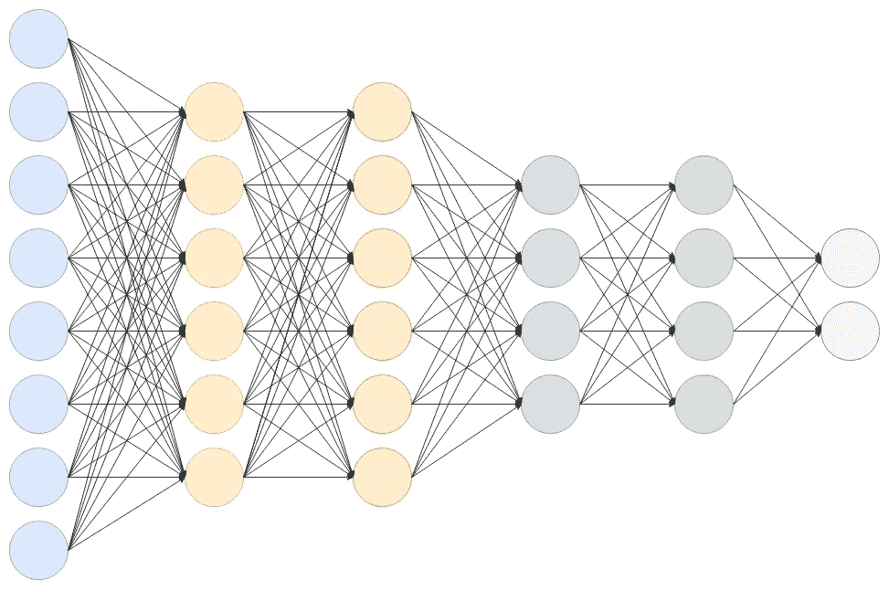
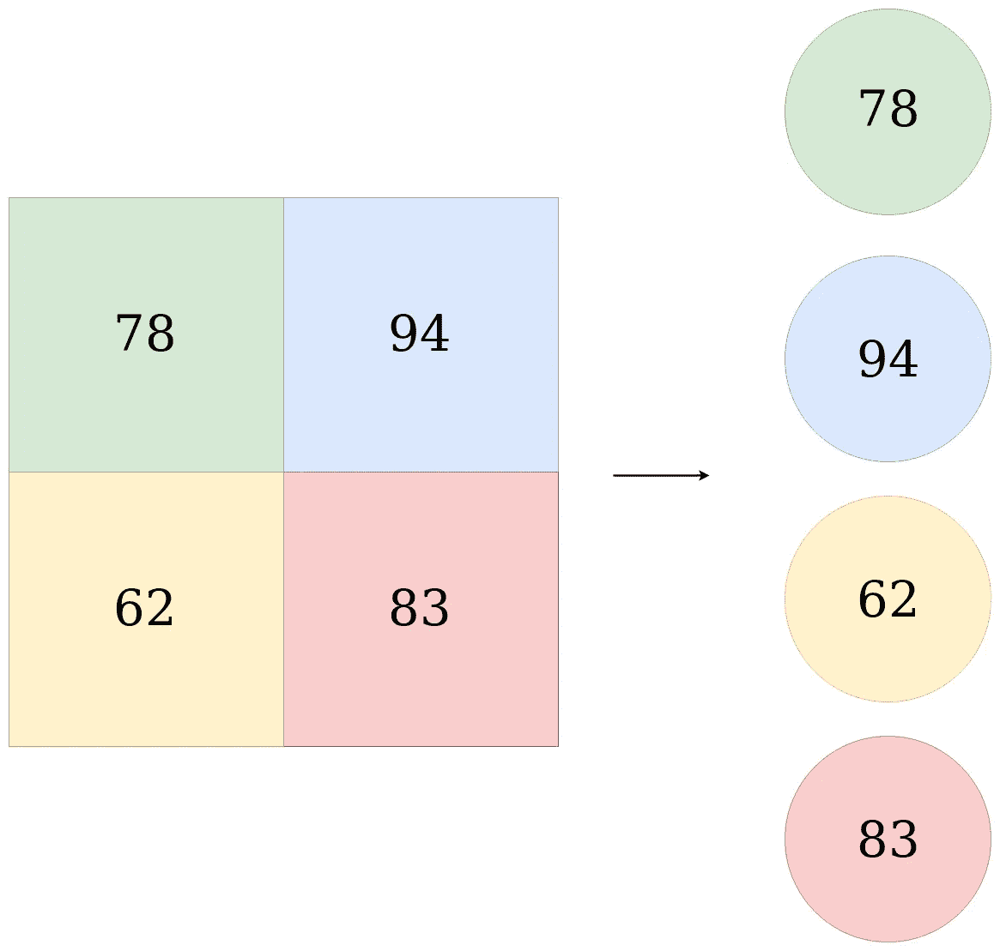
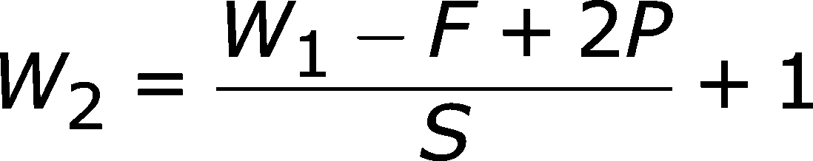

# 卷积神经网络

> 原文：<https://towardsdatascience.com/convolutional-neural-network-17fb77e76c05?source=collection_archive---------1----------------------->

## 卷积神经网络导论

[**Fig 1\. Toon Discovers how machines see**](https://unsplash.com/photos/YvkH8R1zoQM)

在本文中，我们将了解什么是卷积神经网络，简称 ConvNets。ConvNets 是将深度学习中的图像工作提升到下一个水平的超级英雄。对于 ConvNets，输入是一幅图像，或者更具体地说，是一个 3D 矩阵。

让我们先来看看 ConvNet 是什么样子的！

**[Fig 2.]** [**Convolutional Neural Network**](http://file.scirp.org/Html/4-7800353_65406.htm)

简单来说，
一个 ConvNet 通常有 3 种类型的层:
1) **卷积层** ( *CONV* )
2) **池层** ( *池* )
3) **全连接层** ( *FC*

让我们更详细地看看每一层:

# 卷积层

**Fig 3\. Convolutional Layer**

卷积层是 CNN 的第一层。
作为 ***输入*** 得到一个维度为*【h1 * w1 * D1】*的矩阵，就是上图中的蓝色矩阵。

接下来，我们有 ***内核*** (滤镜)。
仁？
内核是一个尺寸为*【H2 * w2 * D1】，*的矩阵，它是上图中(内核层中)多个长方体(内核)中的*一个*黄色长方体。
对于每个卷积层，有多个内核堆叠在彼此的顶部，这就是形成图 2 中的黄色三维矩阵的原因，其维度为*【H2 * w2 * D2】*，其中 *d2* 是内核的数量。

对于每个内核，我们都有其各自的**偏差**，这是一个标量。

然后，我们有一个 ***输出*** 给这一层，图 2 中的绿色矩阵，它有尺寸*【H3 * w3 * D2】。*

让我们从上面揭示一些显而易见的事情。
1)输入和*一个*内核**的深度( *d1* )(或通道数)相同**。
2)输出**的深度( *d2* )等于**内核的数量(即橙色三维矩阵的深度)。

好，我们有输入，内核和输出。现在让我们看看 2D 输入和 2D 内核会发生什么，即 *d1=1* 。

**Fig 4\.** [**Calculation of output using 2D Convolution**](/types-of-convolutions-in-deep-learning-717013397f4d)

对于图像上内核的每个位置，内核上的每个数字与输入矩阵上的相应数字相乘(*蓝色矩阵*)，然后对它们求和，得到输出矩阵中相应位置的值(*绿色矩阵*)。

使用 *d1 > 1* 时，每个通道发生相同的情况，然后将它们相加，再与相应滤波器的偏置相加，这就形成了输出矩阵相应位置的值。让我们想象一下！

**Fig 5\.** [**An example of how Inputs are mapped to Outputs**](http://cs231n.github.io/assets/conv-demo/index.html)

这是构成输出层的 *d2* 矩阵之一。

对所有的 *d2* 内核重复整个过程，这些内核形成输出层中的 *d2* 通道。

# 汇集层

**Fig 6\. Max Pooling Layer**

共有两种类型的池:
1)最大池
2)平均池

汇集层的主要目的是减少输入张量的参数数量，从而
-有助于减少过拟合
-从输入张量中提取代表性特征
-减少计算，从而提高效率

池层的输入是张量。

在 Max Pooling 的情况下，其示例在图 6 的*中示出，*大小为`n*n` *(在上述示例中为 2×2)*的核在矩阵中移动，并且对于每个位置，取**最大值**并放入输出矩阵的相应位置。

在平均汇集*、*的情况下，大小为`n*n`的核在矩阵中移动，并且对于每个位置，对所有值取**平均值，并放入输出矩阵的相应位置。**

对输入张量中的每个通道重复这一过程。所以我们得到了输出张量。
所以，要注意的一点是，**池化在图像的高度和宽度上对图像进行缩减采样，但是通道的数量(深度)保持不变。**

# 全连接层

**Fig 4\. Fully Connected Network**

全连接层简单地说就是，**前馈神经网络。*完全连接的层形成网络中的最后几层。*

*到全连接层的**输入**是来自*最终*池化或卷积层的输出，它被 ***展平*** 然后馈入全连接层。*

> *变平了？
> 最终(和任何)池和卷积层的输出是一个三维矩阵，展平就是将其所有值展开成一个向量。
> 我们来形象化一下！*

**

***Fig 5\. Flattening***

*这个展平的向量然后连接到几个完全连接的层，这些层与人工神经网络相同，执行相同的数学运算！*

*对于人工神经网络的每一层，进行以下计算*

**

***Fig 6\. ANN Calculation for each layer***

*其中，
**x** — *为输入向量，维数为****【p _ l，1】***
**W**—*为权重矩阵，维数为****【p _ l，n _ l】****其中，****p _ l****为上一层神经元个数* **b** *—是维度为****【p _ l，1】*****g***—是激活函数，通常是****ReLU****。**

*对每一层重复这种计算。*

*在通过完全连接的层之后，最终层使用***【soft max】激活函数*** *(而不是 ReLU)* ，该函数用于获得输入在特定类中的概率(*分类*)。*

*最后，我们得到了图像中物体属于不同类别的概率！！*

*这就是卷积神经网络的工作原理！！
输入图像被归类为标签！！*

*现在，让我们想象如何从输入张量计算输出张量的维数。*

**

***Fig 7\. Output Dimension Calculations from Input Dimensions***

*其中，
***W1***—*是输入张量* ***F***—*是内核* ***P****—是填充** 

> ****垫高？通常，输入矩阵用零填充，这样内核可以在矩阵上均匀移动，结果矩阵具有期望的维数。因此，P=1 意味着输入矩阵的所有边都用 1 层零填充，如图 4 所示，输入(蓝色)矩阵周围有虚线。****
> 
> ****跨步？**
> 内核在矩阵上一次移动一个像素(图 4)。因此，这被称为具有 1 的步幅。我们可以将步距增加到 2，这样内核在矩阵上一次移动 2 个像素。这将反过来影响输出张量的维度，并有助于减少过拟合。**

*****输出张量的通道数会发生什么变化？***
嗯，在卷积层的情况下，等于内核的数量。
在合并层的情况下，输入张量和输出张量中的通道保持相同！**