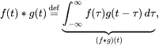
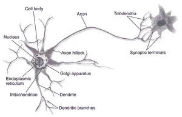
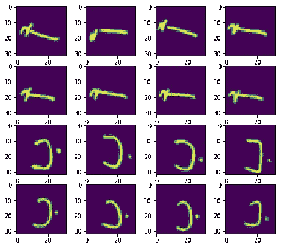
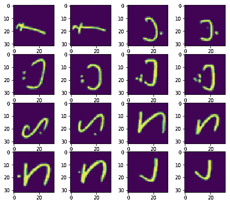

# 卷积神经网络——实施的鸟瞰图

> 原文：<https://towardsdatascience.com/convolutional-neural-network-a-birds-eye-view-with-an-implementation-1bff505dd3d9?source=collection_archive---------12----------------------->

*这篇文章正在被移到我的* [*子栈发布*](https://vishalramesh.substack.com/) *。这里* *可以免费阅读文章* [*。这篇文章将于 2022 年 5 月 18 日被删除。*](https://vishalramesh.substack.com/p/convolutional-neural-network-a-birds-eye-view-with-an-implementation-1bff505dd3d9?s=w)

这个内核旨在给出一个卷积神经网络(CNN)的简单理解。这将按以下顺序实现:

*   理解卷积运算
*   理解神经网络
*   数据预处理
*   了解使用的 CNN
*   了解优化器
*   理解`ImageDataGenerator`
*   做出预测并计算精确度
*   看到神经网络的运行

# 什么是卷积？

> *在数学(尤其是泛函分析)中，卷积是对两个函数(f 和 g)进行数学运算，以产生第三个函数，该函数表示一个函数的形状如何被另一个函数修改。*
> 
> (来源:[维基百科](https://en.wikipedia.org/wiki/Convolution))

这种运算应用于多个领域，如概率、统计、计算机视觉、自然语言处理、图像和信号处理、工程和微分方程。

该操作在数学上表示为



The Convolution operation

(图片来源:[维基百科](https://en.wikipedia.org/wiki/Convolution#Definition))

检查此[链接](https://github.com/vdumoulin/conv_arithmetic)以直观了解卷积运算

# 什么是人工神经网络？

> 人工神经网络(ANN)或连接主义系统是由构成动物大脑的生物神经网络模糊启发的计算系统。这种系统通过考虑例子来“学习”执行任务，通常没有用任何特定于任务的规则来编程。
> 
> (来源:[维基百科](https://en.wikipedia.org/wiki/Artificial_neural_network))

人工神经网络是一个被称为人工神经元的更小的处理单元的集合，它与生物神经元大致相似。

**生物神经回路**



A Biological Neural Circuit

*(图片来源:* [*维基百科*](https://en.wikipedia.org/wiki/Neural_circuit) *)*

互连电路的集合构成一个网络

**人工神经网络**


Artificial Neural Network

*(图片来源:* [*维基百科*](https://en.wikipedia.org/wiki/Artificial_neural_network) *)*

现在，我们从实现开始

# 导入必要的库

```
import numpy as np
import pandas as pd
import matplotlib.pyplot as plt
import seaborn as sns

import tflearn.data_utils as du
from keras.models import Sequential
from keras.layers import Dense, Dropout, Flatten, Conv2D, MaxPool2D
from keras.optimizers import RMSprop
from keras.preprocessing.image import ImageDataGenerator
from sklearn.metrics import confusion_matrix
```

# 加载数据集

```
train_data = pd.read_csv('../input/csvTrainImages 13440x1024.csv', header = None)
train_label = pd.read_csv('../input/csvTrainLabel 13440x1.csv', header = None)
test_data = pd.read_csv('../input/csvTestImages 3360x1024.csv', header = None)
test_label = pd.read_csv('../input/csvTestLabel 3360x1.csv', header = None)
```

# 数据集

这里使用的数据集是[阿拉伯手写字符数据集](https://www.kaggle.com/mloey1/ahcd1)。

trainImages.csv 有 1024 列和 13440 行。每一列代表图像中的一个像素，每一行代表一个单独的灰度图像。每个像素的值在 0 -255 之间变化。

```
train_data = train_data.iloc[:,:].values.astype('float32')
train_label = train_label.iloc[:,:].values.astype('int32')-1
test_data = test_data.iloc[:,:].values.astype('float32')
test_label = test_label.iloc[:,:].values.astype('int32')-1
```

# 可视化数据集

```
def row_calculator(number_of_images, number_of_columns):
    if number_of_images % number_of_columns != 0:
        return (number_of_images / number_of_columns)+1
    else:
        return (number_of_images / number_of_columns)def display_image(x, img_size, number_of_images):
    plt.figure(figsize = (8, 7))
    if x.shape[0] > 0:
        n_samples = x.shape[0]
        x = x.reshape(n_samples, img_size, img_size)
        number_of_rows = row_calculator(number_of_images, 4)
        for i in range(number_of_images):
            plt.subplot(number_of_rows, 4, i+1)
            plt.imshow(x[i])
```

**训练集**

```
display_image(train_data, 32, 16)
```



The training dataset

**测试设置**

```
display_image(test_data, 32, 16)
```



The test data

# 数据预处理

**编码分类变量**

***什么是分类变量？***

> *在统计学中，分类变量是一个变量，它可以取有限的、通常是固定数量的可能值中的一个，根据一些定性属性将每个个体或其他观察单位分配到特定的组或名义类别。*
> 
> (*来源:* [*维基百科*](https://en.wikipedia.org/wiki/Categorical_variable) )

简单地说，分类变量的值代表一个类别或类。

## 为什么我们需要对分类变量进行编码？

对代表一个类别的数字执行运算是没有意义的。因此，需要进行分类编码。

查看 stackoverflow 上的这个链接，通过一个例子来理解。

阿拉伯字母表中有 28 个字母。所以，有 28 节课。

```
train_label = du.to_categorical(train_label,28)
```

# 正常化

## 什么是正常化？

进行标准化是为了将整个数据带入一个明确定义的范围内，最好在 0 和 1 之间

> *在神经网络中，不仅要对数据进行标准化，还要对其进行缩放，这是一个好主意。这是为了在误差表面更快地接近全局最小值。*
> 
> *(来源:* [*堆栈溢出*](https://stackoverflow.com/questions/4674623/why-do-we-have-to-normalize-the-input-for-an-artificial-neural-network) *)*

```
train_data = train_data/255
test_data = test_data/255train_data = train_data.reshape([-1, 32, 32, 1])
test_data = test_data.reshape([-1, 32, 32, 1])
```

进行整形以使数据代表 2D 图像

```
train_data, mean1 = du.featurewise_zero_center(train_data)
test_data, mean2 = du.featurewise_zero_center(test_data)
```

基于特征的零中心化是用指定的平均值对每个样本进行零中心化。如果未指定，则评估所有样本的平均值。

# 构建 CNN

```
recognizer = Sequential()recognizer.add(Conv2D(filters = 32, kernel_size = (5,5),padding = 'Same', activation ='relu', input_shape = (32,32,1)))
recognizer.add(Conv2D(filters = 32, kernel_size = (5,5),padding = 'Same', activation ='relu'))
recognizer.add(MaxPool2D(pool_size=(2,2)))
recognizer.add(Dropout(0.25)) recognizer.add(Conv2D(filters = 64, kernel_size = (3,3),padding = 'Same', activation ='relu'))
recognizer.add(Conv2D(filters = 64, kernel_size = (3,3),padding = 'Same', activation ='relu'))
recognizer.add(MaxPool2D(pool_size=(2,2), strides=(2,2)))
recognizer.add(Dropout(0.25)) recognizer.add(Flatten())
recognizer.add(Dense(units = 256, input_dim = 1024, activation = 'relu'))
recognizer.add(Dense(units = 256, activation = "relu"))
recognizer.add(Dropout(0.5))
recognizer.add(Dense(28, activation = "softmax"))
```

## 什么是最大池？

汇集意味着组合一组数据。组合数据的过程遵循一些规则。

> *根据定义，最大池取定义网格的最大值。*
> 
> (*来源:*[*machine learning online . blog*](https://machinelearningonline.blog/2017/06/29/max-pooling/))

最大池用于减少维度。也可以避免过度拟合。查看[这篇](https://machinelearningonline.blog/2017/06/29/max-pooling/)博客，更好地理解最大池。

## 什么是辍学？

> *Dropout 是一种正则化技术，通过防止对训练数据的复杂协同适应来减少神经网络中的过拟合。这是用神经网络进行模型平均的一种非常有效的方法。术语“丢失”是指在神经网络中丢失单元(隐藏的和可见的)。*
> 
> (*来源:* [*维基百科*](https://en.wikipedia.org/wiki/Dropout_(neural_networks) *)* )

## 什么是扁平化？

进行展平是为了将多维数据转换成 1D 特征向量，以供作为密集层的下一层使用

## 什么是密集层？

密集层只是一层人工神经网络

# CNN 的优化器

## 什么是优化器？

> *优化算法帮助我们最小化(或最大化)目标函数(误差函数的另一个名称)E(x ),它是一个简单的数学函数，依赖于模型的内部可学习参数，这些参数用于根据模型中使用的一组预测值(X)计算目标值(Y)。例如，我们将神经网络的权重(W)和偏差(b)值称为其内部可学习参数，用于计算输出值，并在最佳解决方案的方向上学习和更新，即通过网络的训练过程最小化损失，并且在神经网络模型的训练过程中也起主要作用。*
> 
> *(来源:* [*走向数据科学*](/types-of-optimization-algorithms-used-in-neural-networks-and-ways-to-optimize-gradient-95ae5d39529f) )

```
optimizer = RMSprop(lr=0.001, rho=0.9, epsilon=1e-08, decay=0.0)
```

这里使用的优化器是一个 RMSprop。点击[此处](https://engmrk.com/rmsprop/)了解更多关于 RMSprop 的信息

```
recognizer.compile(optimizer = optimizer , loss = "categorical_crossentropy", metrics=["accuracy"])
```

# 什么是`ImageDataGenerator`？

图像数据生成器用于生成具有实时增强的批量张量图像数据。这些数据是成批循环的。

它用于批量加载图像。

```
datagen = ImageDataGenerator(
        featurewise_center=False, 
        samplewise_center=False,  
        featurewise_std_normalization=False,
        samplewise_std_normalization=False,
        zca_whitening=False,
        rotation_range=10,
        zoom_range = 0.1,  
        width_shift_range=0.1, 
        height_shift_range=0.1,
        horizontal_flip=False,
        vertical_flip=False)datagen.fit(train_data)
```

# 用 CNN 拟合训练数据

```
recognizer.fit_generator(datagen.flow(train_data,train_label, batch_size=100), epochs = 30, verbose = 2, steps_per_epoch=train_data.shape[0] // 100)
```

# 做出预测

```
predictions = recognizer.predict(test_data)
predictions = np.argmax(predictions,axis = 1)
```

# 生成混淆矩阵

## 什么是混淆矩阵？

> 混淆矩阵是一种总结分类算法性能的技术。如果每个类中的观测值数量不相等，或者数据集中有两个以上的类，那么分类精度本身就可能会产生误导。计算混淆矩阵可以让您更好地了解您的分类模型是正确的，以及它正在犯什么类型的错误。
> 
> [来源](https://machinelearningmastery.com/confusion-matrix-machine-learning/)

```
cm = confusion_matrix(test_label, predictions)
```

# 计算精确度

```
accuracy = sum(cm[i][i] for i in range(28)) / test_label.shape[0]
print("accuracy = " + str(accuracy))
```

获得了 97%的准确度

# 观看 CNN 的运作

要实时了解 CNN 的工作情况，请点击[中的](http://scs.ryerson.ca/~aharley/vis/conv/flat.html)链接。它展示了一个 CNN 的工作原理，这个 CNN 被训练来识别手写数字。