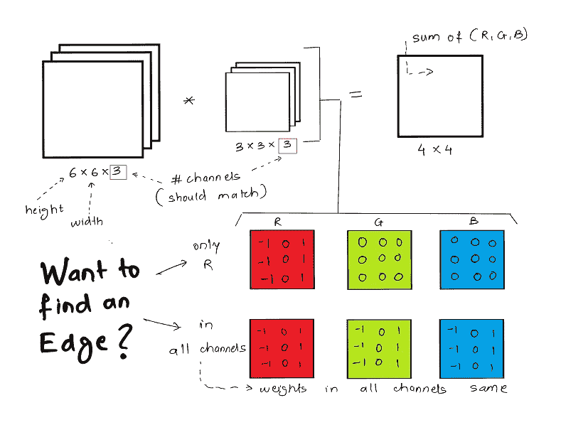
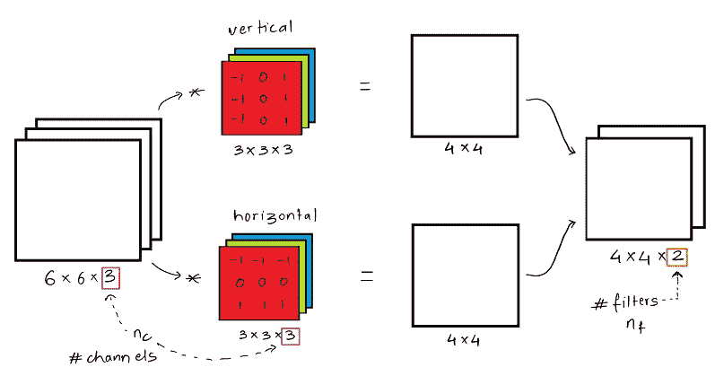
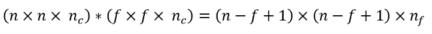
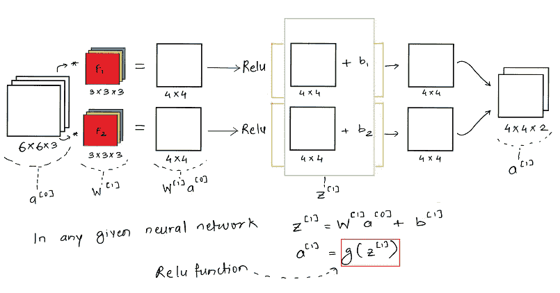
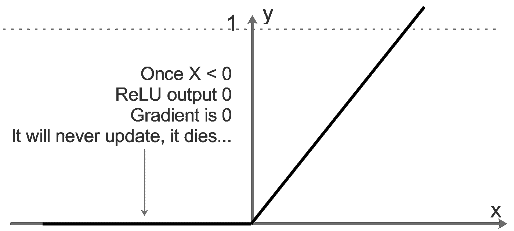
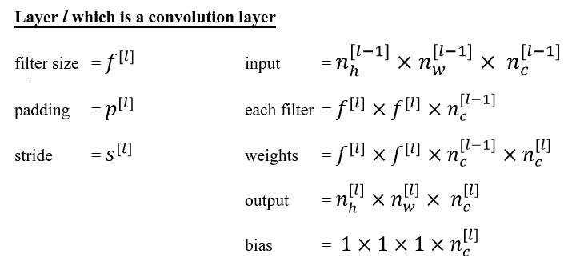
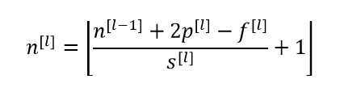

# 卷积神经网络— II

> 原文：<https://towardsdatascience.com/convolutional-neural-network-ii-a11303f807dc?source=collection_archive---------7----------------------->

继续我们在[上一篇文章](/cnn-part-i-9ec412a14cb1)中的学习，我们将在这篇文章中讨论以下主题:

*   体积卷积
*   一次多个过滤器
*   一层卷积网络
*   了解尺寸变化

我已经尽可能地通过插图来解释大多数主题。如果有些东西不容易理解，请告诉我。

> *我们开始吧！*

# 体积卷积

不要害怕读“音量”，这只是一种用一个以上的通道，即`RGB`或任何其他通道来表达图像的方式。

到目前为止，我们只有一个通道，所以我们只关心图像的`height`和`width`。但是，如果增加一个以上的通道，我们需要考虑所涉及的滤波器，因为它们还应该包含所有通道的卷积(此处为 3)。
因此，如果图像尺寸为`n x n x #channels`，那么之前的`f x f`滤波器现在也需要尺寸为`f x f x #channels`。

直观上，我们的输入数据不再是二维的，事实上，如果考虑通道，它是三维的，因此被命名为 **volume** 。

下面是一个体积卷积的简单示例，图像的尺寸为`6 x 6 x 3`，3 表示 3 个通道 R、G 和 b。类似地，滤波器的尺寸为`3 x 3 x 3`。

Fig 1\. Convolution over volume (colour image — 3 channels) with filter of dimension 3 x 3

在给定的例子中，滤波器的目的是检测垂直边缘。如果只需要在`R`通道中检测边沿，那么只需要根据要求设置`R`通道中的权重。如果您需要检测所有通道的垂直边缘，那么所有滤波器通道将具有如上所示的相同权重。

# 一次多个过滤器

很有可能你需要从一幅图像中提取许多不同的特征，为此你将使用多个过滤器。如果单独的滤波器被分别卷积，将增加计算时间，因此直接一次使用所有需要的滤波器更方便。

与单个滤波器的情况一样，单独执行卷积，然后将两个卷积的结果合并在一个堆栈中，以形成具有代表滤波器数量的第三维的输出体积。

下面的例子考虑了一个如上的`6 x 6 x 3`图像，但是我们使用了 2 个维度为`3 x 3 x 3`的过滤器(垂直边缘和水平边缘)。将每个`4 x 4`的合成图像叠加在一起，得到一个`4 x 4 x 2`的输出体积。

Fig 2\. Convolution over volume with multiple filter of dimensions 3 x 3

对于任何一般情况，可以使用以下公式计算输出尺寸:

Fig 3\. Equation governing the output image/signal dimension wrt input and filter dimension

这里，`nc`是输入图像中的通道数，`nf`是使用的滤波器数。

# 一层卷积网络

如果我们考虑一个卷积网络的一个层，而不考虑汇集层和展平，那么它将看起来接近这样:

Fig 4\. Single layer of convolution network only with Relu activation

重要的是要理解，像在任何其他神经网络中一样，卷积神经网络也具有输入数据`x`和模型权重，输入数据`x`在这里是图像，模型权重由滤波器 F1 和 F2 给出，即`W`。一旦权重和输入图像被卷积，我们得到加权输出`W * x`，然后我们加上偏差`b`。

这里的一个关键功能是`RELU`激活功能，它是一个整流线性单元。Relu 帮助我们将非线性添加到学习模型中，并帮助我们更好地训练/学习通用情况下的模型权重。

Fig 5\. Relu activation function

对于低于某个阈值(这里是 0)的值，relu 函数根本不更新参数。它就会死去。对于要考虑用于训练的特定训练示例，需要为要激活的神经元设置最小值。Relu 还帮助我们减少在大多数深度神经网络中面临的消失和爆炸梯度问题，因为 Relu 提供了有效的梯度传播。

# 了解尺寸变化

现在我们已经对单层中发生的事情有了概念性的了解，让我们用公式表示卷积网络的任何给定层`l`的轮廓。

Fig 6\. Equations governing change in input dimensions based on filters, padding and stride

计算单个组件尺寸后，层`l`的最终尺寸`n`可通过下式计算:

Fig 7\. Dimensions of last layer **l** with filter size **f**, padding **p** and a stride of **s**

# 结论

本文一开始，我们探讨了体积卷积，然后立即讨论了多个滤波器。很容易理解，这里的*体积*就是指图像数据的 3 个颜色通道。关于卷积网络的单个层的讨论对于掌握整个网络架构非常重要，所以要确保这些概念(relu、激活函数)是清楚的。最后一节讲述了我们如何根据滤波器卷积中使用的填充量和步幅来评估模型的层尺寸。

> 在下一篇文章中，我将详细解释各种 CNN 架构，并评估其独特的功能

*原载于 2017 年 11 月 18 日*[*mandroid 6 . github . io*](https://mandroid6.github.io/2017/11/18/Convolutional-Neural-Networks-II/)*。*

[https://twitter.com/mandroid_6](https://twitter.com/mandroid_6)

## 查看我关于机器学习和深度学习的其他帖子:[https://medium.com/@razzormandar](https://medium.com/@razzormandar)