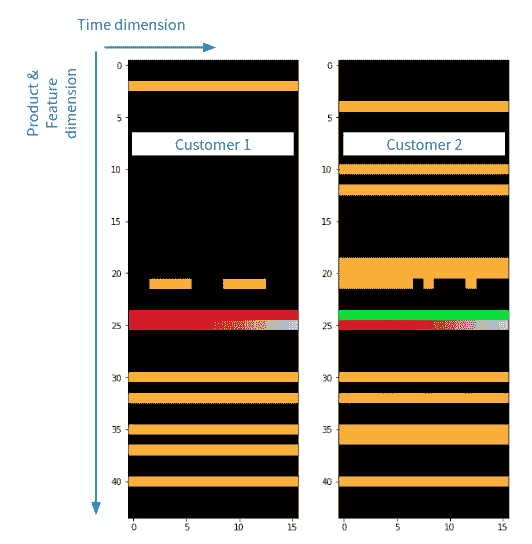
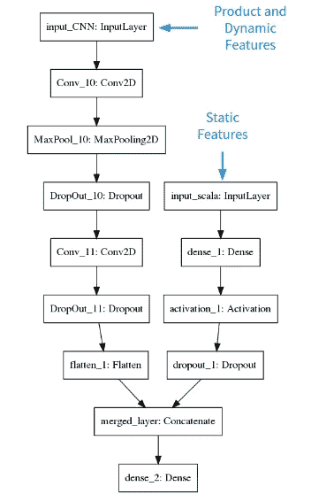
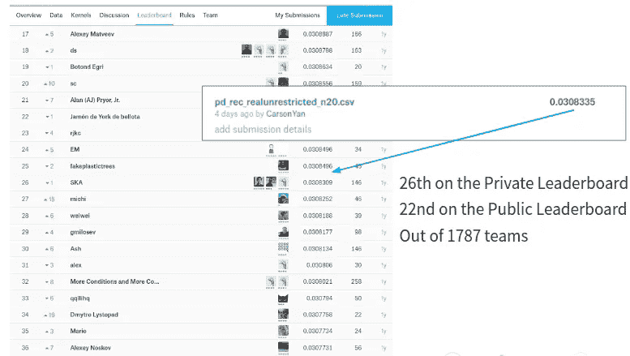
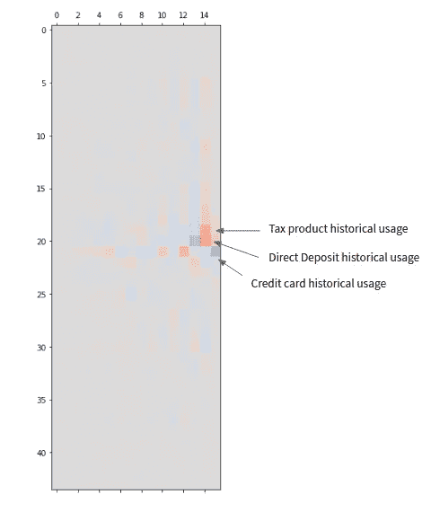

# 基于结构化银行客户数据的卷积神经网络

> 原文：<https://towardsdatascience.com/convolutional-neural-network-on-a-structured-bank-customer-data-358e6b8aa759?source=collection_archive---------1----------------------->

## 一个案例研究证明了 CNN 的价值，即使你没有处理计算机视觉问题。

作为一名为传统银行工作的定量分析师，我坐在一旁看着深度学习颠覆和改变了相当多的行业，但对它对我所在行业的实际用处持怀疑态度。你知道，可能有一些应用程序，如捕捉支票图像或聊天机器人，但当涉及到贷款业务的核心问题时，如信用风险、欺诈风险和营销等问题，我们处理的数据是非常结构化的，这些数据可以放入二维或三维表格中。深度学习在这里似乎有些矫枉过正。或者是？多年来，我已经看到了一些在非图像数据上成功使用卷积神经网络(CNN)的例子，但所有这些例子似乎都具有复杂的空间数据结构，算法可以利用这种结构。此外，银行仍在努力从线性模型过渡到更复杂的模型，如 GBM。深度学习似乎太遥远了。带着许多疑问，我开始了一个为期 3 周半的旅程，使用[桑坦德产品推荐 Kaggle 竞赛](https://www.kaggle.com/c/santander-product-recommendation)数据构建卷积神经网络。剧透一下——CNN 在结构化数据方面也做得非常好！

# 问题是

2016 年，桑坦德银行(西班牙)在 Kaggle 上举办了他们的第二次比赛。他们向 Kaggle 社区发出挑战，要求他们根据现有客户和类似客户过去的行为，预测他们的现有客户在下个月将使用哪些产品。数据集捕获客户信息的每月快照，一些是人口统计信息，如性别、年龄、收入和位置信息，一些是关系信息，如任期、关系类型等。该数据还跟踪每月客户的产品使用情况。这家银行提供 24 种产品，包括支票、储蓄、抵押贷款、信用卡等。如果客户在某个月使用了某个产品，则使用指标设置为 1，否则为 0。任务是根据客户 2015 年 1 月至 2016 年 5 月的产品使用情况以及 2015 年 1 月至 2016 年 6 月的其他信息，预测 2016 年 6 月的所有 24 个使用指标(但他们只关心那些从 0 变为 1 的使用情况)。为模型性能选择的指标是 [MAP@7](https://medium.com/@pds.bangalore/mean-average-precision-abd77d0b9a7e) ，它衡量推荐与客户的实际使用有多相关，以及推荐的排名顺序有多好(想想你会如何衡量从谷歌关键词搜索返回的第一页的有用性:结果越相关越好；结果从上到下的实际顺序与您的预期越一致，就越好)。由于一个客户在某个月可以使用多种产品，这是一个多类多标签的分类问题。

在宽客/经济学家的世界里，这种数据通常被称为“[面板数据](https://en.wikipedia.org/wiki/Panel_data)”。这些数据没有什么特别的，如果目标被一个默认标签代替，它可能是一个[行为记分卡](https://www.creditcards.com/glossary/term-behavior-score.php)模型的很好的数据集。然而，它确实包含一个时间维度和一个 sudo 空间维度(产品使用), CNN 或许可以利用这一点。

# CNN 的力量——特色工程

一般来说，如果没有广泛的特征工程，你不可能赢得一场竞争。在这种情况下也不例外，请看本次比赛的两个获奖方案:[第二](http://blog.kaggle.com/2017/01/12/santander-product-recommendation-competition-2nd-place-winners-solution-write-up-tom-van-de-wiele/)和[第三](http://blog.kaggle.com/2017/02/22/santander-product-recommendation-competition-3rd-place-winners-interview-ryuji-sakata/)名。特征工程在这两者中都扮演了重要的角色。他们想出了输入数据的智能转换，努力得到了回报。

下图显示了 CNN 算法的概念。最终密集连接的神经网络之前的卷积/汇集层用于从输入图像中提取和抽象模式。换句话说，对预测任务有用的工程特征。

我的计划是把专题工程任务交给 CNN，自己不做任何工程。怎么会？通过将客户数据转换成类似图像的结构。在这种情况下，每个客户都有一个时间维度(从他们开始与银行建立关系到 2016 年 5 月)，最大 17 个像素，以及一个 24 个像素的产品维度。收入和与银行的关系等一些特征随着时间的推移发生了变化，所以我最终得到了一些 45×17 像素的低分辨率“图片”，这些图片捕捉了我需要了解的关于客户的所有信息。

Two samples of customer pictures plotted with nipy_spectral colormap

你可能想要设计的一些特征，比如“产品的上个月指数”，“到上个月为止指数从 0 到 1 的转换次数”或者“产品 A 和 B 一起使用的频率”——如果它们有用，它们将成为 CNN 检测的图像中的模式。这最棒的部分是什么？我不需要提出什么特征转换可能有用的假设，我可以去喝杯茶，同时算法勤奋地工作以发现有用的特征组合，其中一些可能超出我的想象。我确实提出了一个假设——如果一个顾客改变了他/她的性别，那么这个顾客的行为和产品使用会因为荷尔蒙和社会互动的变化而有所不同。但是没人变性。相当令人失望。

# 模型

我使用 Keras 和 Tensorflow 后端来构建 CNN。该模型有两条路径——一条路径执行卷积/汇集/丢弃操作，然后连接到密集连接的神经网络，另一条路径只执行简单的密集连接的神经网络，因为某些功能不会随着时间的推移而改变，或者以结构化的方式(例如，任期)为特定客户而改变。该模型有大约 55K 个参数——如果与典型的 CNN 图像识别模型相比，这是一个小网络。我花了大部分时间调整模型的结构(层、节点)，没有调整其他超参数，如辍学率、L1 和 L2 惩罚。

# 结果和收获

我建立的 CNN 模型在 1787 个团队中，在私人排行榜上排名第 26，在公共排行榜上排名第 22。比赛已经结束了，所以我的表演不会被放在那里。然而，这比我的预期好得多。

我可以做更多的调整和模型组合来进一步推动它，但这不是练习的重点。要点是，CNN 在对结构化银行数据建模时也非常有用！我担心，像我这样的银行定量分析师再也不能舒舒服服地坐在椅子上，认为深度学习不会扰乱我们的行业。这可能不会是明天，因为所有的监管审查，但没有理由认为一个自动化，高效和有效的算法不会至少与我们共存。毕竟，几十年前定量分析师和统计学家取代了承销商，因为承销的统计模型比当时的承销商更加自动化、高效和有效。

# 解读

到目前为止开发的用于解释 CNN 的工具倾向于针对图像问题。但由于它是一个神经网络，人们可以随时查看梯度，并了解为什么模型会做出某些预测。我们知道模型是可微分的，因此通过使用一阶[泰勒级数](https://en.wikipedia.org/wiki/Taylor_series)近似，我们可以用输入(在这种情况下，特定客户的特征值)周围的线性函数来近似模型，然后我们可以使用预测相对于输入的梯度来显示输入的变化如何影响预测。下面是一张预测信用卡使用的梯度“图片”,与客户的输入值有关。蓝色块表示负值，红色块表示正值。

亮红色块显示，如果客户在最近 2 个月使用了直接存款，他/她将更有可能在 2016 年 6 月使用信用卡。蓝色块显示，如果客户在 2016 年 5 月使用信用卡，他/她在 2016 年 6 月使用信用卡的可能性将大大降低。猜猜看，这是因为我手动将目标指标更改为 0，而前一个月的使用量为 1，因为 Santander 只想知道谁从不使用产品变为使用产品。事后看来，我应该使用原始指标，建立模型，并使用后处理规则来处理，因为手动调整成为模型需要学习的另一件事。然而，模型能够学习调整的事实表明模型正在做正确的事情。

# 最后的想法

我把这个展示给了当地的数据科学家社区，他们觉得非常有趣。提出的一个问题是为什么 CNN 而不是 RNN(循环神经网络)。毕竟，用 RNN 对时间序列数据建模更有意义。这场比赛的第 15 名获胜者似乎使用了 RNN 作为他们的算法。很难说 RNN 在这种情况下一定更好，因为我建立的 CNN 有点粗糙，我没有做很多调整和模型组合。然而，应该注意的是，时间相关性信息可能会在卷积和池化过滤器中丢失，因此 CNN 可能并不总是适用于时间序列问题。不过，与 RNN 模型相比，CNN 的优势在于相对容易训练。