# 卷积神经网络在游戏中驾驶车辆

> 原文：<https://towardsdatascience.com/convolutional-neural-network-to-steer-a-vehicle-inside-a-game-2aab41a5ef60?source=collection_archive---------11----------------------->

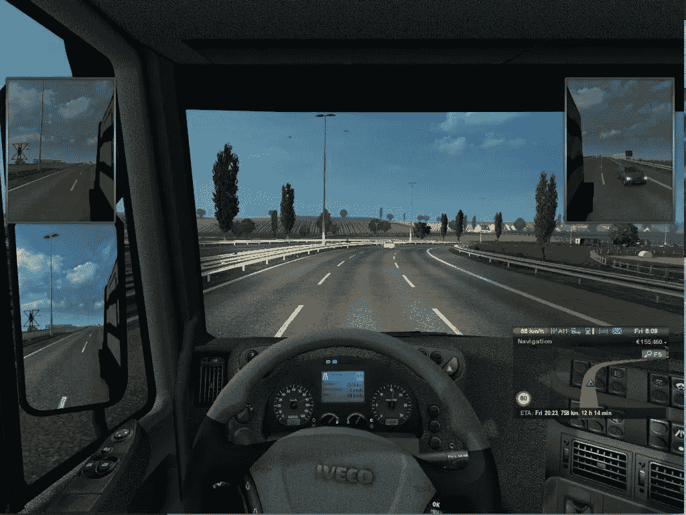

大约两年前，英伟达发表了 [PilotNet 论文](https://arxiv.org/abs/1604.07316)，以端到端的方式展示了自动驾驶汽车的卷积神经网络(CNN)。在这篇文章中，我想展示我是如何在游戏中使用这个架构来预测车辆的方向盘轴线的。我已经将转向角预测公式化为回归问题。

任何有监督的机器学习问题都是在有标签的数据(X，Y)上工作的。其中 **X** 是输入， **Y** 是输出。学习算法学习映射函数 Y = f(X)。在这个问题中，输入 X 是任意给定点的道路图像，输出 Y 是方向盘轴。

## 资料组

我从[这里](https://github.com/marsauto/europilot#sample-training-data)获得了大约 16 万张图像的数据集。该数据集是通过以 10fps 的速度驾驶大约 5 个小时，通过游戏杆捕捉游戏窗口和方向盘轴的截图而生成的。方向盘轴不是以度为单位，而是以操纵杆的不同刻度为单位，范围从-10k(左转)到 10k(右转)。原始图像大小为 1024 X 768 X 3 像素。这里有一些例子图片—

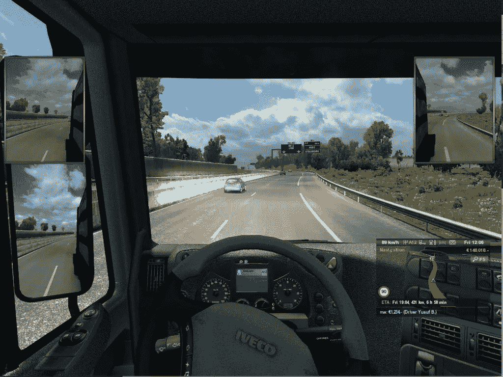

Driving in the daylight

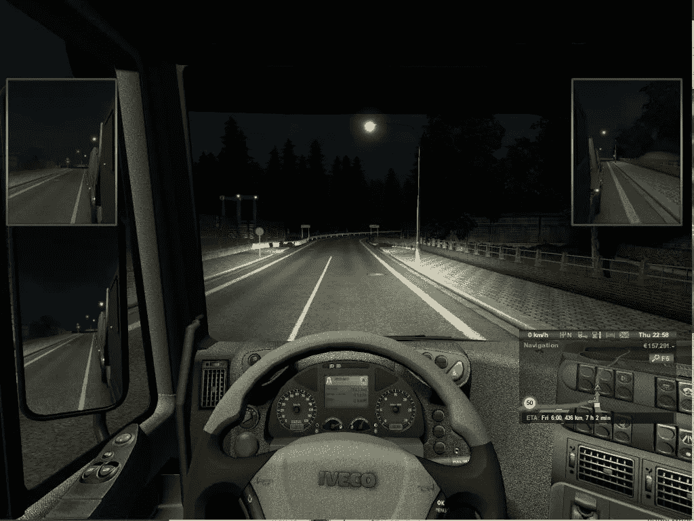

Driving at the night

图像的大部分不是很有用，因此感兴趣区域(ROI)被裁剪并按比例缩小以获得尺寸为 200 x 66 x 3 的图像。

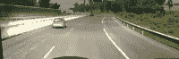

ROI(200 x 66 x 3)

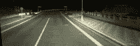

ROI(200 x 66 x 3)

这是数据准备的一个重要部分，因为裁剪确保了学习算法只关注 ROI，而不是整个图像，缩小比例确保了网络没有太多的输入参数。

整个数据被混洗，然后分成训练集(87%)和验证集(13%)。具有超参数调整的模型训练在训练集上完成，而验证集用于检查模型的最终准确性。洗牌确保了训练集和验证集都有来自所有不同驾驶条件的数据，如白天、夜晚、下雨等。

现在来看标签，这是方向盘轴的直方图。正值对应于右转的方向盘旋转量，反之亦然。

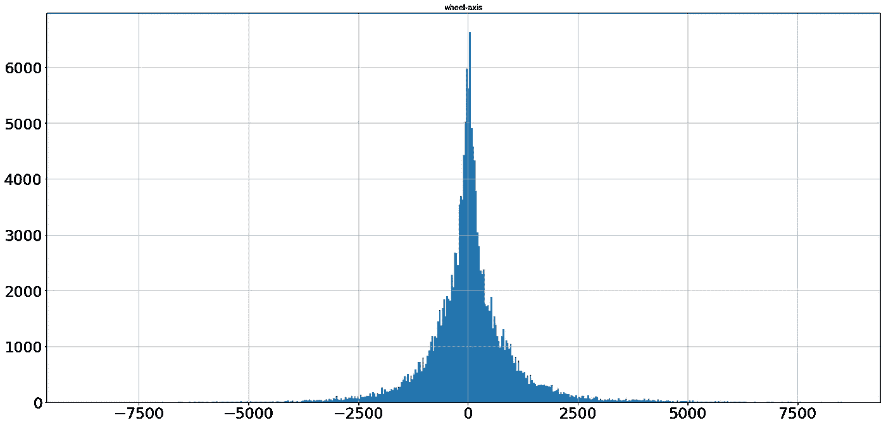

Distribution of steering wheel axis (labels) BEFORE Augmentation

急转弯的例子很少，大多数数据在-2500 到 2500 之间。此外，由于这种分布是正常的，均方差(MSE)损失(已用于回归)应该工作得很好。

此外，**数据通过水平翻转图像并因此翻转转向轴而得到增强**。

```
if(np.random.choice(2, 1)[0] == 1):
    pil_img = pil_img.transpose(Image.FLIP_LEFT_RIGHT)
    label = -1 * label # Changing the direction of wheel axis.
```

这几乎使训练数据翻倍。

## 网络体系结构

我选择了 Nvidia 著名的 [PilotNet 架构，并做了一些修改。这是最初的建筑](https://arxiv.org/abs/1604.07316)


Source [Nvidia blog](https://devblogs.nvidia.com/deep-learning-self-driving-cars/)

为了更快的训练，我在每一层之后增加了**【BN】**(在卷积层的信道轴上)。我也尝试使用**辍学**进行正规化，但这似乎并不影响准确性，因此删除了它。关于何时应用 BN 有许多[争论，BN](https://www.reddit.com/r/MachineLearning/comments/67gonq/d_batch_normalization_before_or_after_relu/)是在非线性之前还是在非线性之后。因为我在每一层使用了 **Relu 激活**，在 Relu 激活后应用 BN 是**增加了隐藏层激活的平均值并减少了方差**，因为 BN 没有考虑负面激活。因此，我在非线性**、**后应用 BN，结果很好。

我将输入图像缩小到 200 x 66(与 PilotNet 相同)，以保持全连接层的参数较低(卷积层的参数不受影响)。这对于避免过度拟合非常重要。具有非常高的参数的模型具有高熵，并且它们倾向于过度拟合(即记忆训练集)。在低熵的情况下，梯度下降算法迫使模型学习数据中的重要模式，而不是记忆训练集。而参数很低也是不好的，因为模型可能什么也学不到。

可以通过使用最大池来避免参数的增加，但是它通常用于空间不变性，这在这种情况下是不期望的。

通过将输入像素除以 255 来归一化模型的输入。使用整个训练集的均值和方差来归一化输入图像有更好的方法，但这也很好。我使用没有任何正则化的均方误差损失。在验证集上测试了这些参数之后，我想出了所有这些设计选择。其余的网络参数保持不变。

这是我和`input_shape = (66, 200, 3)`一起使用的最终架构。

```
_________________________________________________________________
Layer (type)                 Output Shape              Param #   
=================================================================
conv2d_1 (Conv2D)            (None, 31, 98, 24)        1824      
_________________________________________________________________
batch_normalization_1 (Batch (None, 31, 98, 24)        96        
_________________________________________________________________
conv2d_2 (Conv2D)            (None, 14, 47, 36)        21636     
_________________________________________________________________
batch_normalization_2 (Batch (None, 14, 47, 36)        144       
_________________________________________________________________
conv2d_3 (Conv2D)            (None, 5, 22, 48)         43248     
_________________________________________________________________
batch_normalization_3 (Batch (None, 5, 22, 48)         192       
_________________________________________________________________
conv2d_4 (Conv2D)            (None, 3, 20, 64)         27712     
_________________________________________________________________
batch_normalization_4 (Batch (None, 3, 20, 64)         256       
_________________________________________________________________
conv2d_5 (Conv2D)            (None, 1, 18, 64)         36928     
_________________________________________________________________
batch_normalization_5 (Batch (None, 1, 18, 64)         256       
_________________________________________________________________
flatten_1 (Flatten)          (None, 1152)              0         
_________________________________________________________________
dense_1 (Dense)              (None, 100)               115300    
_________________________________________________________________
batch_normalization_6 (Batch (None, 100)               400       
_________________________________________________________________
dense_2 (Dense)              (None, 50)                5050      
_________________________________________________________________
batch_normalization_7 (Batch (None, 50)                200       
_________________________________________________________________
dense_3 (Dense)              (None, 10)                510       
_________________________________________________________________
batch_normalization_8 (Batch (None, 10)                40        
_________________________________________________________________
dense_4 (Dense)              (None, 1)                 11        
=================================================================
Total params: 253,803
Trainable params: 253,011
Non-trainable params: 792
```

我使用 Keras 和 Tensorflow 后端进行所有的实验和最终训练。

## 培养

该数据集在相邻图像之间具有非常高的相关性，因此对训练进行洗牌是很重要的。与此同时，在每个时期之后，数据集被重新洗牌，这样每个批次在多个时期中都是唯一的。

```
total data: 162495, training set: 140800, validation set: 21695
batch_size: 128, train_steps: 1100, val_steps: 170
```

由于 keras [没有用于回归](https://github.com/keras-team/keras/issues/5152)任务的 `[flow_from_directory](https://github.com/keras-team/keras/issues/5152)` [，我不得不编写自己的带有数据扩充的 data_generator。](https://github.com/keras-team/keras/issues/5152)

```
INPUT_NORMALIZATION = 255.0
OUTPUT_NORMALIZATION = 655.35 #picked this number to compare results with data source model.
img_shape = (66, 200, 3)
batch_size = 128
def generator(df, batch_size):
    img_list = df['img']
    wheel_axis = df['wheel-axis']    
    **# create an empty batch**
    batch_img = np.zeros((batch_size,) + img_shape)
    batch_label = np.zeros((batch_size, 1))
    index = 0 while True:
        for i in range(batch_size):
            label = wheel_axis.iloc[index]
            img_name = img_list.iloc[index]
            pil_img = image.load_img(path_to_data+img_name)
            **# Data augmentation **          
            if(np.random.choice(2, 1)[0] == 1):
                pil_img = pil_img.transpose(Image.FLIP_LEFT_RIGHT)
                label = -1 * label            
            batch_img[i] = image.img_to_array(pil_img)
            batch_label[i] = label
            index += 1
            if index == len(img_list):
                **#End of an epoch hence reshuffle**
                df = df.sample(frac=1).reset_index(drop=True)
                img_list = df['img']
                wheel_axis = df['wheel-axis']
                index = 0
        yield batch_img / INPUT_NORMALIZATION, (batch_label / OUTPUT_NORMALIZATION)
```

决定使用多大的迷你批次也很棘手。如果我们使用非常小的批量，计算的梯度可能会非常不准确，因此训练会有噪声。如果你选择一个非常大的批量，它可能不适合内存。我选择使用 128 作为迷你批次大小。

我使用具有动量和学习率衰减的随机梯度下降优化器来训练网络。

```
sgd = SGD(lr=1e-3, decay=1e-6, momentum=0.9, nesterov=True)
```

该模型在 CPU 上训练 41 个时期，持续约 30 小时，以实现 0.1166 的验证均方误差和 0.2429 的验证平均绝对误差(在第 36 个时期)，这对应于 20k 标度上 160 (=0.2429 x 输出 _ 归一化)的平均误差。

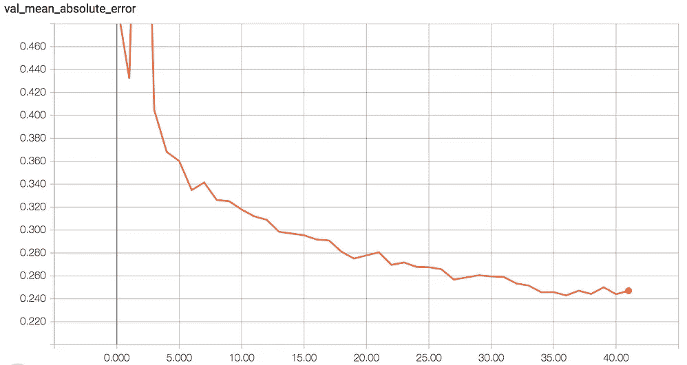

Validation MAE and MSE

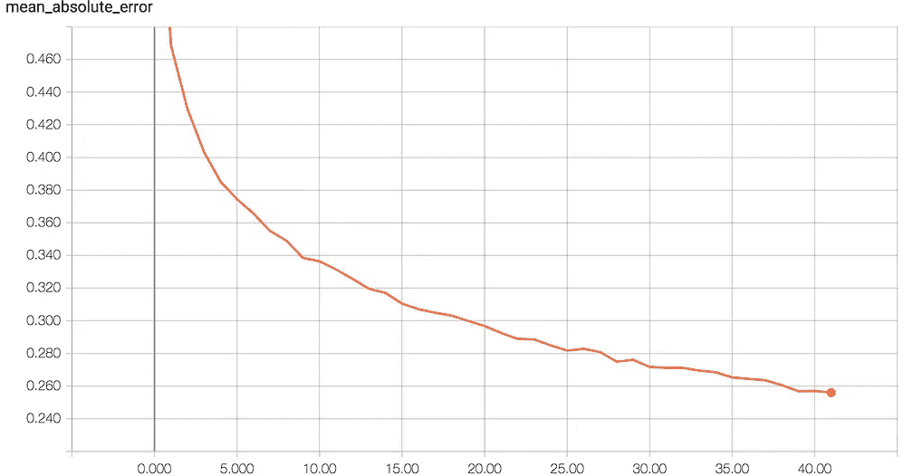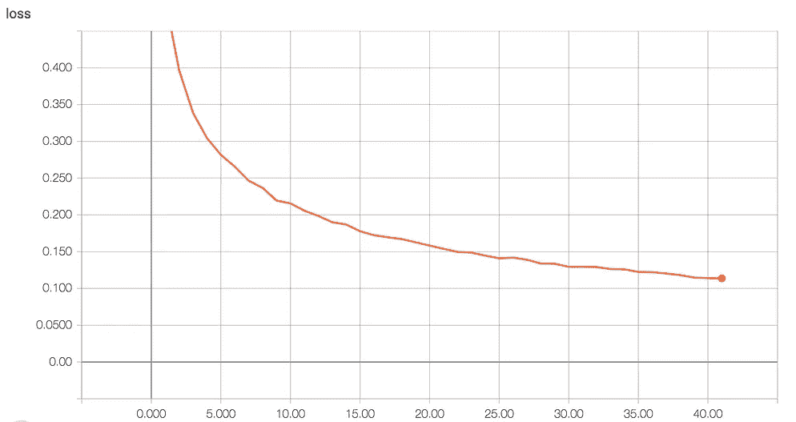

Training MAE and MSE

而训练批次规范化有助于更快的转换。与 20 个时期内没有批量标准化的架构相比，我能够在仅 9 个时期内通过批量标准化实现相同的 MSE 损失。

## 结果

以下是一些结果(提醒—负值表示左转，反之亦然)

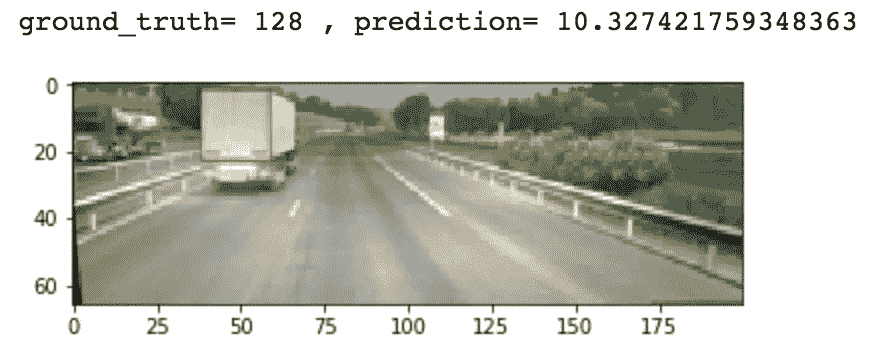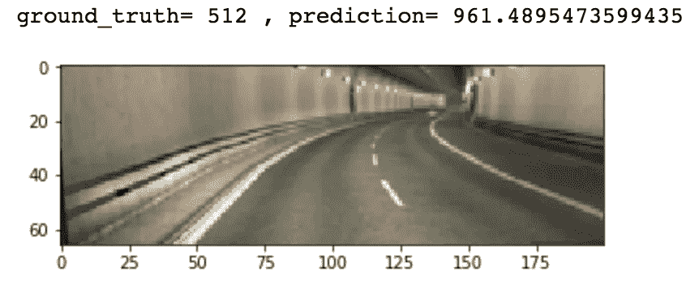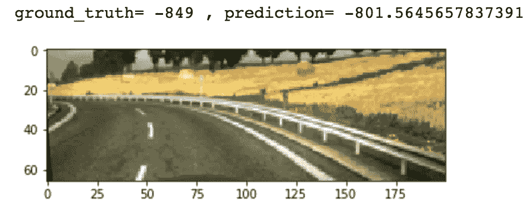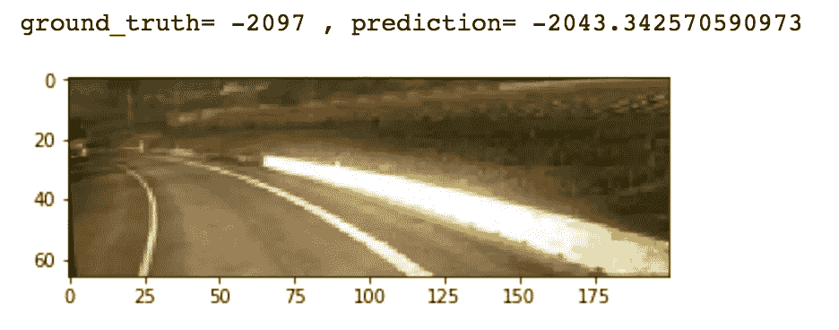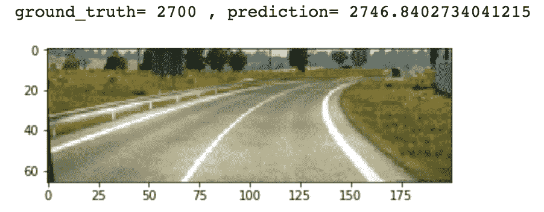

尽管急转弯的例子很少，但 model 仍然学会了这些模式。

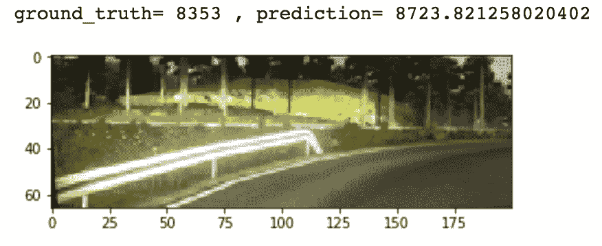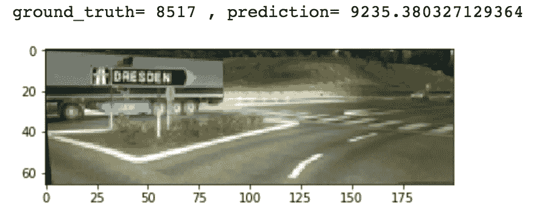

Sharp Right Turns

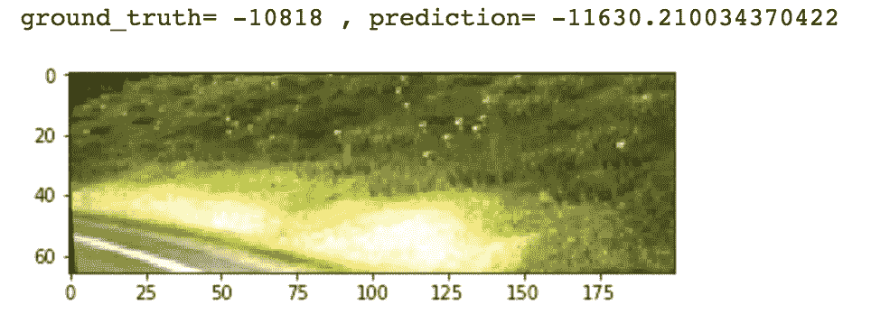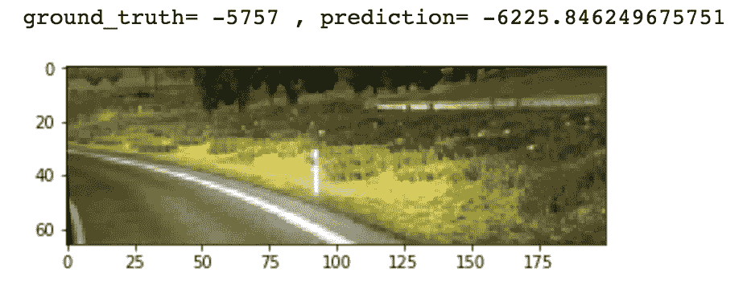

Sharp Left Turns

有些情况下，模型比真实标签表现得更好。

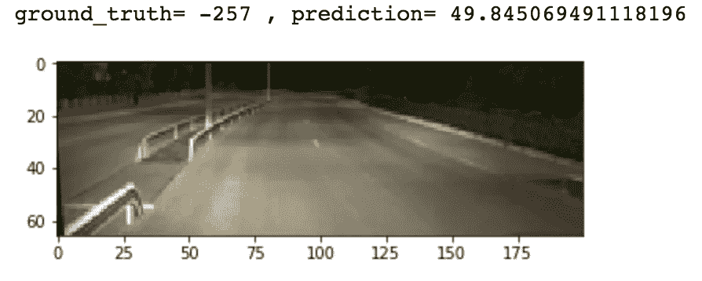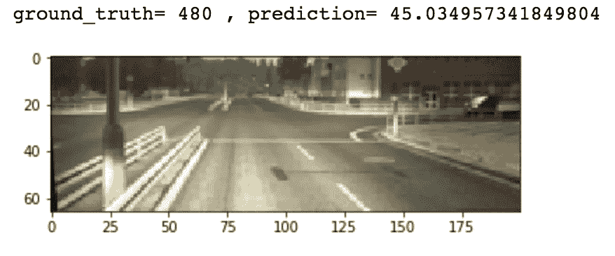

Model predictions are better than ground truth labels

在某些情况下，模型的表现不是很好。

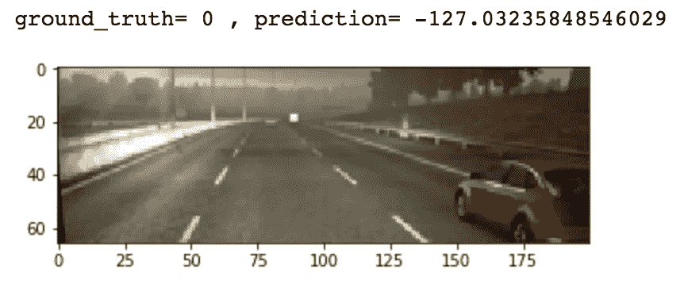

Model prediction are not very good

这篇文章的重量和代码可以在 [my Github](https://github.com/aryarohit07/PilotNetSelfDrivingCar) 上找到。

## 结论

对于这个项目，一个基于 CNN 的小型架构似乎工作得很好。我使用了各种技术，如数据处理(裁剪 ROI、缩放输入大小)、数据扩充、批量标准化，仅用大约 5 小时的行驶数据就实现了相当好的验证损失。这可以通过使用不同的架构，如[CNN-RNN](http://cs231n.stanford.edu/reports/2017/pdfs/626.pdf)网络来获得更好的结果，并通过使用其他梯度下降优化器，如 Adam、Adadelta 等来进一步改善。

如果你喜欢读这篇文章，请鼓掌并与你的同事和朋友分享。谢谢！

还有，我们来连线一下[脸书](https://www.facebook.com/aryarohit07)、[推特](https://twitter.com/arya_rohit07)、 [Linkedin](https://in.linkedin.com/in/aryarohit07) 和 [Github](https://github.com/aryarohit07/) 。