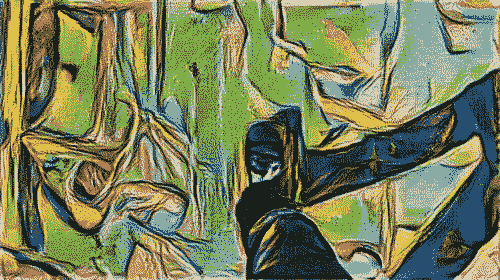
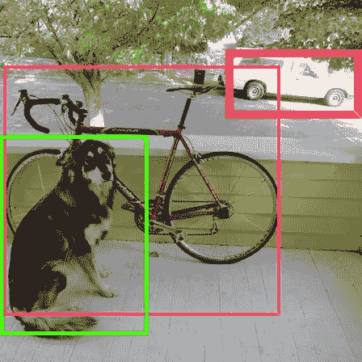
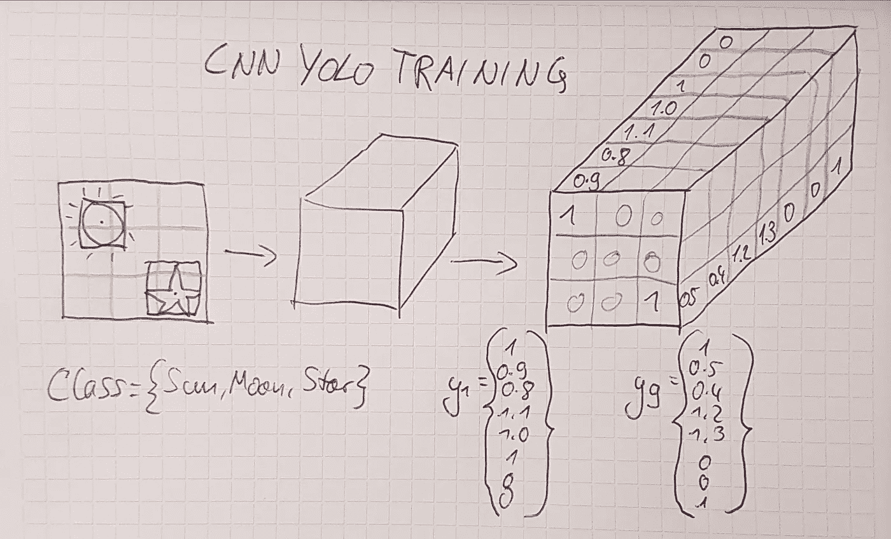
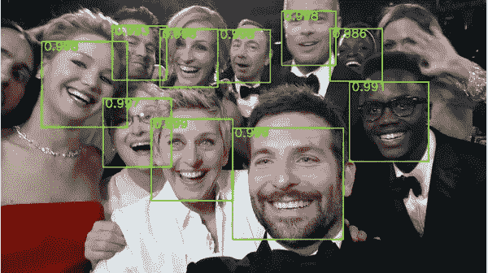
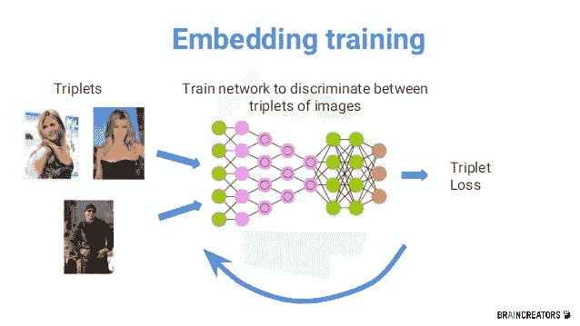
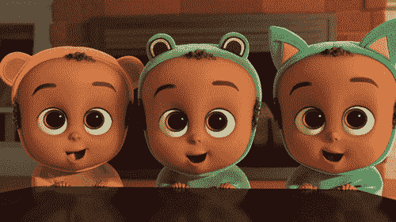
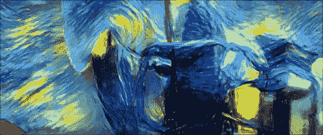
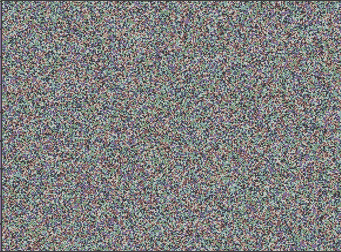
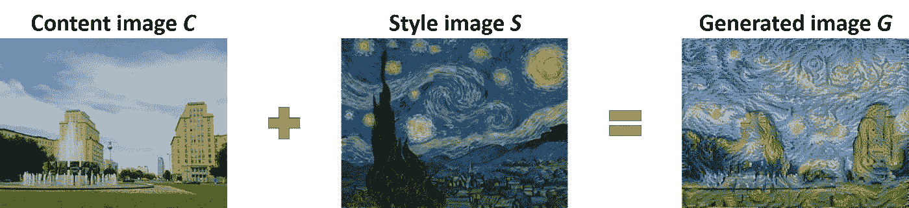

# 全卷积神经网络|第一部分

> 原文：<https://towardsdatascience.com/convolutional-neural-networks-for-all-part-i-cdd282ee7947?source=collection_archive---------5----------------------->

## 导师指导的学习指南，以应对 Coursera 深度学习专业化课程 4

Coursera 深度学习专业化课程的前三门课程是可以忍受的艰难，但接下来是 T2 课程第四门。这么多伟大的主题和概念！但是无数次停止视频、做笔记和重新观看讲座让我们，一群官方导师，决定学习指南值得努力。

Let’s walk this CNN tour until Neural Style Transfer together.

本学习指南三部曲的第一部分回顾了本课程涵盖的广泛概念。什么是卷积神经网络，YOLO 实际上是如何工作的？[第二部分](https://medium.com/machine-learning-world/convolutional-neural-networks-for-all-part-ii-b4cb41d424fd)总结了每一次演讲，并深入解释了顶层概念。第三部分提供了一个 deeplearning.ai 字典，帮助你整理 ng 大师的缩略语、专业术语和偶尔的笑话。

先把 CNN 课程最有意思的概念一个个分解一下。

# 卷积神经网络

## 什么是卷积神经网络？

卷积神经网络(CNN)是计算机视觉的首要深度学习模型。计算机视觉已经变得如此之好，以至于它目前在某些任务上击败了人类，例如[识别猫和狗的品种](http://www.nytimes.com/2012/06/26/technology/in-a-big-network-of-computers-evidence-of-machine-learning.html)，CNN 在这个成功故事中发挥了重要作用。如果你有一个涉及计算机视觉的任务，让它识别人脸或物体，CNN 是首选模型。

Convolving the pixels of an image.

## CNN 是如何工作的？

CNN 用于通过卷积来评估输入。输入与过滤器进行卷积，如上面的 *gif* 所示。这种卷积导致网络检测网络中较早层中的边缘和较低级别的特征以及较深层中更复杂的特征。CNN 与池层结合使用，它们通常在最后有完全连接的层，如下图所示。像在普通神经网络中一样运行前向传播，并通过反向传播最小化损失函数来训练 CNN。

Simple CNN architecture. Source: [https://goo.gl/dVSMQo](https://goo.gl/dVSMQo)

某些架构，如 ResNets 或 InceptionNets，可以加速 CNN 的训练。处理大量的图像和训练权重需要时间，因为有太多的联系。幸运的是，许多伟大的 CNN 已经被训练出来，像 [ImageNet](http://www.image-net.org/) 或 [VGG](http://www.robots.ox.ac.uk/~vgg/practicals/cnn/index.html) ，你可以重用他们的模型。吴恩达的建议是，在现有 CNN 架构和预训练模型的基础上使用迁移学习，快速开始你的计算机视觉任务。

# **通过 YOLO 探测物体**

## 什么是 YOLO？

YOLO 是一种也实时工作的多目标检测算法。图片[自动驾驶汽车在行驶中需要识别汽车、行人、红绿灯](https://www.youtube.com/watch?v=OksuVuNY5o0)或者[简单标注一部电影](https://www.youtube.com/watch?v=VOC3huqHrss)。YOLO 非常快，因为“你只看一次”，这意味着你运行一个单一的前向传播步骤，你立即知道一个对象在图像中的确切位置和这个对象属于哪个类。作为顶端的樱桃，YOLO 能够检测图像中的多个对象。

Output of YOLO object detection. Source: [https://goo.gl/yefAZa](https://goo.gl/yefAZa)

## YOLO 是如何工作的？

要使用 YOLO 训练 CNN，首先必须在训练图像上放置一个网格，例如形状为 3×3 的网格。接下来，为每个格网创建输出标签。在每个网格中的对象周围绘制一个边界框，并相应地标记输出向量。给尽可能多的图像加标签。CNN 的最后一层具有来自输入图像的网格单元的形状，宽度和高度以及与单个输出向量中的元素数量一样多的通道。

How to label your training set for YOLO.

反向传播调整 CNN 的权重，以便它学习识别对象。您可以使用非最大抑制来确定对象的最佳边界框。如果在同一个网格单元中遇到多个对象重叠，可以使用定位框来分隔这些对象。这些细节在[第二部分](https://medium.com/machine-learning-world/convolutional-neural-networks-for-all-part-ii-b4cb41d424fd)中有更详细的解释。

# **人脸识别**

## 什么是人脸识别？

人脸识别用于根据人脸图像来识别一个人。虽然人脸验证是根据人脸来验证一个人是否是他们声称的那个人，但人脸识别要复杂得多，因为您要尝试将那个人的脸与人脸图像数据库进行匹配。此外，你经常必须通过一次性学习来识别一个人，这意味着你必须根据一张图像来识别她，并检查它是否与数据库中的任何图像足够相似——相当困难！

Their faces are detected! Now we can check if these faces belong to people who are allowed to be there. Source: [https://goo.gl/ubrq3H](https://goo.gl/ubrq3H)

## 人脸识别是如何工作的？

你的目标是学习一个相似性函数，例如三重损失。相似性函数旨在检测不同组图像上的人是否相同。三元组损失函数需要三个图像来计算相似性:一个锚、那个人的正面和负面例子。三元组损失函数基于锚图像调整权重以最大化正图像和负图像之间的差异。基于三重损失的输出，CNN 决定是否识别该人。确保使用 hard 为相似性函数训练图像。

Triplet loss learns that the similarity between two images of Jen Aniston should be bigger than between Jen Aniston and LL Cool J. Source: [https://goo.gl/hWn8jJ](https://goo.gl/hWn8jJ)

Good example of a difficult to train image triplet for the similarity function.

# **神经风格转移**

## 这是什么？

神经类型转移是一个有趣的应用程序，将提高您对 CNN 的理解。本质上，你试图生成一个新的图像，将一个图像的内容与另一个图像的风格结合起来，比如说来自一个受欢迎的艺术家。你想知道毕加索会怎么画你吗？去吧，用神经风格转移自己尝试一下！

Van Gogh’s Starry Night applied to a GIF.

## 神经风格转移是如何工作的？

在神经风格转移中，您从生成的图像 *G* 开始，它包含随机像素值，如下所示。接下来，您定义一个内容图像 *C* 和一个样式图像 *S* ，您想要组合它们。您的目标是调整 *G* 中的像素值，以便 *G* 变得与 *C* 和 *S* 相似。为此，您需要定义成本函数 *J(C)* 和 *J(S)* ，并尝试最小化这两个函数。

Random pixel values to start NST.

*J(C)* 确保 *G* 看起来与 *C* 中的内容相似。你知道，CNN 学习识别较低级别的特征，如早期隐藏层中的边缘，以及更复杂的特征，如后期隐藏层中的人脸。在 CNN 中间选择一个隐藏层，用 *C* 和 *G* 进行正向传播。接下来，比较两幅图像的激活值，并通过反向传播尽量减小激活值之间的差异。

接下来，你还必须调整 *G* 的样式，以匹配 *S* 中的样式。最小化 *J(S)* 的关键是调整 *G* 中通道激活之间的相关性，以匹配 *S* 。你可以通过计算 *S* 和 *G* 的 Gram 矩阵来实现。Gram 矩阵计算每一对可能的滤波器组合。接下来，你选择 CNN 中间的一层，再次为 *S* 和 *G* 运行前向传播。 *J(S)* 通过反向传播最小化 gram 矩阵之间的差异，并使 *G* 看起来更类似于 *S* 。

Beautiful, historic Strausberger Platz in Berlin combined with Van Gogh’s Starry Night through NST.

最酷的是，神经网络学会了调整像素值，而不仅仅是权重！这是一种非常直观的研究和理解 CNN 的方式，我鼓励你创建自己的神经风格传输图像。

声明:所有功劳归于 [deeplearning.ai](http://deeplearning.ai/) 。虽然我是一名导师，但我只是总结和重新表述内容，以帮助学习者进步。

第一部分是一个包，关到第二部分和第三部分的[。如果你认为这篇文章是有帮助的，不要忘记展示你的💛穿过👏 👏 👏并关注我，听更多关于深度学习、在线课程、自动驾驶汽车、生活的文章。还有，](https://medium.com/machine-learning-world/convolutional-neural-networks-for-all-part-ii-b4cb41d424fd)[查一下](https://medium.com/machine-learning-world/netflix-or-coursera-how-to-finish-andrew-ngs-1st-deep-learning-course-in-7-days-6fa293ee83d8) [这些](/https-medium-com-janzawadzki-applying-andrew-ngs-1st-deep-neural-network-on-the-titanic-survival-data-set-b77edbc83816) [关于深度学习专精的帖子](/structuring-your-machine-learning-project-course-summary-in-1-picture-and-22-nuggets-of-wisdom-95b051a6c9dd)。请评论分享你的看法。干杯！🙇