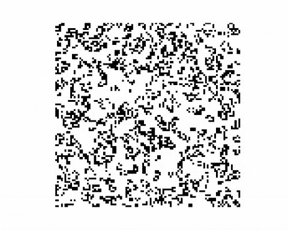

# 康威在搅拌机中的生活游戏

> 原文：<https://towardsdatascience.com/conways-game-of-life-in-blender-6dd84cd22fa1?source=collection_archive---------3----------------------->

《生命的游戏》( GOL)可能是细胞自动机最臭名昭著的例子之一。

由数学家约翰·何顿·康威定义，它在一个二维网格上展开，每个细胞可以处于两种可能状态中的一种。从初始网格配置开始，系统在每个单元步骤中仅考虑前一个配置。如果对于每个小区，我们将周围的八个小区视为*邻居*，则系统转换由[四个简单规则](https://en.wikipedia.org/wiki/Conway's_Game_of_Life#Rules)定义。

A basic plain-2D example

我对用 Blender 探索这种现象的可视化很感兴趣。以下是一些实验结果。

25x25 Cubes Grid with shrinking update function

20x20 Ico-Spheres Grid with shrinking update function

40x40 Cubes Grid with hiding update function

[这里的代码如果有人感兴趣](https://github.com/5agado/data-science-learning/tree/master/cellular%20automata)。这是一个可重用的脚本，你可以直接在 Blender 脚本界面中导入和运行。它定义了 GOL 逻辑，并将 GOL 网格到 Blender 的移植分解为两个可定制的组件:

*   **生成器**—负责生成将被映射到原始 GOL 网格中的单元格的 Blender 对象。一个生成器被精确地用来建立初始的混合网格，并带有首选的网格(例子:立方体，球体，猴子)。
*   **更新器** —基于 GOL 网格值定义 Blender 对象的更新行为。应该根据相应的网格值是 0 还是 1 来指定对象的变化(例如:缩放、隐藏)。

剩下的只是注册更新处理程序的帮助器代码，这样一个帧的改变会导致 GOL 网格的更新(可能包括关键帧)。
我建议一旦你得到你喜欢的结果就删除处理程序，这样额外的帧变化就不会再次触发更新并破坏你的结果。

## 3D 版本

我还试验了一个三维网格，它使用相同的规则集，同时将邻居的数量扩展到新的维度。

我计划更深入地研究 3D 概念，以找到更稳定的配置。另一个有趣的改进是拥有不受约束的网格，这意味着从初始配置开始的自动机可以在空间中无限增长。对于这种方法，我不得不重新制定我目前的代码逻辑，可能首先用一些替代 Blender 的方法进行实验，因为这里的家伙消耗了大量的资源，即使是这些简单的渲染，所以这方面的任何建议都是非常受欢迎的！

## 离题

玩这些细胞自动机的可视化在我的脑海中引发了像因果关系/目的论和[尘埃理论](http://www.gregegan.net/PERMUTATION/FAQ/FAQ.html)这样的概念。所有系统状态都是确定性定义的，但只能根据前一时间步的状态进行计算。有了缩放/收缩功能，系统的行为方式与其他类型的更新功能完全相同，改变的是单元相对于系统状态的行为。一个细胞在外力的作用下会立即收缩，以反映一个等于零的状态，但随后会随着自由意志的幻觉而进化到一个完整大小的新状态。实际上，这种增长只不过是关键帧填充。不是一个细胞的故事决定了它的未来，而是系统的未来决定了所有细胞生命的故事。