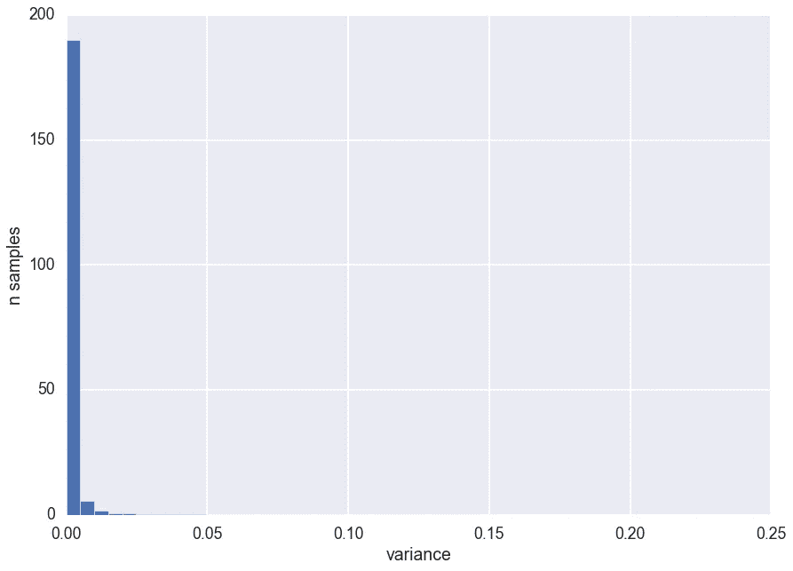
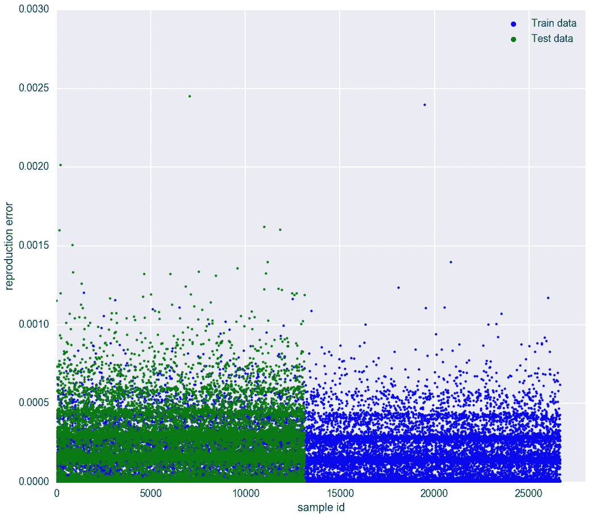
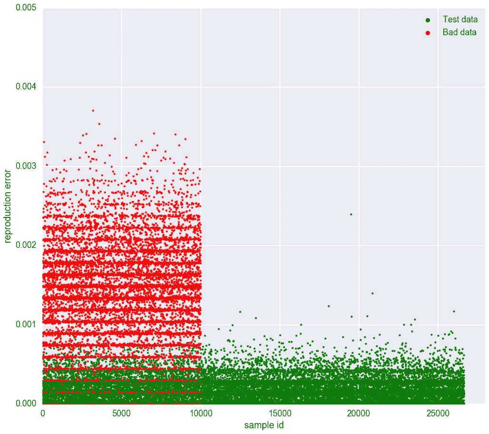
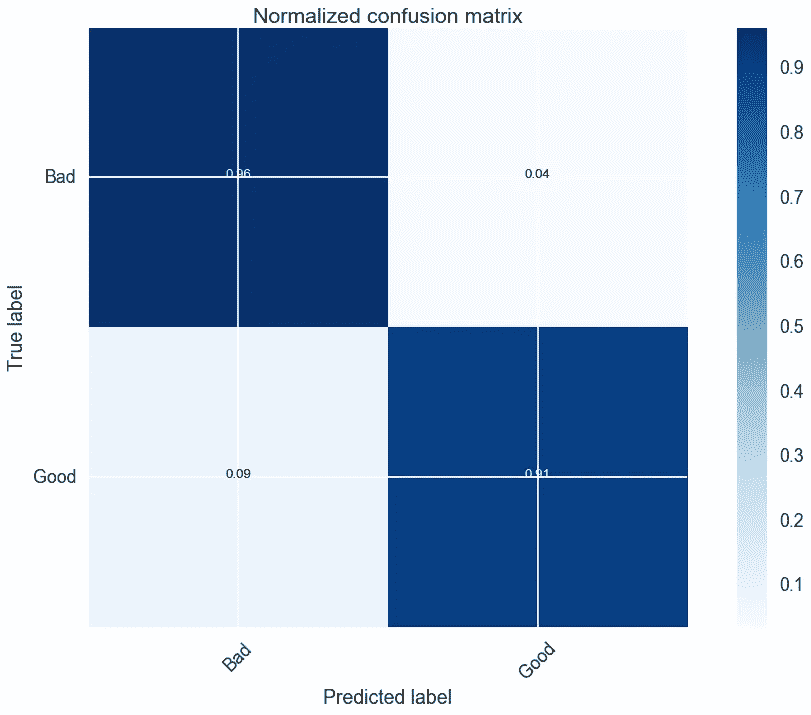
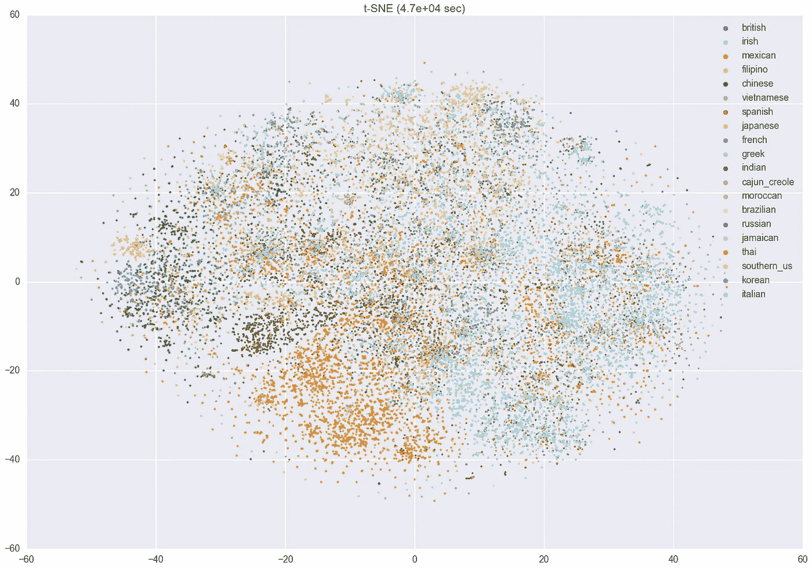

# 用机器学习烹饪:降维

> 原文：<https://towardsdatascience.com/cooking-recipes-with-pca-5c33a4acb7db?source=collection_archive---------7----------------------->

## 最近，我在 Kaggle 上偶然发现了这个烹饪食谱数据集，它启发我将生活中的两个主要兴趣结合起来。食物和机器学习。

这个数据集的特别之处在于，它包含了 20 种不同菜系的食谱，6714 种不同的食材，但只有 26648 个样本。有些菜系的食谱比其他菜系少得多。

对于这么多的数据来说，这是太多的功能了。在处理这个数据集之前，第一步应该是减少它的维数。在这篇文章中，我将展示如何使用主成分分析将这 6714 种成分缩减到一个只有 700 维的潜在空间中。作为奖励，我们将使用这个模型作为异常探测器。

数据如下所示:

```
{
 "id": 24717,
 "cuisine": "indian",
 "ingredients": [
     "tumeric",
     "vegetable stock",
     "tomatoes",
     "garam masala",
     "naan",
     "red lentils",
     "red chili peppers",
     "onions",
     "spinach",
     "sweet potatoes"
 ]
 },
```

最具挑战性的方面是它非常稀少，这里是每个食谱的成分分类:

```
mean 10.76771257605471
min 1   #rice!
max 65 #complicated fettuccine recipe
std 4.428921893064523
```

另一种方法是查看这个方差直方图:



如果我们放大一点:


这意味着平均起来，每行 6714 个特征只有 10 个特征是活动的。少于 1%。这使得将数据分成训练集和测试集变得困难。正因为如此，你很有可能最终得到两套完全不同的食谱。解决这个问题的一个好方法是对数据进行 k 倍折叠，但不是在这种情况下。数据太稀疏，不会有太大改善。

对于具有如此多特征的稀疏数据集，第一步通常是减少维数。[你没听说过维度诅咒吗？](https://en.wikipedia.org/wiki/Curse_of_dimensionality)

在这篇文章中，我将使用一种非常流行的方法来降低维度:PCA

## 转换数据

该忙起来了！让我们对数据做一些基本的转换。这里的主要思想是，因为我们有定性的数据，我们需要做一些被称为一次性编码的事情。长话短说:6714 食材-> 6714 栏目。当配方中有一种配料时，它的列将变为 1。其余的都是 0。平均而言，每行中只有 10 列是“活动的”。这段代码将创建“transformer ”,它将获得一种配料并输出其矢量表示

```
from sklearn.preprocessing import LabelEncoder
from sklearn.preprocessing import OneHotEncoder
from numpy import array
import jsonf = open('recipes_train.json', 'r')
recipes_train_txt = f.read()
recipes_train_json = json.loads(recipes_train_txt)#get list of ingredients
ingredients = set()
ingredients_matrix = []for recipe in recipes_train_json: ingredients_matrix.append(recipe["ingredients"])
    for ingred in recipe["ingredients"]: ingredients.add(ingred)ingredients = list(ingredients)ingredients.sort() #it made my life easier to have it sorted when i needed to check what is what in the encoded vectorvalues = array(ingredients) label_encoder = LabelEncoder()#gives a unique int value for each string ingredient, and saves the #mapping. you need that for the encoder. something like: 
#['banana'] -> [1]
integer_encoded = label_encoder.fit_transform(values) 

onehot_encoder = OneHotEncoder(sparse=False)
integer_encoded = integer_encoded.reshape(len(integer_encoded), 1)#here you encode something like : [2] -> [0,1,0,0,...]
onehot_encoded = onehot_encoder.fit_transform(integer_encoded)def transform_value(s):

    l = array([s])
    integer_encoded = label_encoder.transform(l)
    integer_encoded = integer_encoded.reshape(len(integer_encoded), 1)
    onehot_encoded = onehot_encoder.transform(integer_encoded)

    return onehot_encoded[0]
```

这段代码为我们提供了一个编码器，它将获得一个成分(字符串)作为输入，并输出其向量表示。包含所有配方成分的最终向量将是对这些成分向量中的每一个进行“逻辑或”运算的结果

## 主成分分析

PCA 是一个非常受欢迎的选择。它在输入新的简化数据集以使用 t-sne 可视化之前用作预处理工具，但也是您可能希望在输入机器学习算法之前用来简化您的特征的工具。

这是可取的，因为您拥有的功能越多，需要的数据就越多，学习过程就越慢。所以，把事情做小将会提升你的表现。

但是在最小化数据之前，你需要打一个电话:你想要多小？这里有一个权衡，你去的越小，你丢失的信息就越多。您可以通过使用与最小化数据相同的训练模型来测量，然后最大化回原始大小。之后，您可以比较这两个样本，并测量它们之间的差异(记住，当您下降时，您会丢失信息)。

所以，让我们只是训练一堆不同的模型，并选择一个具有很少特征但重建误差低的模型。


X 轴是分量向量的数量，而 Y 轴是整个样本的重建误差(使用 L2)。那些结果看起来不错，对吗？但是让我们在这里深入挖掘一下。700 似乎是一个安全的数字，在这个区域周围没有太大的改善。这已经是对 6714 功能的巨大改进。我们来对比一些看不见的数据，测试集。



这里我们可以看到，主成分分析在概括数据结构方面做得不错。训练均方误差~ = 0.000171%**测试均方误差~= 0.0002431%** 。还不错。

我们之前知道，数据平均有 10 种成分，标准偏差为 4.42。如果我们用这个分布创造一些‘随机食谱’(随机挑选配料)会怎么样？这可以使用高斯发生器来实现。如果 PCA 学到了什么，我们应该看到一些主要的重建错误。

```
for n_candidates in range(N_CANDIDATES):
    dna = [0 for i in range(N_INGREDIENTS)]

    n_flips = int(round(random.gauss(mu=MEAN, sigma=STD)))
    indexes_to_flip = [ random.randint(0, N_INGREDIENTS-1 ) for i in range(n_flips) ] for i in range(n_flips):

        dna[ indexes_to_flip[i]  ] = 1 BAD_DATA.append(dna)
```

让我们看看模型如何处理这些假数据。



这不是最初的目标，但看起来我们有一个很好的模型来检测异常配方。如果我们将阈值设置为 0.0004，并且将重构误差大于该阈值的任何事物视为异常，则我们得到以下矩阵:



## 结论

我们将这个数据集从 6714 个特征减少到只有 700 个。

我们现在可以得出结论，模型确实从训练集中学到了一些东西。我们试图欺骗 PCA 模型，我们了解到一些成分通常会在一起，而一些不会混合。您也可以使用这个模型作为异常检测，其中糟糕的食谱是异常的(您不应该吃那些！).也许作为一个后续项目，我可以尝试利用这种“学习”。

正如你所看到的，不同的菜系之间有一种模式。我们已经有了一个模型来检测不属于任何一种模式的异常配方，生成新配方会有多难？有可能创造新的法国菜吗？

