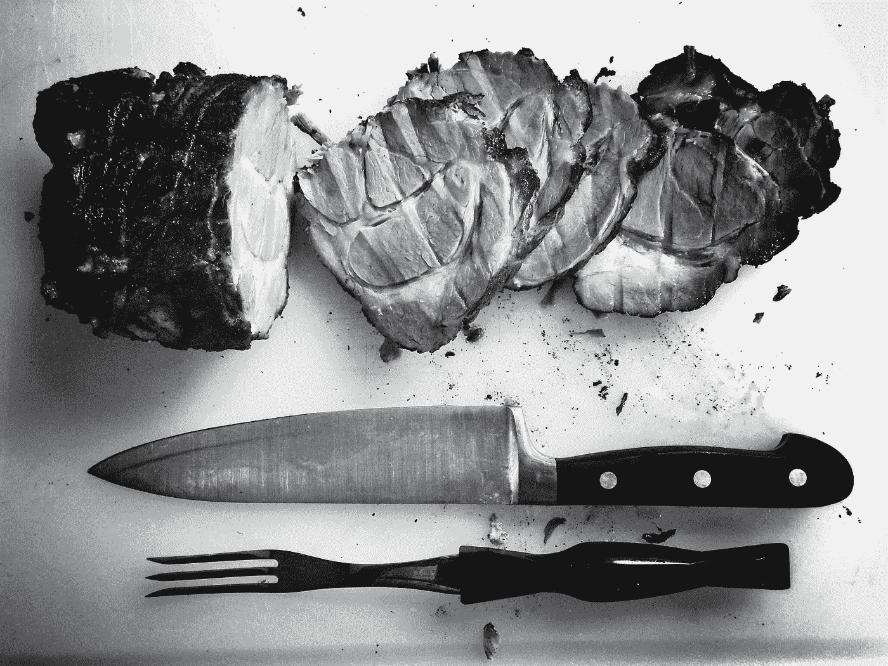
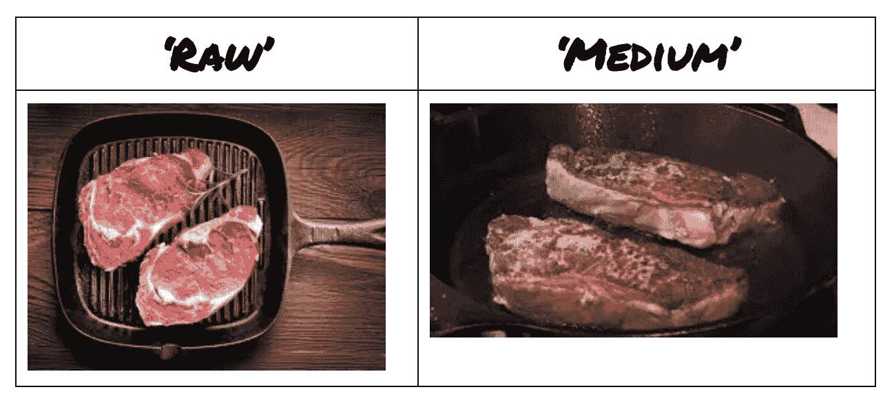

# 用计算机视觉烹饪

> 原文：<https://towardsdatascience.com/cooking-with-computer-vision-b87eb3bc247?source=collection_archive---------11----------------------->



为什么机器人给我们做饭要花这么长时间？

机器人和人工智能最有趣的应用之一，(即计算机视觉)，是在厨房里！有许多初创公司正在研究复杂的机器人厨师，并使用机器人来自动化烹饪过程，例如制作汉堡:

机器人烹饪的潜力远远超出了汉堡，在这篇文章中，我将讨论如何使用计算机视觉来自动化烹饪牛排、鸡肉和鱼肉等日常肉类的过程。本文中介绍的算法可以很容易地在用刮刀捆绑的 raspberry pi 相机中实现。

烹饪牛排是一项相当简单的任务，而且大多需要远见才能完成。只要我们的机器人厨师有一个摄像头和一个翻转和取出牛排的机械装置，(就像一把锅铲)，就可以走了。这里有一个简单的算法来说明机器人厨师应该如何烹饪牛排。

该算法的主要概念是，它将使用图像识别模型来处理来自摄像机的视频馈送中的图像。随着时间的推移，我们将利用**卷积神经网络**的惊人能力来处理牛排。有人可能会反驳说，你可以简单地用牛排的颜色直方图，随着时间的推移，从生的(红色)，到熟的(棕色)，进行比较。但是，在牛排上放调料、光线不好等情况下，CNN 会概括得更好。

这些图像不需要实时处理(或类似 1/30 帧/秒)，因为这不是一个真正的时间关键任务。为了节省计算资源和加速算法，我们将每隔 6 帧处理一次，以检查牛排的状态。此外，我们将在环路中支持更多烹饪牛排所需的基础设施。

***初始配置*** :建立一个图像分类器，将牛排从‘生的’，映射到‘生的’，‘三分熟的’，‘中等的’，‘五分熟的’，‘全熟的’。由于这些类遵循逻辑顺序，我们将只从 0 到 5 映射牛排。

**类别不平衡:**在具有罕见实例的数据集上训练分类器所涉及的一个常见问题是类别不平衡。例如，在为检测海洋中的鲸鱼鳍之类的事情构建图像分类器时，经常会讨论到这一点。由于大部分时间我们的牛排被分类为生的，我们将需要确保我们相应地评估我们的分类器的性能指标。

*一旦分类器达到约 95%的准确率，将牛排分类为生的或熟的，以 Pythonic 风格编写伪代码*

```
def cookSteaks(target):
timer = 0 # used to flip the steaks arbitrarily
side = True # flag used to label sides of the steak as cooked
side0Finished = False
side1Finished = False
Finished = False
seq = 0 # require 5 consecutive classifications to finishProcess every 6 frames
   Classify frame
   if (frame == target): # target indicates ['rare', ..' well-done']
     seq += 1
     if (seq == 5):
        if (side):
          side0Finished = True
          if (side1Finished):
            Finished = True
            exit;
          else:
            seq = 0
            flip()
        else:
           ....
    ...
   timer += 1
   if (timer == 120):
     flip()
     side = !side
     timer = 0
```

在没有完成伪代码的情况下，我认为算法背后的逻辑已经很清楚了。

我们在这里运行 4 个主要部分:

1.  **使用图像识别模型来处理来自视频流**的输入帧(不一定需要具有该任务的实时能力)。
2.  **由于分类模型**中的一些错误，需要连续的分类来触发响应，(如果没有大量的训练数据，95%的准确率将被认为是二进制分类任务的一个相当好的模型)，我们不能让机器人每次都用分类器来翻动牛排。在这个例子中，我们尝试使用 5 作为翻转的阈值，但是这可能太低了。
3.  **标志框住任务**，使用布尔标志引导循环，确保两面都被烹饪，并在烹饪过程中保持翻转。
4.  **任意翻转的计时器，**我们希望每隔 2 分钟左右任意翻转一次牛排，以确保我们不会只煎一面，然后翻转另一面，然后从头到尾煎完。我相信专业厨师有比这更好的策略，但这足以解决我们的问题

*收集用于训练分类器的数据*



我们将输入一个由这样的图像组成的数据集。基于观察平底锅的视角标记图像。

总之，我们看到烹饪肉类是一个相当简单的任务，不需要革命性的算法来完成。建立在卷积神经网络上的图像识别模型非常强大，可以在视频上使用，以实现令人惊叹的事情。我对机器人烹饪的未来感到非常兴奋，并看到这将如何改变食品市场，感谢阅读！

# [CShorten](https://medium.com/@connorshorten300)

Connor Shorten 是佛罗里达大西洋大学计算机科学专业的学生。对数据科学、深度学习和软件工程感兴趣。主要用 Python，JavaScript，C++编码。请关注更多关于这些主题的文章。