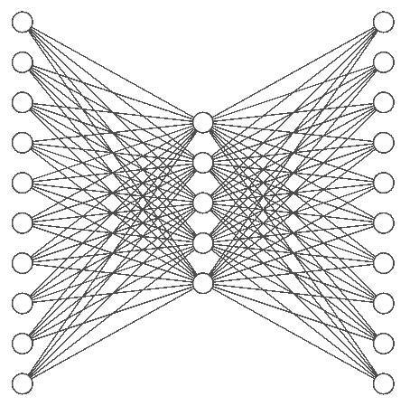
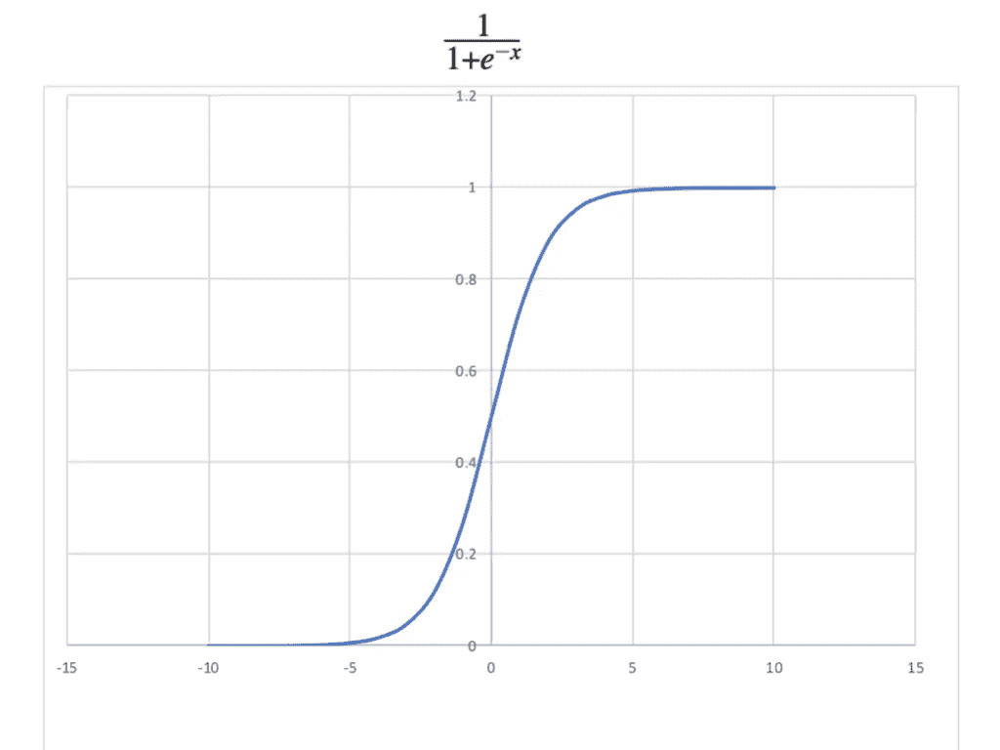
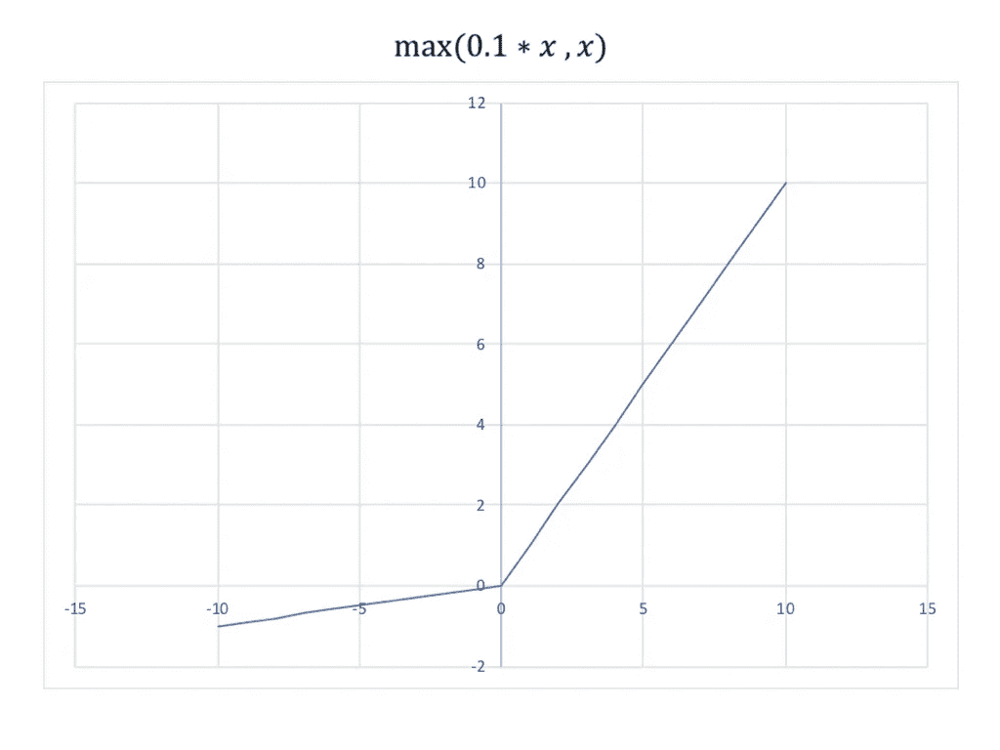

# 用机器学习烹饪:自动编码器

> 原文：<https://towardsdatascience.com/cooking-with-machine-learning-autoencoders-603002b278d5?source=collection_archive---------23----------------------->

这是关于在烹饪食谱上使用机器学习的机器学习系列文章的一部分。如果你错过了第一篇文章，请点击 [*这里*](https://medium.com/@diegotole/cooking-recipes-with-pca-5c33a4acb7db)

**前情提要关于 PCA**
在上一篇文章中，我们探讨了如何使用 PCA 来降低数据集的维数。此外，由于 PCA 通过探索变量之间的“线性”协方差来转换数据，因此它还可以用作异常检测器。因为任何不遵循初始数据集“结构”的配方都不会很好地转化。在我们的情况下，这意味着这是一个糟糕的食谱！更多信息请点击[此处](https://medium.com/@diegotole/cooking-recipes-with-pca-5c33a4acb7db)

**如果 PCA 工作正常，为什么要使用 autoencoder？** 在本文中，我们将通过使用自动编码器来击败 PCA。我们将压缩和解压缩数据，就像我们对 PCA 所做的那样，但我们的自动编码器不会受到“线性”变换的限制，这使得它更加强大。

什么是自动编码器？
简而言之，自动编码器是一种神经网络架构。主元件是中间的瓶颈，基于输入计算误差。所以你通过一个瓶颈挤压数据，并试图在另一端重建相同的输入。没错，没有标签或值被预测。你在努力找回你的输入。如果你成功了，你可以把它作为一个变压器来降低你的维度。您只需要捕获瓶颈层中的特性。

**普通自动编码器** 这是我们自动编码器的第一次迭代:

```
num_input = len(X_Total[0])
num_hidden_l = 700X = tf.placeholder(“float”, [None, num_input])w_encoder_h1 =  tf.Variable(tf.random_normal([num_input, num_hidden_l])w_decoder_h2 = tf.Variable(tf.random_normal([num_hidden_l, num_input])) encoder_b1 = tf.Variable(tf.random_normal([num_hidden_l]))
decoder_b2 = tf.Variable(tf.random_normal([num_input])) layer_1 = tf.nn.sigmoid(tf.add(tf.matmul(X, w_encoder_h1),
                                   encoder_b1))
layer_2 = tf.nn.sigmoid(tf.add(tf.matmul(layer_1, w_decoder_h2),
                                  decoder_b2))# Prediction
y_pred = layer_2
# Targets (Labels) are the input data.
y_true = X# Define loss and optimizer, minimize the squared error
loss = tf.reduce_mean(tf.pow(y_true - y_pred, 2))
optimizer = tf.train.RMSPropOptimizer(learning_rate).minimize(loss)
```

一切都很标准。如果你花一些时间谷歌一下 autoencoder 的例子，你应该会遇到一些非常相似的东西。我到处都在用 sigmoid 作为激活函数，损失函数就是均方差。最后，RMSPropOptimizer 只是一个花哨的梯度下降。最终结果应该类似于下图:



Input = 6714 , Hidden layer = 700, Output = 6714

为什么这不起作用？
如果你尝试运行那个代码，你会发现你打不过 PCA。这是因为我们的数据集和模型的性质。你会卡在~= 0.024113%的重建误差，听起来不错，其实不然。主成分分析在测试集中达到了 **~= 0.0002431%。让我们来解决这个问题。**

**问题 1:消失渐变** 首先，观察 sigmoid 曲线是什么样子的:



请记住，我们的数据非常少，有 6714 列(成分)，大多数时候每个配方只有 10 种成分。这意味着我们的网络正在学习没有一种成分是真正“重要”的，它将所有成分的权重值降低到非常接近 0。想想看，你给我 6714 种成分，我完全忽略你给我的一切，我还给你另外 10 种随机成分。我错过了所有的 1，但与此同时，我答对了所有成千上万的 0。

```
6714 - 20 misses -> 0.0029% error. 
```

当使用 sigmoid 作为激活函数时，这就产生了问题，因为它在零附近开始变得非常平坦。这意味着学习非常缓慢，甚至没有学习。这也是这个激活功能正在失宠的原因之一，但它仍然有一些非常好的用例。因为它的输出总是落在 0 和 1 之间，所以如果你想输出概率，它是很棒的。

为了解决卡在零附近的问题，我们将把激活函数改为“泄漏 ReLU”。



这里的主要区别是，在零点以下和零点之后，你有一个恒定的斜率。这将会给我们一些腿来左右移动，不管重量有多小。现在发表的大多数现代机器学习论文都在使用 ReLU 激活函数的变体，比如 leaky ReLU。

问题 2:这是正确的误差函数吗？
使用中值平方误差的问题是，无论你做了什么错误的预测，所有这些 0 都会冲淡。因为你总会有一堆 0 的对。另一个问题是 sigmoid 返回十进制数，我们需要 0 或 1。并且，最终误差是根据成分向量的“总和”计算的。因此，任何两个加起来为 10 的食谱看起来都是一样的，即使一个食谱有 20 种成分，每种成分的价值为 0.5，看起来也是一样的。这个误差函数更适合于回归问题，这里我们有一个多标签分类问题。

解决办法就是改成‘交叉熵’。这将集中在“预测的标签”(1)，而不是整个事情。成千上万的 0 不会再淡化错误。更具体地说，我们将使用“sigmoid _ cross _ entropy _ with _ logits”。以下是 tensorflow 文档中的描述:

*测量离散分类任务中的概率误差，其中每个类别都是独立的且不互斥。例如，可以进行多标签分类，一张图片可以同时包含一头大象和一只狗*

用我自己的话说，这是测量预测向量和标签向量之间的距离。之前，我们只是将所有值相加，然后将预测向量和与标签向量和进行比较。

**问题 3** sigmoid 和 leaky ReLU 都输出十进制数。虽然 sigmoid 有界在 0 和 1 之间，但我们当前的选择是无界的。对于我们的问题来说，0.32 番茄这样的东西没有意义。你要么有西红柿，要么没有。因此，尽管我们将使用交叉熵来训练我们的模型，但是每当我们使用我们的模型时，我们将对输出应用最终变换:

```
correct_prediction = tf.equal(tf.round(y_pred), y_true)
accuracy = tf.reduce_mean(tf.cast(correct_prediction, tf.float32))
```

round 函数将所有数字舍入到最接近的整数，稍后我们比较两个向量的所有索引。最后，我们得到一个“重建误差”并存储在精度变量中。

**更新解决方案**

```
num_input = len(X_Total[0])
num_hidden_l = 700X = tf.placeholder(“float”, [None, num_input])w_encoder_h1 =  tf.Variable(tf.random_normal([num_input, num_hidden_l])w_decoder_h2 = tf.Variable(tf.random_normal([num_hidden_l, num_input]))encoder_b1 = tf.Variable(tf.random_normal([num_hidden_l]))
decoder_b2 = tf.Variable(tf.random_normal([num_input]))layer_1 = tf.nn.leaky_relu(tf.add(tf.matmul(X, w_encoder_h1),
                                   encoder_b1))
layer_2 = tf.nn.leaky_relu(tf.add(tf.matmul(layer_1, w_decoder_h2),
                                  decoder_b2))# Prediction
y_pred = layer_2
# Targets (Labels) are the input data.
y_true = X# Define loss and optimizer, minimize the squared error
loss_entropy = tf.nn.sigmoid_cross_entropy_with_logits (logits=y_logit,labels= y_true)loss = tf.reduce_mean(loss_entropy)
optimizer = tf.train.RMSPropOptimizer(learning_rate).minimize(loss)
```

有了这个更新的模型，我们可以很容易地击败 PCA 的重建误差。大约 15 个历元之后，代码大小为 700(如果您在此处 *，*查看以前的帖子，您会发现这是我们在开始丢失太多数据之前所能得到的最小值)我们在测试集中得到 0.000003676%的重构**误差，而 PCA 模型得到 0.0002431%。**我们已经有了 100 倍的改进，但我们不必局限于 700 项功能。如果我们将代码大小更改为 200，我们的误差在测试集中上升到只有 0.000008964%。这仍然是 100 倍的改进，但是使用的功能更少了。我们使用这 200 个特征的任何模型都将比使用 700 个特征的模型训练得更快。

**结论** 虽然 PCA 方便多了，但使用 autoencoder 最终还是有回报的。我们不费吹灰之力就将 6714 个特性减少到了 200 个。我们简单地实现了 autoencoder，发现了一些问题，并根据我们的模型需求进行了调整。我相信这不是极限，通过增加几个隐藏层，并使用最先进的深度学习技巧，我们可能会变得更低。我们的下一步将是在另一个模型中使用这 200 个特性。