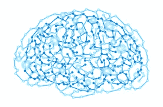
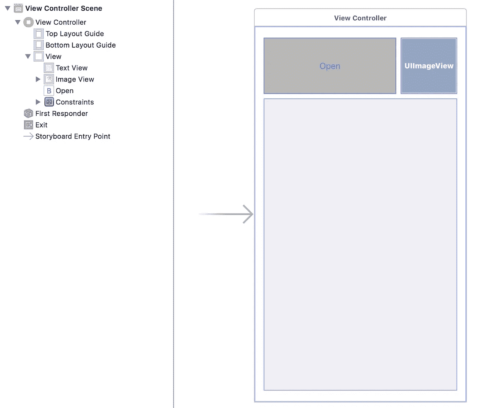
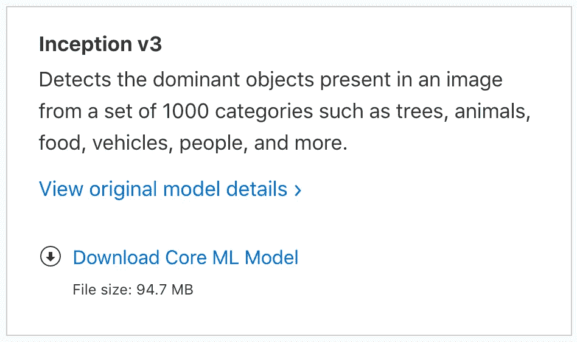
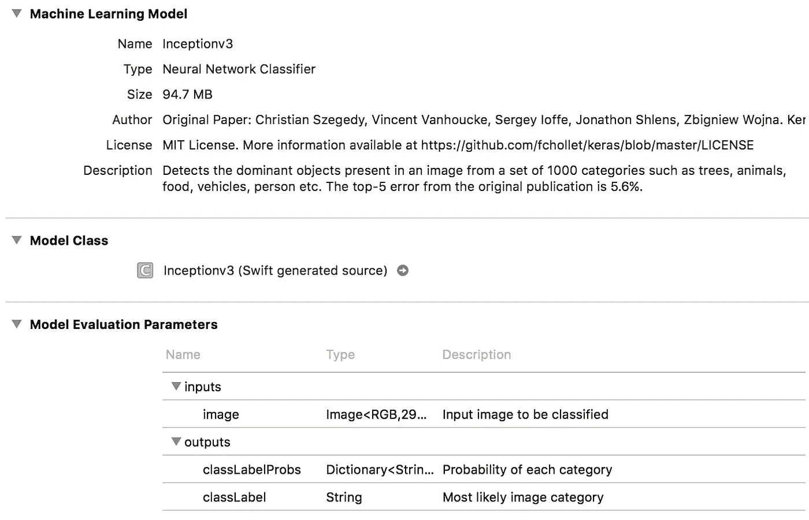
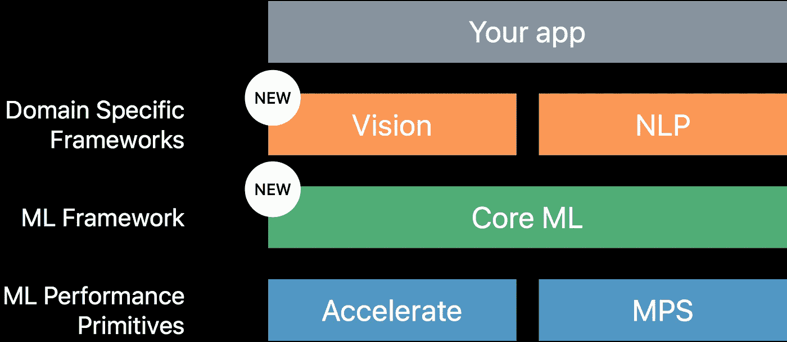
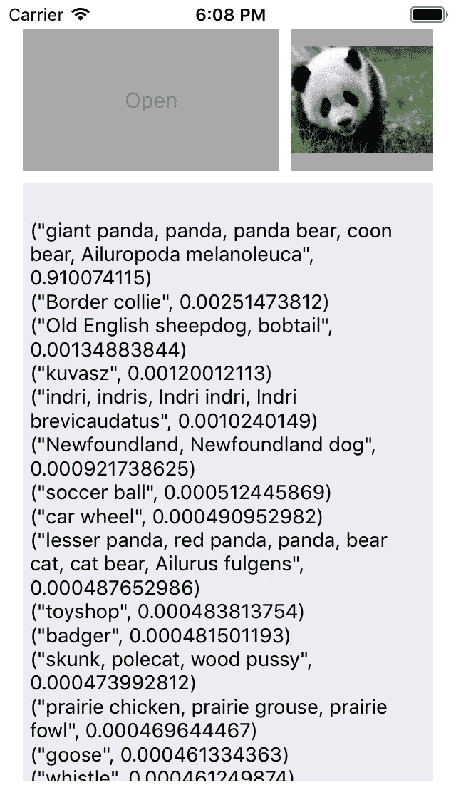

# 面向 iOS 开发者的核心机器学习

> 原文：<https://towardsdatascience.com/core-machine-learning-for-ios-developers-7f2a4b19ec08?source=collection_archive---------0----------------------->

在 WWDC 2017 上，苹果为开发者推出了一种简单的方法，用[**Core ML**](https://developer.apple.com/documentation/coreml) 为他们的 iOS 应用添加 AI 功能。这可以用于各种领域，如对象检测、情感分析、手写识别、音乐标记等。所有这些都可以集成到一个名为 **Core ML Model** 的文件和几行代码中。😏

**什么是核心 ML 模型⁉**

它是将训练好的模型转换成 Apple 格式的模型文件(。mlmodel)，它可以添加到您的项目中。

**什么是训练有素的模特‼︎⁉︎**

它是由机器的训练过程产生的产物。训练模型的过程包括向*学习算法*提供*训练数据*以供学习。

因此，由于核心 ML 模型是关键，我选择使用苹果公司提供的模型，而不是自己转换一个经过训练的模型。目前有 4 个选项可用: *Places205-GoogLeNet，ResNet50，Inception v3，VGG16。*

# 演示时间

要运行演示应用程序或使用 CoreML，你需要获得 [**Xcode9**](https://developer.apple.com/download/) 测试版(振作起来，这是真正的测试版😖).

> 该应用程序将允许用户从照片库中选择一张照片，然后智能模型将推断出主要对象。

打开 Xcode 并创建一个新的单个应用程序视图项目。转到你的 Main.storyboard 并为应用程序设置你想要的 UI。我选择了一个简单的 UI，一个按钮打开图库，一个图像视图显示选中的图像，一个文本视图显示预测结果。

然后将按钮、图像视图和文本视图挂接到视图控制器。设置一个*UIImagePickerController a*after wards，及其委托方法*diddfinishpickingmediwithinfo*并从信息字典*中检索图像。*

此时，您的项目应该可以运行了。您可以选择一个图像并在图像视图中查看它。*提示:你可以在模拟器上打开 safari 并保存一些图像，在你的图库中创建一些变化。*

# 添加核心 ML

现在到了激动人心的部分:让我们从 [**苹果**](https://developer.apple.com/machine-learning/) 下载实际的模型文件。我选择了[**Inceptionv3**](https://docs-assets.developer.apple.com/coreml/models/Inceptionv3.mlmodel)**型号因为它功能强大并且文件大小合理。**

****

**一旦你得到了。mlmodel 文件，将其拖放到您的项目中。确保将其添加到您的**应用目标**(如果您有测试目标，不要将其添加到测试目标，因为这不会生成模型类)。然后从项目导航器中选择文件。**

****

**你可以看到一些与模型相关的元数据。但最重要的是，您可以看到自动生成的**模型类**，它将在我们的代码中使用。我们还知道该模型将一个图像作为输入，将一个字典和字符串作为输出。**

# **CoreML & Vision**

**为了在我们的代码中使用智能，我们必须导入 CoreML 和 Vision。CoreML 被导入，所以我们可以在我们的视图控制器中使用自动生成的**模型类**。由于图像输入属于 *CVPixelBuffer* 类型， **Vision** 将通过给它一个用作输入的 *CGImage* 来使我们的生活变得更容易。**

****

**Data types used to interact with the mlmodel**

**值得注意的是，视觉与将图像作为输入的模型相关。例如，如果我们的模型采用字数统计，那么就应该使用 NLP (NSLinguisticTagger)来代替。**

****

**Vision and NLP are build on top of Core ML**

# **履行**

**现在回到我们的视图控制器。从导入 CoreML 和 Vision 开始。创建一个新函数，姑且称之为 *processImage()。*请注意，该实现特定于 Vision，如果您使用另一个将 String 或 Double 作为输入的模型，您就不必以这种方式使用它。**

**为了提交输入，我们首先使用我们的 *Inceptionv3* 模型初始化一个 *VNCoreMLModel* 。然后创建一个 *VNCoreMLRequest。*最后设置*一个 VNImageRequestHandler* 并以请求为参数*调用 perform。***

**为了检索输出，我们必须使用 *VNCoreMLRequest* 闭包，它有一个包含*结果*属性[*VNClassificationObservation*]的*请求*对象。就是这样，这是输出。⭐️✨**

**现在将 *processImage()* 添加到*imagePickerViewController*的委托方法中，并更新文本视图。下面是 90 行代码下的视图控制器的完整代码:**

**让我们运行应用程序，看看预测结果是什么样的。😍**

****

**iOS Simulator screenshot**

**我期待你的反馈🤓**

**🤖[在此下载完整项目](https://github.com/ayoubkhayatti/GuessImageCoreML)🤖**