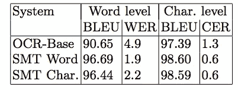
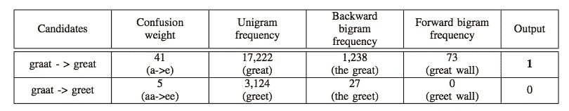
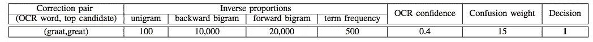

# 通过机器翻译和分类纠正文本输入

> 原文：<https://towardsdatascience.com/correcting-text-input-by-machine-translation-and-classification-fa9d82087de1?source=collection_archive---------9----------------------->

“person holding eyeglasses” by [David Travis](https://unsplash.com/@dtravisphd?utm_source=medium&utm_medium=referral) on [Unsplash](https://unsplash.com?utm_source=medium&utm_medium=referral)

最近，我正在做一个光学字符识别(OCR)相关的项目。挑战之一是预训练的 OCR 模型输出不正确的文本。除了 OCR 模型的性能之外，图像质量和布局对齐也是文本错误的主要来源。

看完这篇帖子，你会明白:

*   光学字符识别错误类型
*   基于词典的
*   基于内容
*   统计机器翻译
*   基于特征的词分类

# OCR 错误类型

*   字符检测:识别不正确的字符。这可能是由于图像质量差和方向不正确造成的。
*   单词检测:无法检测文本。这可能是由字符检测错误引起的。
*   分段错误:无法正确分段字符和/或单词。

*这种方法是最简单的一种解决方案，它可能不需要任何机器学习技能，只需要编程语言和正则表达式技能。通过计算 [Levenshtein 距离](/measure-distance-between-2-words-by-simple-calculation-a97cf4993305)(编辑距离)并从字典中找到最短的词典来替换“不正确的”单词，可以捕捉不正确的单词。你可以通过这个[故事](/step-out-from-regular-expression-for-feature-engineering-134e594f542c)进行基于词汇的识别。局限性在于需要大量的词汇，并且还需要定义特定领域的数据。*

*另外，你可以访问[拼写校正器](/correcting-your-spelling-error-with-4-operations-50bcfd519bb8)故事和[符号拼写](/essential-text-correction-process-for-nlp-tasks-f731a025fcc3)故事来对它有更多的了解。*

# ****基于上下文****

*第二种方法计算单词序列的可能性。在语言学中，我们注意到大多数语言中都有一定的模式(或语法)。给定模式和分布，我们了解单词序列的概率。然而，限制是高频词，如停用词可能会支配结果。此外，罕见但重要的单词可能会受到影响。*

# ****统计机器翻译****

*Afli 等人提出了用于光学字符识别(OCR)纠错的统计机器翻译(SMT)方法。机器翻译(MT)用于将源语言翻译成目标语言。在这个特定的上下文中，源语言是 OCR 输出，而目标语言是正确的文本。*

*典型的机器翻译输入是一个单词序列(OCR 输出)，输出是另一个单词序列(校正文本)。而统计方法的目标是最大化后验概率。另一个不同是，作者不仅评估单词级别模型，还评估[字符级别](/besides-word-embedding-why-you-need-to-know-character-embedding-6096a34a3b10)模型。*

*单词错误率(WER)和双语评价替角(BLEU)在评价中被选中。从实验结果来看，单词级模型略好于字符级模型。*

**

*Evaluation Result (Afli et al., 2015)*

# ****精选基础词分类****

*Kissos 等人提出了另一种方法来修复来自 OCR 的文本错误。他们使用字符和单词分类方法来识别不正确的单词并进行修正。*

*作者提出候选排序器和校正决策器来判断单词是否应该被校正的文本替换。首先，将输入传递给候选排序器，并寻找候选替换的可能性。一旦候选词被确定，它将被传递到另一个模型，即修正决策器，以分类是否应该替换原始单词。*

*单词令牌将首先通过候选排序器，其功能包括:*

*   *混淆权重:讹误纠正对的权重属性。*
*   *单字频率:特定单词的总计数。*
*   *正向二元模型频率:二元模型(由前一个单词构成)的最大字数。*
*   *反向二元模型频率:二元模型(由下一个单词构成)的最大字数。*

**

*Example of the Candidate Ranker feature (Kissos et al., 2016)*

*候选人排名，随后是修正决策者。一旦可能性候选(替换的单词)被识别。校正决策器判断原始单词是否应该被该校正单词替换。功能包括:*

*   *置信度:OCR 输出度量。*
*   *词频:OCR 文本的总字数。*
*   *比例字典功能:与“候选人排名器”中使用的功能相同。*

**

*Example of the Correction Decision Maker feature (Kissos et al., 2016)*

# *参考*

*Afli H，Barrault L .，Schwenk H ...2015.[使用统计机器翻译进行 OCR 纠错](http://www-lium.univ-lemans.fr/~barrault/papers/afli_cicling2015.pdf)*

*基索斯一世，德肖维茨。普通..2016.[使用字符校正和基于特征的单词分类的 OCR 错误校正](https://arxiv.org/pdf/1604.06225.pdf)*