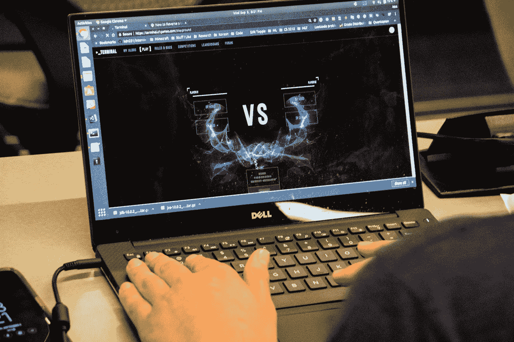
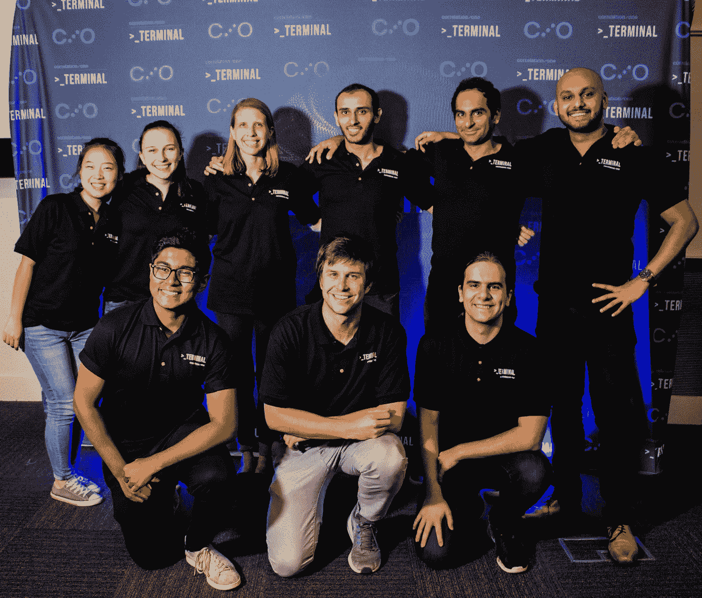
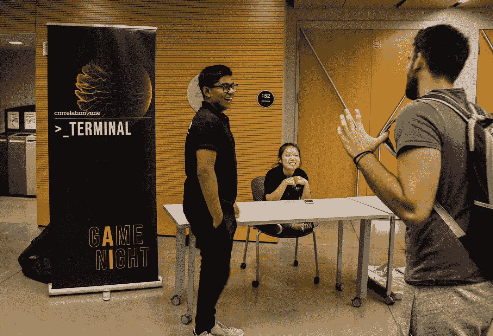
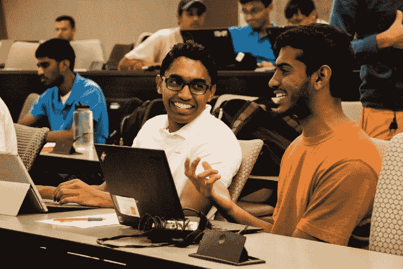
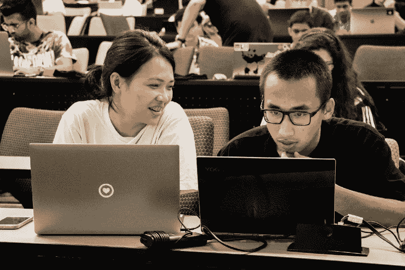
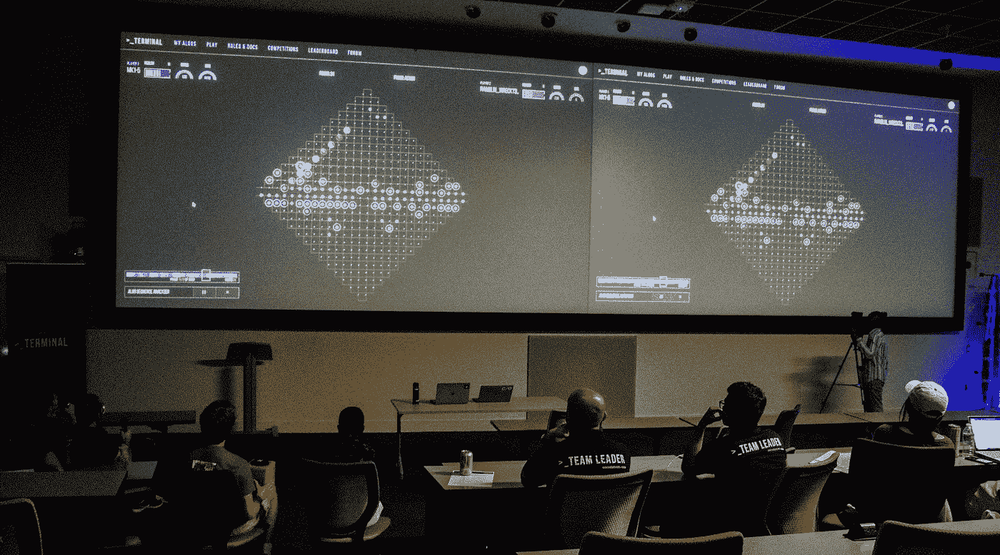

# 相关性一终端来到佐治亚理工学院

> 原文：<https://towardsdatascience.com/correlation-ones-terminal-comes-to-georgia-tech-cb134c6c268e?source=collection_archive---------5----------------------->

## 有没有编过玩电子游戏的算法？

欢迎来到[航站楼](https://terminal.c1games.com)。

吃披萨，穿酷酷的 t 恤，参加四个小时的黑客竞赛，你就有了佐治亚理工学院的游戏之夜。我以竞争对手的身份参加了这次活动，以下是我认为 Terminal(字面上)改变游戏规则的原因。

在计算机科学领域，发展技能是至关重要的。通过上课、个人项目和实习，像我这样的学生为了吸引顶级公司，不断地竞争建立他们的简历。

然而，我们经常忽略硬币的另一面。就像我们学生渴望被雇佣一样，雇主也在不断寻找顶尖的科技人才。招聘已经成为一个蓬勃发展的行业，而 Correlation One 是这个领域最具颠覆性的新参与者之一。

Members of the Correlation One team and Data Science @ GT helped to run the event.

在过去的一年里， [Correlation One](https://www.correlation-one.com) 的团队一直在开发终端，这是一款定制的塔防游戏，通过提交的算法自动进行游戏。在佐治亚理工学院的游戏之夜，这是同类活动中的第一次，超过 230 名学生注册整夜编写他们自己的算法。

游戏之夜得到了很好的宣传，并在一个学生组织的帮助下举办——T4 数据科学@ GT 。我的许多朋友都来参加比赛，都对这项活动的独特性质感兴趣。毕竟，你很少有机会将编码和视频游戏与赢得现金奖励的前景结合在一起！

The event was held at the Clough Learning Commons.

在解释完规则后，每个人都开始研究他们的算法。提供的 API 有很好的文档，视频教程也很棒。本科生、研究生和博士候选人都有同等的机会证明自己的优势。精英精神确实闪耀着光芒，这也是我最喜欢的活动特征之一。

终端是一款塔防游戏，但绝不是简单的一款。尽管提供的 starter 算法只有几百行 Python 代码，但要熟悉游戏的规则和大致范围确实需要一些时间。在活动的第一个小时，提交的竞争算法非常少。随着我和我的同伴们努力解决问题，逐渐熟悉了这个游戏，竞争的感觉开始主导这个房间。

Tech students worked through the night to improve their submissions.

当我整晚继续迭代我的算法时，我对一个团队用终端创建的相关性有了真正的理解。我可能和周围的人一样埋头于电脑中，但通过上传我的算法并观看他们播放其他提交的内容，我正以一种精神上具有挑战性的方式直接与我的同行互动。

传统的编码挑战需要大量的准备工作，通常需要掌握数百个实践问题，而 Terminal 将你置于一个进入的障碍仅仅是知道如何编程的舞台上。除此之外的一切都是开放式的，并测试现实世界的思维，这使它明显不同于我参加过的任何此类比赛。

Terminal incentivizes creativity and strategic thinking unlike most popular recruiting tools.

你可以自由地想出新的策略来打击对手，并按照自己的意愿实施适应性强的复杂解决方案。创新的自由和潜力是独一无二的，令人兴奋的，只有在时间敏感的环境中，让你的工作与竞争对手的工作相竞争，这种挑战才能支撑你的创新。

随着提交截止日期的临近，房间里的能量明显上升。在最后一轮比赛中，所有人都可以看到直播，观众欢呼着算法之间的较量。看到我的算法与我的对手面对面，真是太激动了！

The final round of the night, where my algorithm (in pink) faced off against 2nd place (in blue).

我对我们提出的各种策略和解决方案感到惊讶，终端作为招聘工具的真正价值变得非常清楚。这个游戏不仅能很好地激发学生的兴趣，还能挑战我们的战略思维和适应时间敏感的环境。我认为 Correlation One 已经击中了要害，我期待着在未来的几个月里看到 Terminal 的变化，因为来自全国各地的学生将在未来的比赛中竞争。

The award ceremony from the night! To the left of me is runner-up Neil Thistlethwaite.

在终端上随意查看 Correlation One 的官方[博客帖子](https://medium.com/@CorrelationOne/the-future-of-talent-strategy-is-here-2e7d07698988)。更好的是，如果你有竞争精神和 Python 的工作知识，那就自己去玩吧！