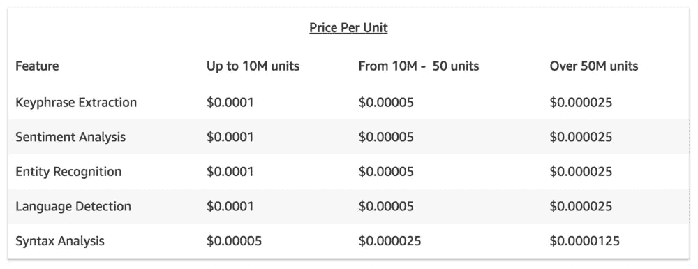
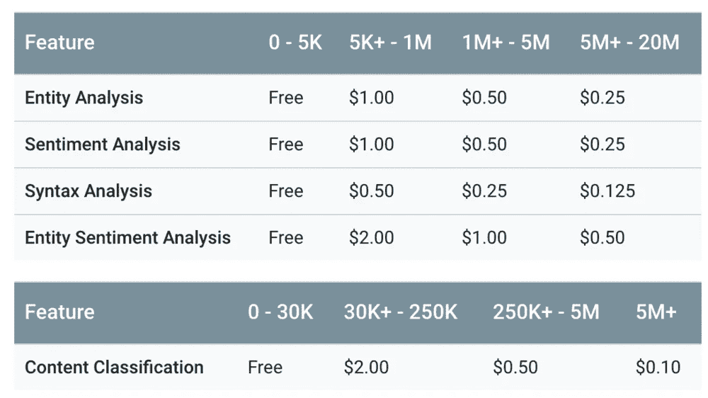
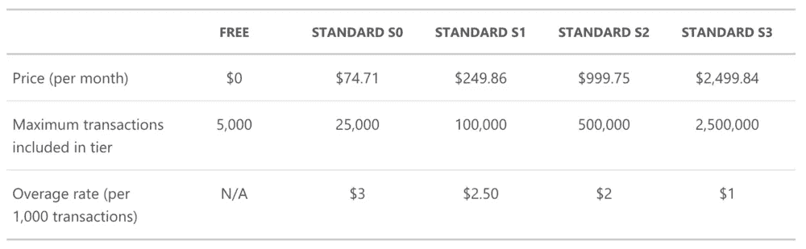
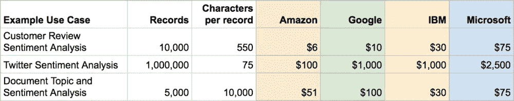

# 亚马逊、谷歌、IBM 和微软的云情感分析成本比较

> 原文：<https://towardsdatascience.com/cost-comparisons-for-cloud-sentiment-analysis-at-amazon-google-ibm-and-microsoft-bbe92cb620d7?source=collection_archive---------14----------------------->


Source: Library of Congress

我们生活在一个激动人心的时代，尤其是对于负责快速分析大量文本的数据科学家来说。除了像 R Studio 和无数现成软件这样的免费 ide 包之外，大型云玩家已经通过 API 将他们的机器学习工具交给你使用。单独来看，云服务工作得很好，但将它们结合起来([就像我们最近的](https://www.deducive.com/blog/2018/7/28/sentiment-analysis-in-the-cloud-round-2-azure-text-analytics-et-al))会产生更好的结果:我们发现[结合亚马逊理解、谷歌云、IBM 沃森和微软 Azure](https://www.deducive.com/blog/2018/7/28/sentiment-analysis-in-the-cloud-round-2-azure-text-analytics-et-al) 的情绪分析结果可以正确预测 78%的情绪。

使用这些服务非常简单。计算它们的成本，以及这些成本之间的比较，完全是另一回事。在本文中，我们将比较四家最大的云计算公司在各种场景下的成本。

# 比较苹果、橘子和香蕉

亚马逊的定价是出了名的复杂，它是少数几个具有开放 API 的云服务之一，可以提供具体的定价示例，所以我们将使用它作为基准。

场景是这样的:你有 10，000 条顾客评论，每条平均 550 个字符。你才刚刚开始，想让事情变得简单，所以你只想知道每个评论的整体情绪。更复杂的分析技术在每个平台上都是可能的，包括主题分析和定制建模。但是我们现在不需要这个。

为了便于比较，我们将排除任何存储成本，因为这也因平台而异。

# 亚马逊理解

虽然这个简单的例子可以在[亚马逊理解](https://www.ibm.com/cloud/watson-natural-language-understanding/pricing)上免费执行，但我们将假设最低标准定价层(同样值得注意的是，免费层有 12 个月的使用期限)。亚马逊将每 100 个字符作为一个“单位”

```
10,000 requests X 550 characters/request = 60,000 units 
60,000 X $0.0001 per unit = **$6**
```



Amazon Comprehend Pricing

# 谷歌云自然语言

谷歌云自然语言免费层最多有 5000 条记录，所以你不得不为这个简单的 10000 条记录付费。然而，每条记录有 1000 个字符的限制，所以我们示例中的每条记录只需要一个单元。

```
10,000 requests X 550 characters/request = 10,000 units 
10,000 X $1 per 1,000 units = **$10**
```



Google Cloud Natural Language Understanding Pricing

# IBM 沃森

[IBM Watson Natural Language Understanding](https://www.ibm.com/cloud/watson-natural-language-understanding/pricing)在其免费定价层中每月允许多达 30，000 个“自然语言单位(nlu)”，但我们将考虑最低定价层进行比较。每个 NLU 允许 10，000 个字符和两个“丰富特性”，因此我们的示例需要 10，000 个 nlu。

```
10,000 requests X 550 characters/request = 10,000 NLUs 
10,000 X $0.003 per NLU = **$30**
```


IBM Watson Natural Language Understanding Pricing

# 微软 Azure 认知服务

像谷歌一样，[微软 Azure 认知服务](https://azure.microsoft.com/en-us/pricing/details/cognitive-services/text-analytics/)免费层被限制为 5000 个“交易”，所以我们将分析他们的最低定价层。每笔交易包括多达 5，000 个字符的情感分析和关键短语提取、语言检测和实体识别。微软不分解单个元素的定价，只提供基于层而不是量的定价。

```
10,000 requests X 550 characters/request = 10,000 transactions
10,000 transactions requires “Standard S0 pricing tier” = **$74.71**
```



Microsoft Azure Text Analytics Pricing

# 更多的场景，更多的水果来比较

从上面的比较来看，你会认为亚马逊在定价上显然是最激进的，这就是故事的结尾。不完全是。当您增加记录的数量或记录的大小时，事情会变得稍微复杂一些。

在上面的第一个例子中，我们比较了 10，000 条客户评论的情感分析。但是如果我们想分析 100 万条推文呢？还是 5000 篇学术论文每篇 10000 条记录？



Pricing based on publicly available information; account-level discounting may lead to lower pricing.

虽然亚马逊在定价上普遍领先于竞争对手，但在规模定价方面有一些奇怪之处变得很明显。例如，如果您有相对较少数量的非常大的文档，那么 IBM 看起来是运行您的分析的好地方。当做一些小的事情时，微软的最低定价层看起来很贵，但是如果这些文档更大，它看起来更有吸引力。

我们建议您使用测试数据集亲自尝试它们，看看它们的表现如何。如果它们不起作用，花多少钱就无关紧要了。

【www.deducive.com】最初发表于[](https://www.deducive.com/blog/2018/8/29/how-much-does-sentiment-analysis-in-the-cloud-actually-cost)**。**