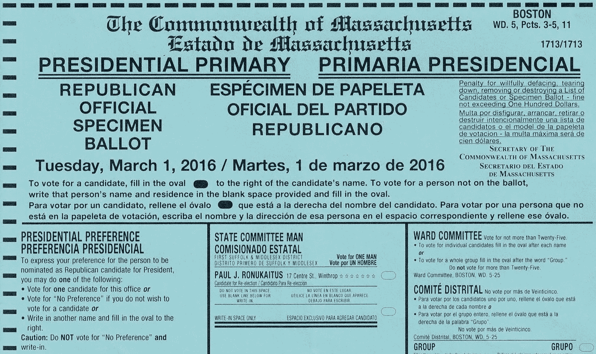
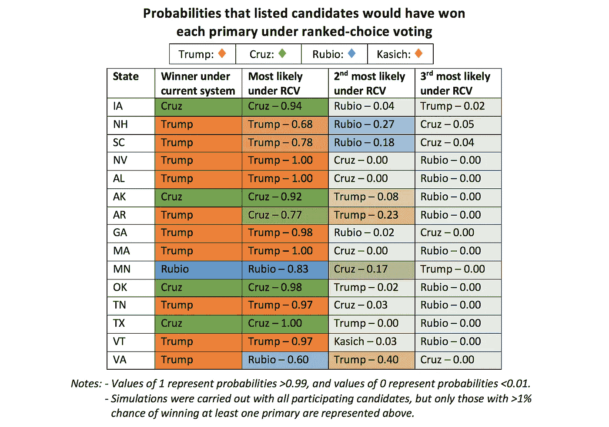
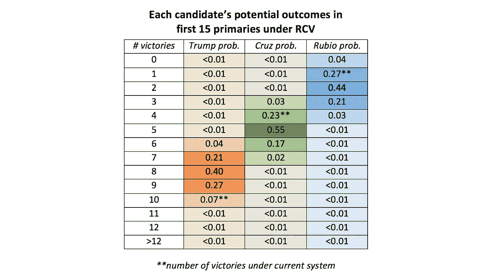

# 替代投票系统能阻止特朗普吗？

> 原文：<https://towardsdatascience.com/could-an-alternate-voting-system-have-stopped-trump-6cabf99f6fa7?source=collection_archive---------2----------------------->

现在，唐纳德·特朗普正式成为共和党提名人，回顾一下让曾经不可想象的事件发生的背景是很重要的。在接下来的几个月和几年中，大量的博客文章、论文、同行评议文章和书籍将研究导致特朗普初选胜利的文化和经济环境，但讨论中似乎缺少了一个背景，那就是初选制度本身。情况并非总是如此。

事实上，在初选期间，[【RCV】](https://en.wikipedia.org/wiki/Ranked_voting_system)的选择性选举制度曾经风光一时。尽管实施这种投票系统的想法并不新奇，但[这次选举的一些事情让人们对它进行了更仔细的审视。RCV 的工作方式是，每个选民不是投票给一个候选人，而是按照他或她的偏好排列所有候选人。如果没有候选人获得第一选择票的绝对多数，则第一选择票最少的候选人将从选票中退出，这些选票将转移给每位选民的第二选择候选人。这一过程一直持续到一名候选人获得至少 50%的选票。](https://twitter.com/realDonaldTrump?ref_src=twsrc%5Egoogle%7Ctwcamp%5Eserp%7Ctwgr%5Eauthor)

举个简单的例子，想象一下萨姆、克莱尔和哈利之间的选举，40 个人投票“1:萨姆，2:克莱尔，3:哈利”，35 个人投票“1:克莱尔，2:哈利，3:萨姆”，25 个人投票“1:哈利，2:克莱尔，3:萨姆”。在目前的制度下，山姆将赢得 40%的选票，相比之下，克莱尔和哈利分别获得 35%和 25%的选票。但在 RCV 治下，由于没有候选人获得 50%的选票，第一选择票数最少的人(哈里)将被淘汰，他的选民将被重新分配给他们的第二选择。在这个例子中，Harry 的所有 25 个投票者都将 Clare 作为他们的第二选择，所以他们的票都投给了她。重新分配后，克莱尔将获得 60 票，而萨姆只有 40 票，他将以 60%的优势获胜。从本质上讲，该制度确保了当大多数选民倾向于另一位候选人时，一位候选人不会以多数票获胜。

如果这听起来很熟悉，那可能是因为在#nevertrump 运动的巅峰时期，它变得非常流行[讨论](http://www.salon.com/2016/03/26/this_one_reform_defeats_donald_trump_and_saves_democracy_too_bad_the_gerrymandering_gop_never_listened_but_maybe_they_will_now/)它的优点(以及[类似](http://www.nytimes.com/2016/05/01/opinion/sunday/how-majority-rule-might-have-stopped-donald-trump.html)系统的优点)。当时的普遍理论似乎是特朗普以 30—40%的多数票赢得了第一轮初选，尽管 60—70%的“反特朗普”选民肯定会团结在另一位候选人周围，如果这个领域没有如此分裂的话。在这种情况下，排名选择投票是可以拯救该党的白衣骑士，提供了一种将提名保留在人民手中的方式，同时确保最终被提名者可以被大多数选民接受。

虽然这是一个令人信服的故事，而且特朗普最终在初选中只获得了 46%的选票，这一事实加强了这一故事，但仍然有必要问一个问题:RCV 真的会改变什么吗？我开始借助两项早期民意调查([公共政策民意调查](http://www.publicpolicypolling.com/pdf/2015/PPP_Release_SC_21616.pdf)和 [NBC 新闻|调查猴子](http://www.msnbc.com/msnbc/who-gains-the-most-when-the-gop-field-shrinks))来寻找答案，这两项调查要求选民给出他们的第二选择候选人。

使用这些民意调查的数据以及每个初选中每个候选人的投票数量，我能够模拟在排名选择投票系统下前 15 个共和党初选和党团会议中可能发生的情况。模拟一直进行到超级星期二初选，包括超级星期二初选，因为剩下的部分需要极端猜测早期初选结果可能如何影响后来的候选人退出和选民偏好。每个州的选举都被模拟了 1000 次，并添加了随机噪声，以考虑所使用的投票数据的不确定性(更详细的方法可以在这里找到)。

有趣的是，这些模拟的结果描绘了一幅比通常理论化的稍微低调的画面。具体来说，在超级星期二之前的几乎每个州，在当前制度下赢得多数票的候选人在 RCV 制度下最有可能赢得大多数选票。两个例外是阿肯色州和弗吉尼亚州，前者克鲁兹赢得了 77%的模拟 RCV 选举，后者卢比奥赢得了 60%的模拟 RCV 选举，尽管特朗普在当前制度下赢得了这两个州。

然而，结果确实表明，特朗普在当前体系下的结局是他在 RCV 治下所能希望的最好结果。特朗普在 RCV 治下至少有 10%胜算的州是他在当前制度下赢得的州。相比之下，非特朗普候选人(克鲁兹和卢比奥的组合)有很大的机会(> 50%)从特朗普手中拿下两个新的州(阿肯色州和弗吉尼亚州)，也有合理的机会(> 20%)拿下另外两个州(新罕布什尔州和南卡罗来纳州)。

此外，通过检查州赢和输的所有可能组合，很明显特朗普会受到这一系统的至少轻微伤害。事实上，他只有 7.5%的机会赢得至少 10 个州(这是他在现行制度下赢得的数字)，相比之下，他有 27%的机会赢得 9 个州，40%的机会赢得 8 个州，21%的机会赢得 7 个州。按照同样的标准，克鲁兹和卢比奥都将略有受益，他们最有可能取得+1 的胜利。

基于这些结果，一个有趣但更主观的任务是分析这样的结果会对剩下的初选产生什么影响。很容易想象 8/15 的表现不如 10/15 的表现占据主导地位，特别是在初选的早期阶段，特朗普的竞选活动非常注重始终“获胜”的理念。然而与此同时，可以想象，8 次多数胜利实际上可能比 10 次多数胜利更令人印象深刻。

因此，尽管这些结果指向反对特朗普的整合大方向，但它们并不像一些人认为的那样确定。最终，这可能简单地归结为记者和政治家不喜欢特朗普的程度与共和党选民不喜欢特朗普的程度之间的脱节。虽然被迫承认 30%至 40%投票给他的选民的意见，但在早期阶段，许多 T2 坚持认为，尽管川普是这些选民的第一选择，但他肯定是其他人的最后选择。事实上，这个天花板理论[很可能是错误的](http://www.slate.com/articles/news_and_politics/politics/2016/04/donald_trump_shatters_his_ceiling.html)。相反，特朗普似乎从一开始就是一个常见的第二或第三选择，并且和其他任何候选人一样从不断缩小的领域中受益匪浅。这一事实很可能是 RCV 对他的成功的适度影响的根源。

虽然排名选择投票可能没有彻底改变这次选举的进程，但仍然有几个原因使这个投票系统值得关注和考虑。如果不说别的，选民排名行为所提供的对选民偏好的深刻洞察可能对更早、更有效地动员反特朗普倡导者非常宝贵。因此，尽管 RCV 在全国范围内实施的可能性不大，但我们仍然可以通过写信给当地的民意调查机构，在他们的下一封邮件中询问第二和第三选择问题来尽自己的一份力量。

你最喜欢的 2020 年的希望会感激它。