# 无数 3D-使用 Python 和 Numpy 对标记的体积图像进行矢量化 2 倍缩减采样

> 原文：<https://towardsdatascience.com/countless-3d-vectorized-2x-downsampling-of-labeled-volume-images-using-python-and-numpy-59d686c2f75?source=collection_archive---------8----------------------->


A visualization of a 2x2x2 downsample of a labeled dataset. This is what COUNTLESS 3D does.

之前，我演示了一个完全矢量化的算法，[neutrable](https://medium.com/@willsilversmith/countless-high-performance-2x-downsampling-of-labeled-images-using-python-and-numpy-e70ad3275589)，它通过寻找 2x2 面片的模式，在不计算像素值频率的情况下，对标记的图像进行下采样。在这里，我使用 2x2x2 的补丁和任意的下采样因子将无数的图像归纳为 3D 图像。无数 2D 通过寻找多数像素而不计算其总频率来工作。这是通过在一个 2×2 图像块中找到两个匹配像素的存在或不存在来确定的。无数 3D 扩展了这一逻辑，在八个体素(三维像素)中搜索匹配的四个像素，然后是三个，最后是两个。无数个 N 将这种技术推广到任何输入大小，尽管它很快变得不切实际无数个 2D 和无数个 3D 可以分别被视为无数个 4 和无数个 8 的特定应用实现。仅使用矢量化指令实现了无数变体，这使得它们对于在 Python 等编程语言中实现非常实用，Python 等编程语言具有快速的线性代数库(如 Numpy ),但具有缓慢的循环和分支语句。虽然无数的 2D 可以胜过简单的算法，但是在高吞吐量应用中使用无数的 3D 是不可取的，因为它比标准方法慢得多。然而，在 Python 中，它可以在不求助于额外编译步骤的情况下实现，并且仍然提供合理的性能。

# 动机

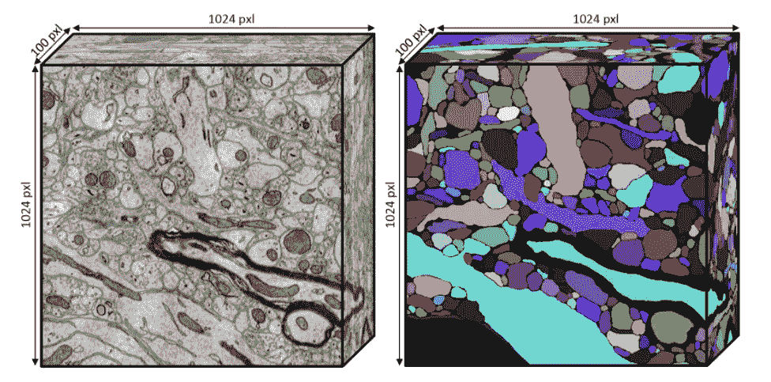

Figure 1\. Volumetric images used in [connectomics research](https://www.nytimes.com/2014/05/27/science/all-circuits-are-busy.html), a field where we attempt to find the wiring diagrams of brains. Left: A 3D image formed from a stack of electron microscope scans of brain tissue. Right: A machine labeling of neurons in the left image by [Kisuk Lee](https://twitter.com/kisukkevinlee). This article concerns the type of image on the right.

虽然普通人不经常遇到，但 3D 图像(体积图像)在生物医学成像中大量使用。可以从以规则加深的间隔采集的一叠 2D 图像中构建体积图像。MRI 机器使用磁体来非侵入性地获取大脑切片的图像，细胞生物学家经常使用激光显微镜来扫描不同深度的样本。他们采集的图像按排序顺序排列在一个堆栈中，形成最终图像。

我感兴趣的组织是一个大脑，获取这些图像的方法是使用一种类似于熟食切片机的叫做[超微型切片机](https://en.wikipedia.org/wiki/Ultramicrotomy)的机器将其非常精细地切片。然后用电子显微镜对得到的切片进行成像，并组合成一堆以生成体积图像。切片很大，每边的像素在数万到数十万之间。相比之下，高端的 T4 4K 分辨率电视或电脑显示器每边只能显示 3000 到 4000 像素的图像，而另一边通常只有它的一半大。

为了使用消费类硬件显示这些图像，通常的做法是对它们进行下采样，即创建一系列更小的摘要图像，这些摘要图像公平地表示底层的高分辨率图像。例如，在谷歌地图上，世界显示为单个(或少量)拼接的图像，但当你放大时，更高分辨率的图像被提取并仅显示感兴趣的区域。对于显微镜图像，我们可以通过平均 2x2x2 小块来对其进行缩减采样，以创建一个八分之一小的图像，并重复这样做，直到图像足够小。然而，一旦我们生成标签来描述哪个体素属于哪个神经元，就不能进行平均，因为标签不是模拟信号，而是离散标识符。总结它们的最合适的方法是选择一个补丁中最频繁出现的值。

下采样的存储导致了额外的成本，尽管它随着每一个额外的 mip 级别而指数下降。对于递归 2x2 缩减，缩减采样堆栈的存储和传输成本比存储全分辨率图层的成本高 33%。

```
**LISTING 1: Size of an Infinite Stack of Downsamples**Let S = The size of all the downsamples
Let r = The reduction factor of a downsample (e.g. 4 for 2x2)S = 1 + 1/r + 1/r^2 + 1/r^3 + …S/r = 1/r + 1/r^2 + 1/r^3 + 1/r^4 + …S — S/r = 1S = r / (r-1)
```

因此，2×2 下采样堆栈的存储成本最多是原始图像本身成本的 4/3 或 133%。2x2x2 下采样堆栈的存储成本最多是全分辨率的 8/7 或 114.3%。对于某些用例来说，这种减少可能是诱人的。对于那些被如此吸引的人来说，问题变成了如何在不计数的情况下实现它？

# 无数个 5——2D 问题的一个小扩展

从根本上说，无数的 2D 依赖于这样一种思想，即如果一组四个标签中的两个匹配，就没有必要考虑任何附加信息来声明该补丁的模式。人们很自然地会问，对于这个问题的最小可能扩展，一组五个标签，是否可以陈述类似的原理。

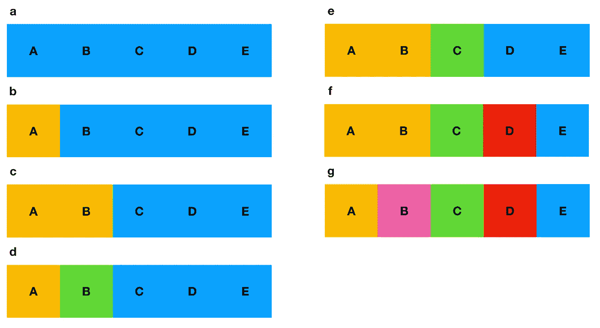

Figure 2\. The seven cases of COUNTLESS 5\. (a) all labels match (b) all but one label matches (c) three labels match versus two labels (d) three match but the other two are both different (e) two pairs and one different (f) one pair and three different pixels (g) all different

在四个标签的情况下，我们发现如果任何两个匹配，它们立即形成多数或平局，在这种情况下，可以任意选择任何一个平局组的成员。在五个标签的情况下，两个标签的匹配不再足以宣布获胜者，然而三个标签是。如果三个标签匹配，它们将总是形成多数，不可能出现平局。然而，如果没有三个匹配，那么模式将由两个匹配组成。如果没有两个标签匹配，那么可以任意选择一个标签。

因此，我们必须通过某种机制寻找三个匹配，如果不存在，则寻找两个匹配，如果没有两个匹配，则举手选择一个合适的像素。搜索三个匹配意味着检查五个标签中的三个标签的每个组合，同样地，搜索两个匹配也是如此。

```
**LISTING 2: The Relevant Combinations of Five Labels**Let the five integer labels be denoted A, B, C, D, ECombinations of three: 5C3 = 5! / 3!2! = 10 combinations ABC, ABD, ABE, 
         ACD, ACE, 
              ADE,
         BCD, BCE, 
              BDE,
              CDECombinations of two: 5C2 = 5! / 2!3! = 10 combinations AB, AC, AD, AE
        BC, BD, BE
            CD, CE
                DECombinations of one: 5C1 = 5 combinations A, B, C, D, E
```

为了评估每个组合，我们可以从无数 2D 中归纳出 PICK(A，B)运算符来接受任意数量的参数:

```
PICK(A,B,C, ..., N) := A if A == B == C == ... == N else 0    EQN. 1
```

这可以用 Python/numpy 伪代码实现(“&”是按位 AND 运算符):

```
PICK(A,B,C ..., M,N) := A * (A == B & B == C & ... & M == N) EQN. 2
```

对给定组合每次应用 PICK 将产生一个标签或零。如果我们的三个组合中的任何一个产生非零值，它就有资格作为候选模式。如果有一个以上的匹配，例如，如果实际上有四个匹配的标签，我们可以任意选择任何一个候选模式。短路逻辑 or 操作符有正确的语义来选择一个标签(如果存在的话)。

```
MODE(A,B,C,D,E) := PICK(A,B,C) || PICK(A,C,D) || PICK(A,D,E)
    || PICK(B,C,D) || PICK(B,D,E) || PICK(C,D,E) || PICK(A,B)
    || PICK(A,C) || PICK(A,D) || PICK(A,E) || PICK(B,C) 
    || PICK(B,D) || PICK(B,E) || PICK(C,D) || PICK(C,E)
    || PICK(D,E) || E                                         EQN. 3
```

如前所述，||运算符可以这样实现:

```
LOGICAL_OR(X,Y) := X + (X == 0) * Y                           EQN. 4
```

等式 3 有十七个元素需要一起计算和逻辑或。有什么方法可以减少所需元素的数量吗？基本上降低通用算法的时间复杂度是不可能的，但是对于少量的标签来说，还是有一些边际节省的。注意，对于两个匹配的情况，我们可以扩展在无数 2D 中使用的技巧，以避免计算最后一个元素的匹配。使用符号 PQ 表示 PICK(P，Q)，如果 AB、AC、AD、BC、BD 和 CD 都不匹配，那么我们将被迫选择 AE、be、CE、DE 或 E 中的一个，所有这些都与 E 相同。因此，我们可以省略 AE、BE、CE 和 DE，留下十三个元素来计算，这是一笔可观的节省。

```
MODE(A,B,C,D,E) := PICK(A,B,C) || PICK(A,C,D) || PICK(A,D,E)
    || PICK(B,C,D) || PICK(B,D,E) || PICK(C,D,E) 
    || PICK(A,B) || PICK(A,C) || PICK(A,D) || PICK(B,C) 
    || PICK(B,D) || PICK(C,D) || E                            EQN. 5
```

无论我们考虑的标签集有多大，最后一个标签总是如此。这意味着对于 N 选 2 的情况，我们总是可以把它简化为 N-1 个选择两个组合来考虑。

将所有这些放在一起，会产生一些适用于无数 5。请注意，这只是无数 3D 的垫脚石，也许更好地称为无数 8，因为它解决了 2 x 2 x 2 体素的模式。

# 无数 3D(又名无数 8)

无数的 3D，这个概念的实际应用现在已经触手可及。对 2×2×2 的体积图像补片进行下采样相当于找到八个整数的模。候选人多数或平局的最低要求是四个匹配的标签。如果比分是 4 比 4，我们可以任意选择一场比赛。要计算无数个 8，我们必须考虑长度为 4、3、2 的匹配。

下面的等式 6 显示了必须进行的提货呼叫的数量。请注意，下面的 7C2 项来自我们使用无数个 5 部分中显示的方法对 8C2 的简化。

```
Total PICKs = 8C4 + 8C3 + 7C2
            =  70 +  56 +  21 
            = 147                                             EQN. 6
```

现在请注意，PICK(A，B，C，D)比 PICK(A，B，C)贵 1.5 倍(六次操作对四次操作)，比 PICK(A，B)贵 3 倍(六次操作对两次操作)。这个事实以后会很重要。

下面是无数个 8 的实现。请注意，如果我们不小心的话，创建 148 个精选将会增加所需的内存。使用 Python 3 生成器表达式，我们可以通过一次只创建几个额外的派生图像来大大减少这个程序的内存需求。

类似于无数的 2D，如果匹配的标签是零，那么 PICK 操作符的输出是无意义的(无论它们是否匹配，它都返回 0)，所以我们将数据上移一位以适应零标签，并在最后下移。

# 无数 3D 动态编程

到目前为止还不错，但可以加快一点。如等式 6 所示，无数 3D 的性能大致与必须计算的拾取操作的数量成比例，而拾取操作的数量又等于必须计算的操作的数量。PICK(A，B，C，D)需要六次运算，而 PICK(A，B，C)需要四次，PICK(A，B)需要两次。我们还需要计算每个逻辑 or 的三次运算。

```
**LISTING 3: Number of Operations Required for COUNTLESS 3D**# of COUNTLESS_3D operations 
    = 8C4 PICK(A,B,C,D) + 8C3 PICK(A,B,C) + 7C2 PICK(A,B)
      + (8C4 + 8C3 + 7C2 + 1 - 1) logical ors
    = 8C4 x 6 + 8C3 x 4 + 7C2 x 2
      + (8C4 + 8C3 + 7C2) x 3
    = 686 + 441     // picks + logical or **= 1,127 operations**
```

或者更一般地说:

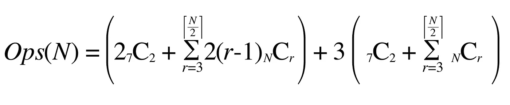

Eqn. 8: Establishing a lower time complexity bound for COUNTLESS N, where N ≥ 2\. N represents the number of labels being evaluated, 7C2 + 1 represents the abbreviated cost of the matches of two case. The left hand term refers to the cost of PICK and the right hand term refers to the cost of logical or.

到目前为止，因为问题的解决方案是由较大的匹配先于较小的匹配来控制的，所以我们首先计算最大的匹配。然而，可以使用动态编程方法从较小的组合中构建较大的组合。以额外的内存为代价，我们可以将两个匹配视为三个匹配的子问题，将三个匹配视为四个匹配的子问题。由于每个新层都通过添加一个元素建立在旧层的基础上，这种技术将使我们能够通过消除重复工作来降低选择项中的(r-1)系数。

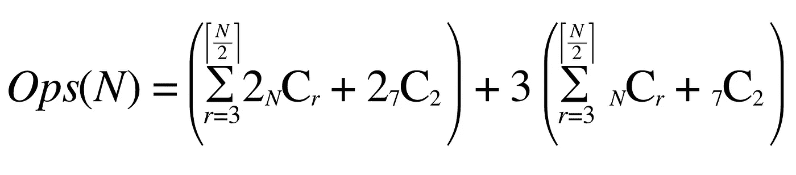

Eqn. 9: Dynamic programming drops the coefficient (r-1) from the summation.

通过去掉因子 2，我们可以将该等式简化为:

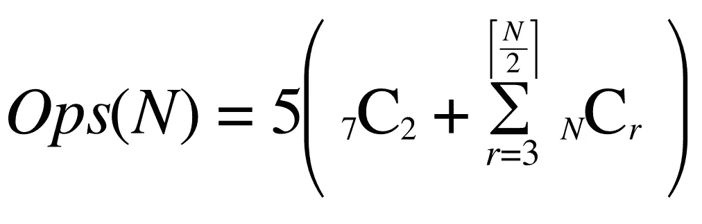

Eqn. 10: Simplified cost of the dynamic programming solution for COUNTLESS N.

然而，这对于计算和交流来说有点烦人，所以让我们用一些[朗道符号](https://en.wikipedia.org/wiki/Big_O_notation#Family_of_Bachmann%E2%80%93Landau_notations)来简化它。从 0 到 N 的所有组合之和等于`2^N`。由于组合是对称的，并且我们在跳过少量计算的同时求和到 N/2，这算出了 2^(N-1).的指数时间复杂度

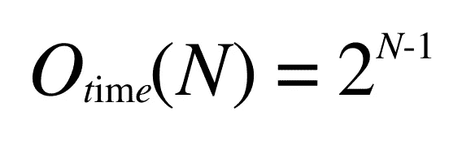

Eqn. 11: Exponential big-O time complexity.

动态规划保存已解决的子问题，供算法的下一次迭代使用。在这种情况下，这意味着保存匹配长度为 2 的结果，并使用它们来引导匹配长度为 3 的匹配。这非常耗费内存，但是有一个技巧可以让它变得稍微好一些。

```
**LISTING 4: Not All Subproblems are Used**Let A, B, C, D, E represent five labels.
Let the notation AB := PICK(A,B) and ABC := PICK(A,B,C) and so on.Combinations of Length Two:     AB, AC, AD, AE
        BC, BD, BE
            CD, CE
                DECombinations of Length Three:

   ABC, ABD, ABE, ACD, ACE, ADE
                  BCD, BCE, BDE
                            CDENotice that all length three combinations are prefixed with length two problems. For example, PICK(A,B,C) can be written as PICK(PICK(A,B), C). However, certain length two subproblems are not used in length three. AE, BE, CE, and DE can never be used as a prefix because E always occurs at the end.Therefore, substantial memory can be saved by not memoizing subproblems that include the terminal element.
```

将所有这些放在一起，就产生了无数 3D 的动态编程版本，虽然需要更多内存，但速度要快得多。它需要存储前一次迭代的结果。这导致内存消耗峰值为:

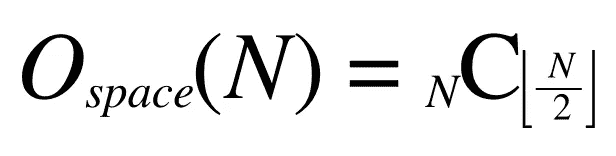

Fig. 11: Combinatoric space complexity.

我们应该期待无数 3D 的动态版快多少？使用等式 8 和 10:

```
**LISTING 5: Comparing the Ratio of Eqn. 10 and Eqn. 8**Non-Dynamic = 1,127 operations ; from LISTING 3
Dynamic     = 5 * ( 8C4 + 8C3 + 7C2 ) ; from Eqn 9
            = 735 operationsDynamic / Non-Dynamic = 0.65 or 1.53x faster
```

由于理想化的动态编程解决方案只需要 65%的工作，我们应该粗略地预计动态编程解决方案大约快 1.5 倍。实际上，我发现它要快 1.3 到 2.3 倍，可能是由于操作者速度的差异。

# 无数 N——广义的无数

总结我们在无数 3D 公式中所学到的东西是很简单的。无数个 N 是一个非常消耗内存和计算的算法。我不期望它在一个狭窄的参数范围之外表现良好。然而，当给出 2x2x2 缩减系数时，下面的算法在性能上匹配无数 3D。

# 表演

无数 2D 的性能指标都集中在纯粹的执行速度上。然而，对于无数的 3D 和无数的 nd，由于组合的数量，也需要测量内存使用量。

为了确定这种算法的速度，我们开发了一个比较套件，并在双核 2.8 GHz、i7 Macbook Pro(大约 2014 年)、256 kB L2 高速缓存和 4MB 三级高速缓存上运行。最大汇集、平均和大步跑包括在速度比较中，尽管它们不适合这项任务。

下面的实验使用了 Python 3.6.2 和 numpy-1.13.3 以及 clang-900.0.39.2。

经过测试的算法:

*   **大步走:**每隔一个像素拾取一次。
*   **countless 3d:**countless 3d 的低内存实现
*   **dynamic _ countless 3d:**countless 3d 的动态编程实现
*   **countless3d_generalized:** 用下采样因子 2，2，2 匹配无数 3d 的无数 N 的低内存实现
*   **COUNTLESS 3d _ Dynamic _ generalized:**用下采样因子 2，2，2 来匹配无数 3d 的无数 N 的动态编程版本

尽管这些算法不适合处理分割，但也对它们进行了测试，以便为其他图像处理算法提供比较点:

*   **down sample _ with _ averaging:**对 2x2 窗口中的像素进行平均。
*   **down sample _ with _ max _ pooling:**在 2x2 窗口中选取最高值像素。

用于测试算法的代码可以在[这里](https://github.com/william-silversmith/countless)找到。以下数字是在修订版 15c0077 上测试的。

## 吞吐量

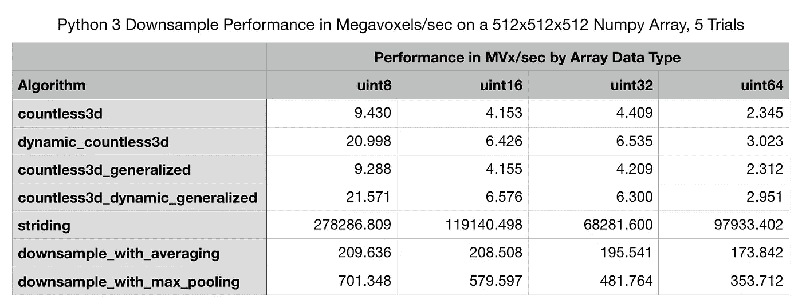

Table 1\. Python 3 Downsample Performance in Megavoxels/sec on a 512x512x512 Numpy Array by Array Data Type, 5 Trials

当使用 uint8、uint16、uint32 和 uint64 分配立方体时，下面的数字来自对 512 x 512 x 512 体素立方体运行上述算法五次。表 1 和图 3 中的结果以每秒兆体素(MVx/sec)为单位，因为人们通常希望处理特定“物理”大小的体积。然而，表 2、图 4 和图 5 以每秒兆字节(MB/sec)为单位，因为运行之间的差异主要在于存储器的大小。

无数 3D 的四个变体由基本算法的 3D 和 N 维实现以及它们的动态编程对应物组成。在基本算法和动态算法中，具体实现的性能与通用实现非常相似。所有这些比较的误差都在 5%以内。使用动态编程算法处理这个 128 MVx 的立方体大约需要 5 秒钟。

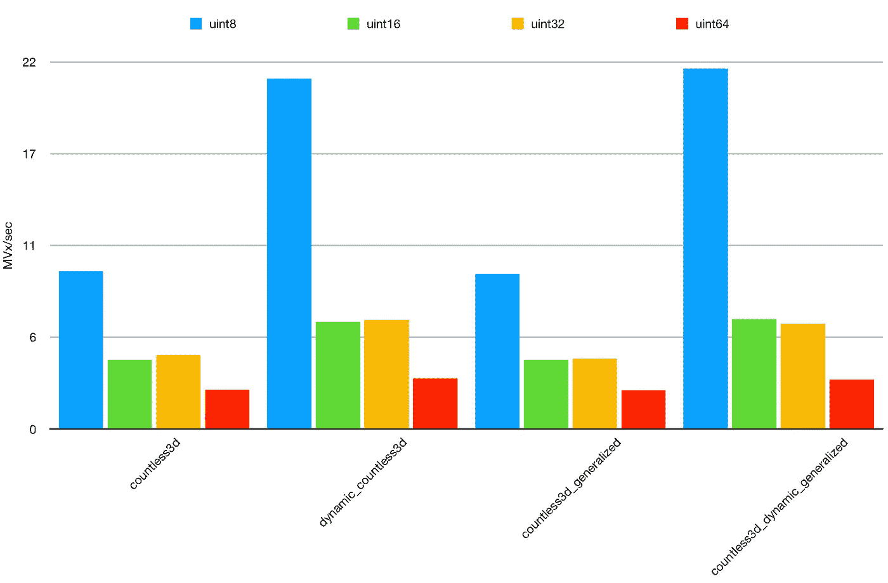

Figure 3\. Python 3 Downsample Performance in Megavoxels/sec on a 512x512x512 Numpy Array by Array Data Type, 5 Trials showing only COUNTLESS 3D variants

就 MVx/sec 而言，对于 uint8 阵列，动态编程产生了大约 2.2 倍的速度提升。对于 uint16 和 uint32，它更接近 1.5 倍。对于 uint64，它大约是 1.27 倍。因此，随着内存的增加，性能有明显的下降趋势，但这在某种程度上被以 MB/秒为单位测量的性能所掩盖。

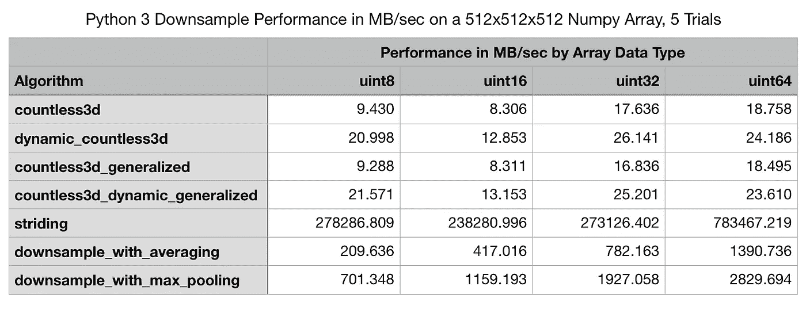

Table 2\. Python 3 Downsample Performance in Megabytes/sec on a 512x512x512 Numpy Array by Array Data Type, 5 Trials

图 4 清楚地表明，在 uint8 和 uint64 之间，性能实际上略有提高，尽管在动态实现中，uint64 与 uint32 相比略有下降。uint16 的结果似乎是一个异常值。它们与 uint8 性能相当，比 uint32 高出近一倍。我怀疑，要么在库内部，要么在我的芯片上，uint16s 被当作 uint32s 处理。动态编程带来的改进是巨大的，但是在下一节我们将看到这是有代价的。

图 5 是为上下文提供的。平均算法和最大池的简单实现展示了更快的执行速度和几乎与数据类型宽度的增加相称的明显上升趋势。

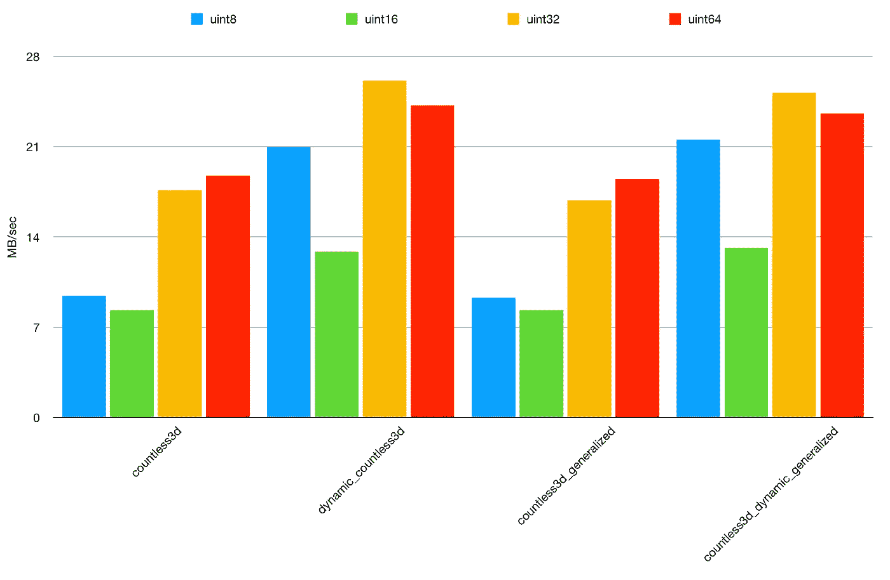

Figure 4\. Python 3 Downsample Performance in Megavoxels/sec on a 512x512x512 Numpy Array by Array Data Type, 5 Trials showing only COUNTLESS 3D variants

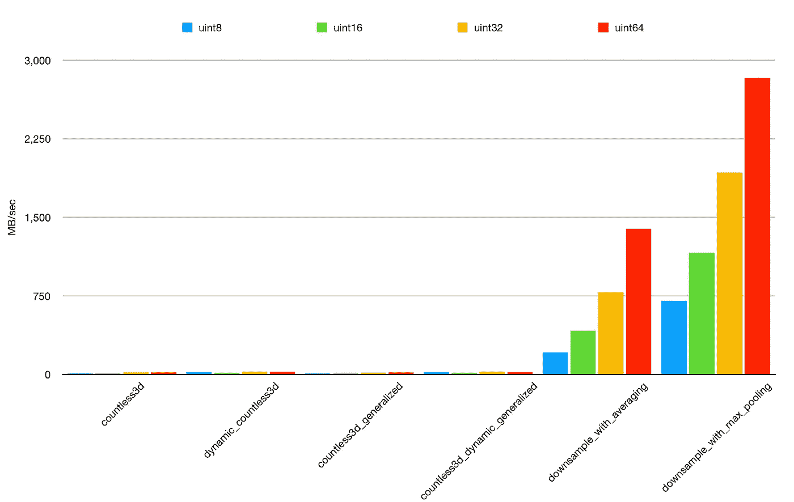

Figure 5\. Python 3 Downsample Performance in Megavoxels/sec on a 512x512x512 Numpy Array by Array Data Type, 5 Trials including COUNTLESS 3D variants, averaging, and max pooling for context.

## 内存使用

在无数个 3D 的动态编程实现中，存储子问题所需的内存显然是巨大的。下面，我测量了五次处理 128MB 512x512x512 立方体的内存需求。图 6 示出了操作中的使用基本算法，而图 7 示出了动态编程算法。下面的图表是使用 Python 3.4 在 Ubuntu 14.04 Linux 上使用 [mprof](https://pypi.python.org/pypi/memory_profiler) 工具生成的。

基本算法相当一致地使用大约 350MB 的 RAM 或大约 2.7 倍的存储立方体所需的内存。动态编程算法需要大约 1150MB，或者大约 9 倍于立方体的内存占用。

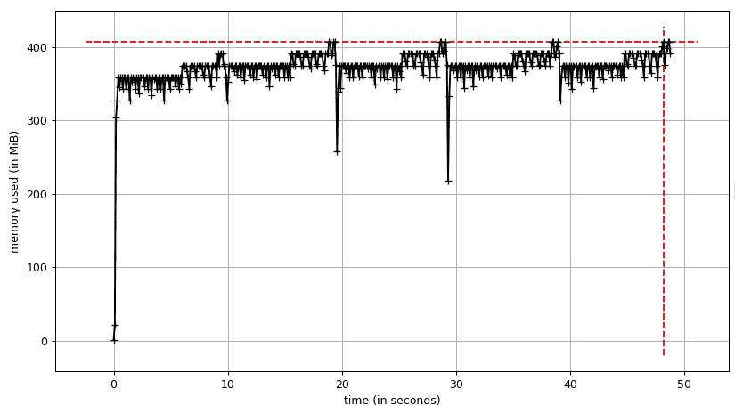

Figure 6\. Memory profile for ordinary COUNTLESS 3D over five trials.

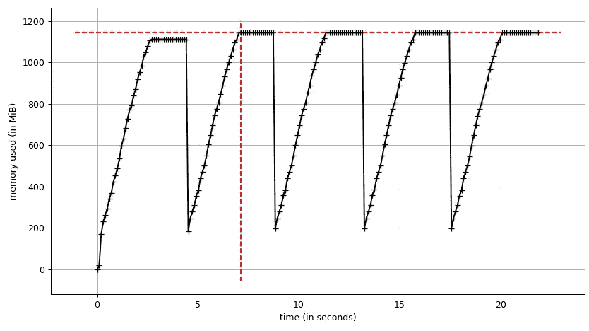

Figure 7\. Memory profile for dynamic programming COUNTLESS 3D over five trials.

# 讨论

无数的 3D 是一个“慢”的算法。更快的动态编程(DP)变体具有指数级的时间复杂度`O(2^(N-1))`，而基本变体稍微慢于此。DP 变体具有组合增长的空间复杂性。然而，非常幸运的是，2x2 (N=4)和 2x2x2 (N=8)的特殊情况是常用的，并且足够小，甚至在这些可怕的条件下也是实用的。在某些情况下，2x2 的情况显示出能够优于实现为 O(N)的标准计数算法，尽管它可以通过使用 hashmaps 减少到 O(N )(尽管由于常数开销增加，它对于小 N 可能会更慢)。

DP 算法的速度提高了 1.5 到 2.2 倍，但内存价格昂贵。无数 3D 的基本变体消耗的内存不到 DP 变体的三分之一。花 3 倍的内存换 2 倍的速度。幸运的是，即使在 uint64 的情况下(~ 8–10gb)，对于单个进程的消费级设置来说，这仍然是一个合理的范围。

可以创建比无数 3D 运行速度快很多倍的 C 或 Cython 代码，而几乎不占用额外的空间。尽管如此，无数的 3D 可以服务于一个特殊的领域:使用普通的 Python/numpy 安装在中等大小的数据集上运行 3D 缩减采样，而不需要额外的编译。这种 3D 算法可以帮助研究人员和程序员，他们需要一个可以在 Python/numpy 所在的地方可靠部署的库。

这些研究人员可以获得最佳性能的一个用例是对感兴趣区域的二进制掩膜进行下采样。某些种类的语义分割可以利用少量的标签。在这种情况下，uint8 阵列提供了足够多的标签，并受益于约 20 MVx/秒的处理速度。在连接组学中，更典型的要求是小容量的 uint16，以及大型项目的 uint32 或 uint64。对于这些情况，我推荐编译代码。

这篇文章存在的一个重要原因是，我在研究无数 2D 的全面概括时获得了乐趣。感谢阅读。😇

## 未来的工作

我计划在将来展示 C 实现之间的比较。我的预期是，它的时钟频率将超过 100 MVx/秒。Github 上有一些 C 代码，但是我还不能确信它是正确的。

# 承认

在开发无数的 3D 和撰写本文的过程中，一些人提供了有益的建议和帮助。 [Kisuk Lee](https://twitter.com/kisukkevinlee) 提供了图 1 和图 2 所示的 3D 数据的可视化。Chris Jordan 提供了 C 实现*计数*和*无数*的种子。乔治·纳吉博士建议概括无数的 2D。Google 的 Jeremy Maitin-Shepard 最初开发了用于 neuroglancer 的*大步走*和*下采样平均*的 Python 代码。特别感谢 [Seung Lab](http://seunglab.org/) 提供神经分割标签。

# 密码

用于测试该管道的代码可以在 [Github](https://github.com/william-silversmith/countless) 上找到。欢迎其他语言的贡献和反馈，并将记入贷方。

**2019 年 3 月 11 日:**现作为 [tinybrain](https://github.com/seung-lab/tinybrain/) [PyPI 包](https://pypi.org/project/tinybrain/)的一部分提供。

*本文是“* [*”无数——使用 Python 和 Numpy*](/countless-high-performance-2x-downsampling-of-labeled-images-using-python-and-numpy-e70ad3275589) *”对标记图像进行高性能 2 倍下采样(2017)的后续。*