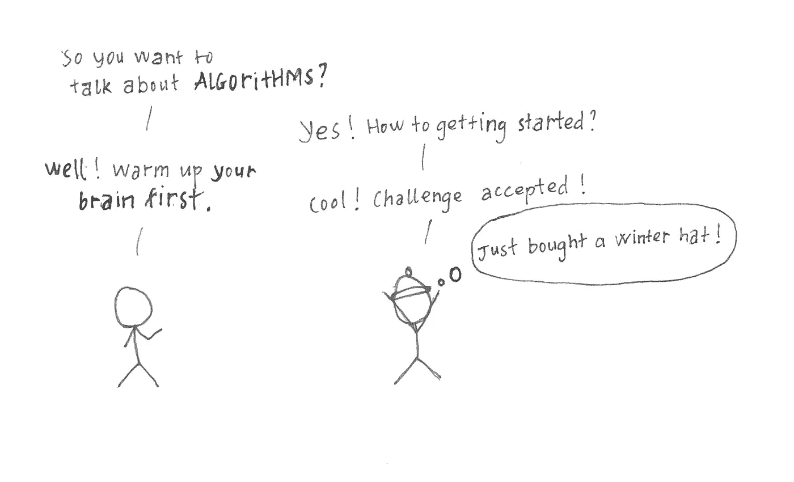
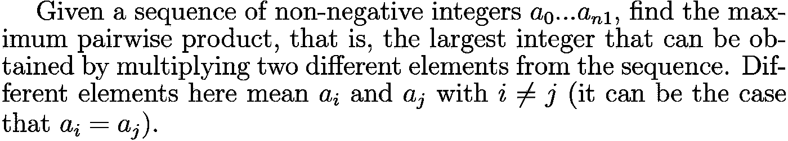
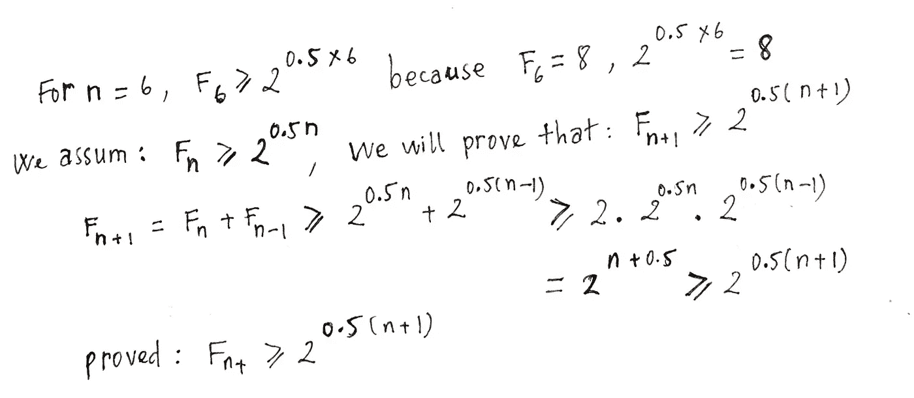
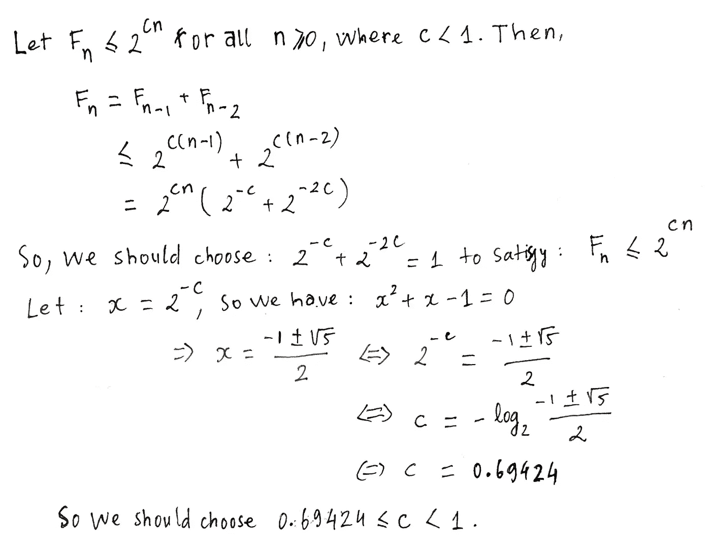
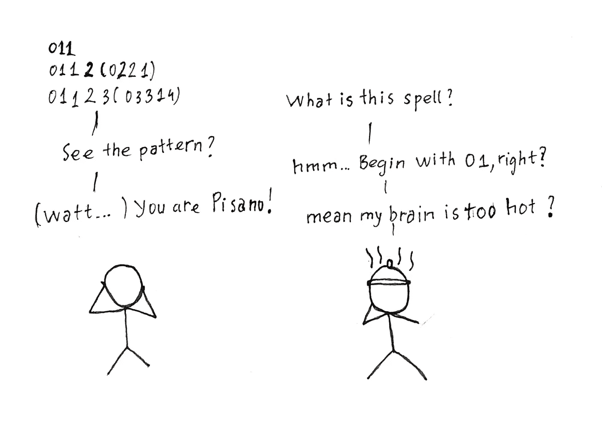
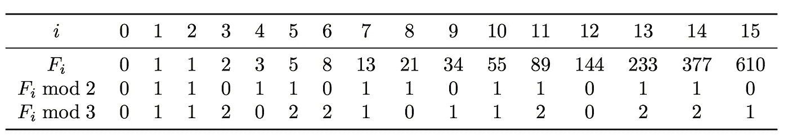

# 课程 1 —算法工具箱—第 1 部分:简介

> 原文：<https://towardsdatascience.com/course-1-algorithmic-toolbox-part-1-introduction-c29b8175430f?source=collection_archive---------1----------------------->

我在做全职工作，创业工作 5 年了。加入软件开发世界是一种幸运。我每天都有机会学习新东西。我构建了许多有效的应用程序(我以前主要是 iOS 开发人员)，许多 RoR、React、Elixir 产品代码正在运行。一切似乎都很好。但是有一天，我深刻地意识到我错过了一些东西，让我的工作更上一层楼。所以我回顾了一下基础知识，看到术语“算法和数据结构”一直在重复。复习完知识后，我决定花时间认真学习算法和数据结构。

幸运的是，这个世界对学习者来说充满了开放的机会。Coursera 为愿意学习的人带来了世界顶尖大学的精彩讲座。毫无疑问，加州大学圣地亚哥分校高等经济学院的“[数据结构和算法](https://www.coursera.org/specializations/data-structures-algorithms)”6 门专业课程脱颖而出。我的朋友正在上课，并向我强烈推荐。

这一系列的博客类似于课堂笔记，包括我基于这些课程材料的想法和实践。它还包含一些我已经解决的问题的提示。如果你有任何问题或评论，请在这里或 [github](https://gist.github.com/phatle) 留言。我愿意一起学习。我做这些笔记是为了帮助我复习。希望对你也有帮助，所以公开一下。让我们跳进游泳池吧！

Getting started with Algorithms

**问题 1:最大两两乘积。**

**解决方案:**

我们只需要将两个最大的数字相乘。

**问题 2:大公约数(GCD)**

两个非负整数 a 和 b(不都等于 0)的最大公约数 GCD(a，b)是除 a 和 b 的最大整数 d。

你在这个问题中的目标是实现计算最大公约数的欧几里德算法。计算最大公约数的高效算法是 RSA 等常用密码算法的重要基本原语。

**解决方案:**

**问题 3:最小公倍数**

两个正整数 a 和 b 的最小公倍数是能被 a 和 b 整除的最小正整数 m。

**解决方案:**

如果你知道 LCM(a，b)。GCD(a，b) = ab，复用上一个 GCD 算法，这个问题的算法会很好写。

***注意:*** 在 python 中使用//在 Python3 中对大数进行右除运算。

**问题四:斐波那契数**

斐波那契数列的定义:

**解决方案:**

很容易实现简单的递归算法来计算斐波那契数。

但是运行时间不好。你可以试着计算一下 **F40** ，这会花费相当长的时间。

我们需要一种更快的方法来计算斐波那契数列。

**练习 1:** 用归纳法证明 n ≥ 6 时 Fn ≥ 2^(0.5n)。

**证明:**

*assume

**练习 2:** 求一常数 c < 1 使得对于所有 n ≥ 0，Fn ≤ 2^cn。表明你的答案是正确的。

**证明:**

**问题 5:一个大斐波那契数的最后一位数字**

求第 n 个斐波那契数的最后一位数。回想一下，斐波那契数列以指数速度增长。举个例子，

f200 = 280571172992510140037611932413038677189525。

**解决方案:**

因为它的增长是指数级的快，所以我们不能用 fast_fibonacci(n) % 10 来给出答案。我们需要另一种方法来解决这个问题。我们只对 Fn-1 的最后一位和 Fn-2 的最后一位求和，而不是对 Fn-1 + Fn-2 求和。

**高级问题 6:模 m 的巨大斐波那契数**

Pisano alike

求 Fn 模 m，这里 n 可能真的很大:高达 1018。对于这样的 n 值，循环 n 次迭代的算法肯定不适合一秒钟。因此，我们需要避免这样的循环。为了了解如何解决这个问题，而不需要遍历 I 从 0 到 n 的所有 Fi，让我们看看当 m 很小时会发生什么，比如 m = 2 或 m = 3。

所以可以观察到它有周期。Fn 模式 2 具有长度为 3 的 011 周期，Fn 模式 3 具有长度为 8 的 01120221 周期。因此，要计算 F2016 mod 3，我们只需找到 2016 除以 8 的余数。自 2016 年= 251.8 + 8。我们的结论是 F2016 mod 3 = F8 mod 3 = 0。

这在一般情况下是成立的:对于任何 m >= 2 的整数，序列 Fn mod m 是周期的。周期总是从 01 开始，被称为[皮萨诺周期](https://en.wikipedia.org/wiki/Pisano_period)。

**解决方案:**

基于这一假设，我们通过检查 Pisano 周期是否由 01 重复并保持重复 Pisano 表中的其他数字来检测 Pisano 周期。所以我们检查

pisano_table[half_size] == 0 并且

pisano_table[half_size+1] == 1 并且

pisano _ table[0:half _ size]= = pisano _ table[half _ size:size]

该算法工作正常，并为我们提供了小数字的正确答案。由于数字很大，Pisano 表的长度很长，计算和检测 Pisano 周期需要时间。为了减少计算时间，我们只需检查后面重复的 01 和 10(其他数字也可以)数字的周期。对于大型斐波那契运算，检测 Pisano 表将节省时间。

**高级问题 7:斐波那契数列的和**

寻找前 n 个斐波那契数列总和的最后一位数。(查找 F0 + F1 + … + Fn 的最后一位数字)

**解决方案:**

借助于皮萨诺周期，我们可以很容易地计算出任何 Fi 的最后一位数字。我们有 F0 + F1 + … + Fn = F(n+2) — 1。该算法将易于实现:

这里的一个技巧是加 10，以确保我们在 get_fibonacci_huge(n+2，10)的最后一位数字为 0 的情况下返回正余数。

**高等问题 8:斐波那契数列的部分和。**

寻找斐波那契数列部分和的最后一位数字:Fm + Fm+1 + + Fn。

**解决方案:**

如果我们得出 Fm + Fm+1 + … + Fn = F(n+2) — F(m+1)。实现该解决方案将会很容易

***注意:*** 我们只取 F(n+2) + 10 的最后一位数字，减去 F(m+1)的最后一位数字，模块得到该数字。

例如:F(n+2) = abc12，F(m+1) = def37，所以要得到正确的最后一位数字，我们必须做:(2+10–7)% 10

旁注:如果你喜欢这个帖子，你会喜欢:[https://www.coursera.org/learn/fibonacci/home/info](https://www.coursera.org/learn/fibonacci/home/info)。我喜欢关于迷惑斐波那契的讲座

**资源:**

最大公约数:[DPV08]第 1.2.3 节,[CLRS]第 31.2 节

计算斐波那契数:[DPV08]的第 0.2 节

斐波那契数列的性质:练习 0.2–0.4[dpv 08]

**参考文献:**

桑乔伊·达斯古普塔、克里斯托斯·帕帕迪米特里乌和乌梅什·瓦齐拉尼。算法(第一版)。麦格劳-希尔高等教育。2008.

托马斯·h·科尔曼，查尔斯·e·莱瑟森，罗纳德·L·李维斯特，克利福德·斯坦。算法导论(第三版)。麻省理工学院出版社和麦格劳-希尔。2009.