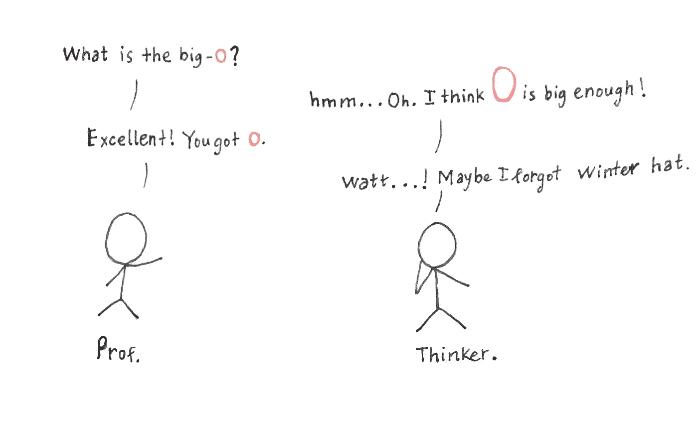
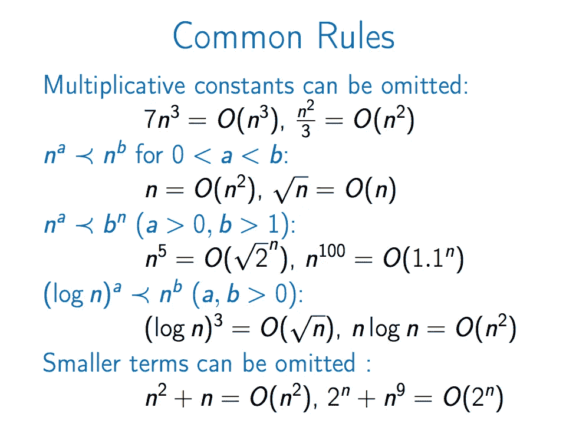
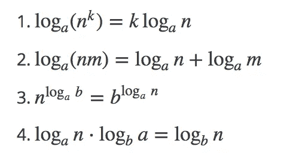
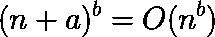
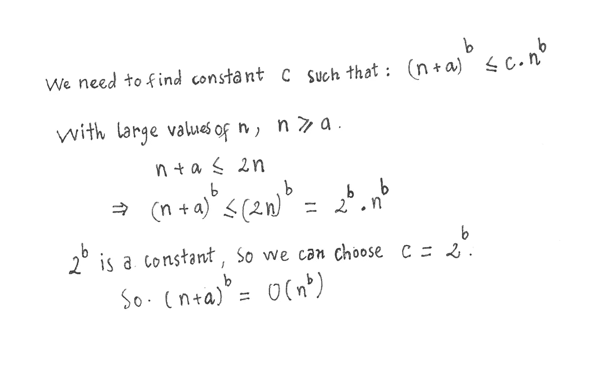
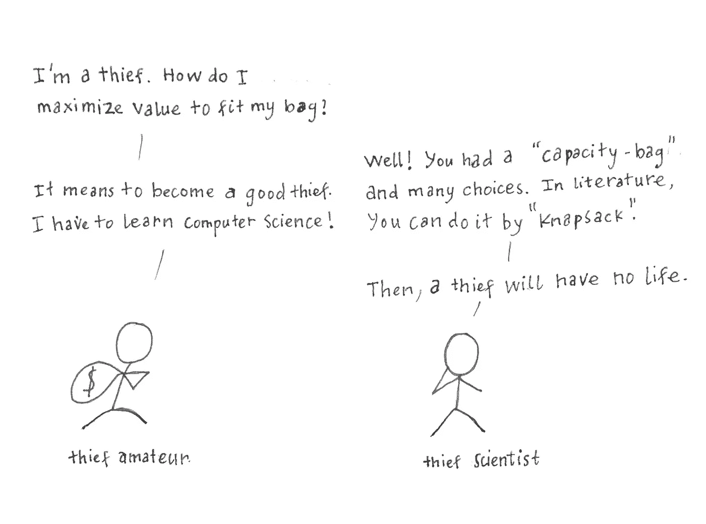
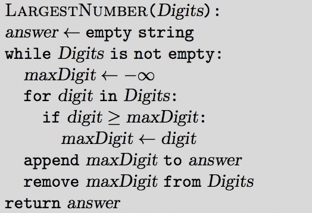

# 课程 1 —算法工具箱—第 2 部分:大 O 和贪婪

> 原文：<https://towardsdatascience.com/course-1-algorithmic-toolbox-part-2-big-o-and-greedy-6265d9065f05?source=collection_archive---------1----------------------->

上一篇文章中，我们讨论了与斐波那契数列相关的小编程问题和数学。为了知道算法有多快，我们使用 Big-O 符号。看看是什么！

# Big-O 的定义来自[1]:

*设 f(n)和 g(n)是正整数到正整数的函数。如果有一个常数 c > 0 使得 f(n) ≤ c . g(n)，我们就说 f = O(g)(意思是“f 的增长速度不比 g 快”)。*

From lecture 3

当我们处理大 O 记数法时，我们通常会遇到对数。以下是使用对数的规则:

From lecture 3

让我们解决一个小问题来暖一下我们的大脑吧！

***问题:表明对于任意实数常数 a 和 b，其中 b >为 0，*为 **

**证明:**

***加分:*** 麻省理工给 Big-O 的作业太好了[3]。

# **贪婪**

贪婪算法首先做出局部最优选择。每个阶段，只是贪婪地做出选择，祈祷你会找到全局的答案。太贪心了。

***要做的步骤:***

-做出贪婪的选择。

-证明这是一个安全的举动。(也就是证明你确实贪婪)。

-归结为一个子问题。

-解决子问题。

**玩具问题举例:**

-由数字 3、9、5、9、7、1 组成的最大数字是多少？使用所有数字。

可能的解决方案:359179、537991、913579。。。

在用贪婪算法解决这个问题时，我们一步一步地做:

- **做一个贪婪的选择**:列表中的最大数字(数字 9)。

- **证明这是一个安全的移动**:列表只包含数字(没有大于 10 的数字)，最大数字从有效的最大数字(不是零)开始。因此，选择最大数量是一个安全的举动。

- **归结为一个子问题**:我们选择最大数字(9)，并将其从列表中移除。左边的列表包含[ 3，5，9，7，1 ]。我们在每一步都有更小的列表。

- **解决子问题**:我们又有一个列表，只要选择最大值，一直做，直到列表为空。你会得到答案的。

正确答案:997531。

# 分数背包

分数背包问题是计算机科学中众所周知的问题。我们可以用贪婪策略来实现背包问题(简单版):

**输入:**权重 w1，w2，…，wn 和值 v1，v2，…。n 个项目的 VN；容量 w。找出一个容量为 w 的袋子中的物品的最大总价值(简单的版本，意味着我们可以将 wi 分成许多重量单位)

例:我们有 3 种包装:价值 20 美元，重 4 公斤；价值 18 美元，重 3 公斤；价值 14 美元，重 2 公斤。我们只能负重 7 公斤。那么，我们如何选择最大化我们的价值呢？

明确的答案是选择 2 公斤 14 美元、3 公斤 18 美元和 2 公斤 20 美元，这样我们就可以得到 14 美元+18 美元+20 美元/2 = 42 美元的价值。

注:2 公斤和 3 公斤的最大值为每单位 14/2 美元和 18/3 美元。

使用贪婪策略来解决这个问题。我们一步一步来。

- **做一个贪婪的选择:**尽可能多的选择单位重量价值最大的物品。

a = 20 美元/4 = 5 美元/单位

b = 18 美元/3 = 6 美元/单位

c = 14 美元/2 = 7 美元/单位。

所以我们先选 A，B 再选 c。

- **证明它是安全之举:**我们把任何物品 I 分成 wi 个更小的物品，每个物品都有 vi/wi 的单位重量。我们有 w0 + w1 + …+ w2 数量的单位项目。因为是单位，所以我们就尽可能选择单位有最大值的。

——**将问题化简为子问题:**在我们选择了一个贪婪的选择 wi 的值为 vi 之后，我们将其从列表中移除，这样我们就有 n-1 个项目对应 n-1 个值。

- **解决子问题:**一直选择每单位最大值，直到容量 W 满为止。(您可以将最后一个分成较小的重量，以适应容量 W)

From lecture 3

背包的运行时间是 O(n)。

# **问题 1:换钱**

该问题的目标是找到将输入值(整数)转换为面值为 1、5 和 10 的硬币所需的最少硬币数。

**输入格式:**输入由一个整数 m 组成。(1 < = m < = 10)

**输出格式:**输出改变 m 的面额为 1，5，10 的硬币的最小数量。

**样品 1:**

输入:3

输出:3

解释:3 = 1 + 1 + 1

**样品 2:**

输入:28

产出:6

解释:28 = 10 + 10 + 5 + 1 + 1 + 1。

***解:***

贪婪的选择是选择尽可能多的数量最大的硬币。

# 问题 2:最大化战利品的价值

一个小偷发现了比他的包能装得下的更多的赃物。帮助他找到最有价值的物品组合，假设战利品的任何部分都可以放进他的包里。

这个代码问题的目标是实现一个派系背包问题的算法。

**输入格式:**输入的第一行包含物品数量 n 和一个背包的容量 W。接下来的 n 行定义了项目的值和重量。第 I 行包含整数 vi 和 wi，分别是第 I 项的值和权重。

**输出格式:**输出适合背包的物品分数的最大值。你的程序的答案和最优值之差的绝对值最多应该是 10 ^ 3。为了确保这一点，输出您的答案时小数点后至少要有四位数字(否则，虽然您的答案计算正确，但可能会因为舍入问题而出错)。

**样品 1:**

**输入:**

3 50

6 20

100 50

120 30

**产量:** 180.0000

**解释:**
要达到数值 180，我们把第一个物品和第三个物品放进袋子里。

**解决方案:**

上面有伪代码，我们可以很容易地实现派系背包。

这里的要点是从价值/重量中选择最大指数。将该值添加到结果中，并清除原始列表中的值。

# **问题 3:在线广告投放收入最大化**

你有 n 个广告可以放在一个流行的网页上。对于每个广告，你知道广告商愿意为这个广告的一次点击支付多少钱。您已经在页面上设置了 n 个位置，并估计了每个位置每天的预期点击数。现在，你的目标是在广告位之间分配广告，以使总收入最大化。

**问题描述:**

给定两个序列 a1，a2，…，an (ai 是第 I 个广告的每次点击利润)和 b1，b2，…，bn (bi 是第 I 个槽的平均每天点击次数)，我们需要把它们划分成 n 对(ai，bj)，使得它们的乘积之和最大化。

**输入格式:**第一行包含整数 n，第二行包含整数 a1，a2，…，an 的序列，第三行包含整数 b1，b2，…，bn 的序列。

**输出格式:**输出∑ai*ci (1 ≤ i ≤ n)的最大值其中 c1，c2，.。。，cn 是 b1，b2，…，bn 的置换。

**样品 1。**

输入:1 23 39

产量:897

解释:897 = 23 39。

**解决方案:**

贪婪的选择是为每天点击次数最多的位置选择最高的每次点击利润。为了证明这是一个安全的选择，请阅读作业细节[2]。

所以，我们只要选择最高的 ai 和 bj，compute: result += ai。bj。

# **问题 4:收集签名**

你负责收集某栋大楼所有租户的签名。对于每个房客，你知道他或她在家的一段时间。你想通过尽可能少的拜访建筑物来收集所有的签名。

这个问题的数学模型如下。给你一组直线上的线段，你的目标是在一条直线上标记尽可能少的点，使每一段至少包含一个标记点。

**问题描述**

给定一组 n 个线段{[a0，b0]，[a1，b1]，。。。，[an-1，bn-1]}整数坐标在一条直线上，求最小 m 个数的点，使得每段至少包含一个点。也就是说，找出一组最小尺寸的整数 X，使得对于任何线段[ai，bi]都有一个点 x ∈ X 使得 ai ≤ x ≤ bi。

**输入格式:**输入的第一行包含段数 n。下面 n 行中的每一行都包含两个整数 ai 和 bi(用空格分隔),它们定义了第 I 个线段端点的坐标。

**输出格式:**第一行输出最少 m 个点，第二行输出 m 个点的整数坐标(用空格隔开)。您可以按任意顺序输出点。如果有很多这样的点集，可以输出任意一个集合。(不难看出，总是存在一组最小尺寸的点，使得所有这些点的坐标都是整数。)

**样品 1:**

**输入:3**

1 3

2 5

3 6

**输出:** 1 3

**说明:**
在这个样本中，我们有三段:[1，3]，[2，5]，[3，6](长度分别为 2，3，3)。都包含坐标为 3 的点:1 ≤3 ≤3，2 ≤3 ≤5，3 ≤ 3 ≤ 6。

**样品 2:**

**输入:** 4

4 7

1 3

2 5

5 6

**输出:** 2

3 6

**解释:**
第二和第三段包含坐标为 3 的点，而第一和第四段包含坐标为 6 的点。所有四个线段不能被一个点覆盖，因为线段[1，3]和[5，6]是不相交的。

**解决方案:**

贪婪的选择是选择最小的右端点。然后删除包含该端点的所有线段。继续选择最小右端点并移除线段。

# **问题 5:最大化竞赛中的奖励名额数量**

你正在为孩子们组织一场有趣的比赛。作为奖励基金，你有 n 颗糖果。你想用这些糖果在一场自然限制的比赛中争夺前 k 名，位置越高，糖果越多。为了让尽可能多的孩子快乐，你要找到可能的 k 的最大值。

**问题描述**

这个问题的目标是将一个给定的正整数 n 表示为尽可能多的两两不同的正整数之和。也就是求 k 的最大值使得 n 可以写成 a1+a2+ +ak 其中 a1，…，ak 是正整数，ai！= aj for all 1 ≤i

**输入格式:**输入由单个整数 n 组成。

**输出格式:**在第一行，输出最大数 k，使得 n 可以表示为 k 个两两不同的正整数之和。在第二行中，输出 k 个两两不同的正整数，总和为 n(如果有许多这样的表示，则输出其中任何一个)。

**样品 1:**

输入:6

输出:3

1 2 3

**样品 2:**

输入:8

输出:3

1 2 5

**解决方案:**

贪婪的选择是从 1，2…中选择最小的数，将它们相加为 S，如果你的最小数大于(input_number— S)/ 2。你找到了最后一个号码。为什么？请看一下作业细节[2]。

# **高级问题 6:最大化你的工资**

作为一次成功面试的最后一个问题，你的老板给你几张写有数字的纸，让你用这些数字组成一个最大的数字。得出的数字就是你的工资，所以你非常想最大化这个数字。你怎么能这样做？

在讲座中，我们考虑了以下算法，用于从给定的一位数中合成最大的数。

不幸的是，这种算法只在输入由一位数组成的情况下有效。例如，对于由两个整数 23 和 3 组成的输入(23 不是个位数！)它返回 233，而实际上最大的数字是 323。换句话说，使用输入中最大的数字作为第一个数字并不安全。

你在这个问题中的目标是调整上面的算法，使它不仅适用于一位数，而且适用于任意正整数。

**问题描述**

组成一组整数中的最大数。

**输入格式:**输入的第一行包含整数 n .第二行包含整数 a1，a2，…，an。

**输出格式:**输出 a1，a2，.。。，安。

**样品 1:**

**输入:2**

21 2

**输出:**

221

**说明:**
注意，在这种情况下，上述算法也返回不正确的答案 212。

**解决方案:**

这个问题有很多边缘情况。根据上面的伪代码，要点是用正确的方法检查“digit ≥ maxDigit”。因为它不再仅仅是数字，你必须确保 12 和 2 => 221，22 和 225 => 22522…为此，比较两个数的策略是:

*   把 A 变成字符串 A
*   把 B 变成字符串 B
*   比较两个字符串 AB 和 BA

**资源**:

背包:[BB]第 6.5 节

**参考文献**:

[1]:[DPV]第 0.3 节

[2]:[https://www . coursera . org/learn/algorithm-toolbox/programming/kAiGl/programming-assignment-2-greedy-algorithms](https://www.coursera.org/learn/algorithmic-toolbox/programming/kAiGl/programming-assignment-2-greedy-algorithms)

[3]:[https://OCW . MIT . edu/courses/electrical-engineering-and-computer-science/6-006-introduction-to-algorithms-fall-2011/assignments/MIT 6 _ 006 F11 _ PS1 _ sol . pdf](https://ocw.mit.edu/courses/electrical-engineering-and-computer-science/6-006-introduction-to-algorithms-fall-2011/assignments/MIT6_006F11_ps1_sol.pdf)

[DPV]桑乔伊·达斯古普塔、克里斯托斯·帕帕迪米特里乌和乌姆什·瓦齐拉尼。算法(第一版)。麦格劳-希尔高等教育。2008.

吉勒·布拉萨尔和保罗·布拉特利。算法基础。普伦蒂斯-霍尔。1996.