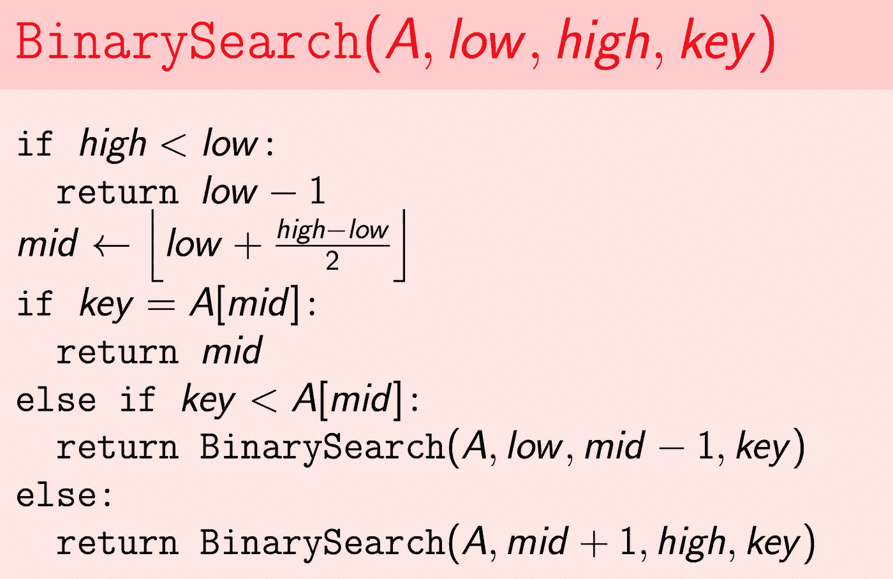
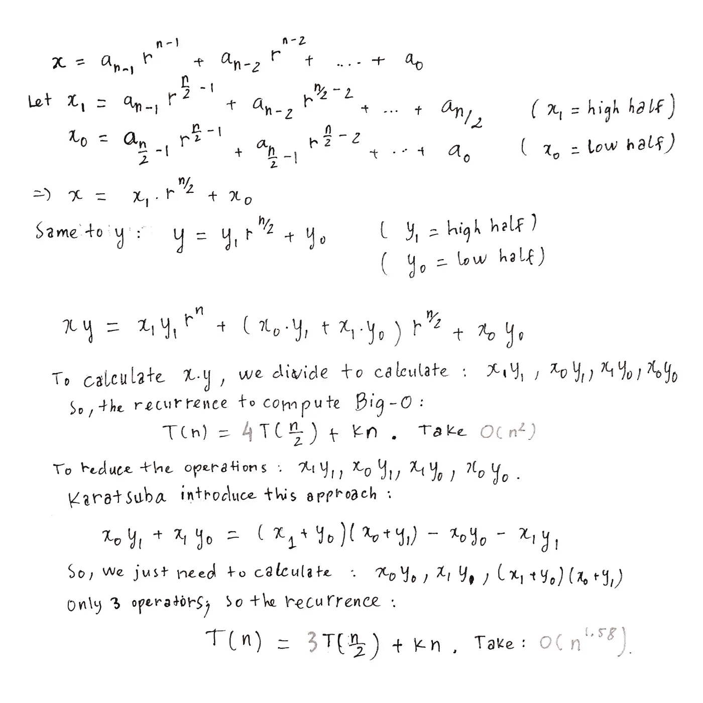
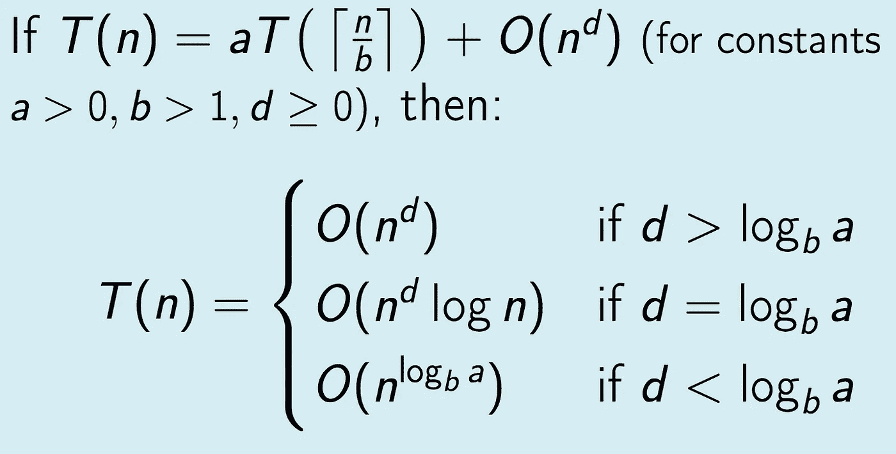
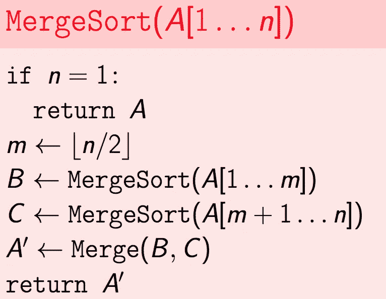
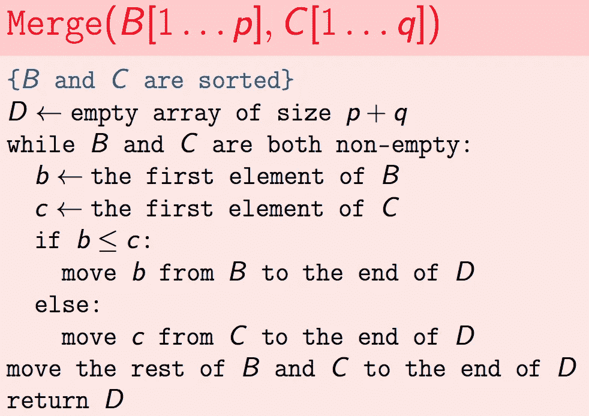
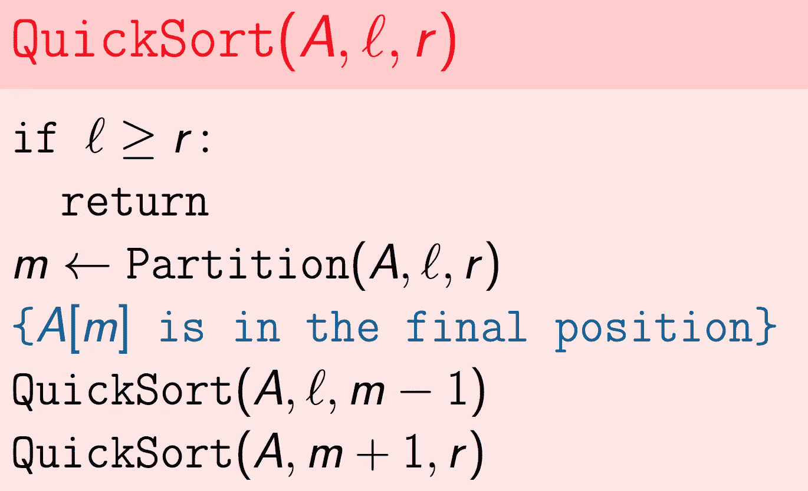
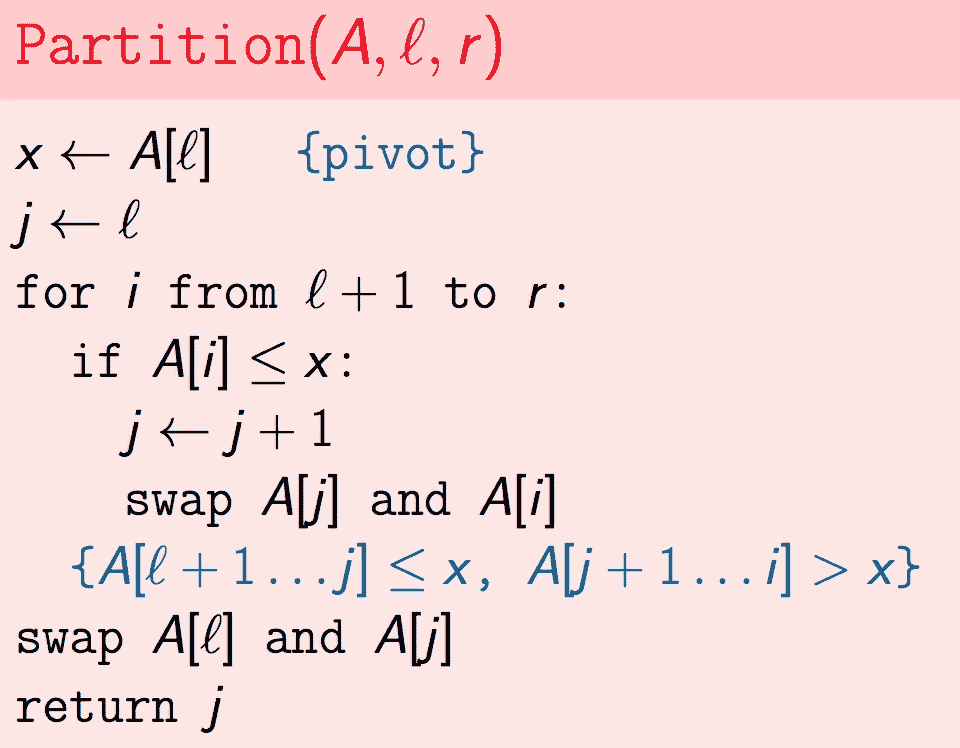
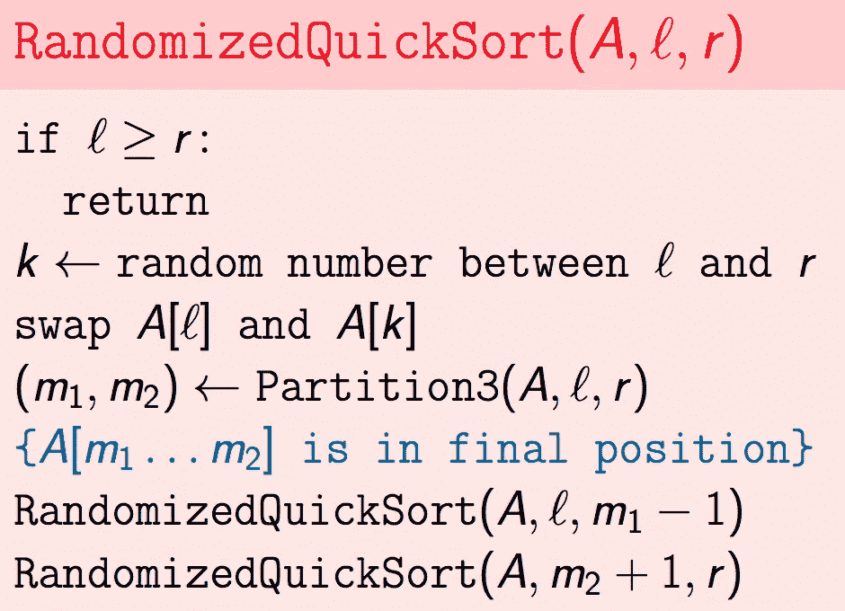
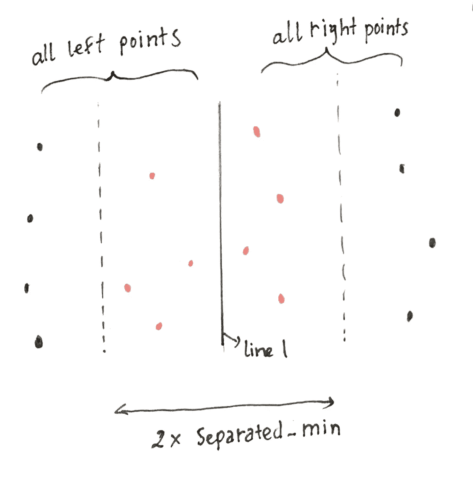

# 课程 1 —算法工具箱—第 3 部分:分而治之

> 原文：<https://towardsdatascience.com/course-1-algorithmic-toolbox-part-3-divide-and-conquer-dd9022bfa2c0?source=collection_archive---------0----------------------->

我们将在本文中讨论各个击破。我对这个话题很感兴趣。我希望你也能。完成作业花了我很多时间。我强烈建议你认真对待作业，并尝试解决两个高级问题。

Divider.

# 各个击破

分而治之的步骤:

1.  分解成相同类型的不重叠的子问题。
2.  解决子问题。
3.  结合结果。

# 二分搜索法:在排序数组中搜索。

**输入:**一个排序数组 A[low…high] (A[i] < A[i+1])和一个 key k。

**输出:**一个指标，I，其中 A[i] = k

否则，最大指数 I，其中 A[i] < k.

Otherwise (k < A[low]), the result is low — 1.

**样本 1:**

输入:[3，5，9，20，27，52，65]和一个键 20。

输出:3。

**样品 2:**

输入:[3，5，9，20，27，52，65]和一个键 7。

输出:1。

我们将使用分治算法来解决这个问题。我们将一步一步地解决它。

1.  分解成相同类型的不重叠的子问题。

*   输入数组已排序。我们将它分成两半数组。因此在两个子阵列之间没有重叠元素。

2.解决子问题。

*   我们有两个子问题:A 和 B。我们比较密钥 k 和 B[0]。
*   如果 B[0] == k = >我们找到了结果(结果= B[0]的索引)
*   如果 B[0] ≤ k = >我们选择数组 a。(结果= B[0]的索引)
*   如果 B[0] ≥ k = >我们选择数组 B。(结果= A[0]的索引)

3.结合结果。

*   只需返回结果。

**伪代码:**

Binary Search

二分搜索法的运行时间是 **O(logn)** 。

# 乘法多项式

这是非常有趣的部分。我们想要乘以大整数。我们如何做到这一点？除此之外，乘法多项式还应用于纠错码、生成函数、信号处理中的卷积等

我们有两个 n 位数:x 和 y(基数 r = 2，10)。

我们将 x 和 y 表示成两种形式:

Karatsuba’s method

# 主定理

计算递归算法的 Big-O。我们将公式一般化，并在一般情况下求解。

Master Theorem

这个公式的证明在[2]中。在本文中，我们将关注问题的解决。:)

# 合并排序

MergeSort 喜欢这个名字，分解和合并。这个概念非常简单:

*   分成两个子列表，直到只剩下一个元素。
*   按顺序合并 2 个子列表(排序)。

**伪代码:**

MergeSort

这里的关键点是合并策略。循环思考 2 个子数组，选择较小的元素，放入第三个数组。

Merge strategy

大 O 就是 **O(nlogn)。**

**注意:**下面有一个有趣的问题，需要我们调整合并策略。通过调整，你会完全理解合并排序。

# 快速排序

快速排序的概念是选择一个支点，重新排列数组，使左支点上的所有元素都小于支点，右支点上的所有元素都大于支点。

**例**:对于数组 A = [ **6** ，4，2，3，9，8，9，4，7，6，1]

如果我们选择 A[1] = 6 是一个支点，我们需要把 A 重新排列成:

[1，4，2，3，4，6， **6** ，9，7，8，9]

快速排序算法分两步实现:

*   选择支点，重新排列成 A[left] ≤A[pivot] < A[right].
*   Keep choosing pivot and re-arrange A[left] and A[right].

The pseudocode for this 2 steps:

QuickSort

As you see, l is left index, r is right index.

Partition(A, l, r) function is containing choosing pivot, and rearrange A from l(left-index) to r(right-index) into A[left] ≤ A[pivot] ≤ A[right] and returning the position(index) of A[pivot].

To choose pivot, we have many strategies. If we know what types of data we have, we will have better choice of pivot. There are common choices of pivot:

*   Choose A[0] as a pivot.
*   Choose random from l -> r 作为支点
*   [中位数的中位数](https://en.wikipedia.org/wiki/Median_of_medians)算法。

以[0]为轴心重新排列数组的伪代码:

QuickSort partition

x 将是 pivot 的值。

我们想把 A[l…r]重新排列成 A[left] ≤ A[pivot] ≤ A[right]用

左=左

A[右] = A[j+1…r]

我们将使用最后一个示例来说明如何将 A = [ **6** ，4，2，3，9，8，9，4，7，6，1]转换为[1，4，2，3，4，6， **6** ，9，7，8，9]。

left = 0，r = 10，pivot A[0] = 6。

假设我们有一个[left]只有一个[l]元素，所以 j = 0。

我们从 l+1 到 r 循环 I，每一步都要保证 A[left…j] ≤ A[pivot] ≤ A[j+1…r]。有两种情况:

*   A[i] ≥ A[pivot]，我们什么都不做，因为它已经是 A[i]≥ A[pivot]。
*   A[i] ≤ A[pivot]，我们有 A[j]是小于 A[pivot]的元素的最后一个索引。因此，我们需要交换 A[j+1]和 A[i]并标记 j = j+1，以表明 j 是小于 A[pivot]的元素的最后一个索引。通过交换 A[j+1]和 A[i]，我们确定 A[l…j] ≤ A[pivot] ≤ A[j+1…r]。

如果您手动运行该算法，我们将得到 A =[ **6** ，4，2，3，4，6，1，9，7，8，9]。

所以我们现在有了数组:A[l] + A[1…j] + A[j+1…r]。最后一步是交换 A[j]和 A[0]，这样我们将得到数组:A[0…j-1] + A[pivot] + a[j+1…r]。

于是我们得到:A = [1，4，2，3，4，6， **6** ，9，7，8，9]。

## **随机化枢纽:**

要实现随机化透视，很简单，只需:

*   选择随机支点 l ≤ k ≤ r。
*   交换 A[0]和 A[k]
*   保持分区就像选择一个[o]作为支点。

随机化 pivot 快速排序的 Big-O 在平均运行时间上是 **O(nlogn)** 。最坏的情况运行时间是 **O(n )** 。这个大 O 有点棘手。你可以阅读[3]中的证明。

**注:**快速排序最差的情况是 **O(n )** 但是在实践中，快速排序平均给了我们比合并排序更好的性能。

## Equal Elements:带有一些 uniq 元素的快速排序。

你可以在这里看到快速排序的[可视化](https://www.toptal.com/developers/sorting-algorithms/quick-sort)。我们可以观察到，如果数据有许多相等的元素，快速排序需要很长时间才能完成。为了优化，我们应该有不同的分区策略:

而不是把 A 重新排列成 A[左]≤A[支点]≤A[右]。我们将把 A 变成:A[左]≤A[m1…m2]≤A[右]有 A[I]= = A[支点] (m1 ≤ i ≤ m2)。

所以在每一步，我们都少了一个[左]，一个[右]项要排序。

相等元素的伪代码:

Equal elements QuickSort

在练习中，我们将了解该算法的实现细节。

完全理解这些排序算法和分而治之技术的最好方法是解决有趣的问题。大家一起解决吧。

# 问题 1:实现二分搜索法

在这个问题中，你将实现二分搜索法算法，该算法允许非常有效地搜索(甚至是巨大的)列表，只要列表是排序的。

**输入格式。**输入的第一行包含一个整数 n 和一个序列 a0 < a1 <。。。< a(n-1)个按升序排列的 n 个两两不同的正整数。下一行包含一个整数 k 和 k 个正整数 b0，b1，.。。，b(k-1)。

**约束。** 1 ≤ n，**k≤10⁵**；对于所有 0 ≤i < n，1≤ai≤10⁹**t11；对于所有 0≤j < k，1≤bj≤10⁹；**

**输出格式。**对于所有的 0 ≤ i ≤ k-1，输出一个索引 0≤j≤n-1，使得 aj = bi，如果没有这样的索引，则输出-1。

**样本。**

**输入:**

5 1 5 8 12 13

5 8 1 23 1 11

**输出:**

2 0 –1 0 –1

**解释:** 在这个例子中，给我们一个长度为五的递增序列 a0 = 1，a1 = 5，a2 = 8，a3 = 12，a4 = 13，五个键进行搜索:8，1，23，1，11。我们看到 a2 = 8，a0 = 1，但是键 23 和 11 没有出现在序列 a 中，为此，我们输出一个序列 2，0，1，0，1。

## 解决方案:

我们只是按照上面的二进制搜索伪代码，实现二进制搜索算法。最后，我们循环搜索关键字 b0，b1，…，bk，并运行 **binary_search(a，bi)** 。

BinarySeach

# 问题 2:寻找多数元素

多数规则是一种决策规则，它选择拥有多数票(即超过半数的选票)的方案。
给定一系列元素 a1，a2，.。。，您希望检查它是否包含出现 n/2 次以上的元素。下面是一个简单的方法。

该算法的运行时间是二次的。你的目标是使用分治技术设计一个 O(n log n)算法。

**输入格式。**第一行包含整数 n，下一行包含 n 个非负整数 a0，a1，.。。，一个 1。

**输出格式。**如果序列包含一个严格出现次数超过 n/2 次的元素，则输出 1，否则输出 0。

**样品 1。**

**输入** : 5

2 3 9 2 2

**输出**:

1

**解释:** 2 是多数元素。

**样品 2。**

**输入** : 4

1 2 3 1

**输出**:

0

**解释** :
这个序列也没有多数元素(注意元素 1 出现了两次，因此不是多数元素)。

你可能已经猜到了，这个问题可以通过分治算法在时间 O(nlogn)内解决。事实上，如果一个长度为 n 的序列包含一个多数元素，那么这个元素也是它的一半的多数元素。因此，要解决这个问题，首先要将一个给定的序列分成两半，并进行两次递归调用。你看到如何组合两个递归调用的结果了吗？

有趣的是，这个问题也可以通过更高级的(非分治)算法在 O(n)时间内解决，该算法只需扫描给定序列两次。

## **解决方案:**

这是一个超级有趣的问题，如果你用分而治之来解决它。

首先，我们需要分成子问题。在每一步，我们将序列分成两个左半序列和右半序列。主要工作是编写合并策略:

为了确定**序列**的多数，我们将把**的左半部分**或**的右半部分**表示成两个元素的数组: **A【多数，其他】**。

**majorities = A[0]** 包含在此序列中占多数的所有元素(相同值)。名为 **A_major_elements**

**others = A[1]** 是内部没有 A_major_elements 的所有元素。

示例:

left_half = [[2，2，2]，[3，5，7，7，9]]

right_half = [[5，5，5，5]，[4，8，10，34，2，10，10]]

**count_merge** 函数将基于**左 _half** 和**右 _half** 返回 **M【多数，其他】**。

为此，我们会:

*   从**右半部分[1]** ([4，8，10，34，2，10，10])**中取出所有**左半部分主元素**(例:2) 放入**左半部分[0】。****
*   **从**左半部分**(【3，5，7，7，9】)**，**中取出所有**右半部分主元素(ex: 5)** 放入**右半部分【0】。****

**所以我们得到了:**

**left_half = [[2，2，2， **2** ]，[3，7，7，9]](加 2，减 5)**

**right_half = [[5，5，5，5， **5** ，[4，8，10，34，10，10]](加 5，减 2)。**

**我们称这个过程为 **chunk_process** :**

**在 **count_merge** 函数中，我们只需要根据 **chunk_left** 和 **chunk_right** 选择多数。**

**最终我们会有一个结果数组:**【多数，其他】**。我们只需检查大多数的长度超过 n/2 就可以给出答案。**

# ****问题 3:改进快速排序****

**这个问题的目标是重新设计随机快速排序算法的一个给定实现，使它即使在包含许多相等元素的序列上也能快速工作。**

****问题描述****

****任务。**为了强制快速排序算法的给定实现有效地处理具有很少唯一元素的序列，您的目标是用 3 路分区替换 2 路分区。也就是说，您的新分区过程应该将数组分成三部分:< x 部分、= x 部分和> x 部分。**

****输入格式。**输入的第一行包含一个整数 n。下一行包含 n 个整数 a0，a1，.。。，a(n-1)。**

****输出格式。**输出这个按非降序排序的序列。**

****样品 1。****

**输入:5**

**2 3 9 2 2**

**输出:**

**2 2 2 3 9**

## **解决方案:**

**正如我们上面所说的，我们需要为具有许多相等元素的数据优化 QuickSort。因此，我们将阵列划分为 3 个阵列:**

**A[left]≤A[m1…m2]≤A[right]with A[I]= = A[pivot](m1≤I≤m2)。**

**我们的主要工作是实现 partition3 函数来重新排列数组 A 并返回位置 m1，m2。**

**我们从 l + 1 到 r 循环遍历所有元素 I。在每一步，我们确保将 a[i]重新排列到正确的位置。**

**例如，如果 **a[i] ≤ pivot** (a[l])，我们将 a[i]重定位到 a[begin…end](与 pivot 具有相同的值)。我们继续检查是否 **a[i] == pivot** ，我们通过什么都不做来保持那个位置，如果 **a[i] < pivot** ，我们需要在 a[begin]之前移动 a[i]。**

**最后，我们只需交换 a[0](pivot)和 a[begin]就可以得到分区(重新排列)数组 a 的最后一步。**

**这似乎很难理解，但如果你手动运行它，它会在你的手下非常清晰(我保证)。**

# **高级问题 4:一个数据离被排序有多近？**

**序列 a0，a1，…，a(n-1)的逆是一对指数 0 ≤i < j < n such that ai > aj。在某种意义上，一个序列的反转次数衡量了这个序列接近被排序的程度。例如，一个排序的(非降序)序列根本不包含反转，而在一个降序排序的序列中，任何两个元素构成一个反转(总共 n(n-1)/2 个反转)。**

****问题描述****

****任务。**这个问题的目标是统计给定序列的求逆次数。**

****输入格式。**第一行包含一个整数 n，下一行包含一个整数序列 a0，a1，…，a(n-1)。**

****输出格式。**输出序列中反转的次数。**

****样品 1。****

****输入** : 5**

**2 3 9 2 9**

**输出:2**

**说明:
这里的两个逆是(1，3)(a1 =3 > 2=a3)和(2，3)(a2 =9 > 2=a3)。**

**这个问题可以通过修改合并排序算法来解决。为此，我们将合并和合并排序过程更改如下:**

*   **Merge(B，C)返回排序后的数组和对(B，C)的数量，使得 b ∈ B，c ∈ C，b > c**
*   **MergeSort(A)返回一个已排序的数组 A 和 A 中的求逆次数。**

## **解决方案:**

**我们的目标是打印反转次数 ai > aj ( 0 ≤ i ≤ j ≤ n)。我们将数组 A 分为 **left_array** 和 **right_array** ，格式:**【count _ inversions，sorted_elements】。****

**在 **merge** 函数中，我们可以实现类似 MergeSort 的功能，我们需要为具有**left _ array[1][I]>right _ array[1][I]**的步骤添加 **count_inversions** 。**

# **高级问题 5:组织一次抽奖**

**您正在组织在线抽奖。为了参与，一个人在一个整数上下赌注。然后，随机绘制几个连续整数的范围。然后，参与者的收益与包含该参与者数字的区间数减去不包含该数字的区间数成正比。你需要一个有效的算法来计算所有参与者的收益。一种简单的方法是扫描所有参与者的所有范围列表。然而，你的彩票很受欢迎:你有成千上万的参与者和成千上万的范围。出于这个原因，你不能负担一个缓慢的幼稚算法。**

****问题描述****

****任务**。给你一组线上的点和一组线上的线段。目标是为每个点计算包含该点的线段数。**

****输入格式**。第一行包含两个非负整数 s 和 p，分别定义线段数和一行上的点数。接下来的 s 行包含定义第 I 个段[ai，bi]的两个整数 ai，bi。下一行包含定义点 x1、x2、.。。，xp。**

****输出格式。**输出 p 个非负整数 k0，k1，.。。k(p-1)，其中 ki 是包含 xi 的片段的数量。**

****样品 1。****

****输入:****

**2 3**

**0 5**

**7 10**

**1 6 11**

****输出:****

**1 0 0**

****解释:**
这里我们有两段([0，5]，[7，10])和三点([1，6，11])。第一个点仅位于第一个线段中，而其余两个点位于所有给定线段之外。**

****样品 2。****

****输入:****

**3 2**

**0 5**

**-3 2**

**7 10**

**1 6**

****输出**:**

**2 0**

**您可能已经猜到，您的目标是首先以某种方式对给定的片段进行排序(因此，这是一个排序问题，而不是分治问题)。**

## **解决方案:**

**这个问题很有挑战性。为了解决这个问题，我们必须通过一些策略对给定的片段进行排序。**

**我们将[ai，aj]和 POINT[pk]变成 3 个数组:[ai，LEFT]，[aj，RIGHT]，[PK，POINT]左= 1，点= 2，右= 3。**

**我们尝试排序[ai，LEFT] + [aj，RIGHT] + [pk，POINT]。为了比较两个元素[x，左/右/点]和[y，左/右/点]，我们比较 x 和 y，如果 x == y，我们根据左= 1，点= 2，右= 3 的值比较左/右/点。**

**例如，我们有段:[0，5]，[-3，2]，[7，10]和点:[1，6]。我们把这些变成:[0，左]，[5，右]，[-3，左]，[2，右]，[1，点]，[6，点]。然后，我们使用问题 3 中的 RandomizedQuickSort 对这些项目进行排序，我们将得到一个排序后的数组:**

**[-3，左]，[0，左]，[1，点]，[2，右]，[5，右]，[6，点]，[10，右]。**

**为了计算覆盖段，我们只需要计算在“点”项之前出现了多少(“左”-右”)项。**

**为了通过这个问题，我必须提交 11 次大量的变化策略。所以，不要放弃，你比你想象的要优秀！**

# **高级问题 6:寻找最近的一对点**

**在这个问题中，你的目标是在给定的 n 个点中找到最近的一对点。这是计算几何中的一个基本原语，在例如图形、计算机视觉、交通控制系统中有应用。**

****问题描述****

****任务**。给定平面上的 n 个点，求一对两点(不同点)之间的最小距离。**

****输入格式**。第一行包含点数 n。下面 n 条线的每一条定义一个点(，易)。**

****输出格式**。输出最小距离。你的程序的答案和最优值之差的绝对值最多应该是 1/10。为了确保这一点，输出您的答案时小数点后至少要有四位数字(否则，虽然您的答案计算正确，但可能会因为舍入问题而出错)。**

****样品 1** 。**

****输入**:**

**11**

**4 4**

**-2 -2**

**-3 -4**

**-1 3**

**2 3**

**-4 0**

**1 1**

**-1 -1**

**3 –1**

**-4 2**

**-2 4**

****输出**:**

**1.414213**

**说明:最小距离√2。这个距离上有两对点:(1，1)和(2，2)；(2，4)和(1，3)。**

****解决方案:****

**在[CLRS]中有一章讨论这个问题，我认为这个问题是这门课中最难的。我经常遇到失败案例#22/23:超过时间限制。所以，一定要先看[CLRS]教材，[33.4 节]关于这个问题。**

**我们需要通过 x 坐标对点进行预排序，并将点分成两个数组: **left_points** 和 **right_points。**我们的目标是计算最小距离的**左 _ 点**称为**最小 _ 左**，最小距离的**右 _ 点**称为**最小 _ 右**。和**左 _ 点**和**右 _ 点**之间的最小距离称为**混合 _ 最小。****

**对于小尺寸的数组(首先是尺寸< 3), we use compute min distance by brute-force. We try to compute **左 _ 最小**和**右 _ 最小**。我们称**左 _min** 和**右 _min** 的最小距离为**分隔 _min** 。因为 left_points 和 right_points 是按 x 排序的，并且我们确实计算了 **separated_min** ，所以不计算**所有 left_points** 的 **hybrid_min** 和**所有** **right_points** 的 **separated_min** 半径内具有 x 坐标的点，我们只关心从中线**line _ l =(left _ points【last】。x + right_points[first]。x)/2。****

****

**Red points are in separated radius.**

**我们减少了具有 x 坐标的点在**分隔 _ 最小**半径之间的数量。我们称这些缩减点为**缩减 _ 总计**点。我们可以看到，要计算一个点到 reduced_total 点中所有点的最小距离，我们只需要计算 reduced_total 点中 y 坐标在 **separated_min** 内的 7 个点。表示**减总**点 x 点的边界是一个矩形，其**宽= 2 x 分隔最小**，**高=分隔最小**。为此，我们需要按 y 坐标对**约简总数**点进行排序，并遍历所有排序后的约简总数点，计算 7 点边界的最小距离。然后我们可以最终计算混合最小距离。**

**很难找到实现这种算法的正确方向。一旦你实施正确，你将通过这个问题。我确实为这个问题提交了 17 次。所以保持冷静，继续提交。:D**

****资源:****

**[1]:[https://OCW . MIT . edu/courses/electrical-engineering-and-computer-science/6-006-introduction-to-algorithms-fall-2011/LEC 11 . pdf](https://ocw.mit.edu/courses/electrical-engineering-and-computer-science/6-006-introduction-to-algorithms-fall-2011/lecture-videos/MIT6_006F11_lec11.pdf)**

**[2]主定理:[DPV08]的第 2.2 节**

**[3]快速排序:[CLRS]的第 7 章**

**多项式乘法:[DPV08]的第 2.1 节**

**合并排序和基于比较排序的下限:[DPV08]的第 2.3 节**

**快速排序:[CLRS]第 7 章**

****参考文献:****

**Sanjoy Dasgupta、Christos Papadimitriou 和 Umesh Vazirani。算法(第一版)。麦格劳-希尔高等教育。2008.**

**托马斯·h·科尔曼，查尔斯·e·莱瑟森，罗纳德·L·李维斯特，克利福德·斯坦。算法导论(第三版)。麻省理工学院出版社和麦格劳-希尔。2009.**